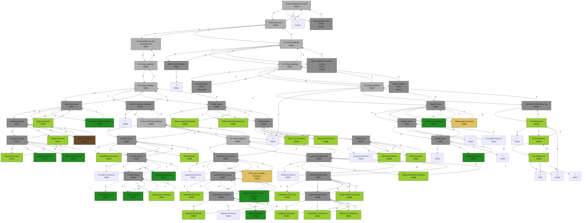

# Aardwolf Zoological Park

77 rooms. Solid = direction; dotted = special exit.

```mermaid
flowchart TD
  r5922["At the entrance of the park<br/>#5922"]
  r5920["Which way now?<br/>#5920"]
  r5911["On a busy walkway<br/>#5911"]
  r5917["On a busy walkway<br/>#5917"]
  r5923["On a busy walkway<br/>#5923"]
  r5940["Entrance to the Petting Zoo<br/>#5940"]
  r5946["The Petting Zoo<br/>#5946"]
  r5949["The Petting Zoo<br/>#5949"]
  r5948["The Petting Zoo<br/>#5948"]
  r5927["On the bridge over the flamingo pond<br/>#5927"]
  r5916["Beachcomber Cafe<br/>#5916<br/>[shop]"]
  r5912["White Elephant Souvenirs & Gifts<br/>#5912<br/>[shop]"]
  r5926["Safari Outfitters<br/>#5926<br/>[shop]"]
  r5924["First Aid Station<br/>#5924<br/>[safe,shop]"]
  r5914["Administrative offices<br/>#5914"]
  r5950["Reptile House<br/>#5950"]
  r5954["Cockatrice Enclosure<br/>#5954"]
  r5957["Salamander Enclosure<br/>#5957"]
  r5951["Reptile House<br/>#5951"]
  r5955["Crocodile Enclosure<br/>#5955"]
  r5952["Reptile House<br/>#5952"]
  r5956["Basilisk Enclosure<br/>#5956"]
  r5925["On a busy walkway<br/>#5925"]
  r5921["On a busy walkway<br/>#5921"]
  r5933["A turn in the busy walkway<br/>#5933"]
  r5960["Feline House<br/>#5960"]
  r5961["Feline House<br/>#5961"]
  r5962["Feline House<br/>#5962"]
  r5965["Cave Lion Enclosure<br/>#5965"]
  r5968["Manticore Enclosure<br/>#5968"]
  r5966["Snow Leopard Enclosure<br/>#5966"]
  r5967["Sabre-tooth Tiger Enclosure<br/>#5967"]
  r5964["Gryphon Enclosure<br/>#5964"]
  r5969["Chimera Enclosure<br/>#5969"]
  r5963["Baku Enclosure<br/>#5963"]
  r5900["A turn in the busy walkway<br/>#5900"]
  r5901["Primate House<br/>#5901"]
  r5910["Snowflake's Enclosure<br/>#5910"]
  r5909["Yeti Enclosure<br/>#5909"]
  r5902["Primate House<br/>#5902"]
  r5908["Grendel's Enclosure<br/>#5908"]
  r5907["Sasquatch Enclosure<br/>#5907"]
  r5903["Primate House<br/>#5903"]
  r5906["Ahuizotl Enclosure<br/>#5906"]
  r5905["Hsigo Enclosure<br/>#5905"]
  r5904["Swamp Ape Enclosure<br/>#5904"]
  r5929["On a busy walkway<br/>#5929"]
  r5980["Small Mammal House<br/>#5980"]
  r5987["Capybara Enclosure<br/>#5987"]
  r5986["Pink Fairy Armadillo Enclosure<br/>#5986"]
  r5981["Small Mammal House<br/>#5981"]
  r5985["Black-Footed Pine Marten Enclosure<br/>#5985"]
  r5988["Chinchilla Enclosure<br/>#5988"]
  r5982["Small Mammal House<br/>#5982"]
  r5984["Koala Enclosure<br/>#5984"]
  r5983["Platypus Enclosure<br/>#5983"]
  r5989["Aardvark Enclosure<br/>#5989"]
  r5990["Large Mammal House<br/>#5990"]
  r5996["Woolly Mammoth Enclosure<br/>#5996"]
  r5997["Bunyip Enclosure<br/>#5997"]
  r5991["Large Mammal House<br/>#5991"]
  r5995["Gomphotheres Enclosure<br/>#5995"]
  r5998["Catoblepas Enclosure<br/>#5998"]
  r5992["Large Mammal House<br/>#5992"]
  r5994["Rhinoceros Enclosure<br/>#5994"]
  r5999["Kangaroo Enclosure<br/>#5999"]
  r5993["Chalicotheres Enclosure<br/>#5993"]
  r5970["Carnivore House<br/>#5970"]
  r5974["Dingo Enclosure<br/>#5974"]
  r5979["Tasmanian Wolf Enclosure<br/>#5979"]
  r5971["Carnivore House<br/>#5971"]
  r5975["Jackal Enclosure<br/>#5975"]
  r5972["Carnivore House<br/>#5972"]
  r5976["Bugbear Enclosure<br/>#5976"]
  r5977["Werewolf Enclosure<br/>#5977"]
  r5973["Crocuta Enclosure<br/>#5973"]
  r5978["Fenrir's Enclosure<br/>#5978"]
  r5922 -->|e| r5920
  r5922 -->|s| r5916
  r12611["?<br/>#12611"]
  r5922 -->|w| r12611
  r5920 -->|e| r5927
  r5920 -->|n| r5911
  r5920 -->|w| r5922
  r5911 -->|e| r5914
  r5911 -->|n| r5917
  r5911 -->|s| r5920
  r5911 -->|w| r5912
  r5917 -->|e| r5924
  r5917 -->|n| r5923
  r5917 -->|s| r5911
  r5917 -->|w| r5926
  r5923 -->|e| r5950
  r5919["?<br/>#5919"]
  r5923 -->|n| r5919
  r5923 -->|s| r5917
  r5923 -->|w| r5940
  r5940 -->|e| r5923
  r5940 -->|w| r5946
  r5946 -->|e| r5940
  r5943["?<br/>#5943"]
  r5946 -->|n| r5943
  r5946 -->|s| r5949
  r5945["?<br/>#5945"]
  r5946 -->|w| r5945
  r5949 -->|n| r5946
  r5949 -->|w| r5948
  r5948 -->|e| r5949
  r5948 -->|n| r5945
  r995["?<br/>#995"]
  r5948 -->|s| r995
  r5947["?<br/>#5947"]
  r5948 -->|w| r5947
  r5927 -->|e| r5925
  r5927 -->|w| r5920
  r5916 -->|n| r5922
  r5912 -->|e| r5911
  r5926 -->|e| r5917
  r5924 -->|w| r5917
  r5915["?<br/>#5915"]
  r5914 -->|e| r5915
  r5914 -->|w| r5911
  r5950 -->|e| r5951
  r5950 -->|n| r5954
  r5950 -->|s| r5957
  r5950 -->|w| r5923
  r5954 -->|s| r5950
  r5957 -->|n| r5950
  r5951 -->|e| r5952
  r5951 -->|n| r5955
  r5958["?<br/>#5958"]
  r5951 -->|s| r5958
  r5951 -->|w| r5950
  r5955 -->|s| r5951
  r5953["?<br/>#5953"]
  r5952 -->|e| r5953
  r5952 -->|n| r5956
  r5959["?<br/>#5959"]
  r5952 -->|s| r5959
  r5952 -->|w| r5951
  r5956 -->|s| r5952
  r5925 -->|n| r5921
  r5925 -->|w| r5927
  r5921 -->|e| r5970
  r5921 -->|n| r5933
  r5921 -->|s| r5925
  r5921 -->|w| r5960
  r5932["?<br/>#5932"]
  r5933 -->|n| r5932
  r5933 -->|s| r5921
  r5933 -->|w| r5900
  r5960 -->|e| r5921
  r5960 -->|n| r5966
  r5960 -->|s| r5967
  r5960 -->|w| r5961
  r5961 -->|e| r5960
  r5961 -->|n| r5965
  r5961 -->|s| r5968
  r5961 -->|w| r5962
  r5962 -->|e| r5961
  r5962 -->|n| r5964
  r5962 -->|s| r5969
  r5962 -->|w| r5963
  r5965 -->|s| r5961
  r5968 -->|n| r5961
  r5966 -->|s| r5960
  r5967 -->|n| r5960
  r5964 -->|s| r5962
  r5969 -->|n| r5962
  r5963 -->|e| r5962
  r5900 -->|e| r5933
  r5900 -->|n| r5901
  r5900 -->|s| r5919
  r5900 -->|w| r5929
  r5901 -->|e| r5910
  r5901 -->|n| r5902
  r5901 -->|s| r5900
  r5901 -->|w| r5909
  r5910 -->|w| r5901
  r5909 -->|e| r5901
  r5902 -->|e| r5908
  r5902 -->|n| r5903
  r5902 -->|s| r5901
  r5902 -->|w| r5907
  r5908 -->|w| r5902
  r5907 -->|e| r5902
  r5903 -->|e| r5906
  r5903 -->|n| r5905
  r5903 -->|s| r5902
  r5903 -->|w| r5904
  r5906 -->|w| r5903
  r5905 -->|s| r5903
  r5904 -->|e| r5903
  r5929 -->|e| r5900
  r5929 -->|n| r5980
  r5929 -->|s| r5990
  r5980 -->|e| r5987
  r5980 -->|n| r5981
  r5980 -->|s| r5929
  r5980 -->|w| r5986
  r5987 -->|w| r5980
  r5986 -->|e| r5980
  r5981 -->|e| r5988
  r5981 -->|n| r5982
  r5981 -->|s| r5980
  r5981 -->|w| r5985
  r5985 -->|e| r5981
  r5988 -->|w| r5981
  r5982 -->|e| r5989
  r5982 -->|n| r5983
  r5982 -->|s| r5981
  r5982 -->|w| r5984
  r5984 -->|e| r5982
  r5983 -->|s| r5982
  r5989 -->|w| r5982
  r5990 -->|e| r5997
  r5990 -->|n| r5929
  r5990 -->|s| r5991
  r5990 -->|w| r5996
  r5996 -->|e| r5990
  r5997 -->|w| r5990
  r5991 -->|e| r5998
  r5991 -->|n| r5990
  r5991 -->|s| r5992
  r5991 -->|w| r5995
  r5995 -->|e| r5991
  r5998 -->|w| r5991
  r5992 -->|e| r5999
  r5992 -->|n| r5991
  r5992 -->|s| r5993
  r5992 -->|w| r5994
  r5994 -->|e| r5992
  r5999 -->|w| r5992
  r5993 -->|n| r5992
  r5970 -->|e| r5971
  r5970 -->|n| r5974
  r5970 -->|s| r5979
  r5970 -->|w| r5921
  r5974 -->|s| r5970
  r5979 -->|n| r5970
  r5971 -->|e| r5972
  r5971 -->|n| r5975
  r5971 -->|s| r5978
  r5971 -->|w| r5970
  r5975 -->|s| r5971
  r5972 -->|e| r5973
  r5972 -->|n| r5976
  r5972 -->|s| r5977
  r5972 -->|w| r5971
  r5976 -->|s| r5972
  r5977 -->|n| r5972
  r5973 -->|w| r5972
  r5978 -->|n| r5971
  classDef t_city fill:#b0b0b0,color:#111,stroke:#222
  class r5922 t_city
  class r5920 t_city
  class r5911 t_city
  class r5917 t_city
  class r5923 t_city
  classDef t_inside fill:#8a8a8a,color:#111,stroke:#222
  class r5940 t_inside
  classDef t_field fill:#9acd32,color:#111,stroke:#222
  class r5946 t_field
  class r5949 t_field
  class r5948 t_field
  class r5927 t_city
  class r5916 t_inside
  class r5912 t_inside
  class r5926 t_inside
  class r5924 t_inside
  class r5914 t_inside
  class r5950 t_inside
  classDef t_forest fill:#228b22,color:#111,stroke:#222
  class r5954 t_forest
  classDef t_desert fill:#e0c060,color:#111,stroke:#222
  class r5957 t_desert
  class r5951 t_inside
  class r5952 t_inside
  class r5956 t_forest
  class r5925 t_city
  class r5921 t_city
  class r5933 t_inside
  class r5960 t_inside
  class r5961 t_inside
  class r5962 t_inside
  class r5965 t_field
  class r5968 t_field
  class r5966 t_field
  class r5967 t_field
  class r5969 t_field
  class r5963 t_field
  class r5900 t_city
  class r5901 t_inside
  class r5910 t_field
  class r5909 t_field
  class r5902 t_inside
  class r5907 t_forest
  class r5903 t_inside
  class r5906 t_forest
  class r5905 t_forest
  class r5904 t_field
  class r5929 t_city
  class r5980 t_inside
  class r5986 t_desert
  class r5981 t_inside
  class r5985 t_forest
  class r5988 t_field
  class r5982 t_inside
  class r5984 t_forest
  class r5989 t_field
  class r5990 t_inside
  class r5996 t_field
  class r5991 t_inside
  class r5995 t_field
  class r5998 t_field
  class r5992 t_inside
  class r5994 t_field
  class r5999 t_field
  class r5993 t_field
  class r5970 t_inside
  class r5974 t_field
  class r5979 t_forest
  class r5971 t_inside
  class r5975 t_field
  class r5972 t_inside
  class r5976 t_forest
  class r5977 t_forest
  class r5973 t_field
  classDef t_underground fill:#6b4a2b,color:#111,stroke:#222
  class r5978 t_underground
```
