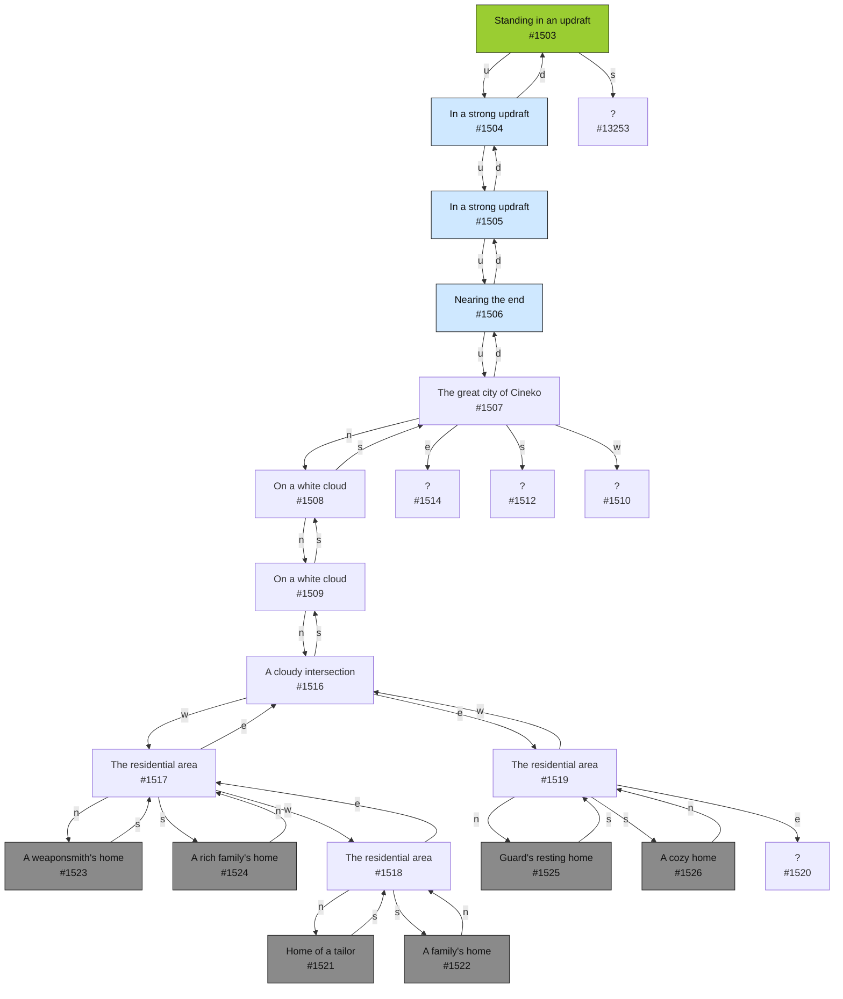

# Aerial City of Cineko

17 rooms. Solid = direction; dotted = special exit.

```mermaid
flowchart TD
  r1503["Standing in an updraft<br/>#1503"]
  r1504["In a strong updraft<br/>#1504"]
  r1505["In a strong updraft<br/>#1505"]
  r1506["Nearing the end<br/>#1506"]
  r1507["The great city of Cineko<br/>#1507"]
  r1508["On a white cloud<br/>#1508"]
  r1509["On a white cloud<br/>#1509"]
  r1516["A cloudy intersection<br/>#1516"]
  r1517["The residential area<br/>#1517"]
  r1523["A weaponsmith's home<br/>#1523"]
  r1524["A rich family's home<br/>#1524"]
  r1518["The residential area<br/>#1518"]
  r1521["Home of a tailor<br/>#1521"]
  r1522["A family's home<br/>#1522"]
  r1519["The residential area<br/>#1519"]
  r1525["Guard's resting home<br/>#1525"]
  r1526["A cozy home<br/>#1526"]
  r13253["?<br/>#13253"]
  r1503 -->|s| r13253
  r1503 -->|u| r1504
  r1504 -->|d| r1503
  r1504 -->|u| r1505
  r1505 -->|d| r1504
  r1505 -->|u| r1506
  r1506 -->|d| r1505
  r1506 -->|u| r1507
  r1507 -->|d| r1506
  r1514["?<br/>#1514"]
  r1507 -->|e| r1514
  r1507 -->|n| r1508
  r1512["?<br/>#1512"]
  r1507 -->|s| r1512
  r1510["?<br/>#1510"]
  r1507 -->|w| r1510
  r1508 -->|n| r1509
  r1508 -->|s| r1507
  r1509 -->|n| r1516
  r1509 -->|s| r1508
  r1516 -->|e| r1519
  r1516 -->|s| r1509
  r1516 -->|w| r1517
  r1517 -->|e| r1516
  r1517 -->|n| r1523
  r1517 -->|s| r1524
  r1517 -->|w| r1518
  r1523 -->|s| r1517
  r1524 -->|n| r1517
  r1518 -->|e| r1517
  r1518 -->|n| r1521
  r1518 -->|s| r1522
  r1521 -->|s| r1518
  r1522 -->|n| r1518
  r1520["?<br/>#1520"]
  r1519 -->|e| r1520
  r1519 -->|n| r1525
  r1519 -->|s| r1526
  r1519 -->|w| r1516
  r1525 -->|s| r1519
  r1526 -->|n| r1519
  classDef t_field fill:#9acd32,color:#111,stroke:#222
  class r1503 t_field
  classDef t_air fill:#cfe8ff,color:#111,stroke:#222
  class r1504 t_air
  class r1505 t_air
  class r1506 t_air
  classDef t_inside fill:#8a8a8a,color:#111,stroke:#222
  class r1523 t_inside
  class r1524 t_inside
  class r1521 t_inside
  class r1522 t_inside
  class r1525 t_inside
  class r1526 t_inside
```
