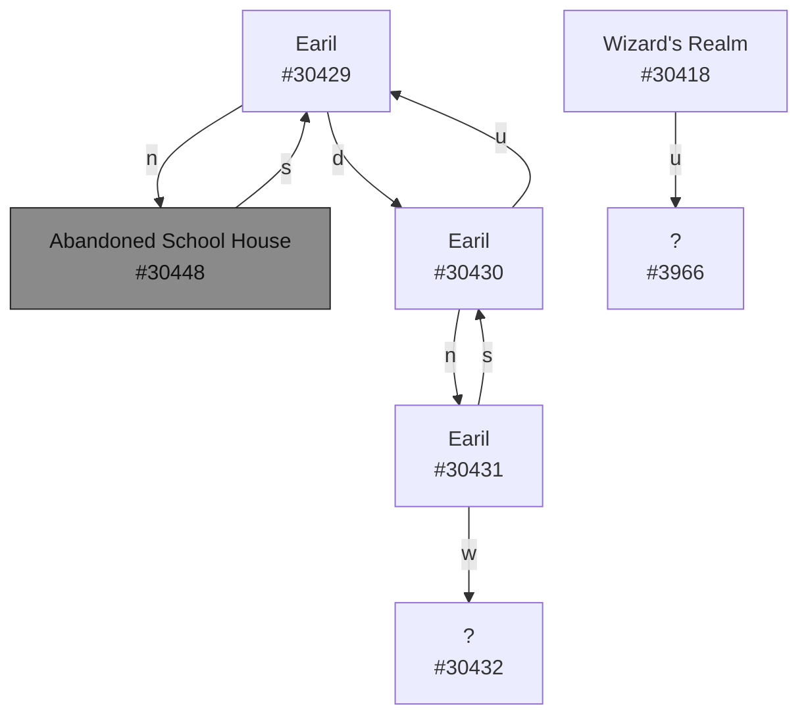

# All in a Fayke Day

5 rooms. Solid = direction; dotted = special exit.

```mermaid
flowchart TD
  r30418["Wizard's Realm<br/>#30418"]
  r30429["Earil<br/>#30429"]
  r30448["Abandoned School House<br/>#30448"]
  r30430["Earil<br/>#30430"]
  r30431["Earil<br/>#30431"]
  r3966["?<br/>#3966"]
  r30418 -->|u| r3966
  r30429 -->|d| r30430
  r30429 -->|n| r30448
  r30448 -->|s| r30429
  r30430 -->|n| r30431
  r30430 -->|u| r30429
  r30431 -->|s| r30430
  r30432["?<br/>#30432"]
  r30431 -->|w| r30432
  classDef t_inside fill:#8a8a8a,color:#111,stroke:#222
  class r30448 t_inside
```
