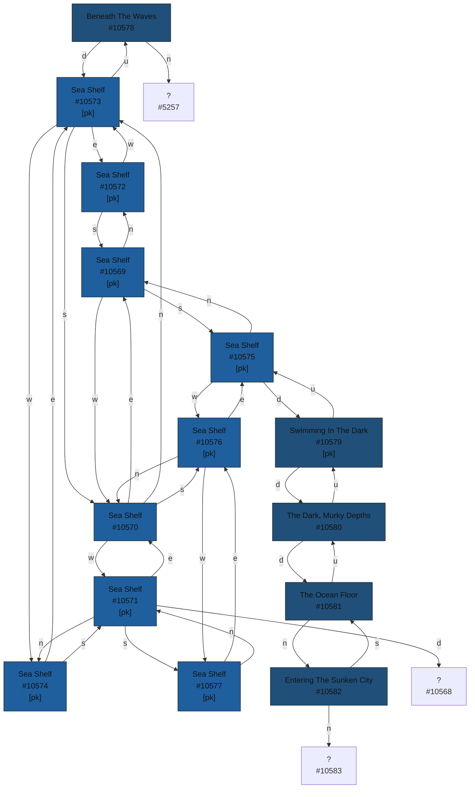

# Atlantis

14 rooms. Solid = direction; dotted = special exit.

```mermaid
flowchart TD
  r10578["Beneath The Waves<br/>#10578"]
  r10573["Sea Shelf<br/>#10573<br/>[pk]"]
  r10574["Sea Shelf<br/>#10574<br/>[pk]"]
  r10572["Sea Shelf<br/>#10572<br/>[pk]"]
  r10569["Sea Shelf<br/>#10569<br/>[pk]"]
  r10570["Sea Shelf<br/>#10570"]
  r10571["Sea Shelf<br/>#10571<br/>[pk]"]
  r10576["Sea Shelf<br/>#10576<br/>[pk]"]
  r10577["Sea Shelf<br/>#10577<br/>[pk]"]
  r10575["Sea Shelf<br/>#10575<br/>[pk]"]
  r10579["Swimming In The Dark<br/>#10579<br/>[pk]"]
  r10580["The Dark, Murky Depths<br/>#10580"]
  r10581["The Ocean Floor<br/>#10581"]
  r10582["Entering The Sunken City<br/>#10582"]
  r10578 -->|d| r10573
  r5257["?<br/>#5257"]
  r10578 -->|n| r5257
  r10573 -->|e| r10572
  r10573 -->|s| r10570
  r10573 -->|u| r10578
  r10573 -->|w| r10574
  r10574 -->|e| r10573
  r10574 -->|s| r10571
  r10572 -->|s| r10569
  r10572 -->|w| r10573
  r10569 -->|n| r10572
  r10569 -->|s| r10575
  r10569 -->|w| r10570
  r10570 -->|e| r10569
  r10570 -->|n| r10573
  r10570 -->|s| r10576
  r10570 -->|w| r10571
  r10568["?<br/>#10568"]
  r10571 -->|d| r10568
  r10571 -->|e| r10570
  r10571 -->|n| r10574
  r10571 -->|s| r10577
  r10576 -->|e| r10575
  r10576 -->|n| r10570
  r10576 -->|w| r10577
  r10577 -->|e| r10576
  r10577 -->|n| r10571
  r10575 -->|d| r10579
  r10575 -->|n| r10569
  r10575 -->|w| r10576
  r10579 -->|d| r10580
  r10579 -->|u| r10575
  r10580 -->|d| r10581
  r10580 -->|u| r10579
  r10581 -->|n| r10582
  r10581 -->|u| r10580
  r10583["?<br/>#10583"]
  r10582 -->|n| r10583
  r10582 -->|s| r10581
  classDef t_underwater fill:#20507a,color:#111,stroke:#222
  class r10578 t_underwater
  classDef t_ocean fill:#1f5f9e,color:#111,stroke:#222
  class r10573 t_ocean
  class r10574 t_ocean
  class r10572 t_ocean
  class r10569 t_ocean
  class r10570 t_ocean
  class r10571 t_ocean
  class r10576 t_ocean
  class r10577 t_ocean
  class r10575 t_ocean
  class r10579 t_underwater
  class r10580 t_underwater
  class r10581 t_underwater
  class r10582 t_underwater
```
