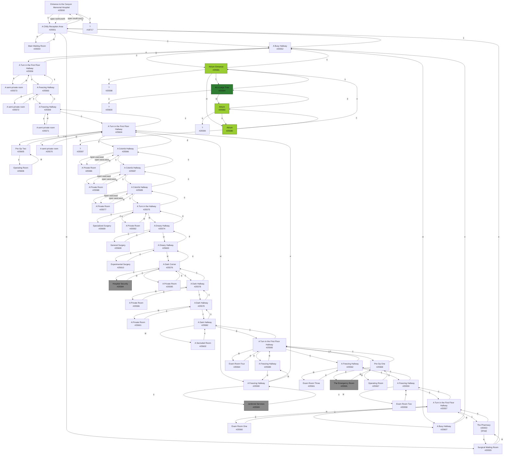

# Canyon Memorial Hospital

57 rooms. Solid = direction; dotted = special exit.

```mermaid
flowchart TD
  r25550["Entrance to the Canyon Memorial Hospital<br/>#25550"]
  r25551["A Chilly Reception Area<br/>#25551"]
  r25554["Main Waiting Room<br/>#25554"]
  r25555["Surgical Waiting Room<br/>#25555"]
  r25553["The Pharmacy<br/>#25553<br/>[shop]"]
  r25557["A Turn in the First Floor Hallway<br/>#25557"]
  r25560["Exam Room One<br/>#25560"]
  r25607["A Busy Hallway<br/>#25607"]
  r25552["A Busy Hallway<br/>#25552"]
  r25556["A Turn in the First Floor Hallway<br/>#25556"]
  r25573["A semi-private room<br/>#25573"]
  r25563["A Freezing Hallway<br/>#25563"]
  r25572["A semi-private room<br/>#25572"]
  r25569["A Freezing Hallway<br/>#25569"]
  r25571["A semi-private room<br/>#25571"]
  r25604["A Turn in the First Floor Hallway<br/>#25604"]
  r25605["Pre-Op Two<br/>#25605"]
  r25570["A semi-private room<br/>#25570"]
  r25606["Operating Room<br/>#25606"]
  r25590["A Freezing Hallway<br/>#25590"]
  r25593["Janitorial Services<br/>#25593"]
  r25589["A Freezing Hallway<br/>#25589"]
  r25565["A Turn in the First Floor Hallway<br/>#25565"]
  r25562["A Freezing Hallway<br/>#25562"]
  r25559["A Freezing Hallway<br/>#25559"]
  r25581["Atrium Entrance<br/>#25581"]
  r25584["At a Large Tree<br/>#25584"]
  r25583["Atrium<br/>#25583"]
  r25580["Atrium<br/>#25580"]
  r25558["Exam Room Two<br/>#25558"]
  r25561["Exam Room Three<br/>#25561"]
  r25564["Exam Room Four<br/>#25564"]
  r25568["Pre-Op One<br/>#25568"]
  r25591["The Emergency Room<br/>#25591"]
  r25567["Operating Room<br/>#25567"]
  r25582["A Dark Hallway<br/>#25582"]
  r25579["A Dark Hallway<br/>#25579"]
  r25578["A Dark Hallway<br/>#25578"]
  r25576["A Dark Corner<br/>#25576"]
  r25594["Hospital Security<br/>#25594"]
  r25595["A Private Room<br/>#25595"]
  r25596["A Private Room<br/>#25596"]
  r25601["A Private Room<br/>#25601"]
  r25602["A Secluded Room<br/>#25602"]
  r25603["A Dreary Hallway<br/>#25603"]
  r25610["Experimental Surgery<br/>#25610"]
  r25574["A Dreary Hallway<br/>#25574"]
  r25608["General Surgery<br/>#25608"]
  r25575["A Turn in the Hallway<br/>#25575"]
  r25609["Specialized Surgery<br/>#25609"]
  r25585["A Colorful Hallway<br/>#25585"]
  r25577["A Private Room<br/>#25577"]
  r25592["A Private Room<br/>#25592"]
  r25587["A Colorful Hallway<br/>#25587"]
  r25588["A Private Room<br/>#25588"]
  r25566["A Colorful Hallway<br/>#25566"]
  r25586["A Private Room<br/>#25586"]
  r25550 -->|n| r25551
  r25550 -.->|open north;north| r25551
  r18717["?<br/>#18717"]
  r25550 -->|s| r18717
  r25551 -->|e| r25554
  r25551 -->|n| r25552
  r25551 -.->|open south;south| r25550
  r25551 -->|s| r25550
  r25551 -->|w| r25555
  r25554 -->|w| r25551
  r25555 -->|e| r25551
  r25555 -->|w| r25553
  r25553 -->|e| r25555
  r25553 -->|n| r25557
  r25557 -->|e| r25607
  r25557 -->|n| r25559
  r25557 -->|s| r25553
  r25557 -->|w| r25560
  r25560 -->|e| r25557
  r25607 -->|e| r25552
  r25607 -->|w| r25557
  r25552 -->|e| r25556
  r25552 -->|n| r25581
  r25552 -->|s| r25551
  r25552 -->|w| r25607
  r25556 -->|e| r25573
  r25556 -->|n| r25563
  r25556 -->|w| r25552
  r25573 -->|w| r25556
  r25563 -->|e| r25572
  r25563 -->|n| r25569
  r25563 -->|s| r25556
  r25572 -->|w| r25563
  r25569 -->|e| r25571
  r25569 -->|n| r25604
  r25569 -->|s| r25563
  r25571 -->|w| r25569
  r25604 -->|e| r25570
  r25604 -->|n| r25605
  r25604 -->|s| r25569
  r25604 -->|u| r25566
  r25604 -->|w| r25590
  r25605 -->|e| r25606
  r25605 -->|s| r25604
  r25570 -->|w| r25604
  r25606 -->|w| r25605
  r25590 -->|e| r25604
  r25590 -->|n| r25593
  r25590 -->|w| r25589
  r25593 -->|s| r25590
  r25589 -->|e| r25590
  r25589 -->|w| r25565
  r25565 -->|e| r25589
  r25565 -->|n| r25568
  r25565 -->|s| r25562
  r25565 -->|u| r25582
  r25565 -->|w| r25564
  r25562 -->|n| r25565
  r25562 -->|s| r25559
  r25562 -->|w| r25561
  r25559 -->|n| r25562
  r25559 -->|s| r25557
  r25559 -->|w| r25558
  r25581 -->|n| r25584
  r25581 -->|s| r25552
  r25598["?<br/>#25598"]
  r25581 -->|u| r25598
  r25581 -->|w| r25580
  r25584 -->|s| r25581
  r25600["?<br/>#25600"]
  r25584 -->|u| r25600
  r25584 -->|w| r25583
  r25583 -->|e| r25584
  r25583 -->|s| r25580
  r25599["?<br/>#25599"]
  r25583 -->|u| r25599
  r25580 -->|e| r25581
  r25580 -->|n| r25583
  r25597["?<br/>#25597"]
  r25580 -->|u| r25597
  r25558 -->|e| r25559
  r25561 -->|e| r25562
  r25564 -->|e| r25565
  r25568 -->|e| r25591
  r25568 -->|s| r25565
  r25568 -->|w| r25567
  r25591 -->|w| r25568
  r25567 -->|e| r25568
  r25582 -->|d| r25565
  r25582 -->|s| r25579
  r25582 -->|w| r25602
  r25579 -->|n| r25582
  r25579 -->|s| r25578
  r25579 -->|w| r25601
  r25578 -->|n| r25579
  r25578 -->|s| r25576
  r25578 -->|w| r25596
  r25576 -->|e| r25603
  r25576 -->|n| r25578
  r25576 -->|s| r25594
  r25576 -->|w| r25595
  r25594 -->|n| r25576
  r25595 -->|e| r25576
  r25596 -->|e| r25578
  r25601 -->|e| r25579
  r25602 -->|e| r25582
  r25603 -->|e| r25574
  r25603 -->|s| r25610
  r25603 -->|w| r25576
  r25610 -->|n| r25603
  r25574 -->|e| r25575
  r25574 -->|s| r25608
  r25574 -->|w| r25603
  r25608 -->|n| r25574
  r25575 -->|e| r25592
  r25575 -->|n| r25585
  r25575 -->|s| r25609
  r25575 -->|w| r25574
  r25609 -->|n| r25575
  r25585 -->|e| r25577
  r25585 -->|n| r25587
  r25585 -.->|open east;east| r25577
  r25585 -->|s| r25575
  r25577 -.->|open west;west| r25585
  r25577 -->|w| r25585
  r25592 -->|w| r25575
  r25587 -->|e| r25588
  r25587 -->|n| r25566
  r25587 -.->|open east;east| r25588
  r25587 -->|s| r25585
  r25588 -.->|open west;west| r25587
  r25588 -->|w| r25587
  r25566 -->|d| r25604
  r25566 -->|e| r25586
  r25566 -.->|open east;east| r25586
  r25566 -->|s| r25587
  r25586 -.->|open west;west| r25566
  r25586 -->|w| r25566
  classDef t_inside fill:#8a8a8a,color:#111,stroke:#222
  class r25593 t_inside
  classDef t_field fill:#9acd32,color:#111,stroke:#222
  class r25581 t_field
  classDef t_jungle fill:#2e7d32,color:#111,stroke:#222
  class r25584 t_jungle
  class r25583 t_field
  class r25580 t_field
  class r25591 t_inside
  class r25594 t_inside
```
