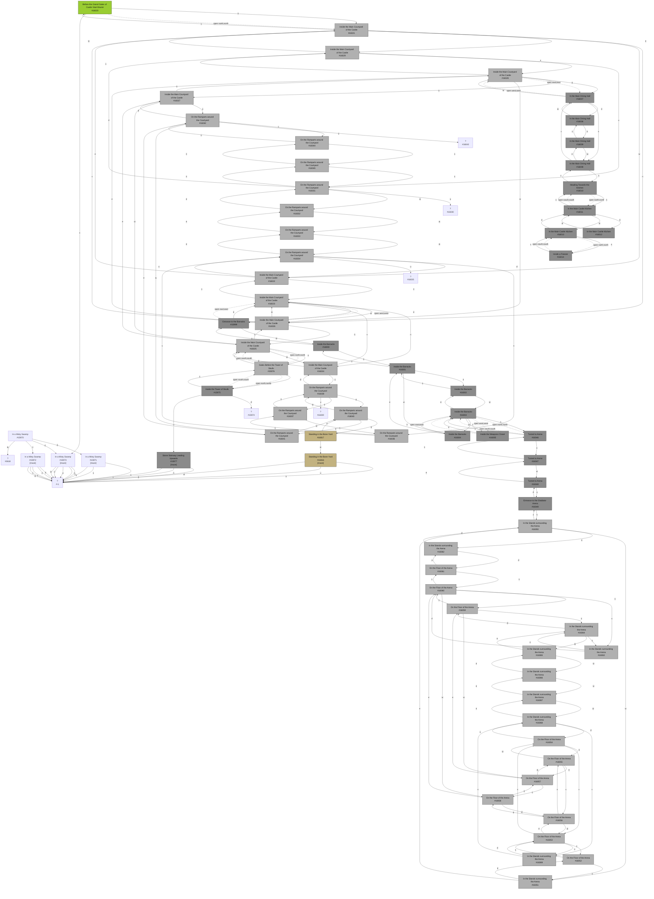

# Castle Vlad-Shamir

71 rooms. Solid = direction; dotted = special exit.

```mermaid
flowchart TD
  r15970["In a Misty Swamp<br/>#15970"]
  r15971["In a Misty Swamp<br/>#15971<br/>[maze]"]
  r15972["In a Misty Swamp<br/>#15972<br/>[maze]"]
  r16020["Before the Grand Gates of Castle Vlad-Shamir<br/>#16020"]
  r16021["Inside the Main Courtyard of the Castle<br/>#16021"]
  r16029["Inside the Main Courtyard of the Castle<br/>#16029"]
  r16031["On the Ramparts around the Courtyard<br/>#16031"]
  r16045["On the Ramparts around the Courtyard<br/>#16045"]
  r16044["On the Ramparts around the Courtyard<br/>#16044"]
  r16042["On the Ramparts around the Courtyard<br/>#16042"]
  r16041["On the Ramparts around the Courtyard<br/>#16041"]
  r16040["On the Ramparts around the Courtyard<br/>#16040"]
  r16038["On the Ramparts around the Courtyard<br/>#16038"]
  r16037["On the Ramparts around the Courtyard<br/>#16037"]
  r16036["On the Ramparts around the Courtyard<br/>#16036"]
  r16034["On the Ramparts around the Courtyard<br/>#16034"]
  r16033["On the Ramparts around the Courtyard<br/>#16033"]
  r16032["On the Ramparts around the Courtyard<br/>#16032"]
  r16017["Standing in the Bone Yard<br/>#16017"]
  r16016["Standing in the Bone Yard<br/>#16016<br/>[maze]"]
  r15973["In a Misty Swamp<br/>#15973<br/>[maze]"]
  r16022["Inside the Main Courtyard of the Castle<br/>#16022"]
  r16023["Inside the Main Courtyard of the Castle<br/>#16023"]
  r16024["Inside the Main Courtyard of the Castle<br/>#16024"]
  r16025["Inside the Main Courtyard of the Castle<br/>#16025"]
  r16027["Inside the Main Courtyard of the Castle<br/>#16027"]
  r16028["Inside the Main Courtyard of the Castle<br/>#16028"]
  r16026["Inside the Main Courtyard of the Castle<br/>#16026"]
  r16007["In the Main Dining Hall<br/>#16007"]
  r16008["In the Main Dining Hall<br/>#16008"]
  r16009["In the Main Dining Hall<br/>#16009"]
  r16010["Heading Towards the Kitchen<br/>#16010"]
  r16011["In the Main Castle Kitchen<br/>#16011"]
  r16006["In the Main Dining Hall<br/>#16006"]
  r16012["In the Main Castle Kitchen<br/>#16012"]
  r16013["In the Main Castle Kitchen<br/>#16013"]
  r16014["Inside a Freezer<br/>#16014"]
  r15976["Gates Before the Tower of Skulls<br/>#15976"]
  r15975["Inside the Tower of Skulls<br/>#15975"]
  r15977["Stone Stairway Leading Upwards<br/>#15977<br/>[maze]"]
  r15999["Entrance to the Barracks<br/>#15999"]
  r16000["Inside the Barracks<br/>#16000"]
  r16001["Inside the Barracks<br/>#16001"]
  r16002["Inside the Barracks<br/>#16002"]
  r16003["Inside the Barracks<br/>#16003"]
  r16004["Inside the Barracks<br/>#16004"]
  r16005["Inside the Weapons Closet<br/>#16005"]
  r16046["Tunnel to Arena<br/>#16046"]
  r16047["Tunnel to Arena<br/>#16047"]
  r16048["Tunnel to Arena<br/>#16048"]
  r16049["Entrance to the Gladiator Arena<br/>#16049"]
  r16050["In the Stands surrounding the Arena<br/>#16050"]
  r16062["In the Stands surrounding the Arena<br/>#16062"]
  r16051["In the Stands surrounding the Arena<br/>#16051"]
  r16052["On the Floor of the Arena<br/>#16052"]
  r16053["On the Floor of the Arena<br/>#16053"]
  r16056["On the Floor of the Arena<br/>#16056"]
  r16058["On the Floor of the Arena<br/>#16058"]
  r16060["On the Floor of the Arena<br/>#16060"]
  r16063["In the Stands surrounding the Arena<br/>#16063"]
  r16061["On the Floor of the Arena<br/>#16061"]
  r16059["On the Floor of the Arena<br/>#16059"]
  r16057["On the Floor of the Arena<br/>#16057"]
  r16055["On the Floor of the Arena<br/>#16055"]
  r16054["On the Floor of the Arena<br/>#16054"]
  r16068["In the Stands surrounding the Arena<br/>#16068"]
  r16069["In the Stands surrounding the Arena<br/>#16069"]
  r16067["In the Stands surrounding the Arena<br/>#16067"]
  r16066["In the Stands surrounding the Arena<br/>#16066"]
  r16065["In the Stands surrounding the Arena<br/>#16065"]
  r16064["In the Stands surrounding the Arena<br/>#16064"]
  r15970 -->|e| r15971
  r15970 -->|n| r15973
  r15970 -->|s| r15972
  r3618["?<br/>#3618"]
  r15970 -->|w| r3618
  r-1["?<br/>#-1"]
  r15971 -->|n| r-1
  r15971 -->|s| r-1
  r15971 -->|u| r-1
  r15972 -->|e| r-1
  r15972 -->|n| r-1
  r15972 -->|s| r-1
  r15972 -->|u| r-1
  r15972 -->|w| r-1
  r16020 -->|n| r16021
  r16020 -.->|open north;north| r16021
  r16020 -->|s| r15973
  r16021 -->|e| r16029
  r16021 -->|n| r16026
  r16021 -->|s| r16020
  r16021 -->|w| r16022
  r16029 -->|n| r16028
  r16029 -->|u| r16031
  r16029 -->|w| r16021
  r16031 -->|d| r16029
  r16031 -->|n| r16045
  r16030["?<br/>#16030"]
  r16031 -->|u| r16030
  r16031 -->|w| r16032
  r16045 -->|n| r16044
  r16045 -->|s| r16031
  r16044 -->|n| r16042
  r16044 -->|s| r16045
  r16042 -->|d| r16027
  r16042 -->|s| r16044
  r16043["?<br/>#16043"]
  r16042 -->|u| r16043
  r16042 -->|w| r16041
  r16041 -->|e| r16042
  r16041 -->|w| r16040
  r16040 -->|d| r16017
  r16040 -->|e| r16041
  r16040 -->|w| r16038
  r16038 -->|d| r16024
  r16038 -->|e| r16040
  r16038 -->|s| r16037
  r16039["?<br/>#16039"]
  r16038 -->|u| r16039
  r16037 -->|n| r16038
  r16037 -->|s| r16036
  r16036 -->|n| r16037
  r16036 -->|s| r16034
  r16034 -->|d| r16022
  r16034 -->|e| r16033
  r16034 -->|n| r16036
  r16035["?<br/>#16035"]
  r16034 -->|u| r16035
  r16033 -->|e| r16032
  r16033 -->|w| r16034
  r16032 -->|e| r16031
  r16032 -->|w| r16033
  r16017 -->|u| r16040
  r16017 -->|w| r16016
  r16016 -->|s| r-1
  r16016 -->|u| r-1
  r16016 -->|w| r-1
  r15973 -->|e| r-1
  r15973 -->|n| r-1
  r15973 -->|s| r-1
  r15973 -->|u| r-1
  r15973 -->|w| r-1
  r16022 -->|e| r16021
  r16022 -->|n| r16023
  r16022 -->|u| r16034
  r16023 -->|e| r16026
  r16023 -->|n| r16024
  r16023 -.->|open west;west| r15999
  r16023 -->|s| r16022
  r16023 -->|w| r15999
  r16024 -->|e| r16025
  r16024 -->|s| r16023
  r16024 -->|u| r16038
  r16025 -->|e| r16027
  r16025 -->|n| r15976
  r16025 -.->|open north;north| r15976
  r16025 -->|s| r16026
  r16025 -->|w| r16024
  r16027 -->|s| r16028
  r16027 -->|u| r16042
  r16027 -->|w| r16025
  r16028 -->|e| r16007
  r16028 -->|n| r16027
  r16028 -.->|open east;east| r16007
  r16028 -->|s| r16029
  r16028 -->|w| r16026
  r16026 -->|e| r16028
  r16026 -->|n| r16025
  r16026 -->|s| r16021
  r16026 -->|w| r16023
  r16007 -->|e| r16006
  r16007 -->|n| r16008
  r16007 -.->|open west;west| r16028
  r16007 -->|w| r16028
  r16008 -->|e| r16009
  r16008 -->|n| r16010
  r16008 -->|s| r16007
  r16009 -->|s| r16006
  r16009 -->|w| r16008
  r16010 -->|n| r16011
  r16010 -.->|open north;north| r16011
  r16010 -->|s| r16008
  r16011 -->|e| r16012
  r16011 -.->|open south;south| r16010
  r16011 -->|s| r16010
  r16011 -->|w| r16013
  r16006 -->|n| r16009
  r16006 -->|w| r16007
  r16012 -->|w| r16011
  r16013 -->|e| r16011
  r16013 -->|n| r16014
  r16013 -.->|open north;north| r16014
  r16014 -.->|open south;south| r16013
  r16014 -->|s| r16013
  r15976 -->|n| r15975
  r15976 -.->|open north;north| r15975
  r15976 -.->|open south;south| r16025
  r15976 -->|s| r16025
  r15974["?<br/>#15974"]
  r15975 -->|d| r15974
  r15975 -.->|open south;south| r15976
  r15975 -->|s| r15976
  r15975 -->|u| r15977
  r15977 -->|d| r-1
  r15977 -->|n| r-1
  r15977 -->|s| r-1
  r15999 -->|e| r16023
  r15999 -.->|open east;east| r16023
  r15999 -->|w| r16000
  r16000 -->|e| r15999
  r16000 -->|n| r16001
  r16001 -->|n| r16002
  r16001 -->|s| r16000
  r16001 -->|w| r16004
  r16002 -->|s| r16001
  r16002 -->|w| r16003
  r16003 -->|e| r16002
  r16003 -->|n| r16046
  r16003 -.->|open north;north| r16046
  r16003 -.->|open west;west| r16005
  r16003 -->|s| r16004
  r16003 -->|w| r16005
  r16004 -->|e| r16001
  r16004 -->|n| r16003
  r16005 -->|e| r16003
  r16005 -.->|open east;east| r16003
  r16046 -->|n| r16047
  r16046 -.->|open south;south| r16003
  r16046 -->|s| r16003
  r16047 -->|s| r16046
  r16047 -->|w| r16048
  r16048 -->|e| r16047
  r16048 -->|u| r16049
  r16049 -->|d| r16048
  r16049 -->|n| r16050
  r16050 -->|e| r16062
  r16050 -->|s| r16049
  r16050 -->|w| r16051
  r16062 -->|d| r16061
  r16062 -->|w| r16050
  r16051 -->|d| r16052
  r16051 -->|e| r16050
  r16052 -->|n| r16053
  r16052 -->|u| r16051
  r16053 -->|e| r16056
  r16053 -->|n| r16054
  r16053 -->|s| r16052
  r16053 -->|u| r16069
  r16056 -->|e| r16058
  r16056 -->|n| r16055
  r16056 -->|w| r16053
  r16058 -->|e| r16060
  r16058 -->|n| r16057
  r16058 -->|w| r16056
  r16060 -->|n| r16059
  r16060 -->|s| r16061
  r16060 -->|u| r16063
  r16060 -->|w| r16058
  r16063 -->|d| r16060
  r16063 -->|n| r16064
  r16061 -->|n| r16060
  r16061 -->|u| r16062
  r16059 -->|s| r16060
  r16059 -->|u| r16064
  r16059 -->|w| r16057
  r16057 -->|e| r16059
  r16057 -->|s| r16058
  r16057 -->|w| r16055
  r16055 -->|e| r16057
  r16055 -->|s| r16056
  r16055 -->|w| r16054
  r16054 -->|e| r16055
  r16054 -->|s| r16053
  r16054 -->|u| r16068
  r16068 -->|d| r16054
  r16068 -->|e| r16067
  r16068 -->|s| r16069
  r16069 -->|d| r16053
  r16069 -->|n| r16068
  r16067 -->|e| r16066
  r16067 -->|w| r16068
  r16066 -->|e| r16065
  r16066 -->|w| r16067
  r16065 -->|e| r16064
  r16065 -->|w| r16066
  r16064 -->|d| r16059
  r16064 -->|s| r16063
  r16064 -->|w| r16065
  classDef t_field fill:#9acd32,color:#111,stroke:#222
  class r16020 t_field
  classDef t_city fill:#b0b0b0,color:#111,stroke:#222
  class r16021 t_city
  class r16029 t_city
  class r16031 t_city
  class r16045 t_city
  class r16044 t_city
  class r16042 t_city
  class r16041 t_city
  class r16040 t_city
  class r16038 t_city
  class r16037 t_city
  class r16036 t_city
  class r16034 t_city
  class r16033 t_city
  class r16032 t_city
  classDef t_hills fill:#c2b280,color:#111,stroke:#222
  class r16017 t_hills
  class r16016 t_hills
  class r16022 t_city
  class r16023 t_city
  class r16024 t_city
  class r16025 t_city
  class r16027 t_city
  class r16028 t_city
  class r16026 t_city
  classDef t_inside fill:#8a8a8a,color:#111,stroke:#222
  class r16007 t_inside
  class r16008 t_inside
  class r16009 t_inside
  class r16010 t_inside
  class r16011 t_inside
  class r16006 t_inside
  class r16012 t_inside
  class r16013 t_inside
  class r16014 t_inside
  class r15976 t_city
  class r15975 t_inside
  class r15977 t_inside
  class r15999 t_inside
  class r16000 t_inside
  class r16001 t_inside
  class r16002 t_inside
  class r16003 t_inside
  class r16004 t_inside
  class r16005 t_inside
  class r16046 t_inside
  class r16047 t_inside
  class r16048 t_inside
  class r16049 t_inside
  class r16050 t_city
  class r16062 t_city
  class r16051 t_city
  class r16052 t_city
  class r16053 t_city
  class r16056 t_city
  class r16058 t_city
  class r16060 t_city
  class r16063 t_city
  class r16061 t_city
  class r16059 t_city
  class r16057 t_city
  class r16055 t_city
  class r16054 t_city
  class r16068 t_city
  class r16069 t_city
  class r16067 t_city
  class r16066 t_city
  class r16065 t_city
  class r16064 t_city
```
