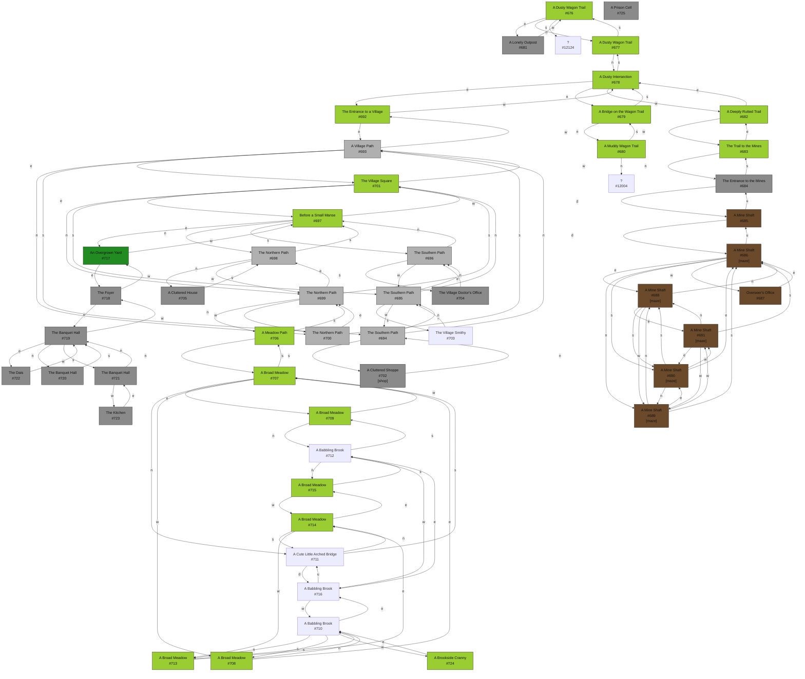

# Child's Play

50 rooms. Solid = direction; dotted = special exit.

```mermaid
flowchart TD
  r676["A Dusty Wagon Trail<br/>#676"]
  r677["A Dusty Wagon Trail<br/>#677"]
  r678["A Dusty Intersection<br/>#678"]
  r679["A Bridge on the Wagon Trail<br/>#679"]
  r680["A Muddy Wagon Trail<br/>#680"]
  r681["A Lonely Outpost<br/>#681"]
  r682["A Deeply Rutted Trail<br/>#682"]
  r683["The Trail to the Mines<br/>#683"]
  r684["The Entrance to the Mines<br/>#684"]
  r685["A Mine Shaft<br/>#685"]
  r686["A Mine Shaft<br/>#686<br/>[maze]"]
  r687["Overseer's Office<br/>#687"]
  r688["A Mine Shaft<br/>#688<br/>[maze]"]
  r689["A Mine Shaft<br/>#689<br/>[maze]"]
  r690["A Mine Shaft<br/>#690<br/>[maze]"]
  r691["A Mine Shaft<br/>#691<br/>[maze]"]
  r692["The Entrance to a Village<br/>#692"]
  r693["A Village Path<br/>#693"]
  r694["The Southern Path<br/>#694"]
  r695["The Southern Path<br/>#695"]
  r696["The Southern Path<br/>#696"]
  r697["Before a Small Manse<br/>#697"]
  r698["The Northern Path<br/>#698"]
  r699["The Northern Path<br/>#699"]
  r700["The Northern Path<br/>#700"]
  r701["The Village Square<br/>#701"]
  r702["A Cluttered Shoppe<br/>#702<br/>[shop]"]
  r703["The Village Smithy<br/>#703"]
  r704["The Village Doctor's Office<br/>#704"]
  r705["A Cluttered House<br/>#705"]
  r706["A Meadow Path<br/>#706"]
  r707["A Broad Meadow<br/>#707"]
  r708["A Broad Meadow<br/>#708"]
  r709["A Broad Meadow<br/>#709"]
  r710["A Babbling Brook<br/>#710"]
  r711["A Cute Little Arched Bridge<br/>#711"]
  r712["A Babbling Brook<br/>#712"]
  r713["A Broad Meadow<br/>#713"]
  r714["A Broad Meadow<br/>#714"]
  r715["A Broad Meadow<br/>#715"]
  r716["A Babbling Brook<br/>#716"]
  r717["An Overgrown Yard<br/>#717"]
  r718["The Foyer<br/>#718"]
  r719["The Banquet Hall<br/>#719"]
  r720["The Banquet Hall<br/>#720"]
  r721["The Banquet Hall<br/>#721"]
  r722["The Dais<br/>#722"]
  r723["The Kitchen<br/>#723"]
  r724["A Brookside Cranny<br/>#724"]
  r725["A Prison Cell<br/>#725"]
  r676 -->|e| r681
  r676 -->|n| r677
  r12124["?<br/>#12124"]
  r676 -->|s| r12124
  r677 -->|n| r678
  r677 -->|s| r676
  r678 -->|e| r692
  r678 -->|n| r679
  r678 -->|s| r677
  r678 -->|w| r682
  r679 -->|n| r680
  r679 -->|s| r678
  r12004["?<br/>#12004"]
  r680 -->|n| r12004
  r680 -->|s| r679
  r681 -->|w| r676
  r682 -->|e| r678
  r682 -->|w| r683
  r683 -->|e| r682
  r683 -->|n| r684
  r684 -->|d| r685
  r684 -->|s| r683
  r685 -->|d| r686
  r685 -->|u| r684
  r686 -->|e| r688
  r686 -->|n| r689
  r686 -->|s| r690
  r686 -->|u| r685
  r686 -->|w| r687
  r687 -->|e| r686
  r688 -->|e| r691
  r688 -->|n| r686
  r688 -->|s| r690
  r688 -->|w| r689
  r689 -->|e| r690
  r689 -->|n| r688
  r689 -->|s| r686
  r689 -->|w| r691
  r690 -->|e| r686
  r690 -->|n| r689
  r690 -->|s| r688
  r690 -->|w| r691
  r691 -->|e| r690
  r691 -->|n| r688
  r691 -->|s| r686
  r691 -->|w| r689
  r692 -->|e| r693
  r692 -->|w| r678
  r693 -->|e| r701
  r693 -->|n| r700
  r693 -->|s| r694
  r693 -->|w| r692
  r694 -->|e| r695
  r694 -->|n| r693
  r694 -->|s| r702
  r695 -->|e| r696
  r695 -->|n| r701
  r695 -->|s| r703
  r695 -->|w| r694
  r696 -->|n| r697
  r696 -->|s| r704
  r696 -->|w| r695
  r697 -->|e| r717
  r697 -->|n| r698
  r697 -->|s| r696
  r697 -->|w| r701
  r698 -->|n| r705
  r698 -->|s| r697
  r698 -->|w| r699
  r699 -->|e| r698
  r699 -->|n| r706
  r699 -->|s| r701
  r699 -->|w| r700
  r700 -->|e| r699
  r700 -->|s| r693
  r701 -->|e| r697
  r701 -->|n| r699
  r701 -->|s| r695
  r701 -->|w| r693
  r702 -->|n| r694
  r703 -->|n| r695
  r704 -->|n| r696
  r705 -->|s| r698
  r706 -->|n| r707
  r706 -->|s| r699
  r707 -->|e| r709
  r707 -->|n| r711
  r707 -->|s| r706
  r707 -->|w| r708
  r708 -->|e| r707
  r708 -->|n| r710
  r709 -->|n| r712
  r709 -->|w| r707
  r710 -->|e| r716
  r710 -->|n| r713
  r710 -->|s| r708
  r710 -->|w| r724
  r711 -->|d| r716
  r711 -->|n| r714
  r711 -->|s| r707
  r712 -->|n| r715
  r712 -->|s| r709
  r712 -->|w| r716
  r713 -->|e| r714
  r713 -->|s| r710
  r714 -->|e| r715
  r714 -->|s| r711
  r714 -->|w| r713
  r715 -->|s| r712
  r715 -->|w| r714
  r716 -->|e| r712
  r716 -->|u| r711
  r716 -->|w| r710
  r717 -->|e| r718
  r717 -->|w| r697
  r718 -->|e| r719
  r718 -->|w| r717
  r719 -->|e| r722
  r719 -->|n| r720
  r719 -->|s| r721
  r719 -->|w| r718
  r720 -->|s| r719
  r721 -->|n| r719
  r721 -->|w| r723
  r722 -->|w| r719
  r723 -->|e| r721
  r724 -->|e| r710
  classDef t_field fill:#9acd32,color:#111,stroke:#222
  class r676 t_field
  class r677 t_field
  class r678 t_field
  class r679 t_field
  class r680 t_field
  classDef t_inside fill:#8a8a8a,color:#111,stroke:#222
  class r681 t_inside
  class r682 t_field
  class r683 t_field
  class r684 t_inside
  classDef t_underground fill:#6b4a2b,color:#111,stroke:#222
  class r685 t_underground
  class r686 t_underground
  class r687 t_underground
  class r688 t_underground
  class r689 t_underground
  class r690 t_underground
  class r691 t_underground
  class r692 t_field
  classDef t_city fill:#b0b0b0,color:#111,stroke:#222
  class r693 t_city
  class r694 t_city
  class r695 t_city
  class r696 t_city
  class r697 t_field
  class r698 t_city
  class r699 t_city
  class r700 t_city
  class r701 t_field
  class r702 t_inside
  class r704 t_inside
  class r705 t_inside
  class r706 t_field
  class r707 t_field
  class r708 t_field
  class r709 t_field
  class r713 t_field
  class r714 t_field
  class r715 t_field
  classDef t_forest fill:#228b22,color:#111,stroke:#222
  class r717 t_forest
  class r718 t_inside
  class r719 t_inside
  class r720 t_inside
  class r721 t_inside
  class r722 t_inside
  class r723 t_inside
  class r724 t_field
  class r725 t_inside
```
