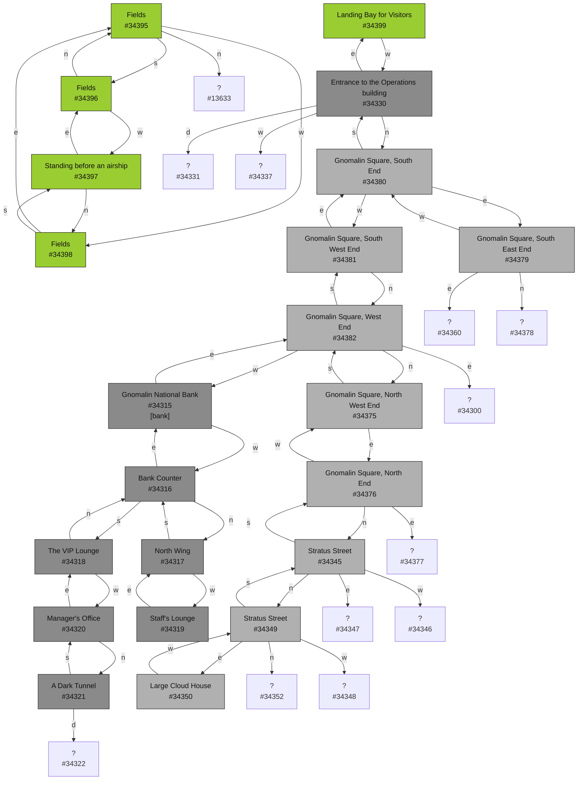

# Cloud City of Gnomalin

22 rooms. Solid = direction; dotted = special exit.

```mermaid
flowchart TD
  r34395["Fields<br/>#34395"]
  r34396["Fields<br/>#34396"]
  r34398["Fields<br/>#34398"]
  r34397["Standing before an airship<br/>#34397"]
  r34399["Landing Bay for Visitors<br/>#34399"]
  r34330["Entrance to the Operations building<br/>#34330"]
  r34380["Gnomalin Square, South End<br/>#34380"]
  r34379["Gnomalin Square, South East End<br/>#34379"]
  r34381["Gnomalin Square, South West End<br/>#34381"]
  r34382["Gnomalin Square, West End<br/>#34382"]
  r34315["Gnomalin National Bank<br/>#34315<br/>[bank]"]
  r34316["Bank Counter<br/>#34316"]
  r34318["The VIP Lounge<br/>#34318"]
  r34320["Manager's Office<br/>#34320"]
  r34321["A Dark Tunnel<br/>#34321"]
  r34317["North Wing<br/>#34317"]
  r34319["Staff's Lounge<br/>#34319"]
  r34375["Gnomalin Square, North West End<br/>#34375"]
  r34376["Gnomalin Square, North End<br/>#34376"]
  r34345["Stratus Street<br/>#34345"]
  r34349["Stratus Street<br/>#34349"]
  r34350["Large Cloud House<br/>#34350"]
  r13633["?<br/>#13633"]
  r34395 -->|n| r13633
  r34395 -->|s| r34396
  r34395 -->|w| r34398
  r34396 -->|n| r34395
  r34396 -->|w| r34397
  r34398 -->|e| r34395
  r34398 -->|s| r34397
  r34397 -->|e| r34396
  r34397 -->|n| r34398
  r34399 -->|w| r34330
  r34331["?<br/>#34331"]
  r34330 -->|d| r34331
  r34330 -->|e| r34399
  r34330 -->|n| r34380
  r34337["?<br/>#34337"]
  r34330 -->|w| r34337
  r34380 -->|e| r34379
  r34380 -->|s| r34330
  r34380 -->|w| r34381
  r34360["?<br/>#34360"]
  r34379 -->|e| r34360
  r34378["?<br/>#34378"]
  r34379 -->|n| r34378
  r34379 -->|w| r34380
  r34381 -->|e| r34380
  r34381 -->|n| r34382
  r34300["?<br/>#34300"]
  r34382 -->|e| r34300
  r34382 -->|n| r34375
  r34382 -->|s| r34381
  r34382 -->|w| r34315
  r34315 -->|e| r34382
  r34315 -->|w| r34316
  r34316 -->|e| r34315
  r34316 -->|n| r34317
  r34316 -->|s| r34318
  r34318 -->|n| r34316
  r34318 -->|w| r34320
  r34320 -->|e| r34318
  r34320 -->|n| r34321
  r34322["?<br/>#34322"]
  r34321 -->|d| r34322
  r34321 -->|s| r34320
  r34317 -->|s| r34316
  r34317 -->|w| r34319
  r34319 -->|e| r34317
  r34375 -->|e| r34376
  r34375 -->|s| r34382
  r34377["?<br/>#34377"]
  r34376 -->|e| r34377
  r34376 -->|n| r34345
  r34376 -->|w| r34375
  r34347["?<br/>#34347"]
  r34345 -->|e| r34347
  r34345 -->|n| r34349
  r34345 -->|s| r34376
  r34346["?<br/>#34346"]
  r34345 -->|w| r34346
  r34349 -->|e| r34350
  r34352["?<br/>#34352"]
  r34349 -->|n| r34352
  r34349 -->|s| r34345
  r34348["?<br/>#34348"]
  r34349 -->|w| r34348
  r34350 -->|w| r34349
  classDef t_field fill:#9acd32,color:#111,stroke:#222
  class r34395 t_field
  class r34396 t_field
  class r34398 t_field
  class r34397 t_field
  class r34399 t_field
  classDef t_inside fill:#8a8a8a,color:#111,stroke:#222
  class r34330 t_inside
  classDef t_city fill:#b0b0b0,color:#111,stroke:#222
  class r34380 t_city
  class r34379 t_city
  class r34381 t_city
  class r34382 t_city
  class r34315 t_inside
  class r34316 t_inside
  class r34318 t_inside
  class r34320 t_inside
  class r34321 t_inside
  class r34317 t_inside
  class r34319 t_inside
  class r34375 t_city
  class r34376 t_city
  class r34345 t_city
  class r34349 t_city
  class r34350 t_city
```
