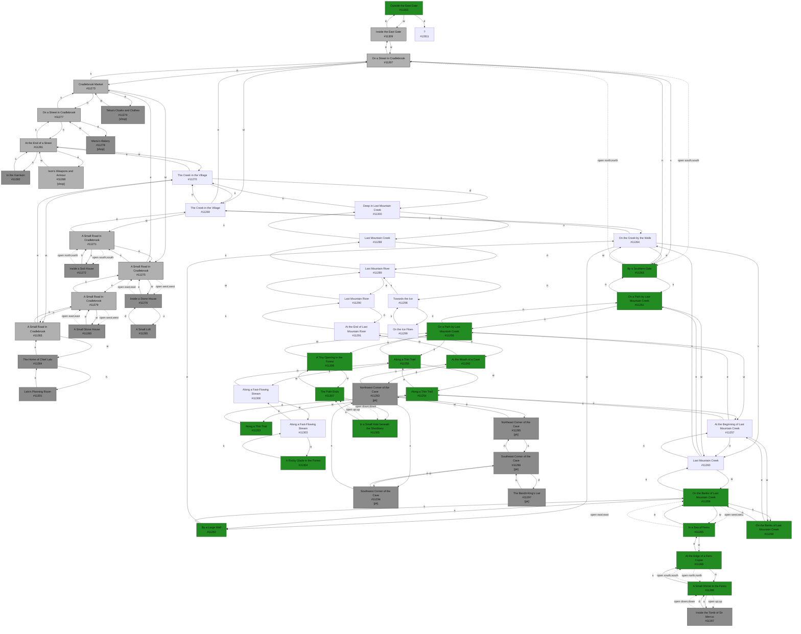

# Cradlebrook

57 rooms. Solid = direction; dotted = special exit.

```mermaid
flowchart TD
  r11302["Outside the East Gate<br/>#11302"]
  r11309["Inside the East Gate<br/>#11309"]
  r11267["On a Street in Cradlebrook<br/>#11267"]
  r11273["Cradlebrook Market<br/>#11273"]
  r11263["By a Southern Gate<br/>#11263"]
  r11277["On a Street in Cradlebrook<br/>#11277"]
  r11281["At the End of a Street<br/>#11281"]
  r11282["In the Garrison<br/>#11282"]
  r11268["Ison's Weapons and Armour<br/>#11268<br/>[shop]"]
  r11270["The Creek in the Village<br/>#11270"]
  r11283["A Small Road in Cradlebrook<br/>#11283"]
  r11284["The Home of Chief Lalo<br/>#11284"]
  r11301["Lalo's Planning Room<br/>#11301"]
  r11279["A Small Road in Cradlebrook<br/>#11279"]
  r11280["A Small Stone House<br/>#11280"]
  r11275["A Small Road in Cradlebrook<br/>#11275"]
  r11276["Inside a Stone House<br/>#11276"]
  r11285["A Small Loft<br/>#11285"]
  r11271["A Small Road in Cradlebrook<br/>#11271"]
  r11272["Inside a Sod House<br/>#11272"]
  r11269["The Creek in the Village<br/>#11269"]
  r11264["On the Creek by the Walls<br/>#11264"]
  r11262["By a Large Wall<br/>#11262"]
  r11259["On the Banks of Last Mountain Creek<br/>#11259"]
  r11265["In a Sea of Ferns<br/>#11265"]
  r11266["At the Edge of a Fern-Copse<br/>#11266"]
  r11286["A Small Shrine in the Ferns<br/>#11286"]
  r11287["Inside the Tomb of Sir Merrus<br/>#11287"]
  r11258["On the Banks of Last Mountain Creek<br/>#11258"]
  r11257["At the Beginning of Last Mountain Creek<br/>#11257"]
  r11260["Last Mountain Creek<br/>#11260"]
  r11261["On a Path by Last Mountain Creek<br/>#11261"]
  r11256["On a Path by Last Mountain Creek<br/>#11256"]
  r11254["Along a Thin Trail<br/>#11254"]
  r11253["Along a Thin Trail<br/>#11253"]
  r11255["Along a Thin Trail<br/>#11255"]
  r11308["Along a Fast-Flowing Stream<br/>#11308"]
  r11303["Along a Fast-Flowing Stream<br/>#11303"]
  r11304["A Rocky Glade in the Forest<br/>#11304"]
  r11306["A Tiny Opening in the Forest<br/>#11306"]
  r11274["Telsa's Cloaks and Clothes<br/>#11274<br/>[shop]"]
  r11278["Martu's Bakery<br/>#11278<br/>[shop]"]
  r11300["Deep in Last Mountain Creek<br/>#11300"]
  r11288["Last Mountain Creek<br/>#11288"]
  r11289["Last Mountain River<br/>#11289"]
  r11290["Last Mountain River<br/>#11290"]
  r11291["At the End of Last Mountain River<br/>#11291"]
  r11298["Towards the Ice<br/>#11298"]
  r11299["On the Ice Floes<br/>#11299"]
  r11292["At the Mouth of a Cave<br/>#11292"]
  r11293["Northwest Corner of the Cave<br/>#11293<br/>[pk]"]
  r11295["Northeast Corner of the Cave<br/>#11295<br/>[pk]"]
  r11294["Southwest Corner of the Cave<br/>#11294<br/>[pk]"]
  r11296["Southeast Corner of the Cave<br/>#11296<br/>[pk]"]
  r11297["The Bandit-King's Lair<br/>#11297<br/>[pk]"]
  r11305["In a Small Hole beneath the Shrubbery<br/>#11305"]
  r11307["The Path Ends<br/>#11307"]
  r12811["?<br/>#12811"]
  r11302 -->|e| r12811
  r11302 -->|w| r11309
  r11309 -->|e| r11302
  r11309 -->|w| r11267
  r11267 -->|e| r11309
  r11267 -->|n| r11273
  r11267 -.->|open south;south| r11263
  r11267 -->|s| r11263
  r11267 -->|w| r11269
  r11273 -->|e| r11274
  r11273 -->|n| r11277
  r11273 -->|s| r11267
  r11273 -->|w| r11275
  r11263 -->|n| r11267
  r11263 -.->|open north;north| r11267
  r11263 -->|s| r11261
  r11263 -->|w| r11264
  r11277 -->|e| r11278
  r11277 -->|n| r11281
  r11277 -->|s| r11273
  r11281 -->|e| r11268
  r11281 -->|n| r11282
  r11281 -->|s| r11277
  r11281 -->|w| r11270
  r11282 -->|s| r11281
  r11268 -->|w| r11281
  r11270 -->|d| r11300
  r11270 -->|e| r11281
  r11270 -->|s| r11269
  r11270 -->|w| r11283
  r11283 -->|e| r11270
  r11283 -->|s| r11279
  r11283 -->|w| r11284
  r11284 -->|e| r11283
  r11284 -->|n| r11301
  r11301 -->|s| r11284
  r11279 -->|n| r11283
  r11279 -.->|open west;west| r11280
  r11279 -->|s| r11275
  r11279 -->|w| r11280
  r11280 -->|e| r11279
  r11280 -.->|open east;east| r11279
  r11275 -->|e| r11273
  r11275 -->|n| r11279
  r11275 -.->|open west;west| r11276
  r11275 -->|s| r11271
  r11275 -->|w| r11276
  r11276 -->|e| r11275
  r11276 -.->|open east;east| r11275
  r11276 -->|u| r11285
  r11285 -->|d| r11276
  r11271 -->|e| r11269
  r11271 -->|n| r11275
  r11271 -.->|open south;south| r11272
  r11271 -->|s| r11272
  r11272 -->|n| r11271
  r11272 -.->|open north;north| r11271
  r11269 -->|e| r11267
  r11269 -->|n| r11270
  r11269 -->|s| r11264
  r11269 -->|w| r11271
  r11264 -->|e| r11263
  r11264 -->|n| r11269
  r11264 -->|s| r11260
  r11264 -->|w| r11262
  r11262 -->|e| r11264
  r11262 -->|s| r11259
  r11259 -->|e| r11260
  r11259 -->|n| r11262
  r11259 -.->|open west;west| r11265
  r11259 -->|s| r11258
  r11259 -->|w| r11265
  r11265 -->|e| r11259
  r11265 -.->|open east;east| r11259
  r11265 -->|w| r11266
  r11266 -->|e| r11265
  r11266 -->|n| r11286
  r11266 -.->|open north;north| r11286
  r11286 -.->|open south;south| r11266
  r11286 -.->|open up;up| r11287
  r11286 -->|s| r11266
  r11286 -->|u| r11287
  r11287 -->|d| r11286
  r11287 -.->|open down;down| r11286
  r11258 -->|e| r11257
  r11258 -->|n| r11259
  r11257 -->|e| r11256
  r11257 -->|n| r11260
  r11257 -->|s| r11254
  r11257 -->|w| r11258
  r11260 -->|e| r11261
  r11260 -->|n| r11264
  r11260 -->|s| r11257
  r11260 -->|w| r11259
  r11261 -->|n| r11263
  r11261 -->|s| r11256
  r11261 -->|w| r11260
  r11256 -->|e| r11306
  r11256 -->|n| r11261
  r11256 -->|s| r11255
  r11256 -->|w| r11257
  r11254 -->|e| r11255
  r11254 -->|n| r11257
  r11254 -->|w| r11253
  r11253 -->|e| r11254
  r11255 -->|n| r11256
  r11255 -->|s| r11308
  r11255 -->|w| r11254
  r11308 -->|n| r11255
  r11308 -->|w| r11303
  r11303 -->|e| r11308
  r11303 -->|n| r11304
  r11304 -->|s| r11303
  r11306 -->|e| r11307
  r11306 -->|w| r11256
  r11274 -->|w| r11273
  r11278 -->|w| r11277
  r11300 -->|n| r11288
  r11300 -->|u| r11270
  r11288 -->|n| r11289
  r11288 -->|s| r11300
  r11289 -->|e| r11290
  r11289 -->|n| r11298
  r11289 -->|s| r11288
  r11290 -->|n| r11291
  r11290 -->|w| r11289
  r11291 -->|e| r11292
  r11291 -->|s| r11290
  r11298 -->|n| r11299
  r11298 -->|s| r11289
  r11299 -->|s| r11298
  r11292 -->|d| r11293
  r11292 -->|w| r11291
  r11293 -->|e| r11295
  r11293 -->|s| r11294
  r11293 -->|u| r11292
  r11295 -->|s| r11296
  r11295 -->|w| r11293
  r11294 -->|e| r11296
  r11294 -->|n| r11293
  r11296 -->|d| r11297
  r11296 -->|n| r11295
  r11296 -->|w| r11294
  r11297 -->|u| r11296
  r11305 -.->|open up;up| r11307
  r11305 -->|u| r11307
  r11307 -->|d| r11305
  r11307 -.->|open down;down| r11305
  r11307 -->|w| r11306
  classDef t_forest fill:#228b22,color:#111,stroke:#222
  class r11302 t_forest
  classDef t_city fill:#b0b0b0,color:#111,stroke:#222
  class r11309 t_city
  class r11267 t_city
  class r11273 t_city
  class r11263 t_forest
  class r11277 t_city
  class r11281 t_city
  classDef t_inside fill:#8a8a8a,color:#111,stroke:#222
  class r11282 t_inside
  class r11268 t_city
  class r11283 t_city
  class r11284 t_inside
  class r11301 t_inside
  class r11279 t_city
  class r11280 t_inside
  class r11275 t_city
  class r11276 t_inside
  class r11285 t_inside
  class r11271 t_city
  class r11272 t_inside
  class r11262 t_forest
  class r11259 t_forest
  class r11265 t_forest
  class r11266 t_forest
  class r11286 t_forest
  class r11287 t_inside
  class r11258 t_forest
  class r11261 t_forest
  class r11256 t_forest
  class r11254 t_forest
  class r11253 t_forest
  class r11255 t_forest
  class r11304 t_forest
  class r11306 t_forest
  class r11274 t_inside
  class r11278 t_inside
  class r11292 t_forest
  class r11293 t_inside
  class r11295 t_inside
  class r11294 t_inside
  class r11296 t_inside
  class r11297 t_inside
  class r11305 t_forest
  class r11307 t_forest
```
