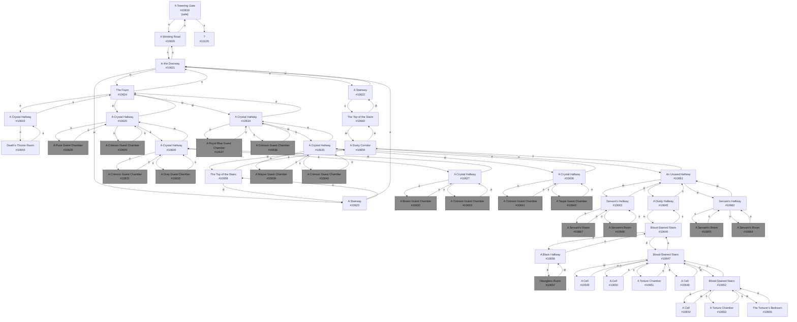

# Death's Manor

49 rooms. Solid = direction; dotted = special exit.

```mermaid
flowchart TD
  r10619["A Towering Gate<br/>#10619<br/>[safe]"]
  r10620["A Winding Road<br/>#10620"]
  r10621["In the Doorway<br/>#10621"]
  r10622["A Stairway<br/>#10622"]
  r10623["A Stairway<br/>#10623"]
  r10624["The Foyer<br/>#10624"]
  r10625["A Crystal Hallway<br/>#10625"]
  r10643["A Crystal Hallway<br/>#10643"]
  r10644["Death's Throne Room<br/>#10644"]
  r10628["A Puce Guest Chamber<br/>#10628"]
  r10626["A Crystal Hallway<br/>#10626"]
  r10627["A Crystal Hallway<br/>#10627"]
  r10632["A Brown Guest Chamber<br/>#10632"]
  r10633["A Crimson Guest Chamber<br/>#10633"]
  r10631["A Crimson Guest Chamber<br/>#10631"]
  r10630["A Grey Guest Chamber<br/>#10630"]
  r10629["A Crimson Guest Chamber<br/>#10629"]
  r10634["A Crystal Hallway<br/>#10634"]
  r10635["A Crystal Hallway<br/>#10635"]
  r10636["A Crystal Hallway<br/>#10636"]
  r10641["A Crimson Guest Chamber<br/>#10641"]
  r10642["A Taupe Guest Chamber<br/>#10642"]
  r10639["A Mauve Guest Chamber<br/>#10639"]
  r10640["A Crimson Guest Chamber<br/>#10640"]
  r10637["A Royal Blue Guest Chamber<br/>#10637"]
  r10638["A Crimson Guest Chamber<br/>#10638"]
  r10658["The Top of the Stairs<br/>#10658"]
  r10659["A Dusty Corridor<br/>#10659"]
  r10660["The Top of the Stairs<br/>#10660"]
  r10661["An Unused Hallway<br/>#10661"]
  r10662["Servant's Hallway<br/>#10662"]
  r10663["Servant's Hallway<br/>#10663"]
  r10667["A Servant's Room<br/>#10667"]
  r10666["A Servant's Room<br/>#10666"]
  r10645["A Dusty Hallway<br/>#10645"]
  r10646["Blood-Stained Stairs<br/>#10646"]
  r10656["A Black Hallway<br/>#10656"]
  r10657["Hourglass Room<br/>#10657"]
  r10665["A Servant's Room<br/>#10665"]
  r10664["A Servant's Room<br/>#10664"]
  r10647["Blood-Stained Stairs<br/>#10647"]
  r10649["A Cell<br/>#10649"]
  r10650["A Cell<br/>#10650"]
  r10651["A Torture Chamber<br/>#10651"]
  r10648["A Cell<br/>#10648"]
  r10652["Blood-Stained Stairs<br/>#10652"]
  r10653["A Torture Chamber<br/>#10653"]
  r10655["The Torturer's Bedroom<br/>#10655"]
  r10654["A Cell<br/>#10654"]
  r10619 -->|n| r10620
  r13135["?<br/>#13135"]
  r10619 -->|s| r13135
  r10620 -->|n| r10621
  r10620 -->|s| r10619
  r10621 -->|e| r10622
  r10621 -->|n| r10624
  r10621 -->|s| r10620
  r10621 -->|w| r10623
  r10622 -->|u| r10660
  r10622 -->|w| r10621
  r10623 -->|e| r10621
  r10623 -->|u| r10658
  r10624 -->|e| r10625
  r10624 -->|n| r10643
  r10624 -->|s| r10621
  r10624 -->|w| r10634
  r10625 -->|e| r10626
  r10625 -->|n| r10628
  r10625 -->|s| r10629
  r10625 -->|w| r10624
  r10643 -->|n| r10644
  r10643 -->|s| r10624
  r10644 -->|s| r10643
  r10628 -->|s| r10625
  r10626 -->|e| r10627
  r10626 -->|n| r10630
  r10626 -->|s| r10631
  r10626 -->|w| r10625
  r10627 -->|n| r10632
  r10627 -->|s| r10633
  r10627 -->|w| r10626
  r10632 -->|s| r10627
  r10633 -->|n| r10627
  r10631 -->|n| r10626
  r10630 -->|s| r10626
  r10629 -->|n| r10625
  r10634 -->|e| r10624
  r10634 -->|n| r10637
  r10634 -->|s| r10638
  r10634 -->|w| r10635
  r10635 -->|e| r10634
  r10635 -->|n| r10639
  r10635 -->|s| r10640
  r10635 -->|w| r10636
  r10636 -->|e| r10635
  r10636 -->|n| r10641
  r10636 -->|s| r10642
  r10641 -->|s| r10636
  r10642 -->|n| r10636
  r10639 -->|s| r10635
  r10640 -->|n| r10635
  r10637 -->|s| r10634
  r10638 -->|n| r10634
  r10658 -->|d| r10623
  r10658 -->|e| r10659
  r10659 -->|e| r10660
  r10659 -->|n| r10661
  r10659 -->|w| r10658
  r10660 -->|d| r10622
  r10660 -->|w| r10659
  r10661 -->|e| r10662
  r10661 -->|n| r10645
  r10661 -->|s| r10659
  r10661 -->|w| r10663
  r10662 -->|n| r10664
  r10662 -->|s| r10665
  r10662 -->|w| r10661
  r10663 -->|e| r10661
  r10663 -->|n| r10666
  r10663 -->|s| r10667
  r10667 -->|n| r10663
  r10666 -->|s| r10663
  r10645 -->|n| r10646
  r10645 -->|s| r10661
  r10646 -->|d| r10647
  r10646 -->|n| r10656
  r10646 -->|s| r10645
  r10656 -->|e| r10657
  r10656 -->|s| r10646
  r10657 -->|w| r10656
  r10665 -->|n| r10662
  r10664 -->|s| r10662
  r10647 -->|d| r10652
  r10647 -->|e| r10648
  r10647 -->|n| r10650
  r10647 -->|s| r10651
  r10647 -->|u| r10646
  r10647 -->|w| r10649
  r10649 -->|e| r10647
  r10650 -->|s| r10647
  r10651 -->|n| r10647
  r10648 -->|w| r10647
  r10652 -->|e| r10654
  r10652 -->|n| r10653
  r10652 -->|u| r10647
  r10652 -->|w| r10655
  r10653 -->|s| r10652
  r10655 -->|e| r10652
  r10654 -->|w| r10652
  classDef t_inside fill:#8a8a8a,color:#111,stroke:#222
  class r10628 t_inside
  class r10632 t_inside
  class r10633 t_inside
  class r10631 t_inside
  class r10630 t_inside
  class r10629 t_inside
  class r10641 t_inside
  class r10642 t_inside
  class r10639 t_inside
  class r10640 t_inside
  class r10637 t_inside
  class r10638 t_inside
  class r10667 t_inside
  class r10666 t_inside
  class r10657 t_inside
  class r10665 t_inside
  class r10664 t_inside
```
