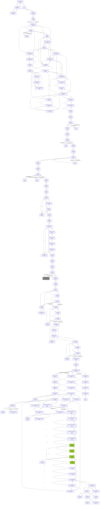

# Descent to Hell

139 rooms. Solid = direction; dotted = special exit.

```mermaid
flowchart TD
  r30981["Stone Archway<br/>#30981"]
  r30982["Ancient Room<br/>#30982"]
  r30998["Ancient Shrine<br/>#30998"]
  r30983["Dark Stairway<br/>#30983"]
  r30984["Landing<br/>#30984"]
  r30985["Gateway to Hell<br/>#30985"]
  r30996["Greed<br/>#30996"]
  r30995["Gluttony<br/>#30995"]
  r30997["Bedroom<br/>#30997"]
  r30994["Tortured Beings<br/>#30994"]
  r30993["Trapped souls<br/>#30993"]
  r30992["Living Walls<br/>#30992"]
  r30991["Mural of the Dead<br/>#30991"]
  r30990["Hall of the Damned<br/>#30990"]
  r30989["Hall of the Damned<br/>#30989"]
  r30988["Hall of the Damned<br/>#30988"]
  r30987["Hall of the Damned<br/>#30987"]
  r30986["Hall of the Damned<br/>#30986"]
  r31006["Blackened Hallway<br/>#31006"]
  r31005["Pit of Fire<br/>#31005"]
  r31004["Room of Lost Souls<br/>#31004"]
  r31003["Room of Lost Souls<br/>#31003"]
  r31002["Ancient Room<br/>#31002"]
  r31007["Blackened Hallway<br/>#31007"]
  r31008["Blood Room<br/>#31008"]
  r31009["Living Walls<br/>#31009"]
  r31010["Skeleton Factory<br/>#31010"]
  r31000["Fountain of Blood<br/>#31000"]
  r30999["Room full of Body Parts<br/>#30999"]
  r31001["Bloody Stairway<br/>#31001"]
  r31011["Bottom of Stairway<br/>#31011"]
  r31012["Stone Hall<br/>#31012"]
  r31022["Stone Hall<br/>#31022"]
  r31023["Stone Hall<br/>#31023"]
  r31024["Stone Hall<br/>#31024"]
  r31013["Cell<br/>#31013"]
  r31014["Stone Hall<br/>#31014"]
  r31015["Stone Hall<br/>#31015"]
  r31025["Cell<br/>#31025"]
  r31016["Stone Hall<br/>#31016"]
  r31026["Stone Hall<br/>#31026"]
  r31027["Stone Hall<br/>#31027"]
  r31028["Stone Hall<br/>#31028"]
  r31017["Cell<br/>#31017"]
  r31018["Stone Hall<br/>#31018"]
  r31019["Stone Hall<br/>#31019"]
  r31029["Cell<br/>#31029"]
  r31020["Cell<br/>#31020"]
  r31030["Hot Stairs<br/>#31030"]
  r31041["Fire Mural<br/>#31041"]
  r31051["Hot Hall<br/>#31051"]
  r31050["Lake of Fire<br/>#31050"]
  r31049["Wall of Fire<br/>#31049"]
  r31040["Fire Pits of Hades<br/>#31040"]
  r31039["Hall of Fire<br/>#31039"]
  r31038["Hall of Fire<br/>#31038"]
  r31048["Hall of Fire<br/>#31048"]
  r31047["Construction Area<br/>#31047"]
  r31037["Construction Area<br/>#31037"]
  r31036["Construction Area<br/>#31036"]
  r31046["Construction Area<br/>#31046"]
  r31045["Construction Area<br/>#31045"]
  r31035["Construction Area<br/>#31035"]
  r31044["Hall of Fire<br/>#31044"]
  r31034["Hall of Fire<br/>#31034"]
  r31033["Hall of Fire<br/>#31033"]
  r31032["Stone Arch<br/>#31032"]
  r31042["Foreman's Office<br/>#31042"]
  r31043["Cold Stairway<br/>#31043"]
  r31052["Icy Landing<br/>#31052"]
  r31121["Ice Room<br/>#31121"]
  r31053["Ice Room<br/>#31053"]
  r31063["Ice Room<br/>#31063"]
  r31062["Ice Room<br/>#31062"]
  r31061["Refrigerator Room<br/>#31061"]
  r31064["Meat Locker<br/>#31064"]
  r31054["Meat Locker<br/>#31054"]
  r31065["Meat Locker<br/>#31065"]
  r31055["Meat Locker<br/>#31055"]
  r31056["Penguin Room<br/>#31056"]
  r31066["Penguin Room<br/>#31066"]
  r31067["Penguin Room<br/>#31067"]
  r31057["Penguin Room<br/>#31057"]
  r31068["Ice-Creamery<br/>#31068"]
  r31058["Ice-Creamery<br/>#31058"]
  r31069["Ice-Creamery<br/>#31069"]
  r31059["Ice-Creamery<br/>#31059"]
  r31060["White Marble Hall<br/>#31060"]
  r31070["Marble Hall<br/>#31070"]
  r31080["Administration of Hell<br/>#31080"]
  r31079["Blackened Hall<br/>#31079"]
  r31090["Maintenance Walkway<br/>#31090"]
  r31078["Blackened Hall<br/>#31078"]
  r31088["Blackened Hall<br/>#31088"]
  r31087["Blackened Hall<br/>#31087"]
  r31086["Blackened Hall<br/>#31086"]
  r31076["Blackened Hall<br/>#31076"]
  r31075["Small Altar<br/>#31075"]
  r31077["Office of the High Priest<br/>#31077"]
  r31085["Halls of Judgement<br/>#31085"]
  r31084["Halls of Judgement<br/>#31084"]
  r31083["Halls of Judgement<br/>#31083"]
  r31082["Halls of Judgement<br/>#31082"]
  r31081["Halls of Judgement<br/>#31081"]
  r31072["Records Hall<br/>#31072"]
  r31071["Records Hall<br/>#31071"]
  r31073["Records Hall<br/>#31073"]
  r31074["Records Hall<br/>#31074"]
  r31093["Office of Complaints<br/>#31093"]
  r31096["Hallway of The Mall from Hell<br/>#31096"]
  r31097["The Office of Big Mouth<br/>#31097"]
  r31095["Hallway of The Mall from Hell<br/>#31095"]
  r31105["Hallway of The Mall from Hell<br/>#31105"]
  r31094["Pawn Shop<br/>#31094<br/>[shop]"]
  r31115["Hallway of The Mall from Hell<br/>#31115"]
  r31114["Hallway of The Mall from Hell<br/>#31114"]
  r31104["Stanley's Magical Steeds<br/>#31104<br/>[shop]"]
  r31103["Courtyard<br/>#31103"]
  r31102["Courtyard<br/>#31102"]
  r31113["Courtyard<br/>#31113"]
  r31112["Courtyard<br/>#31112"]
  r31092["Lawyer's Office<br/>#31092"]
  r31111["Hell's Kitchen<br/>#31111"]
  r31091["Court Room<br/>#31091"]
  r31101["Judge's Chambers<br/>#31101"]
  r31106["Inside Big Mouth's Stomach<br/>#31106"]
  r31089["Stairs to the Abyss<br/>#31089"]
  r31098["Stairs to the Abyss<br/>#31098"]
  r31107["Stairs to the Abyss<br/>#31107"]
  r31116["Stairs to the Abyss<br/>#31116"]
  r31100["Maintenance Walkway<br/>#31100"]
  r31099["Maintenance Walkway<br/>#31099"]
  r31109["Maintenance Room<br/>#31109"]
  r31110["Break Room<br/>#31110"]
  r31120["Office of the Chief Engineer<br/>#31120"]
  r31119["Secondary Control Room<br/>#31119"]
  r31108["Reactor Control Room<br/>#31108"]
  r31118["Reactor Room Floor<br/>#31118"]
  r31117["Inside the Reactor Core<br/>#31117"]
  r3172["?<br/>#3172"]
  r30981 -->|u| r3172
  r30981 -->|w| r30982
  r30982 -->|d| r30983
  r30982 -->|e| r30981
  r30982 -->|w| r30998
  r30998 -->|e| r30982
  r30983 -->|u| r30982
  r30983 -->|w| r30984
  r30984 -->|e| r30983
  r30984 -.->|open west;west| r30985
  r30984 -->|w| r30985
  r30985 -->|e| r30984
  r30985 -->|n| r30996
  r30985 -.->|open east;east| r30984
  r30985 -->|s| r31006
  r30985 -->|w| r30986
  r30996 -->|e| r30997
  r30996 -.->|open east;east| r30997
  r30996 -->|s| r30985
  r30996 -->|w| r30995
  r30995 -->|e| r30996
  r30995 -->|s| r30986
  r30995 -->|w| r30994
  r30997 -.->|open west;west| r30996
  r30997 -->|w| r30996
  r30994 -->|e| r30995
  r30994 -->|s| r30987
  r30994 -->|w| r30993
  r30993 -->|e| r30994
  r30993 -->|s| r30988
  r30993 -->|w| r30992
  r30992 -->|e| r30993
  r30992 -->|s| r30989
  r30992 -->|w| r30991
  r30991 -->|e| r30992
  r30991 -->|s| r30990
  r30990 -->|e| r30989
  r30990 -->|n| r30991
  r30989 -->|d| r31001
  r30989 -->|e| r30988
  r30989 -->|n| r30992
  r30989 -->|s| r31002
  r30989 -->|w| r30990
  r30988 -->|e| r30987
  r30988 -->|n| r30993
  r30988 -->|s| r31003
  r30988 -->|w| r30989
  r30987 -->|e| r30986
  r30987 -->|n| r30994
  r30987 -->|s| r31004
  r30987 -->|w| r30988
  r30986 -->|e| r30985
  r30986 -->|n| r30995
  r30986 -->|s| r31005
  r30986 -->|w| r30987
  r31006 -->|e| r31007
  r31006 -->|n| r30985
  r31006 -->|w| r31005
  r31005 -->|e| r31006
  r31005 -->|n| r30986
  r31005 -->|w| r31004
  r31004 -->|e| r31005
  r31004 -->|n| r30987
  r31004 -->|w| r31003
  r31003 -->|e| r31004
  r31003 -->|n| r30988
  r31003 -->|w| r31002
  r31002 -->|e| r31003
  r31002 -->|n| r30989
  r31007 -->|e| r31008
  r31007 -->|w| r31006
  r31008 -->|e| r31009
  r31008 -->|w| r31007
  r31009 -->|e| r31010
  r31009 -->|n| r30999
  r31009 -->|w| r31008
  r31010 -->|n| r31000
  r31010 -->|w| r31009
  r31000 -->|s| r31010
  r31000 -->|w| r30999
  r30999 -->|e| r31000
  r30999 -->|s| r31009
  r31001 -->|d| r31011
  r31001 -->|u| r30989
  r31011 -->|e| r31012
  r31011 -->|u| r31001
  r31012 -->|s| r31022
  r31012 -->|w| r31011
  r31022 -->|e| r31023
  r31022 -->|n| r31012
  r31023 -->|e| r31024
  r31023 -->|n| r31013
  r31023 -.->|open north;north| r31013
  r31023 -->|w| r31022
  r31024 -->|n| r31014
  r31024 -->|w| r31023
  r31013 -.->|open south;south| r31023
  r31013 -->|s| r31023
  r31014 -->|e| r31015
  r31014 -->|s| r31024
  r31015 -->|e| r31016
  r31015 -.->|open south;south| r31025
  r31015 -->|s| r31025
  r31015 -->|w| r31014
  r31025 -->|n| r31015
  r31025 -.->|open north;north| r31015
  r31016 -->|s| r31026
  r31016 -->|w| r31015
  r31026 -->|e| r31027
  r31026 -->|n| r31016
  r31027 -->|e| r31028
  r31027 -->|n| r31017
  r31027 -.->|open north;north| r31017
  r31027 -->|w| r31026
  r31028 -->|n| r31018
  r31028 -->|w| r31027
  r31017 -.->|open south;south| r31027
  r31017 -->|s| r31027
  r31018 -->|e| r31019
  r31018 -->|s| r31028
  r31019 -->|d| r31030
  r31019 -->|e| r31020
  r31019 -.->|open east;east| r31020
  r31019 -.->|open south;south| r31029
  r31019 -->|s| r31029
  r31019 -->|w| r31018
  r31029 -->|n| r31019
  r31029 -.->|open north;north| r31019
  r31020 -.->|open west;west| r31019
  r31020 -->|w| r31019
  r31030 -->|d| r31041
  r31030 -->|u| r31019
  r31041 -->|s| r31051
  r31041 -->|u| r31030
  r31051 -->|n| r31041
  r31051 -->|w| r31050
  r31050 -->|e| r31051
  r31050 -->|n| r31040
  r31050 -->|w| r31049
  r31049 -->|e| r31050
  r31049 -->|n| r31039
  r31040 -->|s| r31050
  r31040 -->|w| r31039
  r31039 -->|e| r31040
  r31039 -->|s| r31049
  r31039 -->|w| r31038
  r31038 -->|e| r31039
  r31038 -->|s| r31048
  r31048 -->|n| r31038
  r31048 -->|w| r31047
  r31047 -->|e| r31048
  r31047 -->|n| r31037
  r31047 -->|w| r31046
  r31037 -->|s| r31047
  r31037 -->|w| r31036
  r31036 -->|e| r31037
  r31036 -->|w| r31035
  r31046 -->|e| r31047
  r31046 -->|w| r31045
  r31045 -->|e| r31046
  r31045 -->|n| r31035
  r31045 -->|w| r31044
  r31035 -->|e| r31036
  r31035 -->|s| r31045
  r31044 -->|e| r31045
  r31044 -->|n| r31034
  r31034 -->|s| r31044
  r31034 -->|w| r31033
  r31033 -->|e| r31034
  r31033 -->|w| r31032
  r31032 -->|d| r31043
  r31032 -->|e| r31033
  r31032 -.->|open south;south| r31042
  r31032 -->|s| r31042
  r31042 -->|n| r31032
  r31042 -.->|open north;north| r31032
  r31043 -->|e| r31052
  r31043 -->|u| r31032
  r31052 -->|e| r31121
  r31052 -->|w| r31043
  r31121 -->|e| r31053
  r31121 -->|s| r31062
  r31121 -->|w| r31052
  r31053 -->|s| r31063
  r31053 -->|w| r31121
  r31063 -->|e| r31064
  r31063 -->|n| r31053
  r31063 -.->|open east;east| r31064
  r31063 -->|w| r31062
  r31062 -->|e| r31063
  r31062 -->|n| r31121
  r31062 -->|w| r31061
  r31061 -->|e| r31062
  r31064 -->|e| r31065
  r31064 -->|n| r31054
  r31064 -.->|open west;west| r31063
  r31064 -->|w| r31063
  r31054 -->|e| r31055
  r31054 -->|s| r31064
  r31065 -->|n| r31055
  r31065 -->|w| r31064
  r31055 -->|e| r31056
  r31055 -.->|open east;east| r31056
  r31055 -->|s| r31065
  r31055 -->|w| r31054
  r31056 -->|e| r31057
  r31056 -.->|open west;west| r31055
  r31056 -->|s| r31066
  r31056 -->|w| r31055
  r31066 -->|e| r31067
  r31066 -->|n| r31056
  r31067 -->|e| r31068
  r31067 -->|n| r31057
  r31067 -->|w| r31066
  r31057 -->|s| r31067
  r31057 -->|w| r31056
  r31068 -->|e| r31069
  r31068 -->|n| r31058
  r31068 -->|w| r31067
  r31058 -->|e| r31059
  r31058 -->|s| r31068
  r31069 -->|n| r31059
  r31069 -->|w| r31068
  r31059 -->|e| r31060
  r31059 -.->|open east;east| r31060
  r31059 -->|s| r31069
  r31059 -->|w| r31058
  r31060 -.->|open west;west| r31059
  r31060 -->|s| r31070
  r31060 -->|w| r31059
  r31070 -->|n| r31060
  r31070 -->|s| r31080
  r31080 -->|d| r31089
  r31080 -->|n| r31070
  r31080 -.->|open south;south| r31090
  r31080 -.->|open west;west| r31079
  r31080 -->|s| r31090
  r31080 -->|w| r31079
  r31079 -->|e| r31080
  r31079 -.->|open east;east| r31080
  r31079 -->|w| r31078
  r31090 -->|n| r31080
  r31090 -.->|open north;north| r31080
  r31090 -->|s| r31100
  r31078 -->|e| r31079
  r31078 -->|s| r31088
  r31088 -->|n| r31078
  r31088 -->|w| r31087
  r31087 -->|e| r31088
  r31087 -->|w| r31086
  r31086 -->|e| r31087
  r31086 -->|n| r31076
  r31086 -->|s| r31096
  r31086 -->|w| r31085
  r31076 -->|e| r31077
  r31076 -.->|open east;east| r31077
  r31076 -->|s| r31086
  r31076 -->|w| r31075
  r31075 -->|e| r31076
  r31077 -.->|open west;west| r31076
  r31077 -->|w| r31076
  r31085 -->|e| r31086
  r31085 -->|w| r31084
  r31084 -->|e| r31085
  r31084 -->|w| r31083
  r31083 -->|e| r31084
  r31083 -->|s| r31093
  r31083 -->|w| r31082
  r31082 -->|e| r31083
  r31082 -->|n| r31072
  r31082 -->|w| r31081
  r31081 -->|e| r31082
  r31081 -->|s| r31091
  r31072 -->|e| r31073
  r31072 -->|s| r31082
  r31072 -->|w| r31071
  r31071 -->|e| r31072
  r31073 -->|e| r31074
  r31073 -->|w| r31072
  r31074 -->|w| r31073
  r31093 -->|n| r31083
  r31093 -->|w| r31092
  r31096 -->|e| r31097
  r31096 -->|n| r31086
  r31096 -->|w| r31095
  r31097 -->|d| r31106
  r31097 -->|w| r31096
  r31095 -->|e| r31096
  r31095 -->|s| r31105
  r31095 -->|w| r31094
  r31105 -->|e| r31115
  r31105 -->|n| r31095
  r31094 -->|e| r31095
  r31115 -->|e| r31114
  r31115 -->|w| r31105
  r31114 -->|n| r31104
  r31114 -->|w| r31115
  r31104 -->|s| r31114
  r31104 -->|w| r31103
  r31103 -->|e| r31104
  r31103 -->|s| r31113
  r31103 -->|w| r31102
  r31102 -->|e| r31103
  r31102 -->|n| r31092
  r31102 -->|s| r31112
  r31113 -->|n| r31103
  r31113 -->|w| r31112
  r31112 -->|e| r31113
  r31112 -->|n| r31102
  r31112 -->|w| r31111
  r31092 -->|e| r31093
  r31092 -->|s| r31102
  r31111 -->|e| r31112
  r31091 -->|n| r31081
  r31091 -->|s| r31101
  r31101 -->|n| r31091
  r31106 -->|u| r31097
  r31089 -->|d| r31098
  r31098 -->|d| r31107
  r31107 -->|d| r31116
  r28847["?<br/>#28847"]
  r31116 -->|d| r28847
  r31100 -->|n| r31090
  r31100 -->|w| r31099
  r31099 -->|e| r31100
  r31099 -->|s| r31109
  r31109 -->|e| r31110
  r31109 -->|n| r31099
  r31109 -->|s| r31119
  r31109 -->|w| r31108
  r31110 -->|s| r31120
  r31110 -->|w| r31109
  r31120 -->|n| r31110
  r31119 -->|n| r31109
  r31108 -->|e| r31109
  r31108 -->|s| r31118
  r31118 -->|n| r31108
  r31118 -.->|open west;west| r31117
  r31118 -->|w| r31117
  r31117 -->|e| r31118
  r31117 -.->|open east;east| r31118
  classDef t_inside fill:#8a8a8a,color:#111,stroke:#222
  class r31042 t_inside
  classDef t_field fill:#9acd32,color:#111,stroke:#222
  class r31103 t_field
  class r31102 t_field
  class r31113 t_field
  class r31112 t_field
```
