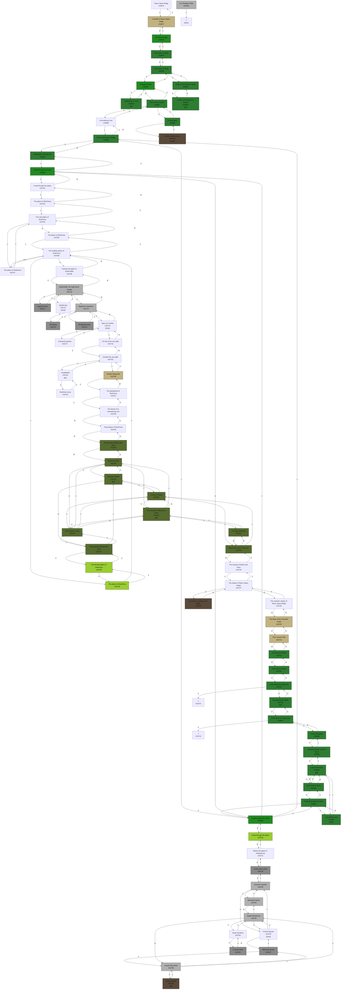

# Dhal'Gora Outlands

81 rooms. Solid = direction; dotted = special exit.

```mermaid
flowchart TD
  r16755["In a Temple of Sibi<br/>#16755"]
  r16676["Razor Spine Ridge<br/>#16676"]
  r16677["Foothills of Razor Spine Ridge<br/>#16677"]
  r16678["The forests edge<br/>#16678"]
  r16679["The Forest of Teeth<br/>#16679"]
  r16680["The Forest of Teeth<br/>#16680"]
  r16683["A tangle of trees<br/>#16683"]
  r16684["A gathering of vines<br/>#16684<br/>[pk]"]
  r16687["The Forest of Teeth<br/>#16687"]
  r16688["A tumultuous river<br/>#16688"]
  r16689["Thick and luscious foliage<br/>#16689"]
  r16690["A path through the forest<br/>#16690"]
  r16691["Pushing through the trees<br/>#16691"]
  r16692["The Forest of Teeth<br/>#16692"]
  r16694["Lost in the forest<br/>#16694<br/>[pk]"]
  r16693["A secluded grove<br/>#16693<br/>[safe]"]
  r16699["A path through the forest<br/>#16699"]
  r16698["Impassable undergrowth<br/>#16698"]
  r16740["A trail through the plains<br/>#16740"]
  r16703["A trail through the plains<br/>#16703"]
  r16704["The plains of Dhal'Gora<br/>#16704"]
  r16705["The vast plains of Dhal'Gora<br/>#16705"]
  r16706["The plains of Dhal'Gora<br/>#16706"]
  r16708["The endless plains of Dhal'Gora<br/>#16708"]
  r16707["The plains of Dhal'Gora<br/>#16707"]
  r16709["Outside the gates of Eyllisneldth<br/>#16709"]
  r16739["The plains of Dhal'Gora<br/>#16739"]
  r16738["The flooded plains of Dhal'Gora<br/>#16738"]
  r16737["The Swamp of Blood and Tears<br/>#16737"]
  r16734["Knee-deep in muck<br/>#16734"]
  r16733["A maze of muck<br/>#16733"]
  r16730["Blood and muck in the mire<br/>#16730"]
  r16729["The Swamp of Blood and Tears<br/>#16729"]
  r16727["The slopes of Razor Spine Ridge<br/>#16727"]
  r16726["The southern slopes of Razor Spine Ridge<br/>#16726"]
  r16725["The base of the mountain range<br/>#16725"]
  r16724["Tree covered hills<br/>#16724"]
  r16723["The Forest of Teeth<br/>#16723"]
  r16702["The Forest of Teeth<br/>#16702"]
  r16701["At the base of a large tree<br/>#16701"]
  r16700["A passionflower glade<br/>#16700<br/>[pk]"]
  r16697["At the base of a large tree<br/>#16697"]
  r16696["A sea of bracken<br/>#16696"]
  r16695["Heading deeper into the forest<br/>#16695"]
  r16728["A luminous, underground grotto<br/>#16728"]
  r16736["Swampy waters<br/>#16736<br/>[pk]"]
  r16735["Muck and mire<br/>#16735"]
  r16760["The Swamp of Blood and Tears<br/>#16760"]
  r16732["The Swamp of Blood and Tears<br/>#16732<br/>[pk]"]
  r16731["A muddy battlefield<br/>#16731"]
  r16759["Flood plains of Dhal'Gora<br/>#16759"]
  r16758["The shores of a meandering river<br/>#16758"]
  r16757["The grasslands of Dhal'Gora<br/>#16757"]
  r16756["Gentle rolling hills<br/>#16756"]
  r16752["Outside the city walls<br/>#16752"]
  r16718["On top of the city walls<br/>#16718"]
  r16753["A battlefield<br/>#16753<br/>[pk]"]
  r16754["Northmen army<br/>#16754"]
  r16716["Open air market<br/>#16716<br/>[shop]"]
  r16713["Magician's Quarters<br/>#16713"]
  r16710["Eyllisneldth, the High-Elven Capital<br/>#16710"]
  r16717["A peaceful garden<br/>#16717"]
  r16714["The library<br/>#16714"]
  r16711["A guest house<br/>#16711"]
  r16712["Apothecary<br/>#16712<br/>[shop]"]
  r16715["Residential area<br/>#16715"]
  r16741["Before the gates of Suldassanar<br/>#16741"]
  r16742["Guard check-point<br/>#16742"]
  r16743["Common Quarter<br/>#16743"]
  r16746["Central Square<br/>#16746<br/>[shop]"]
  r16747["Merchant Sector<br/>#16747"]
  r16748["A quiet side street<br/>#16748"]
  r16745["Noble Residences<br/>#16745"]
  r16744["Merchant Sector<br/>#16744"]
  r16750["Royal Gardens<br/>#16750"]
  r16751["A ruined tower<br/>#16751"]
  r16749["Sewer tunnels<br/>#16749<br/>[pk]"]
  r16686["A small gully<br/>#16686"]
  r16685["A fetid, subterranean chamber<br/>#16685"]
  r16681["Deep in the Forest of Teeth<br/>#16681"]
  r16682["A dark and dangerous thicket<br/>#16682<br/>[pk]"]
  r5624["?<br/>#5624"]
  r16755 -->|s| r5624
  r16676 -->|s| r16677
  r16677 -->|n| r16676
  r16677 -->|w| r16678
  r16678 -->|e| r16677
  r16678 -->|w| r16679
  r16679 -->|e| r16678
  r16679 -->|w| r16680
  r16680 -->|e| r16679
  r16680 -->|n| r16681
  r16680 -->|s| r16683
  r16683 -->|n| r16680
  r16683 -->|s| r16684
  r16683 -->|w| r16687
  r16684 -->|n| r16683
  r16687 -->|e| r16683
  r16687 -->|n| r16686
  r16687 -->|s| r16688
  r16688 -->|n| r16687
  r16688 -->|s| r16689
  r16689 -->|e| r16698
  r16689 -->|n| r16688
  r16689 -->|s| r16690
  r16690 -->|e| r16699
  r16690 -->|n| r16689
  r16690 -->|s| r16691
  r16690 -->|w| r16740
  r16691 -->|e| r16693
  r16691 -->|n| r16690
  r16691 -->|s| r16692
  r16692 -->|e| r16694
  r16692 -->|n| r16691
  r16692 -->|w| r16694
  r16694 -->|e| r16692
  r16694 -->|n| r16693
  r16694 -->|s| r16695
  r16694 -->|w| r16692
  r16693 -->|s| r16694
  r16693 -->|w| r16691
  r16699 -->|e| r16703
  r16699 -->|n| r16698
  r16699 -->|w| r16690
  r16698 -->|s| r16699
  r16698 -->|w| r16689
  r16740 -->|e| r16690
  r16740 -->|w| r16741
  r16703 -->|e| r16704
  r16703 -->|w| r16699
  r16704 -->|s| r16705
  r16704 -->|w| r16703
  r16705 -->|e| r16706
  r16705 -->|n| r16704
  r16705 -->|s| r16707
  r16706 -->|s| r16708
  r16706 -->|w| r16705
  r16708 -->|e| r16709
  r16708 -->|n| r16706
  r16708 -->|s| r16739
  r16708 -->|w| r16707
  r16707 -->|e| r16708
  r16707 -->|n| r16705
  r16709 -->|e| r16710
  r16709 -->|w| r16708
  r16739 -->|n| r16708
  r16739 -->|s| r16738
  r16738 -->|n| r16739
  r16738 -->|s| r16737
  r16737 -->|e| r16736
  r16737 -->|n| r16738
  r16737 -->|s| r16734
  r16734 -->|e| r16735
  r16734 -->|n| r16737
  r16734 -->|s| r16733
  r16734 -->|w| r16732
  r16733 -->|e| r16732
  r16733 -->|n| r16734
  r16733 -->|s| r16730
  r16733 -->|w| r16736
  r16730 -->|e| r16731
  r16730 -->|n| r16733
  r16730 -->|w| r16729
  r16729 -->|e| r16730
  r16729 -->|s| r16727
  r16727 -->|e| r16728
  r16727 -->|n| r16729
  r16727 -->|w| r16726
  r16726 -->|e| r16727
  r16726 -->|w| r16725
  r16725 -->|e| r16726
  r16725 -->|n| r16724
  r16724 -->|s| r16725
  r16724 -->|w| r16723
  r16723 -->|e| r16724
  r16723 -->|w| r16702
  r16702 -->|e| r16723
  r16702 -->|n| r16701
  r16701 -->|s| r16702
  r16722["?<br/>#16722"]
  r16701 -->|u| r16722
  r16701 -->|w| r16700
  r16700 -->|e| r16701
  r16700 -->|n| r16697
  r16697 -->|e| r16696
  r16697 -->|s| r16700
  r16719["?<br/>#16719"]
  r16697 -->|u| r16719
  r16696 -->|n| r16695
  r16696 -->|w| r16697
  r16695 -->|n| r16694
  r16695 -->|s| r16696
  r16728 -->|w| r16727
  r16736 -->|e| r16733
  r16736 -->|s| r16735
  r16736 -->|w| r16737
  r16735 -->|e| r16760
  r16735 -->|n| r16736
  r16735 -->|s| r16732
  r16735 -->|w| r16734
  r16760 -->|e| r16759
  r16760 -->|w| r16735
  r16732 -->|e| r16734
  r16732 -->|n| r16735
  r16732 -->|s| r16731
  r16732 -->|w| r16733
  r16731 -->|n| r16732
  r16731 -->|w| r16730
  r16759 -->|e| r16758
  r16759 -->|w| r16760
  r16758 -->|n| r16757
  r16758 -->|w| r16759
  r16757 -->|s| r16758
  r16757 -->|w| r16756
  r16756 -->|e| r16757
  r16756 -->|n| r16752
  r16752 -->|n| r16753
  r16752 -->|s| r16756
  r16752 -->|w| r16718
  r16718 -->|d| r16716
  r16718 -->|e| r16752
  r16753 -->|n| r16754
  r16753 -->|s| r16752
  r16754 -->|s| r16753
  r16716 -->|n| r16717
  r16716 -->|u| r16718
  r16716 -->|w| r16713
  r16713 -->|e| r16716
  r16713 -->|n| r16714
  r16713 -->|s| r16715
  r16713 -->|w| r16710
  r16710 -->|e| r16713
  r16710 -->|n| r16711
  r16710 -->|s| r16712
  r16710 -->|w| r16709
  r16717 -->|s| r16716
  r16714 -->|s| r16713
  r16711 -->|s| r16710
  r16712 -->|n| r16710
  r16715 -->|n| r16713
  r16741 -->|e| r16740
  r16741 -->|w| r16742
  r16742 -->|e| r16741
  r16742 -->|n| r16743
  r16743 -->|n| r16744
  r16743 -->|s| r16742
  r16743 -->|w| r16746
  r16746 -->|e| r16743
  r16746 -->|n| r16745
  r16746 -->|w| r16747
  r16747 -->|e| r16746
  r16747 -->|n| r16748
  r16748 -->|d| r16749
  r16748 -->|e| r16745
  r16748 -->|s| r16747
  r16745 -->|e| r16744
  r16745 -->|n| r16750
  r16745 -->|s| r16746
  r16745 -->|w| r16748
  r16744 -->|s| r16743
  r16744 -->|w| r16745
  r16750 -->|s| r16745
  r16750 -->|u| r16751
  r16751 -->|d| r16750
  r16749 -->|u| r16748
  r16686 -->|s| r16687
  r16686 -->|w| r16685
  r16685 -->|e| r16686
  r16681 -->|e| r16682
  r16681 -->|s| r16680
  r16682 -->|w| r16681
  classDef t_city fill:#b0b0b0,color:#111,stroke:#222
  class r16755 t_city
  classDef t_hills fill:#c2b280,color:#111,stroke:#222
  class r16677 t_hills
  classDef t_forest fill:#228b22,color:#111,stroke:#222
  class r16678 t_forest
  classDef t_jungle fill:#2e7d32,color:#111,stroke:#222
  class r16679 t_jungle
  class r16680 t_jungle
  class r16683 t_forest
  class r16684 t_jungle
  class r16687 t_jungle
  class r16689 t_jungle
  class r16690 t_forest
  class r16691 t_jungle
  class r16692 t_jungle
  class r16694 t_jungle
  class r16693 t_jungle
  class r16699 t_forest
  class r16698 t_jungle
  classDef t_field fill:#9acd32,color:#111,stroke:#222
  class r16740 t_field
  class r16739 t_field
  class r16738 t_field
  classDef t_swamp fill:#556b2f,color:#111,stroke:#222
  class r16737 t_swamp
  class r16734 t_swamp
  class r16733 t_swamp
  class r16730 t_swamp
  class r16725 t_hills
  class r16724 t_hills
  class r16723 t_jungle
  class r16702 t_jungle
  class r16701 t_jungle
  class r16700 t_jungle
  class r16697 t_jungle
  class r16696 t_jungle
  class r16695 t_jungle
  classDef t_cave fill:#5a4a3a,color:#111,stroke:#222
  class r16728 t_cave
  class r16736 t_swamp
  class r16735 t_swamp
  class r16760 t_swamp
  class r16732 t_swamp
  class r16731 t_swamp
  class r16756 t_hills
  class r16713 t_city
  class r16710 t_city
  classDef t_inside fill:#8a8a8a,color:#111,stroke:#222
  class r16714 t_inside
  class r16711 t_inside
  class r16715 t_inside
  class r16742 t_inside
  class r16743 t_city
  class r16747 t_inside
  class r16748 t_city
  class r16745 t_city
  class r16744 t_city
  class r16751 t_inside
  class r16749 t_cave
  class r16686 t_jungle
  class r16685 t_cave
  class r16681 t_jungle
  class r16682 t_jungle
```
