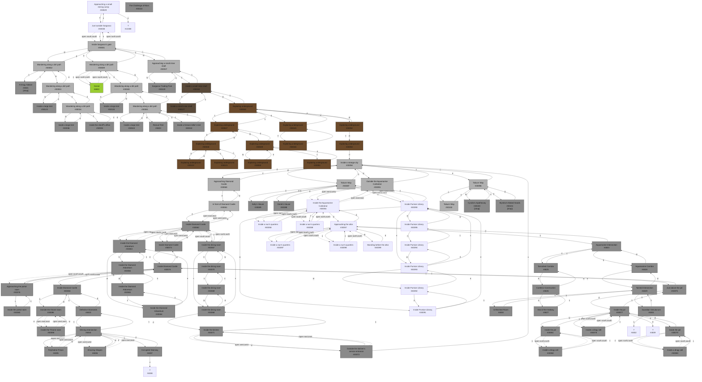

# Diamond Soul Revelation

97 rooms. Solid = direction; dotted = special exit.

```mermaid
flowchart TD
  r30029["Approaching a small mining camp<br/>#30029"]
  r30030["Just outside Sargasso<br/>#30030"]
  r30031["Inside Sargasso's gate<br/>#30031"]
  r30039["Wandering along a dirt path<br/>#30039"]
  r30032["Wandering along a dirt path<br/>#30032"]
  r4821["A Dingy Saloon<br/>#4821<br/>[shop]"]
  r30033["Wandering along a dirt path<br/>#30033"]
  r30123["Inside a large tent<br/>#30123"]
  r30034["Wandering along a dirt path<br/>#30034"]
  r30036["Inside a large tent<br/>#30036"]
  r30035["Inside the sheriff's office<br/>#30035"]
  r4822["Corral<br/>#4822"]
  r30040["Wandering along a dirt path<br/>#30040"]
  r30124["Inside a large tent<br/>#30124"]
  r30041["Wandering along a dirt path<br/>#30041"]
  r30043["Inside a large tent<br/>#30043"]
  r4823["Revival Tent<br/>#4823"]
  r30042["Inside a fortune teller's tent<br/>#30042"]
  r30037["Approaching a small mine shaft<br/>#30037"]
  r30120["Sargasso Trading Post<br/>#30120"]
  r30038["Inside a small mine shaft<br/>#30038"]
  r30127["Inside a small mine shaft<br/>#30127"]
  r30044["Exploring underground<br/>#30044"]
  r30052["Exploring underground<br/>#30052"]
  r30045["Exploring underground<br/>#30045"]
  r30047["Exploring underground<br/>#30047"]
  r30049["Exploring underground<br/>#30049"]
  r30048["Exploring underground<br/>#30048"]
  r30122["Exploring underground<br/>#30122"]
  r30121["Exploring underground<br/>#30121"]
  r30050["Exploring underground<br/>#30050"]
  r30051["Exploring underground<br/>#30051"]
  r30110["The Challenge of Mars<br/>#30110"]
  r30083["Inside the portal room<br/>#30083"]
  r30076["Approaching the portal room<br/>#30076"]
  r30074["Inside Diamond Castle<br/>#30074"]
  r30084["Inside Diamond Castle<br/>#30084"]
  r30085["Outside the throne room<br/>#30085"]
  r30086["Inside the Throne room<br/>#30086"]
  r4833["Defective Diamonds<br/>#4833"]
  r4834["Shining Intersection<br/>#4834"]
  r4835["Polyhedral Prison<br/>#4835"]
  r4836["Amazing Shapes<br/>#4836"]
  r4837["Corrupted Stairway<br/>#4837"]
  r30075["Just above the jail<br/>#30075"]
  r30073["Inside Diamond Castle<br/>#30073"]
  r30062["Inside Diamond Castle<br/>#30062"]
  r30063["Inside the Diamond Arboretum<br/>#30063"]
  r30067["Inside the dining room<br/>#30067"]
  r30061["In front of Diamond Castle<br/>#30061"]
  r30066["Inside the Diamond Arboretum<br/>#30066"]
  r30065["Inside the Diamond Arboretum<br/>#30065"]
  r30064["Inside the Diamond Arboretum<br/>#30064"]
  r30070["Inside the dining room<br/>#30070"]
  r30069["Inside the dining room<br/>#30069"]
  r30068["Inside the dining room<br/>#30068"]
  r30060["Approaching Diamond Castle<br/>#30060"]
  r30054["Inside a strange city<br/>#30054"]
  r30087["Talcum Way<br/>#30087"]
  r30089["Kelly's House<br/>#30089"]
  r30088["Derek's House<br/>#30088"]
  r30090["Inside Pumice Library<br/>#30090"]
  r30091["Inside Pumice Library<br/>#30091"]
  r30095["Inside Pumice Library<br/>#30095"]
  r30094["Inside Pumice Library<br/>#30094"]
  r30093["Inside Pumice Library<br/>#30093"]
  r30092["Inside Pumice Library<br/>#30092"]
  r30055["Outside the Aquamarine Cathedral<br/>#30055"]
  r30056["Inside the Aquamarine Cathedral<br/>#30056"]
  r30058["Inside a nun's quarters<br/>#30058"]
  r30059["Inside a nun's quarters<br/>#30059"]
  r30057["Approaching the altar<br/>#30057"]
  r30097["Inside a nun's quarters<br/>#30097"]
  r30098["Inside a nun's quarters<br/>#30098"]
  r30099["Standing before the altar<br/>#30099"]
  r4824["Aquamarine Intersection<br/>#4824"]
  r4825["Tarnished Corridor<br/>#4825"]
  r4826["Careless Construction<br/>#4826"]
  r4828["Aquamarine Corridor<br/>#4828"]
  r4829["Tainted Intersection<br/>#4829"]
  r4830["Unfinished Room<br/>#4830"]
  r4831["Guardian Simulacrum<br/>#4831"]
  r4827["End of the Hallway<br/>#4827"]
  r30096["Talcum Way<br/>#30096"]
  r30102["Talcum Way<br/>#30102"]
  r30100["Cyndra's Apothecary<br/>#30100<br/>[shop]"]
  r30101["Mystina's Baked Goods<br/>#30101<br/>[shop]"]
  r30071["Inside the kitchen<br/>#30071"]
  r30072["Outside the kitchen's service entrance<br/>#30072"]
  r30077["Inside the jail<br/>#30077"]
  r30081["Inside the jail<br/>#30081"]
  r30079["Inside the jail<br/>#30079"]
  r30046["Exploring underground<br/>#30046"]
  r30053["Exploring underground<br/>#30053"]
  r30078["Inside a dingy cell<br/>#30078"]
  r30082["Inside a dingy cell<br/>#30082"]
  r30080["Inside a dingy cell<br/>#30080"]
  r30029 -->|s| r30030
  r13300["?<br/>#13300"]
  r30029 -->|u| r13300
  r30030 -->|n| r30029
  r30030 -.->|open south;south| r30031
  r30030 -->|s| r30031
  r30031 -->|e| r30039
  r30031 -->|n| r30030
  r30031 -.->|open north;north| r30030
  r30031 -->|s| r30037
  r30031 -->|w| r30032
  r30039 -->|e| r30040
  r30039 -->|n| r4822
  r30039 -.->|open north;north| r4822
  r30039 -->|w| r30031
  r30032 -->|e| r30031
  r30032 -->|n| r4821
  r30032 -->|w| r30033
  r4821 -->|s| r30032
  r30033 -->|e| r30032
  r30033 -->|s| r30034
  r30033 -->|w| r30123
  r30123 -->|e| r30033
  r30034 -->|n| r30033
  r30034 -->|s| r30035
  r30034 -->|w| r30036
  r30036 -->|e| r30034
  r30035 -->|n| r30034
  r4822 -.->|open south;south| r30039
  r4822 -->|s| r30039
  r30040 -->|e| r30124
  r30040 -->|s| r30041
  r30040 -->|w| r30039
  r30124 -->|w| r30040
  r30041 -->|e| r30043
  r30041 -->|n| r30040
  r30041 -->|s| r30042
  r30041 -->|w| r4823
  r30043 -->|w| r30041
  r4823 -->|e| r30041
  r30042 -->|n| r30041
  r30037 -->|n| r30031
  r30037 -->|s| r30038
  r30037 -->|w| r30120
  r30120 -->|e| r30037
  r30038 -->|d| r30044
  r30038 -->|n| r30037
  r30038 -->|s| r30127
  r30127 -->|n| r30038
  r30044 -->|e| r30045
  r30044 -->|s| r30047
  r30044 -->|u| r30038
  r30044 -->|w| r30052
  r30052 -->|e| r30044
  r30052 -->|w| r30053
  r30045 -->|n| r30046
  r30045 -->|w| r30044
  r30047 -->|e| r30048
  r30047 -->|n| r30044
  r30047 -->|w| r30049
  r30049 -->|e| r30047
  r30049 -->|s| r30051
  r30049 -->|w| r30050
  r30048 -->|e| r30122
  r30048 -->|s| r30121
  r30048 -->|w| r30047
  r30122 -->|w| r30048
  r30121 -->|n| r30048
  r30050 -->|e| r30049
  r30051 -->|n| r30049
  r30083 -->|n| r30076
  r30076 -->|n| r30074
  r30076 -.->|open north;north| r30074
  r30076 -->|s| r30083
  r30074 -->|e| r30084
  r30074 -->|n| r30075
  r30074 -.->|open south;south| r30076
  r30074 -->|s| r30076
  r30074 -->|w| r30073
  r30084 -->|e| r30085
  r30084 -->|u| r4833
  r30084 -->|w| r30074
  r30085 -->|e| r30086
  r30085 -.->|open east;east| r30086
  r30085 -->|w| r30084
  r30086 -.->|open west;west| r30085
  r30086 -->|w| r30085
  r4833 -->|d| r30084
  r4833 -->|n| r4834
  r4834 -->|e| r4835
  r4834 -.->|open east;east| r4835
  r4834 -.->|open west;west| r4836
  r4834 -->|s| r4833
  r4834 -->|u| r4837
  r4834 -->|w| r4836
  r4835 -.->|open west;west| r4834
  r4835 -->|w| r4834
  r4836 -->|e| r4834
  r4836 -.->|open east;east| r4834
  r4837 -->|d| r4834
  r4838["?<br/>#4838"]
  r4837 -->|u| r4838
  r30075 -->|d| r30077
  r30075 -->|s| r30074
  r30073 -->|e| r30074
  r30073 -.->|open west;west| r30062
  r30073 -->|w| r30062
  r30062 -->|e| r30073
  r30062 -->|n| r30063
  r30062 -.->|open east;east| r30073
  r30062 -.->|open north;north| r30063
  r30062 -.->|open south;south| r30067
  r30062 -.->|open west;west| r30061
  r30062 -->|s| r30067
  r30062 -->|w| r30061
  r30063 -->|n| r30066
  r30063 -.->|open south;south| r30062
  r30063 -->|s| r30062
  r30063 -->|w| r30064
  r30067 -->|e| r30070
  r30067 -->|n| r30062
  r30067 -.->|open north;north| r30062
  r30067 -->|s| r30068
  r30061 -->|e| r30062
  r30061 -.->|open east;east| r30062
  r30061 -->|w| r30060
  r30066 -->|s| r30063
  r30066 -->|w| r30065
  r30065 -->|e| r30066
  r30065 -->|s| r30064
  r30064 -->|e| r30063
  r30064 -->|n| r30065
  r30070 -->|s| r30069
  r30070 -->|w| r30067
  r30069 -->|n| r30070
  r30069 -->|w| r30068
  r30068 -->|d| r30071
  r30068 -->|e| r30069
  r30068 -->|n| r30067
  r30060 -->|e| r30061
  r30060 -->|w| r30054
  r30054 -->|e| r30060
  r30054 -->|n| r30087
  r30054 -->|s| r30096
  r30054 -->|w| r30055
  r30087 -->|e| r30089
  r30087 -->|n| r30090
  r30087 -.->|open north;north| r30090
  r30087 -->|s| r30054
  r30087 -->|w| r30088
  r30089 -->|w| r30087
  r30088 -->|e| r30087
  r30090 -->|e| r30095
  r30090 -->|n| r30093
  r30090 -.->|open south;south| r30087
  r30090 -->|s| r30087
  r30090 -->|w| r30091
  r30091 -->|e| r30090
  r30091 -->|n| r30092
  r30095 -->|n| r30094
  r30095 -->|w| r30090
  r30094 -->|s| r30095
  r30094 -->|w| r30093
  r30093 -->|e| r30094
  r30093 -->|s| r30090
  r30093 -->|w| r30092
  r30092 -->|e| r30093
  r30092 -->|s| r30091
  r30055 -->|e| r30054
  r30055 -.->|open west;west| r30056
  r30055 -->|w| r30056
  r30056 -->|e| r30055
  r30056 -->|n| r30058
  r30056 -.->|open east;east| r30055
  r30056 -.->|open north;north| r30058
  r30056 -.->|open south;south| r30059
  r30056 -->|s| r30059
  r30056 -->|w| r30057
  r30058 -.->|open south;south| r30056
  r30058 -->|s| r30056
  r30059 -->|n| r30056
  r30059 -.->|open north;north| r30056
  r30057 -->|e| r30056
  r30057 -->|n| r30097
  r30057 -.->|open north;north| r30097
  r30057 -.->|open south;south| r30098
  r30057 -->|s| r30098
  r30057 -->|u| r4824
  r30057 -->|w| r30099
  r30097 -.->|open south;south| r30057
  r30097 -->|s| r30057
  r30098 -->|n| r30057
  r30098 -.->|open north;north| r30057
  r30099 -->|e| r30057
  r4824 -->|d| r30057
  r4824 -->|e| r4828
  r4824 -->|n| r4825
  r4825 -->|e| r4826
  r4825 -->|s| r4824
  r4826 -->|n| r4827
  r4826 -->|w| r4825
  r4828 -->|e| r4829
  r4828 -->|w| r4824
  r4829 -->|n| r4831
  r4829 -->|s| r4830
  r4829 -->|w| r4828
  r4830 -->|n| r4829
  r4831 -->|s| r4829
  r4832["?<br/>#4832"]
  r4831 -->|u| r4832
  r4827 -->|s| r4826
  r30096 -->|e| r30101
  r30096 -->|n| r30054
  r30096 -->|s| r30102
  r30096 -->|w| r30100
  r30102 -->|n| r30096
  r30100 -->|e| r30096
  r30101 -->|w| r30096
  r30071 -.->|open west;west| r30072
  r30071 -->|u| r30068
  r30071 -->|w| r30072
  r30072 -->|e| r30071
  r30072 -.->|open east;east| r30071
  r30072 -->|u| r30054
  r4839["?<br/>#4839"]
  r30077 -->|d| r4839
  r30077 -->|e| r30079
  r30077 -->|n| r30078
  r30077 -.->|open north;north| r30078
  r30077 -->|u| r30075
  r30077 -->|w| r30081
  r30081 -->|e| r30077
  r30081 -->|n| r30082
  r30081 -.->|open north;north| r30082
  r30079 -->|n| r30080
  r30079 -.->|open north;north| r30080
  r30079 -->|w| r30077
  r30046 -->|s| r30045
  r30053 -->|d| r30054
  r30078 -.->|open south;south| r30077
  r30078 -->|s| r30077
  r30082 -.->|open south;south| r30081
  r30082 -->|s| r30081
  r30080 -.->|open south;south| r30079
  r30080 -->|s| r30079
  classDef t_city fill:#b0b0b0,color:#111,stroke:#222
  class r30031 t_city
  class r30039 t_city
  class r30032 t_city
  classDef t_inside fill:#8a8a8a,color:#111,stroke:#222
  class r4821 t_inside
  class r30033 t_city
  class r30123 t_inside
  class r30034 t_city
  class r30036 t_inside
  class r30035 t_inside
  classDef t_field fill:#9acd32,color:#111,stroke:#222
  class r4822 t_field
  class r30040 t_city
  class r30124 t_inside
  class r30041 t_city
  class r30043 t_inside
  class r4823 t_inside
  class r30042 t_inside
  class r30037 t_city
  class r30120 t_inside
  classDef t_cave fill:#5a4a3a,color:#111,stroke:#222
  class r30038 t_cave
  class r30127 t_cave
  classDef t_underground fill:#6b4a2b,color:#111,stroke:#222
  class r30044 t_underground
  class r30052 t_underground
  class r30045 t_underground
  class r30047 t_underground
  class r30049 t_underground
  class r30048 t_underground
  class r30122 t_underground
  class r30121 t_underground
  class r30050 t_underground
  class r30051 t_underground
  class r30110 t_inside
  class r30083 t_inside
  class r30076 t_inside
  class r30074 t_inside
  class r30084 t_inside
  class r30085 t_inside
  class r30086 t_inside
  class r4833 t_inside
  class r4834 t_inside
  class r4835 t_inside
  class r4836 t_inside
  class r4837 t_inside
  class r30075 t_inside
  class r30073 t_inside
  class r30062 t_inside
  class r30063 t_inside
  class r30067 t_inside
  class r30061 t_city
  class r30066 t_inside
  class r30065 t_inside
  class r30064 t_inside
  class r30070 t_inside
  class r30069 t_inside
  class r30068 t_inside
  class r30060 t_city
  class r30054 t_city
  class r30087 t_city
  class r30089 t_inside
  class r30088 t_inside
  class r30055 t_city
  class r4824 t_inside
  class r4825 t_inside
  class r4826 t_inside
  class r4828 t_inside
  class r4829 t_inside
  class r4830 t_inside
  class r4831 t_inside
  class r4827 t_inside
  class r30096 t_city
  class r30102 t_city
  class r30100 t_inside
  class r30101 t_inside
  class r30071 t_inside
  class r30072 t_inside
  class r30077 t_inside
  class r30081 t_inside
  class r30079 t_inside
  class r30046 t_underground
  class r30053 t_underground
  class r30078 t_inside
  class r30082 t_inside
  class r30080 t_inside
```
