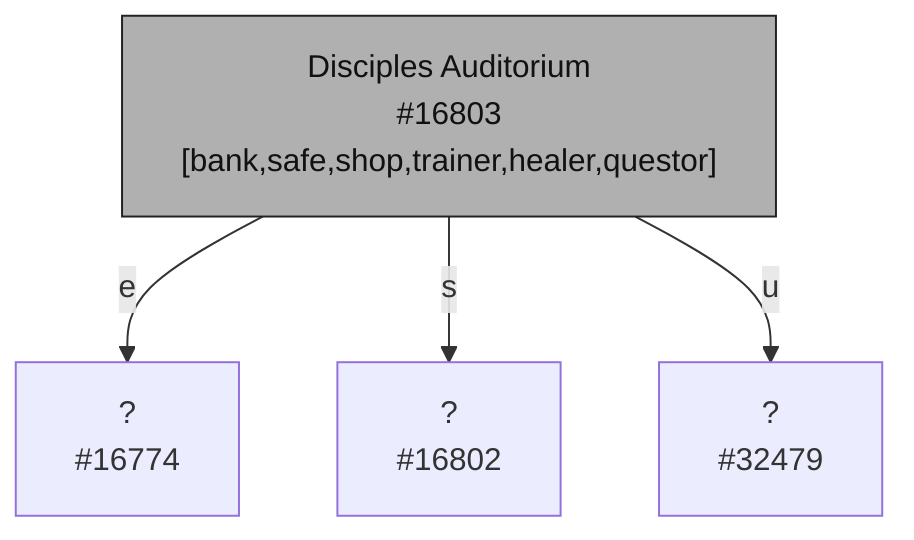

# Disciples of Hassan Clan Hall

1 rooms. Solid = direction; dotted = special exit.

```mermaid
flowchart TD
  r16803["Disciples Auditorium<br/>#16803<br/>[bank,safe,shop,trainer,healer,questor]"]
  r16774["?<br/>#16774"]
  r16803 -->|e| r16774
  r16802["?<br/>#16802"]
  r16803 -->|s| r16802
  r32479["?<br/>#32479"]
  r16803 -->|u| r32479
  classDef t_city fill:#b0b0b0,color:#111,stroke:#222
  class r16803 t_city
```
