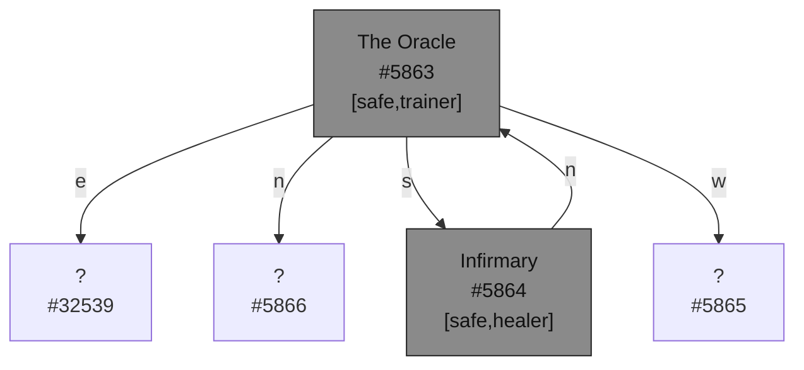

# Dominion Clan Area

2 rooms. Solid = direction; dotted = special exit.

```mermaid
flowchart TD
  r5863["The Oracle<br/>#5863<br/>[safe,trainer]"]
  r5864["Infirmary<br/>#5864<br/>[safe,healer]"]
  r32539["?<br/>#32539"]
  r5863 -->|e| r32539
  r5866["?<br/>#5866"]
  r5863 -->|n| r5866
  r5863 -->|s| r5864
  r5865["?<br/>#5865"]
  r5863 -->|w| r5865
  r5864 -->|n| r5863
  classDef t_inside fill:#8a8a8a,color:#111,stroke:#222
  class r5863 t_inside
  class r5864 t_inside
```
