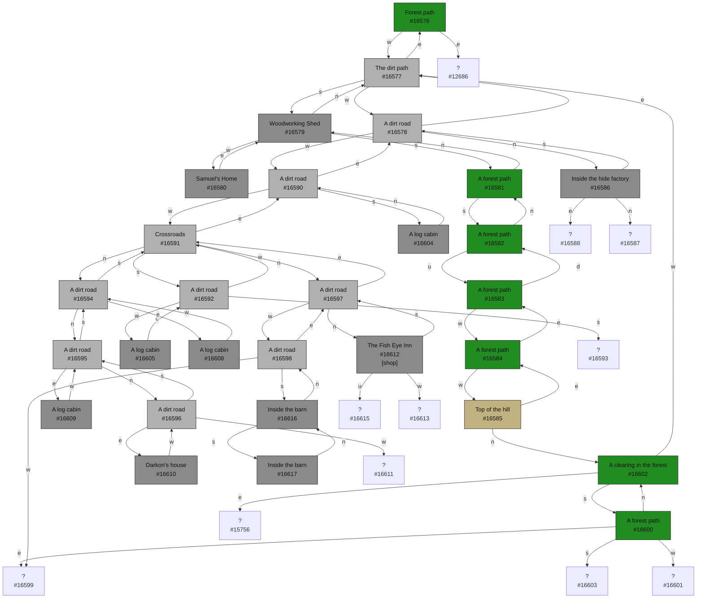

# Dortmund

29 rooms. Solid = direction; dotted = special exit.

```mermaid
flowchart TD
  r16576["Forest path<br/>#16576"]
  r16577["The dirt path<br/>#16577"]
  r16579["Woodworking Shed<br/>#16579"]
  r16580["Samuel's Home<br/>#16580"]
  r16581["A forest path<br/>#16581"]
  r16582["A forest path<br/>#16582"]
  r16583["A forest path<br/>#16583"]
  r16584["A forest path<br/>#16584"]
  r16585["Top of the hill<br/>#16585"]
  r16602["A clearing in the forest<br/>#16602"]
  r16600["A forest path<br/>#16600"]
  r16578["A dirt road<br/>#16578"]
  r16586["Inside the hide factory<br/>#16586"]
  r16590["A dirt road<br/>#16590"]
  r16604["A log cabin<br/>#16604"]
  r16591["Crossroads<br/>#16591"]
  r16592["A dirt road<br/>#16592"]
  r16605["A log cabin<br/>#16605"]
  r16594["A dirt road<br/>#16594"]
  r16608["A log cabin<br/>#16608"]
  r16595["A dirt road<br/>#16595"]
  r16609["A log cabin<br/>#16609"]
  r16596["A dirt road<br/>#16596"]
  r16610["Darkon's house<br/>#16610"]
  r16597["A dirt road<br/>#16597"]
  r16612["The Fish Eye Inn<br/>#16612<br/>[shop]"]
  r16598["A dirt road<br/>#16598"]
  r16616["Inside the barn<br/>#16616"]
  r16617["Inside the barn<br/>#16617"]
  r12686["?<br/>#12686"]
  r16576 -->|e| r12686
  r16576 -->|w| r16577
  r16577 -->|e| r16576
  r16577 -->|s| r16579
  r16577 -->|w| r16578
  r16579 -->|n| r16577
  r16579 -->|s| r16581
  r16579 -->|w| r16580
  r16580 -->|e| r16579
  r16581 -->|n| r16579
  r16581 -->|s| r16582
  r16582 -->|n| r16581
  r16582 -->|u| r16583
  r16583 -->|d| r16582
  r16583 -->|w| r16584
  r16584 -->|e| r16583
  r16584 -->|w| r16585
  r16585 -->|e| r16584
  r16585 -->|n| r16602
  r15756["?<br/>#15756"]
  r16602 -->|e| r15756
  r16602 -->|s| r16600
  r16602 -->|w| r16577
  r16599["?<br/>#16599"]
  r16600 -->|e| r16599
  r16600 -->|n| r16602
  r16603["?<br/>#16603"]
  r16600 -->|s| r16603
  r16601["?<br/>#16601"]
  r16600 -->|w| r16601
  r16578 -->|e| r16577
  r16578 -->|n| r16586
  r16578 -->|w| r16590
  r16588["?<br/>#16588"]
  r16586 -->|e| r16588
  r16587["?<br/>#16587"]
  r16586 -->|n| r16587
  r16586 -->|s| r16578
  r16590 -->|e| r16578
  r16590 -->|s| r16604
  r16590 -->|w| r16591
  r16604 -->|n| r16590
  r16591 -->|e| r16590
  r16591 -->|n| r16594
  r16591 -->|s| r16592
  r16591 -->|w| r16597
  r16592 -->|n| r16591
  r16593["?<br/>#16593"]
  r16592 -->|s| r16593
  r16592 -->|w| r16605
  r16605 -->|e| r16592
  r16594 -->|e| r16608
  r16594 -->|n| r16595
  r16594 -->|s| r16591
  r16608 -->|w| r16594
  r16595 -->|e| r16609
  r16595 -->|n| r16596
  r16595 -->|s| r16594
  r16609 -->|w| r16595
  r16596 -->|e| r16610
  r16596 -->|s| r16595
  r16611["?<br/>#16611"]
  r16596 -->|w| r16611
  r16610 -->|w| r16596
  r16597 -->|e| r16591
  r16597 -->|n| r16612
  r16597 -->|w| r16598
  r16612 -->|s| r16597
  r16615["?<br/>#16615"]
  r16612 -->|u| r16615
  r16613["?<br/>#16613"]
  r16612 -->|w| r16613
  r16598 -->|e| r16597
  r16598 -->|s| r16616
  r16598 -->|w| r16599
  r16616 -->|n| r16598
  r16616 -->|s| r16617
  r16617 -->|n| r16616
  classDef t_forest fill:#228b22,color:#111,stroke:#222
  class r16576 t_forest
  classDef t_city fill:#b0b0b0,color:#111,stroke:#222
  class r16577 t_city
  classDef t_inside fill:#8a8a8a,color:#111,stroke:#222
  class r16579 t_inside
  class r16580 t_inside
  class r16581 t_forest
  class r16582 t_forest
  class r16583 t_forest
  class r16584 t_forest
  classDef t_hills fill:#c2b280,color:#111,stroke:#222
  class r16585 t_hills
  class r16602 t_forest
  class r16600 t_forest
  class r16578 t_city
  class r16586 t_inside
  class r16590 t_city
  class r16604 t_inside
  class r16591 t_city
  class r16592 t_city
  class r16605 t_inside
  class r16594 t_city
  class r16608 t_inside
  class r16595 t_city
  class r16609 t_inside
  class r16596 t_city
  class r16610 t_inside
  class r16597 t_city
  class r16612 t_inside
  class r16598 t_city
  class r16616 t_inside
  class r16617 t_inside
```
