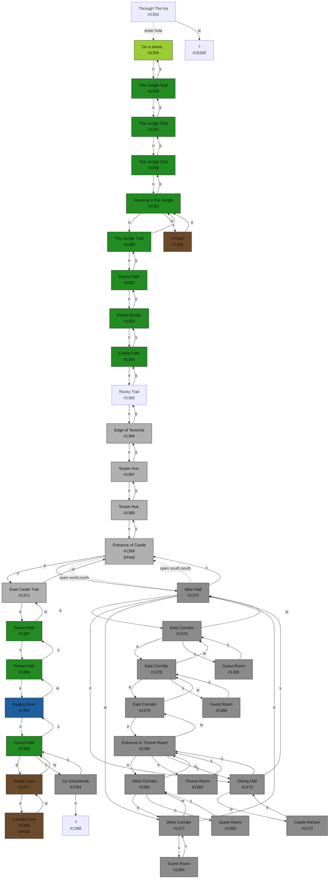

# Earth Plane 4

38 rooms. Solid = direction; dotted = special exit.

```mermaid
flowchart TD
  r1354["Through The Ice<br/>#1354"]
  r1355["On a shore...<br/>#1355"]
  r1356["The Jungle Trail<br/>#1356"]
  r1357["The Jungle Trail<br/>#1357"]
  r1358["The Jungle Trail<br/>#1358"]
  r1361["Opening in the Jungle<br/>#1361"]
  r1359["A Cave<br/>#1359"]
  r1360["The Jungle Trail<br/>#1360"]
  r1362["Forest Path<br/>#1362"]
  r1363["Forest Bridge<br/>#1363"]
  r1364["Forest Path<br/>#1364"]
  r1365["Rocky Trail<br/>#1365"]
  r1366["Edge of Teutonia<br/>#1366"]
  r1367["Teuton Ave.<br/>#1367"]
  r1368["Teuton Ave.<br/>#1368"]
  r1372["East Castle Trail<br/>#1372"]
  r1387["Forest Path<br/>#1387"]
  r1389["Forest Path<br/>#1389"]
  r1391["Raging River<br/>#1391"]
  r1393["Forest Path<br/>#1393"]
  r1371["Damp Cave<br/>#1371"]
  r1395["A small room<br/>#1395<br/>[shop]"]
  r1394["Icy Grasslands<br/>#1394"]
  r1369["Entrance of Castle<br/>#1369<br/>[shop]"]
  r1370["Main Hall<br/>#1370"]
  r1377["West Corridor<br/>#1377"]
  r1381["West Corridor<br/>#1381"]
  r1380["Entrance to Throne Room<br/>#1380"]
  r1375["Dining Hall<br/>#1375"]
  r1373["Castle Kitchen<br/>#1373"]
  r1374["East Corridor<br/>#1374"]
  r1385["Guest Room<br/>#1385"]
  r1378["East Corridor<br/>#1378"]
  r1379["East Corridor<br/>#1379"]
  r1383["Guest Room<br/>#1383"]
  r1382["Throne Room<br/>#1382"]
  r1384["Guest Room<br/>#1384"]
  r1386["Guest Room<br/>#1386"]
  r1354 -.->|enter hole| r1355
  r18389["?<br/>#18389"]
  r1354 -->|w| r18389
  r1355 -->|n| r1356
  r1356 -->|n| r1357
  r1356 -->|s| r1355
  r1357 -->|n| r1358
  r1357 -->|s| r1356
  r1358 -->|n| r1361
  r1358 -->|s| r1357
  r1361 -->|n| r1360
  r1361 -->|s| r1358
  r1361 -->|w| r1359
  r1359 -->|e| r1361
  r1360 -->|n| r1362
  r1360 -->|s| r1361
  r1362 -->|n| r1363
  r1362 -->|s| r1360
  r1363 -->|n| r1364
  r1363 -->|s| r1362
  r1364 -->|n| r1365
  r1364 -->|s| r1363
  r1365 -->|n| r1366
  r1365 -->|s| r1364
  r1366 -->|n| r1367
  r1366 -->|s| r1365
  r1367 -->|n| r1368
  r1367 -->|s| r1366
  r1368 -->|n| r1369
  r1368 -->|s| r1367
  r1372 -->|e| r1387
  r1372 -->|w| r1369
  r1387 -->|n| r1389
  r1387 -->|w| r1372
  r1389 -->|e| r1391
  r1389 -->|s| r1387
  r1391 -->|n| r1393
  r1391 -->|w| r1389
  r1393 -->|e| r1371
  r1393 -->|n| r1394
  r1393 -->|s| r1391
  r1371 -->|e| r1395
  r1371 -->|w| r1393
  r1395 -->|w| r1371
  r1388["?<br/>#1388"]
  r1394 -->|n| r1388
  r1394 -->|s| r1393
  r1369 -->|e| r1372
  r1369 -->|n| r1370
  r1369 -.->|open north;north| r1370
  r1369 -->|s| r1368
  r1370 -->|e| r1374
  r1370 -->|n| r1375
  r1370 -.->|open south;south| r1369
  r1370 -->|s| r1369
  r1370 -->|w| r1377
  r1377 -->|e| r1370
  r1377 -->|s| r1384
  r1377 -->|w| r1381
  r1381 -->|e| r1377
  r1381 -->|n| r1383
  r1381 -->|w| r1380
  r1380 -->|e| r1381
  r1380 -->|n| r1382
  r1380 -->|s| r1375
  r1380 -->|w| r1379
  r1375 -->|n| r1380
  r1375 -->|s| r1370
  r1375 -->|w| r1373
  r1373 -->|e| r1375
  r1374 -->|e| r1378
  r1374 -->|n| r1385
  r1374 -->|w| r1370
  r1385 -->|s| r1374
  r1378 -->|e| r1379
  r1378 -->|s| r1386
  r1378 -->|w| r1374
  r1379 -->|e| r1380
  r1379 -->|w| r1378
  r1383 -->|s| r1381
  r1382 -->|s| r1380
  r1384 -->|n| r1377
  r1386 -->|n| r1378
  classDef t_field fill:#9acd32,color:#111,stroke:#222
  class r1355 t_field
  classDef t_forest fill:#228b22,color:#111,stroke:#222
  class r1356 t_forest
  class r1357 t_forest
  class r1358 t_forest
  class r1361 t_forest
  classDef t_underground fill:#6b4a2b,color:#111,stroke:#222
  class r1359 t_underground
  class r1360 t_forest
  class r1362 t_forest
  class r1363 t_forest
  class r1364 t_forest
  classDef t_city fill:#b0b0b0,color:#111,stroke:#222
  class r1366 t_city
  class r1367 t_city
  class r1368 t_city
  class r1372 t_city
  class r1387 t_forest
  class r1389 t_forest
  classDef t_ocean fill:#1f5f9e,color:#111,stroke:#222
  class r1391 t_ocean
  class r1393 t_forest
  class r1371 t_underground
  class r1395 t_underground
  classDef t_inside fill:#8a8a8a,color:#111,stroke:#222
  class r1394 t_inside
  class r1369 t_city
  class r1370 t_inside
  class r1377 t_inside
  class r1381 t_inside
  class r1380 t_inside
  class r1375 t_inside
  class r1373 t_inside
  class r1374 t_inside
  class r1385 t_inside
  class r1378 t_inside
  class r1379 t_inside
  class r1383 t_inside
  class r1382 t_inside
  class r1384 t_inside
  class r1386 t_inside
```
