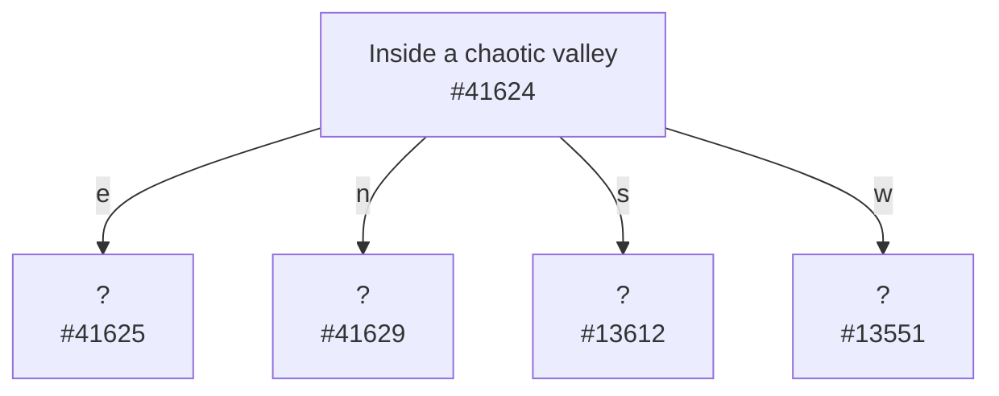

# Elemental Chaos

1 rooms. Solid = direction; dotted = special exit.

```mermaid
flowchart TD
  r41624["Inside a chaotic valley<br/>#41624"]
  r41625["?<br/>#41625"]
  r41624 -->|e| r41625
  r41629["?<br/>#41629"]
  r41624 -->|n| r41629
  r13612["?<br/>#13612"]
  r41624 -->|s| r13612
  r13551["?<br/>#13551"]
  r41624 -->|w| r13551
```
