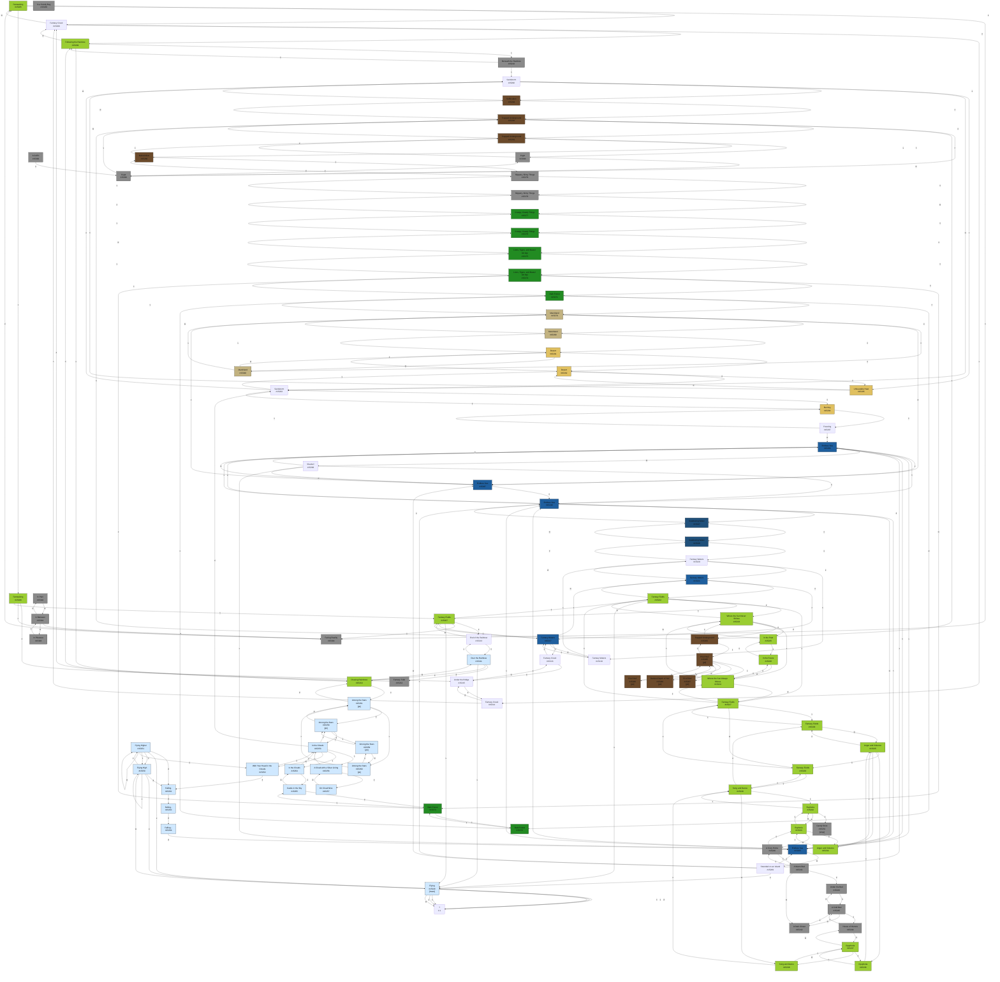

# Fantasy Fields

100 rooms. Solid = direction; dotted = special exit.

```mermaid
flowchart TD
  r15205["Fantasizing<br/>#15205"]
  r15304["Facing Reality<br/>#15304"]
  r15208["Fantasy Creek<br/>#15208"]
  r15206["Fantasizing<br/>#15206"]
  r15207["Fantasy Fields<br/>#15207"]
  r15217["Fantasy Waters<br/>#15217"]
  r15219["Fantasy Waters<br/>#15219"]
  r15220["Fantasy Waters<br/>#15220"]
  r15221["Fantasy Waters<br/>#15221"]
  r15222["Fantasy Fields<br/>#15222"]
  r15227["Fantasy Fields<br/>#15227"]
  r15228["Fantasy Fields<br/>#15228"]
  r15230["Song and Dance<br/>#15230"]
  r15238["Song and Dance<br/>#15238"]
  r15237["Dysphoria<br/>#15237"]
  r15244["House of Horrors<br/>#15244"]
  r15232["Euphoria<br/>#15232"]
  r15209["Following the Rainbow<br/>#15209"]
  r15210["Chasing Rainbows<br/>#15210"]
  r15218["Beneath the Rainbow<br/>#15218"]
  r15296["Sandstorm<br/>#15296"]
  r15223["Where the Sun Never Shines<br/>#15223"]
  r15225["In the Past<br/>#15225"]
  r15226["In the Future<br/>#15226"]
  r15224["Where the Sun Always Shines<br/>#15224"]
  r15216["Fantasy Creek<br/>#15216"]
  r15215["Under the Bridge<br/>#15215"]
  r15214["Fantasy Creek<br/>#15214"]
  r15229["Fantasy Fields<br/>#15229"]
  r15235["Anger and Violence<br/>#15235"]
  r15236["Dysphoria<br/>#15236"]
  r15245["A Cold Bed<br/>#15245"]
  r15242["A Dark Closet<br/>#15242"]
  r15243["Under the Bed<br/>#15243"]
  r15283["Trapped Underground<br/>#15283"]
  r15282["Trapped Underground<br/>#15282"]
  r15281["Trapped Underground<br/>#15281"]
  r15298["Crypt<br/>#15298"]
  r15299["Crypt<br/>#15299"]
  r15284["Suffocation<br/>#15284"]
  r15213["End of the Rainbow<br/>#15213"]
  r15211["Over the Rainbow<br/>#15211"]
  r15295["Unbearable Heat<br/>#15295"]
  r15292["Desert<br/>#15292"]
  r15291["Desert<br/>#15291"]
  r15289["Marshland<br/>#15289"]
  r15270["Marshland<br/>#15270"]
  r15231["Candy Store<br/>#15231<br/>[shop]"]
  r15233["Euphoria<br/>#15233"]
  r15240["A Cozy Home<br/>#15240"]
  r15234["Anger and Violence<br/>#15234"]
  r15241["A Warm Bed<br/>#15241"]
  r15285["Pit of Hell<br/>#15285<br/>[pk]"]
  r15287["Pit of Hell<br/>#15287<br/>[pk]"]
  r15286["Pit of Hell<br/>#15286<br/>[pk]"]
  r15288["Darkest Depth of Hell<br/>#15288<br/>[pk]"]
  r15293["Sandstorm<br/>#15293"]
  r15294["Burning<br/>#15294"]
  r15297["Freezing<br/>#15297"]
  r15266["Endless Sea<br/>#15266"]
  r15267["Endless Sea<br/>#15267"]
  r15248["Endless Sea<br/>#15248"]
  r15268["Sharks!!<br/>#15268"]
  r15271["Dark Forest<br/>#15271"]
  r15274["Lions, Tigers, and Bears! Oh My!<br/>#15274"]
  r15275["Lions, Tigers, and Bears! Oh My!<br/>#15275"]
  r15276["Creepy, Crawly Things<br/>#15276"]
  r15277["Creepy, Crawly Things<br/>#15277"]
  r15278["Slippery, Slimy Things<br/>#15278"]
  r15279["Slippery, Slimy Things<br/>#15279"]
  r15280["Buried Alive<br/>#15280"]
  r15273["Dark Forest<br/>#15273"]
  r15272["Dark Forest<br/>#15272"]
  r15290["Marshland<br/>#15290"]
  r15265["Endless Sea<br/>#15265"]
  r15269["Stranded on an Island<br/>#15269"]
  r15251["Flying Higher<br/>#15251"]
  r15250["Flying High<br/>#15250"]
  r15262["Falling.<br/>#15262"]
  r15263["Falling..<br/>#15263"]
  r15264["Falling...<br/>#15264"]
  r15247["Swallowing Water<br/>#15247"]
  r15246["Swallowing Water<br/>#15246"]
  r15212["Fantasy Falls<br/>#15212"]
  r15300["A Coffin<br/>#15300"]
  r15302["In Pain<br/>#15302"]
  r15301["In Between<br/>#15301"]
  r15303["In Pleasure<br/>#15303"]
  r15249["Flying<br/>#15249<br/>[maze]"]
  r15253["In the Clouds<br/>#15253"]
  r15254["In the Clouds<br/>#15254"]
  r15255["Castle in the Sky<br/>#15255"]
  r15256["A Cloud with a Silver Lining<br/>#15256"]
  r15252["With Your Head in the Clouds<br/>#15252"]
  r15257["On Cloud Nine<br/>#15257"]
  r15258["Among the Stars<br/>#15258<br/>[pk]"]
  r15259["Among the Stars<br/>#15259<br/>[pk]"]
  r15260["Among the Stars<br/>#15260<br/>[pk]"]
  r15261["Among the Stars<br/>#15261<br/>[pk]"]
  r15239["In a Candy Bag<br/>#15239"]
  r15205 -->|e| r15208
  r15205 -->|n| r15304
  r15205 -->|s| r15206
  r15304 -->|d| r15205
  r15208 -->|e| r15209
  r15208 -->|s| r15214
  r15208 -->|w| r15205
  r15206 -->|d| r15215
  r15206 -->|n| r15304
  r15206 -->|s| r15207
  r15207 -->|e| r15213
  r15207 -->|n| r15304
  r15207 -->|s| r15222
  r15207 -->|u| r15249
  r15207 -->|w| r15217
  r15217 -->|e| r15207
  r15217 -->|n| r15216
  r15217 -->|s| r15221
  r15217 -->|w| r15219
  r15219 -->|e| r15217
  r15219 -->|s| r15220
  r15220 -->|d| r15246
  r15220 -->|e| r15221
  r15220 -->|n| r15219
  r15221 -->|e| r15222
  r15221 -->|n| r15217
  r15221 -->|w| r15220
  r15222 -->|e| r15223
  r15222 -->|n| r15207
  r15222 -->|s| r15227
  r15222 -->|u| r15249
  r15222 -->|w| r15221
  r15227 -->|e| r15224
  r15227 -->|n| r15222
  r15227 -->|s| r15229
  r15227 -->|w| r15228
  r15228 -->|e| r15227
  r15228 -->|s| r15230
  r15230 -->|e| r15229
  r15230 -->|n| r15228
  r15230 -->|s| r15232
  r15230 -->|w| r15238
  r15238 -->|e| r15230
  r15238 -->|s| r15237
  r15237 -->|e| r15236
  r15237 -->|n| r15238
  r15237 -->|w| r15244
  r15244 -->|e| r15237
  r15244 -->|n| r15245
  r15232 -->|e| r15231
  r15232 -->|n| r15230
  r15232 -->|w| r15233
  r15209 -->|s| r15218
  r15209 -->|u| r15210
  r15209 -->|w| r15208
  r15210 -->|d| r15209
  r15210 -->|u| r15261
  r15210 -->|w| r15211
  r15218 -->|n| r15209
  r15218 -->|s| r15296
  r15296 -->|e| r15284
  r15296 -->|s| r15295
  r15296 -->|w| r15293
  r15223 -->|d| r15283
  r15223 -->|e| r15225
  r15223 -->|s| r15224
  r15223 -->|w| r15222
  r15225 -->|s| r15226
  r15225 -->|w| r15223
  r15226 -->|n| r15225
  r15226 -->|w| r15224
  r15224 -->|e| r15226
  r15224 -->|n| r15223
  r15224 -->|w| r15227
  r15216 -->|e| r15215
  r15216 -->|s| r15217
  r15215 -->|e| r15214
  r15215 -->|w| r15216
  r15214 -->|n| r15208
  r15214 -->|w| r15215
  r15229 -->|n| r15227
  r15229 -->|w| r15235
  r15235 -->|e| r15229
  r15235 -->|n| r15228
  r15235 -->|s| r15236
  r15235 -->|w| r15234
  r15236 -->|n| r15235
  r15236 -->|w| r15237
  r15245 -->|d| r15243
  r15245 -->|s| r15244
  r15245 -->|w| r15242
  r15242 -->|e| r15245
  r15243 -->|u| r15245
  r15283 -->|n| r15282
  r15283 -->|s| r15285
  r15283 -->|u| r15223
  r15282 -->|e| r15281
  r15282 -->|n| r15299
  r15282 -->|s| r15283
  r15282 -->|w| r15284
  r15281 -->|n| r15298
  r15281 -->|u| r15280
  r15281 -->|w| r15282
  r15298 -->|s| r15281
  r15298 -->|w| r15299
  r15299 -->|e| r15298
  r15299 -->|s| r15282
  r15284 -->|e| r15282
  r15284 -->|w| r15296
  r15213 -->|n| r15211
  r15213 -->|w| r15207
  r15211 -->|d| r15212
  r15211 -->|e| r15210
  r15211 -->|s| r15213
  r15211 -->|u| r15249
  r15295 -->|n| r15296
  r15295 -->|w| r15292
  r15292 -->|e| r15295
  r15292 -->|n| r15293
  r15292 -->|w| r15291
  r15291 -->|e| r15292
  r15291 -->|s| r15289
  r15291 -->|w| r15290
  r15289 -->|n| r15291
  r15289 -->|w| r15270
  r15270 -->|e| r15289
  r15270 -->|n| r15290
  r15270 -->|s| r15271
  r15270 -->|w| r15267
  r15231 -->|w| r15232
  r15233 -->|e| r15232
  r15233 -->|n| r15234
  r15233 -->|w| r15240
  r15240 -->|e| r15233
  r15240 -->|n| r15241
  r15234 -->|e| r15235
  r15234 -->|s| r15233
  r15241 -->|d| r15243
  r15241 -->|s| r15240
  r15241 -->|w| r15242
  r15285 -->|e| r15287
  r15285 -->|n| r15283
  r15285 -->|s| r15288
  r15285 -->|w| r15286
  r15287 -->|w| r15285
  r15286 -->|e| r15285
  r15288 -->|n| r15285
  r15293 -->|e| r15296
  r15293 -->|n| r15294
  r15293 -->|s| r15292
  r15294 -->|n| r15297
  r15294 -->|s| r15293
  r15297 -->|s| r15294
  r15297 -->|w| r15266
  r15266 -->|e| r15267
  r15266 -->|n| r15248
  r15266 -->|s| r15265
  r15266 -->|w| r15268
  r15267 -->|e| r15270
  r15267 -->|n| r15248
  r15267 -->|w| r15266
  r15248 -->|d| r15247
  r15248 -->|e| r15266
  r15248 -->|n| r15265
  r15248 -->|s| r15266
  r15248 -->|w| r15265
  r15268 -->|e| r15248
  r15268 -->|n| r15266
  r15268 -->|s| r15265
  r15268 -->|w| r15267
  r15271 -->|n| r15270
  r15271 -->|s| r15274
  r15271 -->|w| r15272
  r15274 -->|n| r15271
  r15274 -->|s| r15275
  r15274 -->|w| r15273
  r15275 -->|n| r15274
  r15275 -->|w| r15276
  r15276 -->|e| r15275
  r15276 -->|s| r15277
  r15277 -->|e| r15278
  r15277 -->|n| r15276
  r15278 -->|s| r15279
  r15278 -->|w| r15277
  r15279 -->|d| r15280
  r15279 -->|n| r15278
  r15280 -->|d| r15281
  r15280 -->|u| r15279
  r15273 -->|e| r15274
  r15273 -->|n| r15272
  r15273 -->|u| r15255
  r15272 -->|e| r15271
  r15272 -->|s| r15273
  r15290 -->|e| r15291
  r15290 -->|s| r15270
  r15265 -->|e| r15248
  r15265 -->|n| r15266
  r15265 -->|s| r15248
  r15265 -->|w| r15269
  r15269 -->|e| r15265
  r15269 -->|n| r15248
  r15269 -->|s| r15266
  r15269 -->|u| r15249
  r15269 -->|w| r15267
  r15251 -->|d| r15262
  r15251 -->|e| r15249
  r15251 -->|n| r15250
  r15251 -->|s| r15250
  r15251 -->|u| r15252
  r15251 -->|w| r15251
  r15250 -->|d| r15262
  r15250 -->|e| r15249
  r15250 -->|s| r15250
  r15250 -->|u| r15251
  r15250 -->|w| r15249
  r15262 -->|d| r15263
  r15263 -->|d| r15264
  r15264 -->|d| r15265
  r15247 -->|e| r15246
  r15247 -->|u| r15248
  r15246 -->|u| r15220
  r15246 -->|w| r15247
  r15212 -->|d| r15208
  r15300 -->|u| r15299
  r15302 -->|w| r15301
  r15301 -->|d| r15304
  r15301 -->|e| r15302
  r15301 -->|w| r15303
  r15303 -->|e| r15301
  r-1["?<br/>#-1"]
  r15249 -->|d| r-1
  r15249 -->|e| r-1
  r15249 -->|n| r-1
  r15249 -->|s| r-1
  r15249 -->|u| r-1
  r15249 -->|w| r-1
  r15253 -->|d| r15293
  r15253 -->|n| r15256
  r15253 -->|s| r15254
  r15253 -->|u| r15258
  r15253 -->|w| r15252
  r15254 -->|e| r15255
  r15254 -->|n| r15253
  r15255 -->|d| r15273
  r15255 -->|w| r15254
  r15256 -->|e| r15257
  r15256 -->|s| r15253
  r15252 -->|d| r15262
  r15252 -->|e| r15253
  r15257 -->|w| r15256
  r15258 -->|d| r15253
  r15258 -->|s| r15259
  r15258 -->|w| r15261
  r15259 -->|n| r15258
  r15259 -->|w| r15260
  r15260 -->|e| r15259
  r15260 -->|n| r15261
  r15261 -->|d| r15210
  r15261 -->|e| r15258
  r15261 -->|s| r15260
  classDef t_field fill:#9acd32,color:#111,stroke:#222
  class r15205 t_field
  classDef t_inside fill:#8a8a8a,color:#111,stroke:#222
  class r15304 t_inside
  class r15206 t_field
  class r15207 t_field
  classDef t_ocean fill:#1f5f9e,color:#111,stroke:#222
  class r15217 t_ocean
  class r15221 t_ocean
  class r15222 t_field
  class r15227 t_field
  class r15228 t_field
  class r15230 t_field
  class r15238 t_field
  class r15237 t_field
  class r15244 t_inside
  class r15232 t_field
  class r15209 t_field
  class r15210 t_field
  class r15218 t_inside
  class r15223 t_field
  class r15225 t_field
  class r15226 t_field
  class r15224 t_field
  class r15229 t_field
  class r15235 t_field
  class r15236 t_field
  class r15245 t_inside
  class r15242 t_inside
  class r15243 t_inside
  classDef t_underground fill:#6b4a2b,color:#111,stroke:#222
  class r15283 t_underground
  class r15282 t_underground
  class r15281 t_underground
  class r15298 t_inside
  class r15299 t_inside
  class r15284 t_underground
  classDef t_air fill:#cfe8ff,color:#111,stroke:#222
  class r15211 t_air
  classDef t_desert fill:#e0c060,color:#111,stroke:#222
  class r15295 t_desert
  class r15292 t_desert
  class r15291 t_desert
  classDef t_hills fill:#c2b280,color:#111,stroke:#222
  class r15289 t_hills
  class r15270 t_hills
  class r15231 t_inside
  class r15233 t_field
  class r15240 t_inside
  class r15234 t_field
  class r15241 t_inside
  class r15285 t_underground
  class r15287 t_underground
  class r15286 t_underground
  class r15288 t_underground
  class r15294 t_desert
  class r15266 t_ocean
  class r15267 t_ocean
  class r15248 t_ocean
  classDef t_forest fill:#228b22,color:#111,stroke:#222
  class r15271 t_forest
  class r15274 t_forest
  class r15275 t_forest
  class r15276 t_forest
  class r15277 t_forest
  class r15278 t_inside
  class r15279 t_inside
  class r15280 t_underground
  class r15273 t_forest
  class r15272 t_forest
  class r15290 t_hills
  class r15265 t_ocean
  class r15251 t_air
  class r15250 t_air
  class r15262 t_air
  class r15263 t_air
  class r15264 t_air
  classDef t_underwater fill:#20507a,color:#111,stroke:#222
  class r15247 t_underwater
  class r15246 t_underwater
  class r15212 t_inside
  class r15300 t_inside
  class r15302 t_inside
  class r15301 t_inside
  class r15303 t_inside
  class r15249 t_air
  class r15253 t_air
  class r15254 t_air
  class r15255 t_air
  class r15256 t_air
  class r15252 t_air
  class r15257 t_air
  class r15258 t_air
  class r15259 t_air
  class r15260 t_air
  class r15261 t_air
  class r15239 t_inside
```
