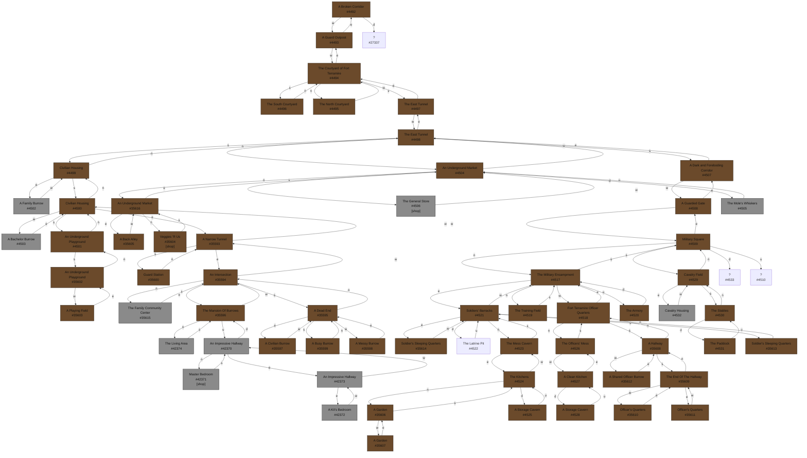

# Fort Terramire

62 rooms. Solid = direction; dotted = special exit.

```mermaid
flowchart TD
  r4492["A Broken Corridor<br/>#4492"]
  r4493["A Guard Outpost<br/>#4493"]
  r4494["The Courtyard of Fort Terramire<br/>#4494"]
  r4496["The South Courtyard<br/>#4496"]
  r4495["The North Courtyard<br/>#4495"]
  r4497["The East Tunnel<br/>#4497"]
  r4498["The East Tunnel<br/>#4498"]
  r4504["An Underground Market<br/>#4504"]
  r4499["Civilian Housing<br/>#4499"]
  r4502["A Family Burrow<br/>#4502"]
  r4500["Civilian Housing<br/>#4500"]
  r4503["A Bachelor Burrow<br/>#4503"]
  r4501["An Underground Playground<br/>#4501"]
  r35602["An Underground Playground<br/>#35602"]
  r35603["A Playing Field<br/>#35603"]
  r35600["Guard Station<br/>#35600"]
  r4507["A Dark and Foreboding Corridor<br/>#4507"]
  r4508["A Guarded Gate<br/>#4508"]
  r4506["The General Store<br/>#4506<br/>[shop]"]
  r35616["An Underground Market<br/>#35616"]
  r35605["A Back Alley<br/>#35605"]
  r35604["Veggies 'R Us<br/>#35604<br/>[shop]"]
  r4505["The Mole's Whiskers<br/>#4505"]
  r35594["An Intersection<br/>#35594"]
  r35615["The Family Community Center<br/>#35615"]
  r35596["The Mansion Of Burrows<br/>#35596"]
  r42374["The Living Area<br/>#42374"]
  r42370["An Impressive Hallway<br/>#42370"]
  r42371["Master Bedroom<br/>#42371<br/>[shop]"]
  r42373["An Impressive Hallway<br/>#42373"]
  r42372["A Kit's Bedroom<br/>#42372"]
  r35595["A Dead End<br/>#35595"]
  r35597["A Civilian Burrow<br/>#35597"]
  r35599["A Busy Burrow<br/>#35599"]
  r35598["A Messy Burrow<br/>#35598"]
  r35593["A Narrow Tunnel<br/>#35593"]
  r4509["Military Square<br/>#4509"]
  r4517["The Military Encampment<br/>#4517"]
  r4529["Cavalry Field<br/>#4529"]
  r4521["Soldiers' Barracks<br/>#4521"]
  r35614["Soldier's Sleeping Quarters<br/>#35614"]
  r4522["The Latrine Pit<br/>#4522"]
  r4523["The Mess Cavern<br/>#4523"]
  r4524["The Kitchens<br/>#4524"]
  r35606["A Garden<br/>#35606"]
  r35607["A Garden<br/>#35607"]
  r4525["A Storage Cavern<br/>#4525"]
  r4519["The Training Field<br/>#4519"]
  r4518["Fort Terramire Officer Quarters<br/>#4518"]
  r4526["The Officers' Mess<br/>#4526"]
  r4527["A Clean Kitchen<br/>#4527"]
  r4528["A Storage Cavern<br/>#4528"]
  r35608["A Hallway<br/>#35608"]
  r35612["A Shared Officer Burrow<br/>#35612"]
  r35609["The End Of The Hallway<br/>#35609"]
  r35610["Officer's Quarters<br/>#35610"]
  r35611["Officer's Quarters<br/>#35611"]
  r4520["The Armory<br/>#4520"]
  r4532["Cavalry Housing<br/>#4532"]
  r4530["The Stables<br/>#4530"]
  r4531["The Paddock<br/>#4531"]
  r35613["Soldier's Sleeping Quarters<br/>#35613"]
  r27337["?<br/>#27337"]
  r4492 -->|d| r27337
  r4492 -->|w| r4493
  r4493 -->|e| r4492
  r4493 -->|w| r4494
  r4494 -->|e| r4493
  r4494 -->|n| r4495
  r4494 -->|s| r4496
  r4494 -->|w| r4497
  r4496 -->|n| r4494
  r4495 -->|s| r4494
  r4497 -->|e| r4494
  r4497 -->|w| r4498
  r4498 -->|e| r4497
  r4498 -->|n| r4504
  r4498 -->|s| r4499
  r4498 -->|w| r4507
  r4504 -->|d| r4505
  r4504 -->|e| r4506
  r4504 -->|n| r35616
  r4504 -->|s| r4498
  r4499 -->|e| r4502
  r4499 -->|n| r4498
  r4499 -->|s| r4500
  r4502 -->|w| r4499
  r4500 -->|e| r35593
  r4500 -->|n| r4499
  r4500 -->|s| r4501
  r4500 -->|w| r4503
  r4503 -->|e| r4500
  r4501 -->|n| r4500
  r4501 -->|s| r35602
  r35602 -->|n| r4501
  r35602 -->|w| r35603
  r35603 -->|e| r35602
  r35600 -->|n| r35593
  r4507 -->|e| r4498
  r4507 -->|w| r4508
  r4508 -->|e| r4507
  r4508 -->|w| r4509
  r4506 -->|w| r4504
  r35616 -->|e| r35605
  r35616 -->|n| r35604
  r35616 -->|s| r4504
  r35605 -->|w| r35616
  r35604 -->|s| r35616
  r4505 -->|u| r4504
  r35594 -->|e| r35596
  r35594 -->|n| r35615
  r35594 -->|s| r35595
  r35594 -->|w| r35593
  r35615 -->|s| r35594
  r35596 -->|n| r42374
  r35596 -->|u| r42370
  r35596 -->|w| r35594
  r42374 -->|s| r35596
  r42370 -->|d| r35596
  r42370 -->|e| r42373
  r42370 -->|n| r42371
  r42371 -->|s| r42370
  r42373 -->|e| r42372
  r42373 -->|w| r42370
  r42372 -->|w| r42373
  r35595 -->|e| r35597
  r35595 -->|n| r35594
  r35595 -->|s| r35599
  r35595 -->|w| r35598
  r35597 -->|w| r35595
  r35599 -->|n| r35595
  r35598 -->|e| r35595
  r35593 -->|e| r35594
  r35593 -->|s| r35600
  r35593 -->|w| r4500
  r4533["?<br/>#4533"]
  r4509 -->|d| r4533
  r4509 -->|e| r4508
  r4509 -->|n| r4517
  r4509 -->|s| r4529
  r4510["?<br/>#4510"]
  r4509 -->|u| r4510
  r4517 -->|e| r4521
  r4517 -->|n| r4519
  r4517 -->|s| r4509
  r4517 -->|u| r4520
  r4517 -->|w| r4518
  r4529 -->|e| r4532
  r4529 -->|n| r4509
  r4529 -->|s| r4530
  r4521 -->|d| r4522
  r4521 -->|e| r35614
  r4521 -->|n| r4523
  r4521 -->|s| r35613
  r4521 -->|w| r4517
  r35614 -->|w| r4521
  r4522 -->|u| r4521
  r4523 -->|e| r4524
  r4523 -->|s| r4521
  r4524 -->|d| r4525
  r4524 -->|n| r35606
  r4524 -->|w| r4523
  r35606 -->|s| r4524
  r35606 -->|w| r35607
  r35607 -->|e| r35606
  r4525 -->|u| r4524
  r4519 -->|s| r4517
  r4518 -->|e| r4517
  r4518 -->|n| r4526
  r4518 -->|s| r35608
  r4526 -->|s| r4518
  r4526 -->|w| r4527
  r4527 -->|d| r4528
  r4527 -->|e| r4526
  r4528 -->|u| r4527
  r35608 -->|n| r4518
  r35608 -->|s| r35609
  r35608 -->|w| r35612
  r35612 -->|e| r35608
  r35609 -->|e| r35611
  r35609 -->|n| r35608
  r35609 -->|w| r35610
  r35610 -->|e| r35609
  r35611 -->|w| r35609
  r4520 -->|d| r4517
  r4532 -->|w| r4529
  r4530 -->|d| r4531
  r4530 -->|n| r4529
  r4531 -->|u| r4530
  r35613 -->|n| r4521
  classDef t_underground fill:#6b4a2b,color:#111,stroke:#222
  class r4492 t_underground
  class r4493 t_underground
  class r4494 t_underground
  class r4496 t_underground
  class r4495 t_underground
  class r4497 t_underground
  class r4498 t_underground
  class r4504 t_underground
  class r4499 t_underground
  classDef t_inside fill:#8a8a8a,color:#111,stroke:#222
  class r4502 t_inside
  class r4500 t_underground
  class r4503 t_inside
  class r4501 t_underground
  class r35602 t_underground
  class r35603 t_underground
  class r35600 t_underground
  class r4507 t_underground
  class r4508 t_underground
  class r4506 t_inside
  class r35616 t_underground
  class r35605 t_underground
  class r35604 t_underground
  class r4505 t_inside
  class r35594 t_underground
  class r35615 t_inside
  class r35596 t_underground
  class r42374 t_inside
  class r42370 t_inside
  class r42371 t_inside
  class r42373 t_inside
  class r42372 t_inside
  class r35595 t_underground
  class r35597 t_underground
  class r35599 t_underground
  class r35598 t_underground
  class r35593 t_underground
  class r4509 t_underground
  class r4517 t_underground
  class r4529 t_underground
  class r4521 t_underground
  class r35614 t_underground
  class r4523 t_underground
  class r4524 t_underground
  class r35606 t_underground
  class r35607 t_underground
  class r4525 t_underground
  class r4519 t_underground
  class r4518 t_underground
  class r4526 t_underground
  class r4527 t_underground
  class r4528 t_underground
  class r35608 t_underground
  class r35612 t_underground
  class r35609 t_underground
  class r35610 t_underground
  class r35611 t_underground
  class r4520 t_underground
  class r4532 t_inside
  class r4530 t_underground
  class r4531 t_underground
  class r35613 t_underground
```
