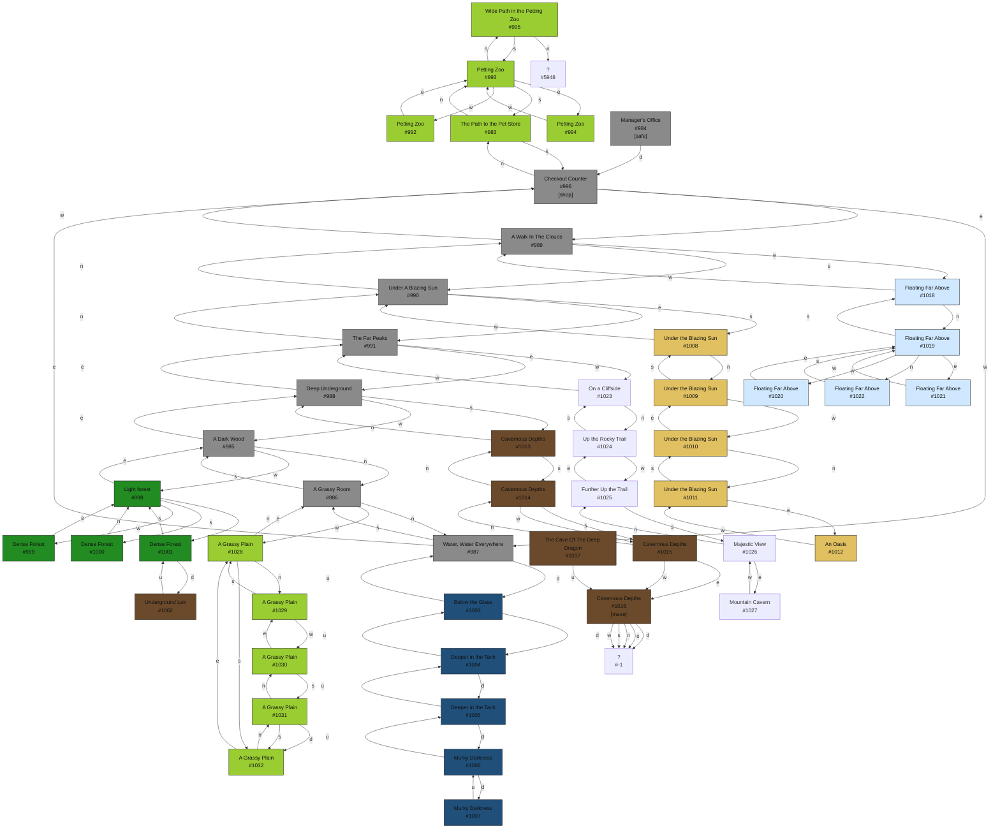

# Giant's Pet Store

49 rooms. Solid = direction; dotted = special exit.

```mermaid
flowchart TD
  r995["Wide Path in the Petting Zoo<br/>#995"]
  r993["Petting Zoo<br/>#993"]
  r994["Petting Zoo<br/>#994"]
  r992["Petting Zoo<br/>#992"]
  r983["The Path to the Pet Store<br/>#983"]
  r996["Checkout Counter<br/>#996<br/>[shop]"]
  r989["A Walk In The Clouds<br/>#989"]
  r990["Under A Blazing Sun<br/>#990"]
  r987["Water, Water Everywhere<br/>#987"]
  r986["A Grassy Room<br/>#986"]
  r985["A Dark Wood<br/>#985"]
  r991["The Far Peaks<br/>#991"]
  r988["Deep Underground<br/>#988"]
  r984["Manager's Office<br/>#984<br/>[safe]"]
  r1003["Below the Glass<br/>#1003"]
  r1004["Deeper in the Tank<br/>#1004"]
  r1005["Deeper in the Tank<br/>#1005"]
  r1006["Murky Darkness<br/>#1006"]
  r1007["Murky Darkness<br/>#1007"]
  r1028["A Grassy Plain<br/>#1028"]
  r1029["A Grassy Plain<br/>#1029"]
  r1030["A Grassy Plain<br/>#1030"]
  r1032["A Grassy Plain<br/>#1032"]
  r998["Light forest<br/>#998"]
  r999["Dense Forest<br/>#999"]
  r1000["Dense Forest<br/>#1000"]
  r1013["Cavernous Depths<br/>#1013"]
  r1014["Cavernous Depths<br/>#1014"]
  r1015["Cavernous Depths<br/>#1015"]
  r1016["Cavernous Depths<br/>#1016<br/>[maze]"]
  r1017["The Cave Of The Deep Dragon<br/>#1017"]
  r1023["On a Cliffside<br/>#1023"]
  r1024["Up the Rocky Trail<br/>#1024"]
  r1025["Further Up the Trail<br/>#1025"]
  r1026["Majestic View<br/>#1026"]
  r1027["Mountain Cavern<br/>#1027"]
  r1008["Under the Blazing Sun<br/>#1008"]
  r1009["Under the Blazing Sun<br/>#1009"]
  r1010["Under the Blazing Sun<br/>#1010"]
  r1011["Under the Blazing Sun<br/>#1011"]
  r1012["An Oasis<br/>#1012"]
  r1018["Floating Far Above<br/>#1018"]
  r1019["Floating Far Above<br/>#1019"]
  r1021["Floating Far Above<br/>#1021"]
  r1022["Floating Far Above<br/>#1022"]
  r1020["Floating Far Above<br/>#1020"]
  r1031["A Grassy Plain<br/>#1031"]
  r1002["Underground Lair<br/>#1002"]
  r1001["Dense Forest<br/>#1001"]
  r5948["?<br/>#5948"]
  r995 -->|n| r5948
  r995 -->|s| r993
  r993 -->|e| r994
  r993 -->|n| r995
  r993 -->|s| r983
  r993 -->|w| r992
  r994 -->|w| r993
  r992 -->|e| r993
  r983 -->|n| r993
  r983 -->|s| r996
  r996 -->|e| r989
  r996 -->|n| r983
  r996 -->|w| r987
  r989 -->|e| r1018
  r989 -->|s| r990
  r989 -->|w| r996
  r990 -->|e| r1008
  r990 -->|n| r989
  r990 -->|s| r991
  r987 -->|d| r1003
  r987 -->|e| r996
  r987 -->|s| r986
  r986 -->|n| r987
  r986 -->|s| r985
  r986 -->|w| r1028
  r985 -->|e| r988
  r985 -->|n| r986
  r985 -->|w| r998
  r991 -->|e| r1023
  r991 -->|n| r990
  r991 -->|w| r988
  r988 -->|e| r991
  r988 -->|s| r1013
  r988 -->|w| r985
  r984 -->|d| r996
  r1003 -->|d| r1004
  r1003 -->|u| r987
  r1004 -->|d| r1005
  r1004 -->|u| r1003
  r1005 -->|d| r1006
  r1005 -->|u| r1004
  r1006 -->|d| r1007
  r1006 -->|u| r1005
  r1007 -->|u| r1006
  r1028 -->|e| r986
  r1028 -->|n| r1029
  r1028 -->|s| r1032
  r1029 -->|s| r1028
  r1029 -->|w| r1030
  r1030 -->|e| r1029
  r1030 -->|s| r1031
  r1032 -->|e| r1028
  r1032 -->|n| r1031
  r998 -->|e| r985
  r998 -->|n| r1001
  r998 -->|s| r1000
  r998 -->|w| r999
  r999 -->|e| r998
  r1000 -->|n| r998
  r1013 -->|n| r988
  r1013 -->|s| r1014
  r1014 -->|n| r1013
  r1014 -->|s| r1015
  r1014 -->|w| r1015
  r1015 -->|e| r1016
  r1015 -->|n| r1014
  r1015 -->|w| r1016
  r-1["?<br/>#-1"]
  r1016 -->|d| r-1
  r1016 -->|e| r-1
  r1016 -->|n| r-1
  r1016 -->|s| r-1
  r1016 -->|w| r-1
  r1017 -->|u| r1016
  r1023 -->|n| r1024
  r1023 -->|w| r991
  r1024 -->|s| r1023
  r1024 -->|w| r1025
  r1025 -->|e| r1024
  r1025 -->|s| r1026
  r1026 -->|e| r1027
  r1026 -->|n| r1025
  r1027 -->|w| r1026
  r1008 -->|n| r1009
  r1008 -->|w| r990
  r1009 -->|s| r1008
  r1009 -->|w| r1010
  r1010 -->|e| r1009
  r1010 -->|n| r1011
  r1011 -->|e| r1012
  r1011 -->|s| r1010
  r1012 -->|w| r1011
  r1018 -->|n| r1019
  r1018 -->|w| r989
  r1019 -->|e| r1021
  r1019 -->|n| r1022
  r1019 -->|s| r1018
  r1019 -->|w| r1020
  r1021 -->|w| r1019
  r1022 -->|s| r1019
  r1020 -->|e| r1019
  r1031 -->|d| r1032
  r1031 -->|n| r1030
  r1031 -->|s| r1032
  r1002 -->|u| r1001
  r1001 -->|d| r1002
  r1001 -->|s| r998
  classDef t_field fill:#9acd32,color:#111,stroke:#222
  class r995 t_field
  class r993 t_field
  class r994 t_field
  class r992 t_field
  class r983 t_field
  classDef t_inside fill:#8a8a8a,color:#111,stroke:#222
  class r996 t_inside
  class r989 t_inside
  class r990 t_inside
  class r987 t_inside
  class r986 t_inside
  class r985 t_inside
  class r991 t_inside
  class r988 t_inside
  class r984 t_inside
  classDef t_underwater fill:#20507a,color:#111,stroke:#222
  class r1003 t_underwater
  class r1004 t_underwater
  class r1005 t_underwater
  class r1006 t_underwater
  class r1007 t_underwater
  class r1028 t_field
  class r1029 t_field
  class r1030 t_field
  class r1032 t_field
  classDef t_forest fill:#228b22,color:#111,stroke:#222
  class r998 t_forest
  class r999 t_forest
  class r1000 t_forest
  classDef t_underground fill:#6b4a2b,color:#111,stroke:#222
  class r1013 t_underground
  class r1014 t_underground
  class r1015 t_underground
  class r1016 t_underground
  class r1017 t_underground
  classDef t_desert fill:#e0c060,color:#111,stroke:#222
  class r1008 t_desert
  class r1009 t_desert
  class r1010 t_desert
  class r1011 t_desert
  class r1012 t_desert
  classDef t_air fill:#cfe8ff,color:#111,stroke:#222
  class r1018 t_air
  class r1019 t_air
  class r1021 t_air
  class r1022 t_air
  class r1020 t_air
  class r1031 t_field
  class r1002 t_underground
  class r1001 t_forest
```
