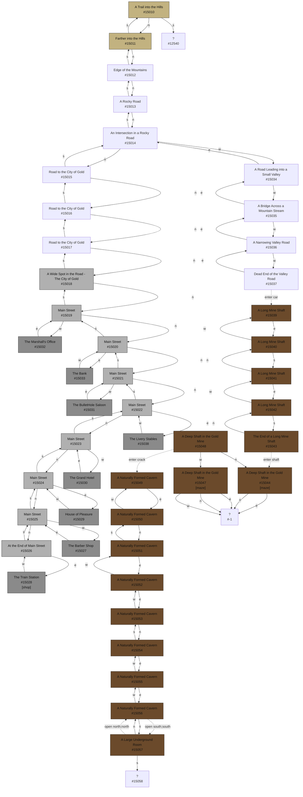

# Gold Rush

46 rooms. Solid = direction; dotted = special exit.

```mermaid
flowchart TD
  r15010["A Trail into the Hills<br/>#15010"]
  r15011["Farther into the Hills<br/>#15011"]
  r15012["Edge of the Mountains<br/>#15012"]
  r15013["A Rocky Road<br/>#15013"]
  r15014["An Intersection in a Rocky Road<br/>#15014"]
  r15034["A Road Leading into a Small Valley<br/>#15034"]
  r15035["A Bridge Across a Mountain Stream<br/>#15035"]
  r15036["A Narrowing Valley Road<br/>#15036"]
  r15037["Dead End of the Valley Road<br/>#15037"]
  r15015["Road to the City of Gold<br/>#15015"]
  r15016["Road to the City of Gold<br/>#15016"]
  r15017["Road to the City of Gold<br/>#15017"]
  r15018["A Wide Spot in the Road - The City of Gold<br/>#15018"]
  r15019["Main Street<br/>#15019"]
  r15032["The Marshall's Office<br/>#15032"]
  r15020["Main Street<br/>#15020"]
  r15033["The Bank<br/>#15033"]
  r15021["Main Street<br/>#15021"]
  r15031["The BulletHole Saloon<br/>#15031"]
  r15022["Main Street<br/>#15022"]
  r15023["Main Street<br/>#15023"]
  r15024["Main Street<br/>#15024"]
  r15025["Main Street<br/>#15025"]
  r15026["At the End of Main Street<br/>#15026"]
  r15028["The Train Station<br/>#15028<br/>[shop]"]
  r15027["The Barber Shop<br/>#15027"]
  r15029["House of Pleasure<br/>#15029"]
  r15030["The Grand Hotel<br/>#15030"]
  r15038["The Livery Stables<br/>#15038"]
  r15039["A Long Mine Shaft<br/>#15039"]
  r15040["A Long Mine Shaft<br/>#15040"]
  r15041["A Long Mine Shaft<br/>#15041"]
  r15042["A Long Mine Shaft<br/>#15042"]
  r15043["The End of a Long Mine Shaft<br/>#15043"]
  r15044["A Deep Shaft in the Gold Mine<br/>#15044<br/>[maze]"]
  r15047["A Deep Shaft in the Gold Mine<br/>#15047<br/>[maze]"]
  r15048["A Deep Shaft in the Gold Mine<br/>#15048"]
  r15049["A Naturally Formed Cavern<br/>#15049"]
  r15050["A Naturally Formed Cavern<br/>#15050"]
  r15051["A Naturally Formed Cavern<br/>#15051"]
  r15052["A Naturally Formed Cavern<br/>#15052"]
  r15053["A Naturally Formed Cavern<br/>#15053"]
  r15054["A Naturally Formed Cavern<br/>#15054"]
  r15055["A Naturally Formed Cavern<br/>#15055"]
  r15056["A Naturally Formed Cavern<br/>#15056"]
  r15057["A Large Underground Room<br/>#15057"]
  r15010 -->|n| r15011
  r12540["?<br/>#12540"]
  r15010 -->|s| r12540
  r15011 -->|n| r15012
  r15011 -->|s| r15010
  r15012 -->|n| r15013
  r15012 -->|s| r15011
  r15013 -->|n| r15014
  r15013 -->|s| r15012
  r15014 -->|n| r15015
  r15014 -->|s| r15013
  r15014 -->|w| r15034
  r15034 -->|e| r15014
  r15034 -->|w| r15035
  r15035 -->|e| r15034
  r15035 -->|w| r15036
  r15036 -->|e| r15035
  r15036 -->|w| r15037
  r15037 -->|e| r15036
  r15037 -.->|enter car| r15039
  r15015 -->|n| r15016
  r15015 -->|s| r15014
  r15016 -->|n| r15017
  r15016 -->|s| r15015
  r15017 -->|n| r15018
  r15017 -->|s| r15016
  r15018 -->|n| r15019
  r15018 -->|s| r15017
  r15019 -->|n| r15020
  r15019 -->|s| r15018
  r15019 -->|w| r15032
  r15032 -->|e| r15019
  r15020 -->|e| r15033
  r15020 -->|n| r15021
  r15020 -->|s| r15019
  r15033 -->|w| r15020
  r15021 -->|n| r15022
  r15021 -->|s| r15020
  r15021 -->|w| r15031
  r15031 -->|e| r15021
  r15022 -->|e| r15038
  r15022 -->|n| r15023
  r15022 -->|s| r15021
  r15023 -->|n| r15024
  r15023 -->|s| r15022
  r15023 -->|w| r15030
  r15024 -->|e| r15029
  r15024 -->|n| r15025
  r15024 -->|s| r15023
  r15025 -->|n| r15026
  r15025 -->|s| r15024
  r15025 -->|w| r15027
  r15026 -->|e| r15028
  r15026 -->|s| r15025
  r15028 -->|w| r15026
  r15027 -->|e| r15025
  r15029 -->|w| r15024
  r15030 -->|e| r15023
  r15038 -->|w| r15022
  r15039 -->|e| r15040
  r15040 -->|s| r15041
  r15040 -->|w| r15039
  r15041 -->|e| r15042
  r15041 -->|n| r15040
  r15042 -->|s| r15043
  r15042 -->|w| r15041
  r15043 -.->|enter shaft| r15044
  r15043 -->|n| r15042
  r-1["?<br/>#-1"]
  r15044 -->|e| r-1
  r15044 -->|n| r-1
  r15047 -->|e| r-1
  r15047 -->|n| r-1
  r15047 -->|w| r-1
  r15048 -.->|enter crack| r15049
  r15048 -->|n| r15044
  r15048 -->|w| r15047
  r15049 -->|e| r15050
  r15050 -->|n| r15051
  r15050 -->|w| r15049
  r15051 -->|e| r15052
  r15051 -->|s| r15050
  r15052 -->|e| r15053
  r15052 -->|w| r15051
  r15053 -->|n| r15054
  r15053 -->|w| r15052
  r15054 -->|e| r15055
  r15054 -->|s| r15053
  r15055 -->|e| r15056
  r15055 -->|w| r15054
  r15056 -.->|open south;south| r15057
  r15056 -->|s| r15057
  r15056 -->|w| r15055
  r15057 -->|n| r15056
  r15057 -.->|open north;north| r15056
  r15058["?<br/>#15058"]
  r15057 -->|s| r15058
  classDef t_hills fill:#c2b280,color:#111,stroke:#222
  class r15010 t_hills
  class r15011 t_hills
  classDef t_city fill:#b0b0b0,color:#111,stroke:#222
  class r15018 t_city
  class r15019 t_city
  classDef t_inside fill:#8a8a8a,color:#111,stroke:#222
  class r15032 t_inside
  class r15020 t_city
  class r15033 t_inside
  class r15021 t_city
  class r15031 t_inside
  class r15022 t_city
  class r15023 t_city
  class r15024 t_city
  class r15025 t_city
  class r15026 t_city
  class r15028 t_inside
  class r15027 t_inside
  class r15029 t_inside
  class r15030 t_inside
  class r15038 t_inside
  classDef t_underground fill:#6b4a2b,color:#111,stroke:#222
  class r15039 t_underground
  class r15040 t_underground
  class r15041 t_underground
  class r15042 t_underground
  class r15043 t_underground
  class r15044 t_underground
  class r15047 t_underground
  class r15048 t_underground
  class r15049 t_underground
  class r15050 t_underground
  class r15051 t_underground
  class r15052 t_underground
  class r15053 t_underground
  class r15054 t_underground
  class r15055 t_underground
  class r15056 t_underground
  class r15057 t_underground
```
