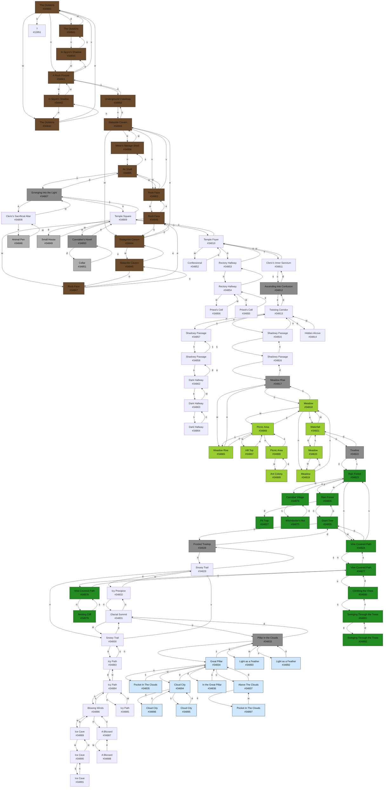

# Guardian's Spyre of Knowledge

88 rooms. Solid = direction; dotted = special exit.

```mermaid
flowchart TD
  r34800["The Outskirts<br/>#34800"]
  r34801["A Rock Fissure<br/>#34801"]
  r34802["Underground Crawlway<br/>#34802"]
  r34841["The Outskirts<br/>#34841"]
  r34840["The Outskirts<br/>#34840"]
  r34842["In Spyre's Shadow<br/>#34842"]
  r34843["In Spyre's Shadow<br/>#34843"]
  r34804["Stalactite Cavern<br/>#34804"]
  r34806["Miner's Storage Shed<br/>#34806"]
  r34844["Stalagmite Cavern<br/>#34844"]
  r34803["Rock Face<br/>#34803"]
  r34805["Air Shaft<br/>#34805"]
  r34846["Rock Face<br/>#34846"]
  r34847["Rock Face<br/>#34847"]
  r34845["Stalactite Cavern<br/>#34845"]
  r34807["Emerging into the Light<br/>#34807"]
  r34808["Cleric's Sacrificial Altar<br/>#34808"]
  r34848["Animal Pen<br/>#34848"]
  r34809["Temple Square<br/>#34809"]
  r34849["Small House<br/>#34849"]
  r34850["Caretaker's Hovel<br/>#34850"]
  r34851["Cellar<br/>#34851"]
  r34810["Temple Foyer<br/>#34810"]
  r34811["Cleric's Inner Sanctum<br/>#34811"]
  r34812["Ascending Into Confusion<br/>#34812"]
  r34853["Rectory Hallway<br/>#34853"]
  r34854["Rectory Hallway<br/>#34854"]
  r34856["Priest's Cell<br/>#34856"]
  r34855["Priest's Cell<br/>#34855"]
  r34852["Confessional<br/>#34852"]
  r34857["Shadowy Passage<br/>#34857"]
  r34858["Shadowy Passage<br/>#34858"]
  r34862["Dark Hallway<br/>#34862"]
  r34863["Dark Hallway<br/>#34863"]
  r34864["Dark Hallway<br/>#34864"]
  r34815["Shadowy Passage<br/>#34815"]
  r34816["Shadowy Passage<br/>#34816"]
  r34817["Meadow Rise<br/>#34817"]
  r34818["Meadow<br/>#34818"]
  r34865["Meadow Rise<br/>#34865"]
  r34866["Picnic Area<br/>#34866"]
  r34867["Hill Top<br/>#34867"]
  r34868["Picnic Area<br/>#34868"]
  r34869["Ant Colony<br/>#34869"]
  r34819["Meadow<br/>#34819"]
  r34820["Meadow<br/>#34820"]
  r34821["Waterfall<br/>#34821"]
  r34822["Treeline<br/>#34822"]
  r34814["Hidden Alcove<br/>#34814"]
  r34813["Twisting Corridor<br/>#34813"]
  r34823["Rain Forest<br/>#34823"]
  r34876["Cannibal Village<br/>#34876"]
  r34826["Rain Forest<br/>#34826"]
  r34827["Pit Trap<br/>#34827"]
  r34875["Witchdoctor's Hut<br/>#34875"]
  r34824["Vine Covered Path<br/>#34824"]
  r34825["Giant Tree<br/>#34825"]
  r34828["Frosted Treetop<br/>#34828"]
  r34829["Snowy Trail<br/>#34829"]
  r34832["Icy Precipice<br/>#34832"]
  r34831["Glacial Summit<br/>#34831"]
  r34830["Snowy Trail<br/>#34830"]
  r34883["Icy Path<br/>#34883"]
  r34884["Icy Path<br/>#34884"]
  r34886["Blowing Winds<br/>#34886"]
  r34889["Ice Cave<br/>#34889"]
  r34890["Ice Cave<br/>#34890"]
  r34891["Ice Cave<br/>#34891"]
  r34887["A Blizzard<br/>#34887"]
  r34885["Icy Path<br/>#34885"]
  r34888["A Blizzard<br/>#34888"]
  r34833["Pillar in the Clouds<br/>#34833"]
  r34877["Vine Covered Path<br/>#34877"]
  r34878["Vine Covered Path<br/>#34878"]
  r34879["Nesting Cliff<br/>#34879"]
  r34880["Climbing the Vines<br/>#34880"]
  r34881["Swinging Through the Trees<br/>#34881"]
  r34882["Swinging Through the Trees<br/>#34882"]
  r34834["Great Pillar<br/>#34834"]
  r34835["Pocket In The Clouds<br/>#34835"]
  r34894["Cloud City<br/>#34894"]
  r34896["Cloud City<br/>#34896"]
  r34895["Cloud City<br/>#34895"]
  r34893["Light as a Feather<br/>#34893"]
  r34892["Light as a Feather<br/>#34892"]
  r34836["In the Great Pillar<br/>#34836"]
  r34837["Above The Clouds<br/>#34837"]
  r34897["Pocket In The Clouds<br/>#34897"]
  r34800 -->|e| r34841
  r34800 -->|n| r34801
  r11951["?<br/>#11951"]
  r34800 -->|s| r11951
  r34800 -->|w| r34840
  r34801 -->|e| r34843
  r34801 -->|n| r34802
  r34801 -->|s| r34800
  r34801 -->|w| r34842
  r34802 -->|n| r34804
  r34802 -->|s| r34801
  r34841 -->|n| r34843
  r34841 -->|w| r34800
  r34840 -->|e| r34800
  r34840 -->|n| r34842
  r34842 -->|e| r34801
  r34842 -->|s| r34840
  r34843 -->|s| r34841
  r34843 -->|w| r34801
  r34804 -->|e| r34806
  r34804 -->|n| r34803
  r34804 -->|s| r34802
  r34804 -->|w| r34844
  r34806 -->|n| r34805
  r34806 -->|w| r34804
  r34844 -->|e| r34804
  r34844 -->|n| r34846
  r34844 -->|w| r34845
  r34803 -->|e| r34805
  r34803 -->|s| r34804
  r34803 -->|w| r34846
  r34805 -->|s| r34806
  r34805 -->|u| r34807
  r34805 -->|w| r34803
  r34846 -->|e| r34803
  r34846 -->|s| r34844
  r34846 -->|w| r34847
  r34847 -->|e| r34846
  r34847 -->|s| r34845
  r34845 -->|e| r34844
  r34845 -->|n| r34847
  r34807 -->|d| r34805
  r34807 -->|e| r34808
  r34807 -->|n| r34809
  r34808 -->|e| r34848
  r34808 -->|w| r34807
  r34848 -->|w| r34808
  r34809 -->|e| r34849
  r34809 -->|n| r34810
  r34809 -->|s| r34807
  r34809 -->|w| r34850
  r34849 -->|w| r34809
  r34850 -->|d| r34851
  r34850 -->|e| r34809
  r34851 -->|u| r34850
  r34810 -->|e| r34811
  r34810 -->|n| r34853
  r34810 -->|s| r34809
  r34810 -->|w| r34852
  r34811 -->|u| r34812
  r34811 -->|w| r34810
  r34812 -->|d| r34811
  r34812 -->|e| r34813
  r34853 -->|n| r34854
  r34853 -->|s| r34810
  r34854 -->|e| r34856
  r34854 -->|s| r34853
  r34854 -->|w| r34855
  r34856 -->|w| r34854
  r34855 -->|e| r34854
  r34852 -->|e| r34810
  r34857 -->|n| r34858
  r34857 -->|s| r34813
  r34858 -->|s| r34857
  r34858 -->|u| r34862
  r34862 -->|d| r34858
  r34862 -->|e| r34863
  r34863 -->|s| r34864
  r34863 -->|w| r34862
  r34864 -->|n| r34863
  r34815 -->|n| r34813
  r34815 -->|s| r34816
  r34816 -->|n| r34815
  r34816 -->|u| r34817
  r34817 -->|d| r34816
  r34817 -->|n| r34818
  r34817 -->|w| r34865
  r34818 -->|e| r34821
  r34818 -->|n| r34819
  r34818 -->|s| r34817
  r34818 -->|w| r34866
  r34865 -->|e| r34817
  r34865 -->|n| r34866
  r34866 -->|e| r34818
  r34866 -->|n| r34868
  r34866 -->|s| r34865
  r34866 -->|w| r34867
  r34867 -->|e| r34866
  r34868 -->|s| r34866
  r34868 -->|w| r34869
  r34869 -->|e| r34868
  r34819 -->|e| r34820
  r34819 -->|s| r34818
  r34820 -->|s| r34821
  r34820 -->|w| r34819
  r34821 -->|n| r34820
  r34821 -->|u| r34822
  r34821 -->|w| r34818
  r34822 -->|d| r34821
  r34822 -->|n| r34823
  r34814 -->|w| r34813
  r34813 -->|e| r34814
  r34813 -->|n| r34857
  r34813 -->|s| r34815
  r34813 -->|w| r34812
  r34823 -->|e| r34826
  r34823 -->|n| r34824
  r34823 -->|s| r34822
  r34823 -->|w| r34876
  r34876 -->|e| r34823
  r34876 -->|s| r34875
  r34826 -->|d| r34827
  r34826 -->|n| r34825
  r34826 -->|w| r34823
  r34875 -->|n| r34876
  r34824 -->|e| r34825
  r34824 -->|n| r34877
  r34824 -->|s| r34823
  r34825 -->|s| r34826
  r34825 -->|u| r34828
  r34825 -->|w| r34824
  r34828 -->|d| r34825
  r34828 -->|n| r34829
  r34829 -->|e| r34832
  r34829 -->|n| r34830
  r34829 -->|s| r34828
  r34832 -->|n| r34831
  r34832 -->|w| r34829
  r34831 -->|s| r34832
  r34831 -->|u| r34833
  r34831 -->|w| r34830
  r34830 -->|e| r34831
  r34830 -->|n| r34883
  r34830 -->|s| r34829
  r34883 -->|e| r34884
  r34883 -->|s| r34830
  r34884 -->|e| r34885
  r34884 -->|n| r34886
  r34884 -->|w| r34883
  r34886 -->|n| r34887
  r34886 -->|s| r34884
  r34886 -->|w| r34889
  r34889 -->|e| r34886
  r34889 -->|w| r34890
  r34890 -->|e| r34889
  r34890 -->|s| r34891
  r34891 -->|n| r34890
  r34887 -->|s| r34886
  r34887 -->|w| r34888
  r34885 -->|w| r34884
  r34888 -->|e| r34887
  r34833 -->|d| r34831
  r34833 -->|e| r34893
  r34833 -->|n| r34834
  r34833 -->|s| r34892
  r34877 -->|s| r34824
  r34877 -->|u| r34880
  r34877 -->|w| r34878
  r34878 -->|e| r34877
  r34878 -->|n| r34879
  r34879 -->|s| r34878
  r34880 -->|d| r34877
  r34880 -->|s| r34881
  r34881 -->|e| r34882
  r34881 -->|n| r34880
  r34882 -->|w| r34881
  r34834 -->|d| r34836
  r34834 -->|n| r34835
  r34834 -->|s| r34833
  r34834 -->|u| r34837
  r34834 -->|w| r34894
  r34835 -->|s| r34834
  r34894 -->|e| r34834
  r34894 -->|n| r34896
  r34894 -->|s| r34895
  r34896 -->|s| r34894
  r34895 -->|n| r34894
  r34893 -->|w| r34833
  r34892 -->|n| r34833
  r34836 -->|u| r34834
  r34837 -->|d| r34834
  r34837 -->|e| r34897
  r34897 -->|w| r34837
  classDef t_underground fill:#6b4a2b,color:#111,stroke:#222
  class r34800 t_underground
  class r34801 t_underground
  class r34802 t_underground
  class r34841 t_underground
  class r34840 t_underground
  class r34842 t_underground
  class r34843 t_underground
  class r34804 t_underground
  class r34806 t_underground
  class r34844 t_underground
  class r34803 t_underground
  class r34805 t_underground
  class r34846 t_underground
  class r34847 t_underground
  class r34845 t_underground
  classDef t_inside fill:#8a8a8a,color:#111,stroke:#222
  class r34807 t_inside
  classDef t_city fill:#b0b0b0,color:#111,stroke:#222
  class r34848 t_city
  class r34849 t_city
  class r34850 t_inside
  class r34851 t_city
  class r34812 t_inside
  class r34817 t_inside
  classDef t_field fill:#9acd32,color:#111,stroke:#222
  class r34818 t_field
  class r34865 t_field
  class r34866 t_field
  class r34867 t_field
  class r34868 t_field
  class r34869 t_field
  class r34819 t_field
  class r34820 t_field
  class r34821 t_field
  class r34822 t_inside
  classDef t_forest fill:#228b22,color:#111,stroke:#222
  class r34823 t_forest
  class r34876 t_forest
  class r34826 t_forest
  class r34827 t_forest
  class r34875 t_forest
  class r34824 t_forest
  class r34825 t_forest
  class r34828 t_inside
  class r34833 t_inside
  class r34877 t_forest
  class r34878 t_forest
  class r34879 t_forest
  class r34880 t_forest
  class r34881 t_forest
  class r34882 t_forest
  classDef t_air fill:#cfe8ff,color:#111,stroke:#222
  class r34834 t_air
  class r34835 t_air
  class r34894 t_air
  class r34896 t_air
  class r34895 t_air
  class r34893 t_air
  class r34892 t_air
  class r34836 t_air
  class r34837 t_air
  class r34897 t_air
```
