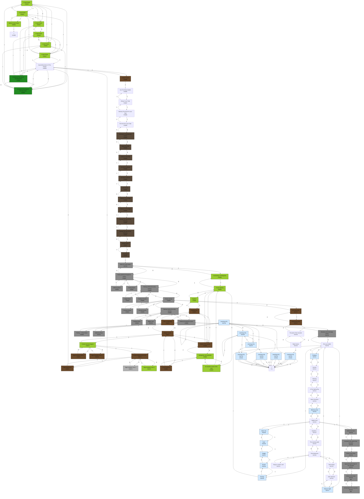

# Hatchling Aerie

98 rooms. Solid = direction; dotted = special exit.

```mermaid
flowchart TD
  r34643["A Vast Prairie<br/>#34643"]
  r34644["A Vast Prairie<br/>#34644"]
  r34645["A Vast Prairie<br/>#34645"]
  r34646["A Vast Prairie<br/>#34646"]
  r34647["A Vast Prairie<br/>#34647"]
  r34648["A Vast Prairie<br/>#34648"]
  r34649["A Forest At The Foot Of The Mountains<br/>#34649"]
  r34650["Sacred Mountains Of The Dragon<br/>#34650"]
  r34651["A Forest At The Foot Of The Mountains<br/>#34651"]
  r34652["Before A Vast Prairie<br/>#34652"]
  r34653["At A Corner<br/>#34653"]
  r34654["The Path Continues<br/>#34654"]
  r34655["The Nest<br/>#34655"]
  r34656["The Path Continues<br/>#34656"]
  r34657["Almost There<br/>#34657"]
  r34658["Along The Path<br/>#34658"]
  r34659["A Bend In The Path<br/>#34659"]
  r34660["Entering An Underground Cavern<br/>#34660"]
  r34661["Nearing The Top Of The Pathway<br/>#34661"]
  r34662["Nearing The Top Of The Pathway<br/>#34662"]
  r34663["Pathway To The Eggs<br/>#34663"]
  r34664["Pathway To The Eggs<br/>#34664"]
  r34665["Into The Murky Depths<br/>#34665"]
  r34666["Nearing The End Of A Lava Tube<br/>#34666"]
  r34667["Along A Lava Tube<br/>#34667"]
  r34668["A Dark Tunnel<br/>#34668"]
  r34669["The End Of A Lava Tube<br/>#34669"]
  r34670["Egg dropoff point<br/>#34670"]
  r34671["Broad underground tunnel<br/>#34671"]
  r34672["Egg incubation room 1<br/>#34672"]
  r34673["Egg incubation room 2<br/>#34673"]
  r34674["Freshly hatched dragons<br/>#34674"]
  r34675["Egg incubation room 3<br/>#34675"]
  r34676["Egg incubation room 4<br/>#34676"]
  r34677["Dragon nursery<br/>#34677"]
  r34678["Piles of hatchlings<br/>#34678"]
  r34679["Feeding time<br/>#34679"]
  r34680["Centre of the nursery<br/>#34680"]
  r34681["A small opening<br/>#34681"]
  r34683["An anarchic corner of the cave<br/>#34683"]
  r34684["A cave opening<br/>#34684"]
  r34685["Naptime<br/>#34685"]
  r34686["Overlooking a kindergarten<br/>#34686"]
  r34687["Rocky pathway through the cavern<br/>#34687"]
  r34688["Pathway before the rocky outcrop<br/>#34688"]
  r34689["Rocky outcrop<br/>#34689"]
  r34690["Pathway before the rocky outcrop<br/>#34690"]
  r34691["Pathway through the cavern<br/>#34691"]
  r34692["Glittering Room<br/>#34692"]
  r34693["Magic Room<br/>#34693"]
  r34694["Proving Ground<br/>#34694"]
  r34695["Feeding Room<br/>#34695"]
  r34696["Plotting.. er Rest Room<br/>#34696"]
  r34697["Nesting Room<br/>#34697"]
  r34698["Feeding Grounds<br/>#34698"]
  r34699["Proving Ground<br/>#34699"]
  r34700["Magic room<br/>#34700"]
  r34701["Glittering Room<br/>#34701"]
  r34702["Westerly exit to the large cavern<br/>#34702"]
  r34703["Entry to a vast cavern<br/>#34703"]
  r34704["Pick your battle!<br/>#34704"]
  r34705["Evening<br/>#34705"]
  r34706["Sunset<br/>#34706"]
  r34707["Twilight<br/>#34707"]
  r34708["Dusk<br/>#34708"]
  r34709["Moon rise<br/>#34709"]
  r34710["Hopeless...<br/>#34710"]
  r34711["Predawn<br/>#34711"]
  r34712["Sunrise<br/>#34712"]
  r34713["Morning<br/>#34713"]
  r34714["A Fine Spring Day<br/>#34714"]
  r34715["Warm Sunshine<br/>#34715"]
  r34716["Blistering Heat<br/>#34716"]
  r34717["Flying at night<br/>#34717"]
  r34718["Utter darkness<br/>#34718"]
  r34719["Total eclipse<br/>#34719"]
  r34720["Thick blackness<br/>#34720"]
  r34721["Flying in circles! Lost!<br/>#34721"]
  r34722["The ravening night<br/>#34722"]
  r34723["Battle's End<br/>#34723"]
  r34724["Up a lava tube<br/>#34724"]
  r34725["Approaching the heart of the mountain<br/>#34725"]
  r34726["Almost at the heart<br/>#34726<br/>[pk]"]
  r34727["Nearing the peak<br/>#34727"]
  r34728["The peak of the mountain<br/>#34728"]
  r34729["Closer to the heart<br/>#34729"]
  r34730["Flight School<br/>#34730"]
  r34735["Learning to fly<br/>#34735"]
  r34736["Learning to fly<br/>#34736"]
  r34737["Learning to fly<br/>#34737"]
  r34738["Before the heart<br/>#34738"]
  r34739["A tunnel to the heart of the mountain<br/>#34739"]
  r34740["At the heart of the mountain<br/>#34740<br/>[pk]"]
  r34682["Stalagmites and stalactites<br/>#34682"]
  r34731["Learning to fly<br/>#34731<br/>[maze]"]
  r34734["Learning to fly<br/>#34734<br/>[maze]"]
  r34732["Learning to fly<br/>#34732<br/>[maze]"]
  r34733["Learning to fly<br/>#34733<br/>[maze]"]
  r34643 -->|e| r34644
  r34643 -->|n| r34646
  r34643 -->|s| r34649
  r34643 -->|w| r34645
  r34644 -->|e| r34645
  r34644 -->|n| r34647
  r34644 -->|s| r34652
  r34644 -->|w| r34643
  r34645 -->|e| r34643
  r34645 -->|n| r34648
  r34645 -->|s| r34651
  r34645 -->|w| r34644
  r34646 -->|e| r34647
  r34646 -->|n| r34649
  r34646 -->|s| r34643
  r34646 -->|w| r34648
  r34647 -->|e| r34648
  r34647 -->|n| r34650
  r34647 -->|s| r34644
  r34647 -->|w| r34646
  r34648 -->|e| r34646
  r34648 -->|n| r34651
  r34648 -->|s| r34645
  r34648 -->|w| r34647
  r34649 -->|e| r34650
  r34649 -->|n| r34643
  r34649 -->|s| r34646
  r34649 -->|w| r34651
  r34650 -->|d| r34668
  r34650 -->|e| r34651
  r34650 -->|s| r34647
  r34650 -->|u| r34670
  r34650 -->|w| r34649
  r34651 -->|e| r34649
  r34651 -->|n| r34645
  r34651 -->|s| r34648
  r34651 -->|w| r34650
  r34652 -->|n| r34644
  r12885["?<br/>#12885"]
  r34652 -->|s| r12885
  r34653 -->|e| r34664
  r34653 -->|s| r34654
  r34654 -->|n| r34653
  r34654 -->|s| r34656
  r34655 -->|s| r34657
  r34655 -->|u| r34703
  r34656 -->|n| r34654
  r34656 -->|s| r34659
  r34657 -->|e| r34661
  r34657 -->|n| r34655
  r34658 -->|e| r34660
  r34658 -->|w| r34659
  r34659 -->|e| r34658
  r34659 -->|n| r34656
  r34660 -->|e| r34669
  r34660 -->|w| r34658
  r34661 -->|n| r34662
  r34661 -->|w| r34657
  r34662 -->|n| r34663
  r34662 -->|s| r34661
  r34663 -->|s| r34662
  r34663 -->|w| r34664
  r34664 -->|e| r34663
  r34664 -->|w| r34653
  r34665 -->|s| r34667
  r34666 -->|n| r34667
  r34666 -->|s| r34669
  r34667 -->|n| r34665
  r34667 -->|s| r34666
  r34668 -->|d| r34665
  r34668 -->|u| r34650
  r34669 -->|n| r34666
  r34669 -->|w| r34660
  r34670 -->|d| r34650
  r34670 -->|n| r34671
  r34671 -->|e| r34672
  r34671 -->|n| r34674
  r34671 -->|s| r34670
  r34671 -->|w| r34673
  r34672 -->|w| r34671
  r34673 -->|e| r34671
  r34674 -->|e| r34675
  r34674 -->|n| r34677
  r34674 -->|s| r34671
  r34674 -->|w| r34676
  r34675 -->|w| r34674
  r34676 -->|e| r34674
  r34677 -->|e| r34678
  r34677 -->|n| r34680
  r34677 -->|s| r34674
  r34677 -->|w| r34681
  r34678 -->|n| r34679
  r34678 -->|w| r34677
  r34679 -->|n| r34685
  r34679 -->|s| r34678
  r34679 -->|w| r34680
  r34680 -->|e| r34679
  r34680 -->|n| r34684
  r34680 -->|s| r34677
  r34680 -->|w| r34682
  r34681 -->|e| r34677
  r34681 -->|n| r34682
  r34683 -->|e| r34684
  r34683 -->|s| r34682
  r34684 -->|e| r34685
  r34684 -->|n| r34686
  r34684 -->|s| r34680
  r34684 -->|w| r34683
  r34685 -->|s| r34679
  r34685 -->|w| r34684
  r34686 -->|s| r34684
  r34686 -->|w| r34703
  r34687 -->|e| r34703
  r34687 -->|n| r34692
  r34687 -->|s| r34697
  r34687 -->|w| r34688
  r34688 -->|e| r34687
  r34688 -->|n| r34693
  r34688 -->|s| r34698
  r34688 -->|w| r34689
  r34689 -->|e| r34688
  r34689 -->|n| r34694
  r34689 -->|s| r34699
  r34689 -->|u| r34724
  r34689 -->|w| r34690
  r34690 -->|e| r34689
  r34690 -->|n| r34695
  r34690 -->|s| r34700
  r34690 -->|w| r34691
  r34691 -->|e| r34690
  r34691 -->|n| r34696
  r34691 -->|s| r34701
  r34691 -->|w| r34702
  r34692 -->|s| r34687
  r34693 -->|s| r34688
  r34694 -->|s| r34689
  r34695 -->|s| r34690
  r34696 -->|s| r34691
  r34697 -->|n| r34687
  r34698 -->|n| r34688
  r34699 -->|n| r34689
  r34700 -->|n| r34690
  r34701 -->|n| r34691
  r34702 -->|e| r34691
  r34702 -->|w| r34704
  r34703 -->|e| r34686
  r34703 -->|w| r34687
  r34704 -->|d| r34711
  r34704 -->|e| r34702
  r34704 -->|n| r34705
  r34704 -->|u| r34717
  r34705 -->|n| r34706
  r34705 -->|s| r34704
  r34706 -->|n| r34707
  r34706 -->|s| r34705
  r34707 -->|n| r34708
  r34707 -->|s| r34706
  r34708 -->|n| r34709
  r34708 -->|s| r34707
  r34709 -->|n| r34723
  r34709 -->|s| r34708
  r34710 -->|d| r34722
  r34710 -->|u| r34723
  r34711 -->|d| r34712
  r34711 -->|u| r34704
  r34712 -->|n| r34713
  r34712 -->|u| r34711
  r34713 -->|n| r34714
  r34713 -->|s| r34712
  r34714 -->|s| r34713
  r34714 -->|w| r34715
  r34715 -->|e| r34714
  r34715 -->|n| r34716
  r34716 -->|e| r34723
  r34716 -->|s| r34715
  r34717 -->|d| r34704
  r34717 -->|n| r34718
  r34718 -->|s| r34717
  r34718 -->|u| r34719
  r34719 -->|d| r34718
  r34719 -->|s| r34720
  r34720 -->|n| r34719
  r34720 -->|s| r34721
  r34720 -->|w| r34722
  r34721 -->|n| r34720
  r34722 -->|e| r34720
  r34722 -->|u| r34710
  r34723 -->|d| r34710
  r34723 -->|n| r34738
  r34723 -->|s| r34709
  r34723 -->|w| r34716
  r34724 -->|d| r34689
  r34724 -->|u| r34727
  r34725 -->|n| r34726
  r34725 -->|s| r34729
  r34726 -->|n| r34740
  r34726 -->|s| r34725
  r34727 -->|d| r34724
  r34727 -->|u| r34728
  r34728 -->|d| r34727
  r34728 -->|e| r34730
  r34729 -->|n| r34725
  r34729 -->|s| r34739
  r34730 -->|u| r34731
  r34730 -->|w| r34728
  r34735 -->|e| r34733
  r34735 -->|n| r34731
  r34735 -->|s| r34735
  r34735 -->|w| r34736
  r34736 -->|e| r34737
  r34736 -->|n| r34732
  r34736 -->|s| r34736
  r34736 -->|w| r34733
  r34737 -->|e| r34735
  r34737 -->|n| r34733
  r34737 -->|s| r34736
  r34737 -->|w| r34732
  r34738 -->|n| r34739
  r34738 -->|s| r34723
  r34739 -->|n| r34729
  r34739 -->|s| r34738
  r34740 -->|s| r34726
  r34682 -->|e| r34680
  r34682 -->|n| r34683
  r34682 -->|s| r34681
  r-1["?<br/>#-1"]
  r34731 -->|d| r-1
  r34731 -->|e| r-1
  r34731 -->|n| r-1
  r34731 -->|s| r-1
  r34731 -->|w| r-1
  r34734 -->|e| r-1
  r34734 -->|n| r-1
  r34734 -->|s| r-1
  r34734 -->|w| r-1
  r34732 -->|e| r-1
  r34732 -->|n| r-1
  r34732 -->|s| r-1
  r34732 -->|w| r-1
  r34733 -->|e| r-1
  r34733 -->|n| r-1
  r34733 -->|s| r-1
  r34733 -->|w| r-1
  classDef t_field fill:#9acd32,color:#111,stroke:#222
  class r34643 t_field
  class r34644 t_field
  class r34645 t_field
  class r34646 t_field
  class r34647 t_field
  class r34648 t_field
  classDef t_forest fill:#228b22,color:#111,stroke:#222
  class r34649 t_forest
  class r34651 t_forest
  class r34652 t_field
  classDef t_cave fill:#5a4a3a,color:#111,stroke:#222
  class r34653 t_cave
  class r34654 t_cave
  class r34655 t_cave
  class r34656 t_cave
  class r34657 t_cave
  class r34658 t_cave
  class r34659 t_cave
  class r34660 t_cave
  class r34661 t_cave
  class r34662 t_cave
  class r34663 t_cave
  class r34664 t_cave
  classDef t_underground fill:#6b4a2b,color:#111,stroke:#222
  class r34668 t_underground
  class r34670 t_underground
  class r34671 t_underground
  classDef t_city fill:#b0b0b0,color:#111,stroke:#222
  class r34672 t_city
  class r34673 t_field
  class r34674 t_field
  class r34675 t_underground
  class r34676 t_underground
  class r34677 t_underground
  class r34678 t_underground
  class r34679 t_underground
  class r34680 t_underground
  class r34681 t_underground
  class r34683 t_field
  class r34684 t_field
  class r34685 t_field
  class r34686 t_field
  classDef t_inside fill:#8a8a8a,color:#111,stroke:#222
  class r34687 t_inside
  class r34688 t_inside
  class r34689 t_inside
  class r34690 t_inside
  class r34691 t_inside
  class r34692 t_inside
  class r34693 t_inside
  class r34694 t_inside
  class r34695 t_inside
  class r34696 t_inside
  class r34697 t_inside
  class r34698 t_inside
  class r34699 t_inside
  class r34700 t_inside
  class r34701 t_inside
  class r34702 t_inside
  class r34703 t_inside
  classDef t_air fill:#cfe8ff,color:#111,stroke:#222
  class r34705 t_air
  class r34706 t_air
  class r34707 t_air
  class r34708 t_air
  class r34709 t_air
  class r34711 t_air
  class r34716 t_air
  class r34717 t_air
  class r34724 t_underground
  class r34725 t_inside
  class r34726 t_inside
  class r34727 t_underground
  class r34729 t_inside
  class r34735 t_air
  class r34736 t_air
  class r34737 t_air
  class r34738 t_inside
  class r34739 t_inside
  class r34740 t_inside
  class r34682 t_field
  class r34731 t_air
  class r34734 t_air
  class r34732 t_air
  class r34733 t_air
```
