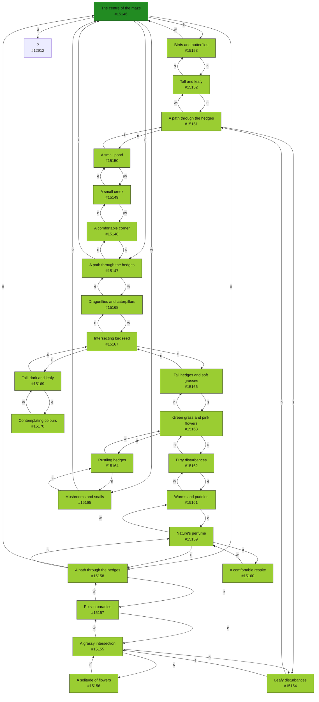

# Hedgehogs' Paradise

25 rooms. Solid = direction; dotted = special exit.

```mermaid
flowchart TD
  r15146["The centre of the maze<br/>#15146"]
  r15147["A path through the hedges<br/>#15147"]
  r15158["A path through the hedges<br/>#15158"]
  r15157["Pots 'n paradise<br/>#15157"]
  r15159["Nature's perfume<br/>#15159"]
  r15161["Worms and puddles<br/>#15161"]
  r15162["Dirty disturbances<br/>#15162"]
  r15163["Green grass and pink flowers<br/>#15163"]
  r15166["Tall hedges and soft grasses<br/>#15166"]
  r15164["Rustling hedges<br/>#15164"]
  r15165["Mushrooms and snails<br/>#15165"]
  r15168["Dragonflies and caterpillars<br/>#15168"]
  r15167["Intersecting birdseed<br/>#15167"]
  r15169["Tall, dark and leafy<br/>#15169"]
  r15170["Contemplating colours<br/>#15170"]
  r15148["A comfortable corner<br/>#15148"]
  r15149["A small creek<br/>#15149"]
  r15150["A small pond<br/>#15150"]
  r15151["A path through the hedges<br/>#15151"]
  r15154["Leafy disturbances<br/>#15154"]
  r15152["Tall and leafy<br/>#15152"]
  r15153["Birds and butterflies<br/>#15153"]
  r15155["A grassy intersection<br/>#15155"]
  r15156["A solitude of flowers<br/>#15156"]
  r15160["A comfortable respite<br/>#15160"]
  r15146 -->|e| r15153
  r15146 -->|n| r15147
  r15146 -->|s| r15158
  r12912["?<br/>#12912"]
  r15146 -->|u| r12912
  r15146 -->|w| r15165
  r15147 -->|n| r15148
  r15147 -->|s| r15146
  r15147 -->|w| r15168
  r15158 -->|e| r15157
  r15158 -->|n| r15146
  r15158 -->|s| r15159
  r15157 -->|e| r15155
  r15157 -->|w| r15158
  r15159 -->|e| r15160
  r15159 -->|n| r15158
  r15159 -->|w| r15161
  r15161 -->|e| r15159
  r15161 -->|w| r15162
  r15162 -->|e| r15161
  r15162 -->|n| r15163
  r15163 -->|e| r15164
  r15163 -->|n| r15166
  r15163 -->|s| r15162
  r15166 -->|n| r15167
  r15166 -->|s| r15163
  r15164 -->|n| r15165
  r15164 -->|w| r15163
  r15165 -->|e| r15146
  r15165 -->|s| r15164
  r15168 -->|e| r15147
  r15168 -->|w| r15167
  r15167 -->|e| r15168
  r15167 -->|n| r15169
  r15167 -->|s| r15166
  r15169 -->|e| r15170
  r15169 -->|s| r15167
  r15170 -->|w| r15169
  r15148 -->|e| r15149
  r15148 -->|s| r15147
  r15149 -->|e| r15150
  r15149 -->|w| r15148
  r15150 -->|s| r15151
  r15150 -->|w| r15149
  r15151 -->|n| r15150
  r15151 -->|s| r15154
  r15151 -->|w| r15152
  r15154 -->|n| r15151
  r15154 -->|s| r15155
  r15152 -->|e| r15151
  r15152 -->|s| r15153
  r15153 -->|n| r15152
  r15153 -->|w| r15146
  r15155 -->|n| r15154
  r15155 -->|s| r15156
  r15155 -->|w| r15157
  r15156 -->|n| r15155
  r15160 -->|w| r15159
  classDef t_forest fill:#228b22,color:#111,stroke:#222
  class r15146 t_forest
  classDef t_field fill:#9acd32,color:#111,stroke:#222
  class r15147 t_field
  class r15158 t_field
  class r15157 t_field
  class r15159 t_field
  class r15161 t_field
  class r15162 t_field
  class r15163 t_field
  class r15166 t_field
  class r15164 t_field
  class r15165 t_field
  class r15168 t_field
  class r15167 t_field
  class r15169 t_field
  class r15170 t_field
  class r15148 t_field
  class r15149 t_field
  class r15150 t_field
  class r15151 t_field
  class r15154 t_field
  class r15152 t_field
  class r15153 t_field
  class r15155 t_field
  class r15156 t_field
  class r15160 t_field
```
