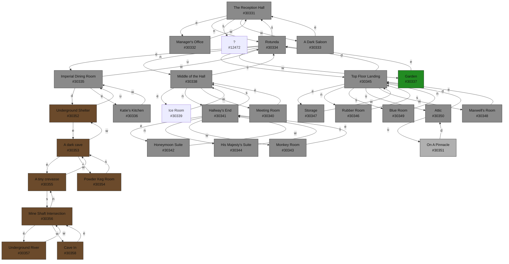

# Hotel Orlando

28 rooms. Solid = direction; dotted = special exit.

```mermaid
flowchart TD
  r30331["The Reception Hall<br/>#30331"]
  r30334["Rotunda<br/>#30334"]
  r30333["A Dark Saloon<br/>#30333"]
  r30332["Manager's Office<br/>#30332"]
  r30336["Katie's Kitchen<br/>#30336"]
  r30337["Garden<br/>#30337"]
  r30338["Middle of the Hall<br/>#30338"]
  r30340["Meeting Room<br/>#30340"]
  r30339["Ice Room<br/>#30339"]
  r30341["Hallway's End<br/>#30341"]
  r30343["Monkey Room<br/>#30343"]
  r30342["Honeymoon Suite<br/>#30342"]
  r30344["His Majesty's Suite<br/>#30344"]
  r30345["Top Floor Landing<br/>#30345"]
  r30347["Storage<br/>#30347"]
  r30348["Maxwell's Room<br/>#30348"]
  r30346["Rubber Room<br/>#30346"]
  r30349["Blue Room<br/>#30349"]
  r30350["Attic<br/>#30350"]
  r30351["On A Pinnacle<br/>#30351"]
  r30335["Imperial Dining Room<br/>#30335"]
  r30352["Underground Shelter<br/>#30352"]
  r30353["A dark cave<br/>#30353"]
  r30355["A tiny crevasse<br/>#30355"]
  r30356["Mine Shaft Intersection<br/>#30356"]
  r30357["Underground River<br/>#30357"]
  r30358["Cave In<br/>#30358"]
  r30354["Powder Keg Room<br/>#30354"]
  r30331 -->|e| r30332
  r30331 -->|n| r30334
  r12472["?<br/>#12472"]
  r30331 -->|s| r12472
  r30331 -->|w| r30333
  r30334 -->|e| r30335
  r30334 -->|n| r30338
  r30334 -->|s| r30331
  r30334 -->|u| r30345
  r30334 -->|w| r30337
  r30333 -->|e| r30331
  r30332 -->|w| r30331
  r30336 -->|w| r30335
  r30337 -->|e| r30334
  r30338 -->|e| r30339
  r30338 -->|n| r30341
  r30338 -->|s| r30334
  r30338 -->|w| r30340
  r30340 -->|e| r30338
  r30339 -->|w| r30338
  r30341 -->|e| r30342
  r30341 -->|n| r30344
  r30341 -->|s| r30338
  r30341 -->|w| r30343
  r30343 -->|e| r30341
  r30342 -->|w| r30341
  r30344 -->|s| r30341
  r30345 -->|d| r30334
  r30345 -->|e| r30347
  r30345 -->|n| r30346
  r30345 -->|s| r30349
  r30345 -->|u| r30350
  r30345 -->|w| r30348
  r30347 -->|w| r30345
  r30348 -->|e| r30345
  r30346 -->|s| r30345
  r30349 -->|n| r30345
  r30350 -->|d| r30345
  r30350 -->|u| r30351
  r30351 -->|d| r30350
  r30335 -->|d| r30352
  r30335 -->|e| r30336
  r30335 -->|w| r30334
  r30352 -->|e| r30353
  r30352 -->|u| r30335
  r30353 -->|e| r30355
  r30353 -->|n| r30354
  r30353 -->|w| r30352
  r30355 -->|s| r30356
  r30355 -->|w| r30353
  r30356 -->|e| r30357
  r30356 -->|n| r30355
  r30356 -->|w| r30358
  r30357 -->|w| r30356
  r30358 -->|e| r30356
  r30354 -->|s| r30353
  classDef t_inside fill:#8a8a8a,color:#111,stroke:#222
  class r30331 t_inside
  class r30334 t_inside
  class r30333 t_inside
  class r30332 t_inside
  class r30336 t_inside
  classDef t_forest fill:#228b22,color:#111,stroke:#222
  class r30337 t_forest
  class r30338 t_inside
  class r30340 t_inside
  class r30341 t_inside
  class r30343 t_inside
  class r30342 t_inside
  class r30344 t_inside
  class r30345 t_inside
  class r30347 t_inside
  class r30348 t_inside
  class r30346 t_inside
  class r30349 t_inside
  class r30350 t_inside
  classDef t_city fill:#b0b0b0,color:#111,stroke:#222
  class r30351 t_city
  class r30335 t_inside
  classDef t_underground fill:#6b4a2b,color:#111,stroke:#222
  class r30352 t_underground
  class r30353 t_underground
  class r30355 t_underground
  class r30356 t_underground
  class r30357 t_underground
  class r30358 t_underground
  class r30354 t_underground
```
