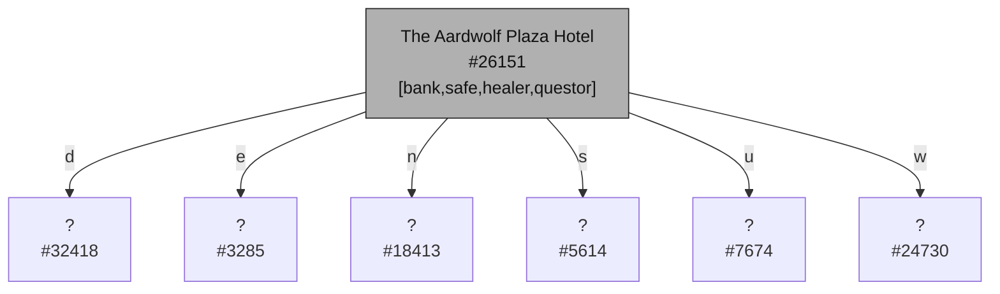

# Immortal Homes

1 rooms. Solid = direction; dotted = special exit.

```mermaid
flowchart TD
  r26151["The Aardwolf Plaza Hotel<br/>#26151<br/>[bank,safe,healer,questor]"]
  r32418["?<br/>#32418"]
  r26151 -->|d| r32418
  r3285["?<br/>#3285"]
  r26151 -->|e| r3285
  r18413["?<br/>#18413"]
  r26151 -->|n| r18413
  r5614["?<br/>#5614"]
  r26151 -->|s| r5614
  r7674["?<br/>#7674"]
  r26151 -->|u| r7674
  r24730["?<br/>#24730"]
  r26151 -->|w| r24730
  classDef t_city fill:#b0b0b0,color:#111,stroke:#222
  class r26151 t_city
```
