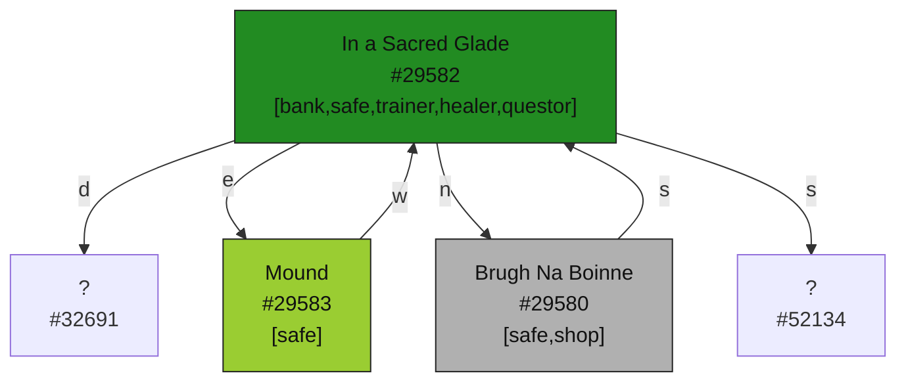

# Isle of Anglesey

3 rooms. Solid = direction; dotted = special exit.

```mermaid
flowchart TD
  r29582["In a Sacred Glade<br/>#29582<br/>[bank,safe,trainer,healer,questor]"]
  r29583["Mound<br/>#29583<br/>[safe]"]
  r29580["Brugh Na Boinne<br/>#29580<br/>[safe,shop]"]
  r32691["?<br/>#32691"]
  r29582 -->|d| r32691
  r29582 -->|e| r29583
  r29582 -->|n| r29580
  r52134["?<br/>#52134"]
  r29582 -->|s| r52134
  r29583 -->|w| r29582
  r29580 -->|s| r29582
  classDef t_forest fill:#228b22,color:#111,stroke:#222
  class r29582 t_forest
  classDef t_field fill:#9acd32,color:#111,stroke:#222
  class r29583 t_field
  classDef t_city fill:#b0b0b0,color:#111,stroke:#222
  class r29580 t_city
```
