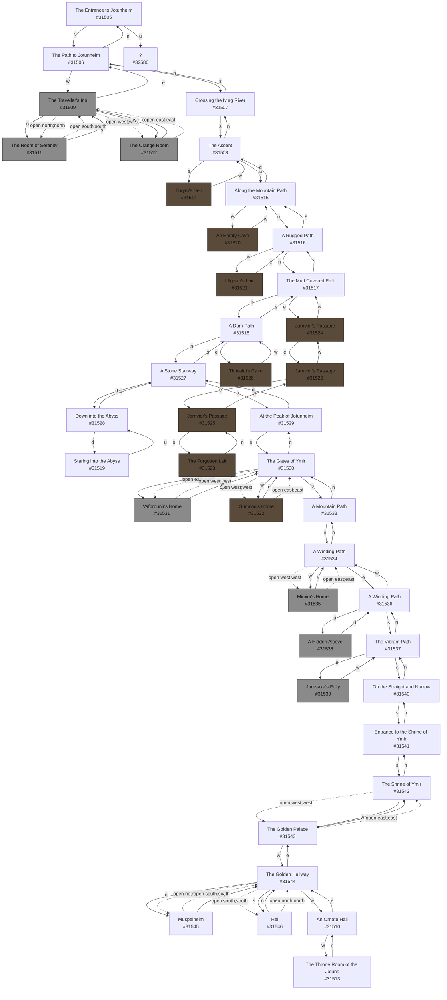

# Jotunheim

42 rooms. Solid = direction; dotted = special exit.

```mermaid
flowchart TD
  r31505["The Entrance to Jotunheim<br/>#31505"]
  r31506["The Path to Jotunheim<br/>#31506"]
  r31509["The Traveller's Inn<br/>#31509"]
  r31511["The Room of Serenity<br/>#31511"]
  r31512["The Orange Room<br/>#31512"]
  r31507["Crossing the Iving River<br/>#31507"]
  r31508["The Ascent<br/>#31508"]
  r31514["Thrym's Den<br/>#31514"]
  r31515["Along the Mountain Path<br/>#31515"]
  r31520["An Empty Cave<br/>#31520"]
  r31516["A Rugged Path<br/>#31516"]
  r31521["Utgaror's Lair<br/>#31521"]
  r31517["The Mud Covered Path<br/>#31517"]
  r31518["A Dark Path<br/>#31518"]
  r31527["A Stone Stairway<br/>#31527"]
  r31528["Down into the Abyss<br/>#31528"]
  r31519["Staring into the Abyss<br/>#31519"]
  r31526["Thrivaldi's Cave<br/>#31526"]
  r31524["Jarnvior's Passage<br/>#31524"]
  r31522["Jarnvior's Passage<br/>#31522"]
  r31525["Jarnvior's Passage<br/>#31525"]
  r31523["The Forgotten Lair<br/>#31523"]
  r31529["At the Peak of Jotunheim<br/>#31529"]
  r31530["The Gates of Ymir<br/>#31530"]
  r31531["Vafprounir's Home<br/>#31531"]
  r31532["Gunnlod's Home<br/>#31532"]
  r31533["A Mountain Path<br/>#31533"]
  r31534["A Winding Path<br/>#31534"]
  r31535["Mimior's Home<br/>#31535"]
  r31536["A Winding Path<br/>#31536"]
  r31538["A Hidden Alcove<br/>#31538"]
  r31537["The Vibrant Path<br/>#31537"]
  r31539["Jarnsaxa's Folly<br/>#31539"]
  r31540["On the Straight and Narrow<br/>#31540"]
  r31541["Entrance to the Shrine of Ymir<br/>#31541"]
  r31542["The Shrine of Ymir<br/>#31542"]
  r31543["The Golden Palace<br/>#31543"]
  r31544["The Golden Hallway<br/>#31544"]
  r31545["Muspelheim<br/>#31545"]
  r31546["Hel<br/>#31546"]
  r31510["An Ornate Hall<br/>#31510"]
  r31513["The Throne Room of the Jotuns<br/>#31513"]
  r31505 -->|s| r31506
  r32586["?<br/>#32586"]
  r31505 -->|u| r32586
  r31506 -->|n| r31505
  r31506 -->|s| r31507
  r31506 -->|w| r31509
  r31509 -->|e| r31506
  r31509 -->|n| r31511
  r31509 -.->|open north;north| r31511
  r31509 -.->|open west;west| r31512
  r31509 -->|w| r31512
  r31511 -.->|open south;south| r31509
  r31511 -->|s| r31509
  r31512 -->|e| r31509
  r31512 -.->|open east;east| r31509
  r31507 -->|n| r31506
  r31507 -->|s| r31508
  r31508 -->|e| r31514
  r31508 -->|n| r31507
  r31508 -->|u| r31515
  r31514 -->|w| r31508
  r31515 -->|d| r31508
  r31515 -->|e| r31520
  r31515 -->|n| r31516
  r31520 -->|w| r31515
  r31516 -->|n| r31517
  r31516 -->|s| r31515
  r31516 -->|w| r31521
  r31521 -->|e| r31516
  r31517 -->|e| r31524
  r31517 -->|n| r31518
  r31517 -->|s| r31516
  r31518 -->|e| r31526
  r31518 -->|n| r31527
  r31518 -->|s| r31517
  r31527 -->|d| r31528
  r31527 -->|s| r31518
  r31527 -->|u| r31529
  r31528 -->|d| r31519
  r31528 -->|u| r31527
  r31519 -->|u| r31528
  r31526 -->|w| r31518
  r31524 -->|e| r31522
  r31524 -->|w| r31517
  r31522 -->|e| r31525
  r31522 -->|w| r31524
  r31525 -->|s| r31523
  r31525 -->|w| r31522
  r31523 -->|n| r31525
  r31529 -->|d| r31527
  r31529 -->|s| r31530
  r31530 -->|e| r31531
  r31530 -->|n| r31529
  r31530 -.->|open east;east| r31531
  r31530 -.->|open west;west| r31532
  r31530 -->|s| r31533
  r31530 -->|w| r31532
  r31531 -.->|open west;west| r31530
  r31531 -->|w| r31530
  r31532 -->|e| r31530
  r31532 -.->|open east;east| r31530
  r31533 -->|n| r31530
  r31533 -->|s| r31534
  r31534 -->|e| r31536
  r31534 -->|n| r31533
  r31534 -.->|open west;west| r31535
  r31534 -->|w| r31535
  r31535 -->|e| r31534
  r31535 -.->|open east;east| r31534
  r31536 -->|s| r31537
  r31536 -->|u| r31538
  r31536 -->|w| r31534
  r31538 -->|d| r31536
  r31537 -->|e| r31539
  r31537 -->|n| r31536
  r31537 -->|s| r31540
  r31539 -->|w| r31537
  r31540 -->|n| r31537
  r31540 -->|s| r31541
  r31541 -->|n| r31540
  r31541 -->|s| r31542
  r31542 -->|n| r31541
  r31542 -.->|open west;west| r31543
  r31542 -->|w| r31543
  r31543 -->|e| r31542
  r31543 -.->|open east;east| r31542
  r31543 -->|w| r31544
  r31544 -->|e| r31543
  r31544 -->|n| r31545
  r31544 -.->|open no;no| r31545
  r31544 -.->|open south;south| r31546
  r31544 -->|s| r31546
  r31544 -->|w| r31510
  r31545 -.->|open south;south| r31544
  r31545 -->|s| r31544
  r31546 -->|n| r31544
  r31546 -.->|open north;north| r31544
  r31510 -->|e| r31544
  r31510 -->|w| r31513
  r31513 -->|e| r31510
  classDef t_inside fill:#8a8a8a,color:#111,stroke:#222
  class r31509 t_inside
  class r31511 t_inside
  class r31512 t_inside
  classDef t_cave fill:#5a4a3a,color:#111,stroke:#222
  class r31514 t_cave
  class r31520 t_cave
  class r31521 t_cave
  class r31526 t_cave
  class r31524 t_cave
  class r31522 t_cave
  class r31525 t_cave
  class r31523 t_cave
  class r31531 t_inside
  class r31532 t_cave
  class r31535 t_inside
  class r31538 t_inside
  class r31539 t_inside
```
