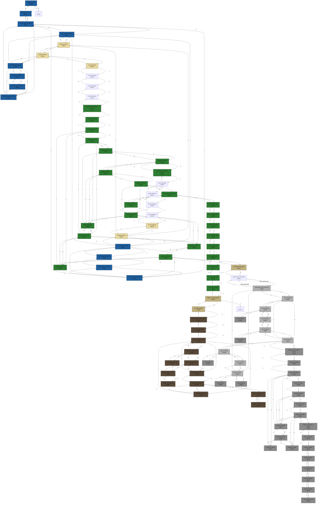

# Jungles of Verume

100 rooms. Solid = direction; dotted = special exit.

```mermaid
flowchart TD
  r30599["Western Ocean<br/>#30599"]
  r30600["Off the Coast of Verume<br/>#30600"]
  r30601["Off the Coast of Verume<br/>#30601"]
  r30602["Off the Coast of Verume<br/>#30602"]
  r30603["Off the Coast of Verume<br/>#30603"]
  r30604["Off the Coast of Verume<br/>#30604"]
  r30605["The Shores of Verume<br/>#30605"]
  r30606["The Shores of Verume<br/>#30606"]
  r30607["The Shores of Verume<br/>#30607"]
  r30608["The Shores of Verume<br/>#30608"]
  r30609["The Shores of Verume<br/>#30609"]
  r30610["Along the Sands<br/>#30610"]
  r30611["Along the Sands<br/>#30611"]
  r30612["Along the Sands<br/>#30612"]
  r30613["A worn pathway<br/>#30613"]
  r30614["A worn pathway<br/>#30614"]
  r30615["A worn pathway<br/>#30615"]
  r30616["A worn pathway<br/>#30616"]
  r30617["Entering the Jungles of Verume<br/>#30617"]
  r30618["A worn pathway<br/>#30618"]
  r30619["A worn pathway<br/>#30619"]
  r30620["A worn pathway<br/>#30620"]
  r30621["A worn pathway<br/>#30621"]
  r30622["A worn pathway<br/>#30622"]
  r30623["Entering the Jungles of Verume<br/>#30623"]
  r30624["Jungles of Verume<br/>#30624"]
  r30625["Jungles of Verume<br/>#30625"]
  r30626["Jungles of Verume<br/>#30626"]
  r30627["Jungles of Verume<br/>#30627"]
  r30628["Jungles of Verume<br/>#30628"]
  r30629["Jungles of Verume<br/>#30629"]
  r30630["Jungles of Verume<br/>#30630"]
  r30631["Jungles of Verume<br/>#30631"]
  r30632["Jungles of Verume<br/>#30632"]
  r30633["Jungles of Verume<br/>#30633"]
  r30634["Jungles of Verume<br/>#30634"]
  r30635["Nearing a Swing Bridge<br/>#30635"]
  r30636["Jungles of Verume<br/>#30636"]
  r30637["Jungles of Verume<br/>#30637"]
  r30638["Jungles of Verume<br/>#30638"]
  r30639["A clearing in the jungle<br/>#30639"]
  r30640["Near the City of Verume<br/>#30640"]
  r30641["On a swing bridge<br/>#30641"]
  r30642["On a swing bridge<br/>#30642"]
  r30643["On a swing bridge<br/>#30643"]
  r30644["On a swing bridge<br/>#30644"]
  r30645["On a swing bridge<br/>#30645"]
  r30646["On a swing bridge<br/>#30646"]
  r30647["On a swing bridge<br/>#30647"]
  r30648["On a swing bridge<br/>#30648"]
  r30649["On a swing bridge<br/>#30649"]
  r30651["A muddy walkway<br/>#30651"]
  r30652["An Opening in the Ground<br/>#30652"]
  r30653["The Lair of the Tabaxi<br/>#30653"]
  r30654["Inside the Tabaxi Lair<br/>#30654"]
  r30655["Inside the Tabaxi Lair<br/>#30655"]
  r30656["Inside the Tabaxi Lair<br/>#30656"]
  r30657["Inside the Tabaxi Lair<br/>#30657"]
  r30658["Inside the Tabaxi Lair<br/>#30658"]
  r30659["Inside the Tabaxi Lair<br/>#30659"]
  r30660["Inside the Tabaxi Lair<br/>#30660"]
  r30661["Inside the Tabaxi Lair<br/>#30661"]
  r30662["Inside the Tabaxi Lair<br/>#30662"]
  r30663["Inside the Tabaxi Lair<br/>#30663"]
  r30664["Inside the Tabaxi Lair<br/>#30664"]
  r30665["Entering the City of Verume<br/>#30665"]
  r30666["City of Verume<br/>#30666"]
  r30667["City of Verume<br/>#30667"]
  r30668["City of Verume<br/>#30668"]
  r30669["City of Verume<br/>#30669"]
  r30670["City of Verume<br/>#30670"]
  r30671["City of Verume<br/>#30671"]
  r30672["City of Verume<br/>#30672"]
  r30673["City of Verume<br/>#30673"]
  r30674["Entering the Temple of Verume<br/>#30674"]
  r30675["Inside the Temple<br/>#30675"]
  r30676["Inside the Temple<br/>#30676"]
  r30677["Inside the Temple<br/>#30677"]
  r30678["Inside the Temple<br/>#30678"]
  r30679["Inside the Temple<br/>#30679"]
  r30680["City Residence<br/>#30680"]
  r30681["City Residence<br/>#30681"]
  r30682["City Residence<br/>#30682"]
  r30683["City Residence<br/>#30683"]
  r30684["City Residence<br/>#30684"]
  r30685["Inside the Temple<br/>#30685"]
  r30686["Entering the Shrine of Ushak<br/>#30686"]
  r30687["Inside the Temple<br/>#30687"]
  r30688["Inside the Temple<br/>#30688"]
  r30689["Inside the temple<br/>#30689"]
  r30690["Inside the Temple<br/>#30690"]
  r30691["A Bronze Hallway<br/>#30691"]
  r30692["A Bronze Hallway<br/>#30692"]
  r30693["A Bronze Hallway<br/>#30693"]
  r30694["A Bronze Hallway<br/>#30694"]
  r30695["A Bronze Hallway<br/>#30695"]
  r30696["A Bronze Hallway<br/>#30696"]
  r30697["Western Ocean<br/>#30697"]
  r30698["The Shrine of Ushak<br/>#30698"]
  r30650["Nearing a Swing Bridge<br/>#30650"]
  r30599 -->|e| r30697
  r3754["?<br/>#3754"]
  r30599 -->|w| r3754
  r30600 -->|e| r30609
  r30600 -->|n| r30601
  r30601 -->|e| r30608
  r30601 -->|n| r30602
  r30601 -->|s| r30600
  r30602 -->|e| r30607
  r30602 -->|n| r30603
  r30602 -->|s| r30601
  r30602 -->|w| r30697
  r30603 -->|e| r30606
  r30603 -->|n| r30604
  r30603 -->|s| r30602
  r30604 -->|e| r30605
  r30604 -->|s| r30603
  r30605 -->|s| r30606
  r30605 -->|w| r30604
  r30606 -->|e| r30610
  r30606 -->|n| r30605
  r30606 -->|s| r30607
  r30606 -->|w| r30603
  r30607 -->|e| r30611
  r30607 -->|n| r30606
  r30607 -->|s| r30608
  r30607 -->|w| r30602
  r30608 -->|e| r30612
  r30608 -->|n| r30607
  r30608 -->|s| r30609
  r30608 -->|w| r30601
  r30609 -->|n| r30608
  r30609 -->|w| r30600
  r30610 -->|n| r30613
  r30610 -->|s| r30611
  r30610 -->|w| r30606
  r30611 -->|n| r30610
  r30611 -->|s| r30612
  r30611 -->|w| r30607
  r30612 -->|n| r30611
  r30612 -->|s| r30618
  r30612 -->|w| r30608
  r30613 -->|n| r30614
  r30613 -->|s| r30610
  r30614 -->|e| r30615
  r30614 -->|s| r30613
  r30615 -->|e| r30616
  r30615 -->|w| r30614
  r30616 -->|n| r30617
  r30616 -->|w| r30615
  r30617 -->|n| r30624
  r30617 -->|s| r30616
  r30618 -->|e| r30619
  r30618 -->|n| r30612
  r30619 -->|s| r30620
  r30619 -->|w| r30618
  r30620 -->|e| r30621
  r30620 -->|n| r30619
  r30621 -->|e| r30622
  r30621 -->|w| r30620
  r30622 -->|n| r30623
  r30622 -->|w| r30621
  r30623 -->|s| r30622
  r30623 -->|w| r30638
  r30624 -->|n| r30625
  r30624 -->|s| r30617
  r30625 -->|e| r30630
  r30625 -->|n| r30626
  r30625 -->|s| r30624
  r30626 -->|e| r30629
  r30626 -->|n| r30627
  r30626 -->|s| r30625
  r30627 -->|e| r30628
  r30627 -->|s| r30626
  r30627 -->|w| r30639
  r30628 -->|e| r30633
  r30628 -->|s| r30629
  r30628 -->|w| r30627
  r30629 -->|e| r30632
  r30629 -->|n| r30628
  r30629 -->|s| r30630
  r30629 -->|w| r30626
  r30630 -->|e| r30631
  r30630 -->|n| r30629
  r30630 -->|w| r30625
  r30631 -->|e| r30638
  r30631 -->|n| r30632
  r30631 -->|w| r30630
  r30632 -->|e| r30637
  r30632 -->|n| r30633
  r30632 -->|s| r30631
  r30632 -->|w| r30629
  r30633 -->|e| r30636
  r30633 -->|n| r30634
  r30633 -->|s| r30632
  r30633 -->|w| r30628
  r30634 -->|e| r30635
  r30634 -->|s| r30633
  r30635 -->|n| r30641
  r30635 -->|s| r30636
  r30635 -->|w| r30634
  r30636 -->|n| r30635
  r30636 -->|s| r30637
  r30636 -->|w| r30633
  r30637 -->|n| r30636
  r30637 -->|s| r30638
  r30637 -->|w| r30632
  r30638 -->|e| r30623
  r30638 -->|n| r30637
  r30638 -->|w| r30631
  r30639 -->|e| r30627
  r30639 -->|n| r30640
  r30640 -->|n| r30665
  r30640 -.->|open north;north| r30665
  r30640 -->|s| r30639
  r30641 -->|n| r30642
  r30641 -->|s| r30635
  r30642 -->|n| r30643
  r30642 -->|s| r30641
  r30643 -->|d| r30644
  r30643 -->|s| r30642
  r30644 -->|n| r30645
  r30644 -->|u| r30643
  r30645 -->|n| r30646
  r30645 -->|s| r30644
  r30646 -->|n| r30647
  r30646 -->|s| r30645
  r30647 -->|s| r30646
  r30647 -->|u| r30648
  r30648 -->|d| r30647
  r30648 -->|n| r30649
  r30649 -->|n| r30650
  r30649 -->|s| r30648
  r30651 -->|n| r30652
  r30651 -->|w| r30650
  r30652 -->|d| r30653
  r30652 -->|s| r30651
  r30653 -->|n| r30654
  r30653 -->|u| r30652
  r30654 -->|e| r30659
  r30654 -->|n| r30657
  r30654 -->|s| r30653
  r30654 -->|w| r30655
  r30655 -->|e| r30654
  r30655 -->|n| r30656
  r30656 -->|e| r30657
  r30656 -->|s| r30655
  r30656 -->|w| r30660
  r30657 -->|e| r30658
  r30657 -->|s| r30654
  r30657 -->|w| r30656
  r30658 -->|e| r30662
  r30658 -->|s| r30659
  r30658 -->|w| r30657
  r30659 -->|e| r30664
  r30659 -->|n| r30658
  r30659 -->|w| r30654
  r30660 -->|e| r30656
  r30660 -->|n| r30661
  r30661 -->|s| r30660
  r30662 -->|n| r30663
  r30662 -->|w| r30658
  r30663 -->|s| r30662
  r30664 -->|w| r30659
  r30665 -->|n| r30666
  r30665 -.->|open south;south| r30640
  r30665 -->|s| r30640
  r30665 -->|w| r30673
  r30666 -->|n| r30672
  r30666 -->|s| r30665
  r30666 -->|w| r30667
  r30667 -->|e| r30666
  r30667 -->|n| r30668
  r30667 -->|s| r30669
  r30667 -->|w| r30674
  r30668 -->|e| r30670
  r30668 -->|n| r30683
  r30668 -->|s| r30667
  r30669 -->|e| r30671
  r30669 -->|n| r30667
  r30669 -->|s| r30682
  r30670 -->|e| r30672
  r30670 -->|w| r30668
  r30671 -->|e| r30673
  r30671 -->|w| r30669
  r30672 -->|n| r30684
  r30672 -->|s| r30666
  r30672 -->|w| r30670
  r30673 -->|e| r30665
  r30673 -->|n| r30680
  r30673 -->|s| r30681
  r30673 -->|w| r30671
  r30674 -->|d| r30675
  r30674 -->|e| r30667
  r30675 -->|n| r30676
  r30675 -->|u| r30674
  r30676 -->|e| r30678
  r30676 -->|n| r30679
  r30676 -->|s| r30675
  r30676 -->|w| r30677
  r30677 -->|e| r30676
  r30677 -->|n| r30687
  r30678 -->|n| r30689
  r30678 -->|w| r30676
  r30679 -->|e| r30689
  r30679 -->|n| r30685
  r30679 -->|s| r30676
  r30679 -->|w| r30687
  r30680 -->|s| r30673
  r30681 -->|n| r30673
  r30682 -->|n| r30669
  r30683 -->|s| r30668
  r30684 -->|s| r30672
  r30685 -->|e| r30690
  r30685 -->|n| r30686
  r30685 -->|s| r30679
  r30685 -->|w| r30688
  r30686 -->|n| r30691
  r30686 -->|s| r30685
  r30687 -->|e| r30679
  r30687 -->|n| r30688
  r30687 -->|s| r30677
  r30688 -->|e| r30685
  r30688 -->|s| r30687
  r30689 -->|n| r30690
  r30689 -->|s| r30678
  r30689 -->|w| r30679
  r30690 -->|s| r30689
  r30690 -->|w| r30685
  r30691 -->|d| r30692
  r30691 -->|s| r30686
  r30692 -->|n| r30693
  r30692 -->|u| r30691
  r30693 -->|n| r30694
  r30693 -->|s| r30692
  r30694 -->|n| r30695
  r30694 -->|s| r30693
  r30695 -->|n| r30696
  r30695 -->|s| r30694
  r30696 -->|n| r30698
  r30696 -->|s| r30695
  r30697 -->|e| r30602
  r30697 -->|w| r30599
  r30698 -->|s| r30696
  r30650 -->|e| r30651
  r27710["?<br/>#27710"]
  r30650 -->|n| r27710
  r30650 -->|s| r30649
  classDef t_ocean fill:#1f5f9e,color:#111,stroke:#222
  class r30599 t_ocean
  class r30600 t_ocean
  class r30601 t_ocean
  class r30602 t_ocean
  class r30603 t_ocean
  class r30604 t_ocean
  class r30605 t_ocean
  class r30606 t_ocean
  class r30607 t_ocean
  class r30608 t_ocean
  class r30609 t_ocean
  classDef t_beach fill:#e8d8a0,color:#111,stroke:#222
  class r30610 t_beach
  class r30611 t_beach
  class r30612 t_beach
  class r30613 t_beach
  classDef t_jungle fill:#2e7d32,color:#111,stroke:#222
  class r30617 t_jungle
  class r30618 t_beach
  class r30623 t_jungle
  class r30624 t_jungle
  class r30625 t_jungle
  class r30626 t_jungle
  class r30627 t_jungle
  class r30628 t_jungle
  class r30629 t_jungle
  class r30630 t_jungle
  class r30631 t_jungle
  class r30632 t_jungle
  class r30633 t_jungle
  class r30634 t_jungle
  class r30635 t_jungle
  class r30636 t_jungle
  class r30637 t_jungle
  class r30638 t_jungle
  classDef t_hills fill:#c2b280,color:#111,stroke:#222
  class r30639 t_hills
  class r30641 t_jungle
  class r30642 t_jungle
  class r30643 t_jungle
  class r30644 t_jungle
  class r30645 t_jungle
  class r30646 t_jungle
  class r30647 t_jungle
  class r30648 t_jungle
  class r30649 t_jungle
  class r30651 t_hills
  classDef t_cave fill:#5a4a3a,color:#111,stroke:#222
  class r30652 t_cave
  class r30653 t_cave
  class r30654 t_cave
  class r30655 t_cave
  class r30656 t_cave
  class r30657 t_cave
  class r30658 t_cave
  class r30659 t_cave
  class r30660 t_cave
  class r30661 t_cave
  class r30662 t_cave
  class r30663 t_cave
  class r30664 t_cave
  classDef t_city fill:#b0b0b0,color:#111,stroke:#222
  class r30665 t_city
  class r30666 t_city
  class r30667 t_city
  class r30668 t_city
  class r30669 t_city
  class r30670 t_city
  class r30671 t_city
  class r30672 t_city
  class r30673 t_city
  classDef t_inside fill:#8a8a8a,color:#111,stroke:#222
  class r30674 t_inside
  class r30675 t_inside
  class r30676 t_inside
  class r30677 t_inside
  class r30678 t_inside
  class r30679 t_inside
  class r30680 t_inside
  class r30681 t_inside
  class r30682 t_inside
  class r30683 t_inside
  class r30684 t_inside
  class r30685 t_inside
  class r30686 t_inside
  class r30687 t_inside
  class r30688 t_inside
  class r30689 t_inside
  class r30690 t_inside
  class r30691 t_inside
  class r30692 t_inside
  class r30693 t_inside
  class r30694 t_inside
  class r30695 t_inside
  class r30696 t_inside
  class r30697 t_ocean
  class r30698 t_inside
  class r30650 t_hills
```
