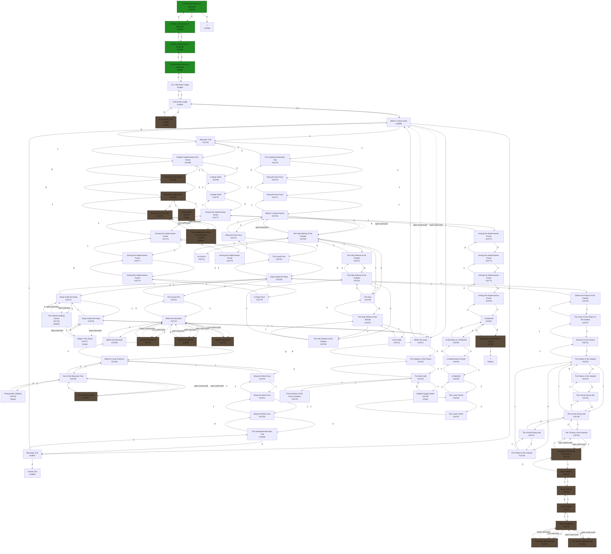

# Keep of the Kobaloi

91 rooms. Solid = direction; dotted = special exit.

```mermaid
flowchart TD
  r10688["A Path at the Foot of a Mountain<br/>#10688"]
  r10689["A Path at the Foot of a Mountain<br/>#10689"]
  r10690["A Path at the Foot of a Mountain<br/>#10690"]
  r10691["A Path at the Foot of a Mountain<br/>#10691"]
  r10692["On a Mountain Ledge<br/>#10692"]
  r10693["A Mountain Ledge<br/>#10693"]
  r10694["A Cramped Cave<br/>#10694<br/>[shop]"]
  r10696["Before a Stone Gate<br/>#10696"]
  r10721["Within the Keep<br/>#10721"]
  r10697["Mountain Trail<br/>#10697"]
  r10695["A Rock Fall<br/>#10695"]
  r10720["Mountain Trail<br/>#10720"]
  r10722["The Keepers of the Peace<br/>#10722"]
  r10725["Deep Inside the Keep<br/>#10725"]
  r10727["Stagh's Fish Stand<br/>#10727<br/>[shop]"]
  r10712["Deep Inside the Keep<br/>#10712"]
  r10748["The Kobaloi Healing Cavern<br/>#10748<br/>[healer]"]
  r10728["Deep Inside the Keep<br/>#10728"]
  r10731["The Guard Post<br/>#10731"]
  r10730["The Guard Post<br/>#10730"]
  r10729["Before the Palace of the Kobaloi<br/>#10729"]
  r10710["Within the Mountain<br/>#10710"]
  r10708["Within the Mountain<br/>#10708"]
  r10705["Before A Cave Entrance<br/>#10705"]
  r10704["Kobaloi Residence<br/>#10704"]
  r10699["Kobaloi Residence<br/>#10699"]
  r10709["Kobaloi Residence<br/>#10709"]
  r10706["End of the Mountain Trail<br/>#10706"]
  r10702["Flourpunder's Bakery<br/>#10702<br/>[shop]"]
  r10703["Along the West Face<br/>#10703"]
  r10701["Along the West Face<br/>#10701"]
  r10700["Along the West Face<br/>#10700"]
  r10698["The Southwest Mountain Trail<br/>#10698"]
  r10707["The Kobaloi School<br/>#10707"]
  r10719["The Southeast Mountain Trail<br/>#10719"]
  r10718["Along the East Face<br/>#10718"]
  r10717["Along the East Face<br/>#10717"]
  r10716["Before a Gated Cavern<br/>#10716"]
  r10715["Along the East Face<br/>#10715"]
  r10750["The Holy Retreat of the Kobaloi<br/>#10750"]
  r10751["The Holy Retreat of the Kobaloi<br/>#10751"]
  r10714["An Alcove<br/>#10714"]
  r10749["The Dais<br/>#10749"]
  r10752["The Holy Retreat of the Kobaloi<br/>#10752"]
  r10754["The Holy Retreat of the Kobaloi<br/>#10754"]
  r10753["The Holy Retreat of the Kobaloi<br/>#10753"]
  r10713["Choir Stalls<br/>#10713"]
  r10732["Entrance to the Palace<br/>#10732"]
  r10747["The Foyer of the Palace of the Kobaloi<br/>#10747"]
  r10733["The Palace of the Kobaloi<br/>#10733"]
  r10734["The Palace of the Kobaloi<br/>#10734"]
  r10738["The Palace of the Kobaloi<br/>#10738"]
  r10737["The Grand Dining Hall<br/>#10737"]
  r10736["The Grand Dining Hall<br/>#10736"]
  r10735["The Grand Dining Hall<br/>#10735"]
  r10739["The Thrones of the Kobaloi<br/>#10739"]
  r10740["A Vestibule Behind the Throneroom <br/>#10740"]
  r10741["Royal Hallway<br/>#10741"]
  r10742["Royal Hallway<br/>#10742"]
  r10743["Royal Hallway<br/>#10743"]
  r10744["Royal Residence<br/>#10744"]
  r10745["The King's Bedchamber<br/>#10745"]
  r10746["The Queen's Bedchamber<br/>#10746"]
  r10723["The Mess Hall<br/>#10723"]
  r10724["The Dormitory of the Peace Keepers<br/>#10724"]
  r10726["Kobaloi Supply Depot<br/>#10726<br/>[shop]"]
  r10768["Kobaloi Subterranean Fish Ponds<br/>#10768"]
  r10758["Entrance to the Ponds<br/>#10758"]
  r10759["Entrance to the Ponds<br/>#10759"]
  r10761["Entrance to the Ponds<br/>#10761"]
  r10762["The Headquarters of the Pond Keepers<br/>#10762<br/>[trainer]"]
  r10760["Tackle Shop<br/>#10760<br/>[shop]"]
  r10769["A Steep Shaft<br/>#10769"]
  r10770["A Steep Shaft<br/>#10770"]
  r10771["Among the Subterranean Ponds<br/>#10771"]
  r10775["Among the Subterranean Ponds<br/>#10775"]
  r10776["Among the Subterranean Ponds<br/>#10776"]
  r10777["Among the Subterranean Ponds<br/>#10777"]
  r10778["Among the Subterranean Ponds<br/>#10778"]
  r10779["A Deep Pond<br/>#10779"]
  r10772["Among the Subterranean Ponds<br/>#10772"]
  r10773["Among the Subterranean Ponds<br/>#10773"]
  r10774["Among the Subterranean Ponds<br/>#10774"]
  r10780["Among the Subterranean Ponds<br/>#10780"]
  r10781["A Waterfall<br/>#10781"]
  r10782["Among the Subterranean Ponds<br/>#10782"]
  r10783["At the Base of a Waterfall<br/>#10783"]
  r10784["A Subterranean Rivulet<br/>#10784"]
  r10785["A Waterfall<br/>#10785"]
  r10786["The Lower Ponds<br/>#10786"]
  r10787["The Lower Ponds<br/>#10787"]
  r13360["?<br/>#13360"]
  r10688 -->|e| r13360
  r10688 -->|n| r10689
  r10689 -->|n| r10690
  r10689 -->|s| r10688
  r10690 -->|s| r10689
  r10690 -->|w| r10691
  r10691 -->|e| r10690
  r10691 -->|u| r10692
  r10692 -->|d| r10691
  r10692 -->|n| r10693
  r10693 -->|s| r10692
  r10693 -->|u| r10696
  r10693 -->|w| r10694
  r10694 -->|e| r10693
  r10696 -->|d| r10693
  r10696 -->|e| r10720
  r10696 -->|n| r10721
  r10696 -.->|open north;north| r10721
  r10696 -->|w| r10697
  r10721 -->|e| r10722
  r10721 -->|n| r10725
  r10721 -.->|open south;south| r10696
  r10721 -->|s| r10696
  r10697 -->|d| r10695
  r10697 -->|e| r10696
  r10697 -->|u| r10698
  r10720 -->|d| r10768
  r10720 -->|u| r10719
  r10720 -->|w| r10696
  r10722 -->|u| r10723
  r10722 -->|w| r10721
  r10725 -->|n| r10712
  r10725 -.->|open west;west| r10727
  r10725 -->|s| r10721
  r10725 -->|w| r10727
  r10727 -->|e| r10725
  r10727 -.->|open east;east| r10725
  r10712 -->|e| r10748
  r10712 -->|n| r10728
  r10712 -.->|open east;east| r10748
  r10712 -->|s| r10725
  r10748 -.->|open west;west| r10712
  r10748 -->|w| r10712
  r10728 -->|e| r10730
  r10728 -->|n| r10729
  r10728 -->|s| r10712
  r10728 -->|w| r10731
  r10731 -->|e| r10728
  r10731 -->|u| r10710
  r10730 -->|u| r10715
  r10730 -->|w| r10728
  r10729 -->|s| r10728
  r10729 -->|u| r10747
  r10710 -->|d| r10731
  r10710 -->|e| r10699
  r10710 -->|n| r10704
  r10710 -.->|open east;east| r10699
  r10710 -.->|open north;north| r10704
  r10710 -.->|open south;south| r10709
  r10710 -->|s| r10709
  r10710 -->|w| r10708
  r10708 -->|e| r10710
  r10708 -->|w| r10705
  r10705 -->|e| r10708
  r10705 -->|n| r10706
  r10705 -->|s| r10703
  r10704 -.->|open south;south| r10710
  r10704 -->|s| r10710
  r10699 -.->|open west;west| r10710
  r10699 -->|w| r10710
  r10709 -->|n| r10710
  r10709 -.->|open north;north| r10710
  r10706 -->|e| r10702
  r10706 -->|n| r10707
  r10706 -.->|open north;north| r10707
  r10706 -->|s| r10705
  r10702 -->|w| r10706
  r10703 -->|n| r10705
  r10703 -->|s| r10701
  r10701 -->|n| r10703
  r10701 -->|s| r10700
  r10700 -->|e| r10698
  r10700 -->|n| r10701
  r10698 -->|d| r10697
  r10698 -->|w| r10700
  r10707 -.->|open south;south| r10706
  r10707 -->|s| r10706
  r10719 -->|d| r10720
  r10719 -->|e| r10718
  r10718 -->|n| r10717
  r10718 -->|w| r10719
  r10717 -->|n| r10716
  r10717 -->|s| r10718
  r10716 -->|n| r10715
  r10716 -.->|open west;west| r10750
  r10716 -->|s| r10717
  r10716 -->|w| r10750
  r10715 -->|d| r10730
  r10715 -->|s| r10716
  r10750 -->|e| r10716
  r10750 -->|n| r10751
  r10750 -.->|open east;east| r10716
  r10750 -->|s| r10714
  r10750 -->|w| r10749
  r10751 -->|s| r10750
  r10751 -->|w| r10752
  r10714 -->|n| r10750
  r10749 -->|e| r10750
  r10749 -->|n| r10752
  r10749 -->|w| r10754
  r10752 -->|e| r10751
  r10752 -->|s| r10749
  r10752 -->|w| r10753
  r10754 -->|e| r10749
  r10754 -->|n| r10753
  r10754 -->|s| r10713
  r10753 -->|e| r10752
  r10753 -->|s| r10754
  r10713 -->|n| r10754
  r10732 -->|n| r10733
  r10732 -->|s| r10747
  r10747 -->|d| r10729
  r10747 -->|n| r10732
  r10733 -->|e| r10734
  r10733 -->|n| r10736
  r10733 -->|s| r10732
  r10733 -->|w| r10738
  r10734 -->|n| r10735
  r10734 -->|w| r10733
  r10738 -->|e| r10733
  r10738 -->|n| r10737
  r10737 -->|e| r10736
  r10737 -->|s| r10738
  r10736 -->|e| r10735
  r10736 -->|n| r10739
  r10736 -->|s| r10733
  r10736 -->|w| r10737
  r10735 -->|s| r10734
  r10735 -->|w| r10736
  r10739 -->|n| r10740
  r10739 -.->|open north;north| r10740
  r10739 -->|s| r10736
  r10740 -.->|open south;south| r10739
  r10740 -->|s| r10739
  r10740 -->|u| r10741
  r10741 -->|d| r10740
  r10741 -->|n| r10742
  r10742 -->|e| r10743
  r10742 -->|s| r10741
  r10743 -->|s| r10744
  r10743 -->|w| r10742
  r10744 -->|e| r10745
  r10744 -->|n| r10743
  r10744 -.->|open east;east| r10745
  r10744 -.->|open south;south| r10746
  r10744 -->|s| r10746
  r10745 -.->|open west;west| r10744
  r10745 -->|w| r10744
  r10746 -->|n| r10744
  r10746 -.->|open north;north| r10744
  r10723 -->|d| r10722
  r10723 -->|n| r10724
  r10723 -->|s| r10726
  r10724 -->|s| r10723
  r10726 -->|n| r10723
  r10768 -->|d| r10769
  r10768 -->|e| r10758
  r10768 -->|u| r10720
  r10758 -->|e| r10759
  r10758 -->|w| r10768
  r10759 -->|n| r10761
  r10759 -->|s| r10760
  r10759 -->|w| r10758
  r10761 -->|e| r10762
  r10761 -.->|open east;east| r10762
  r10761 -->|s| r10759
  r10762 -.->|open west;west| r10761
  r10762 -->|w| r10761
  r10760 -->|n| r10759
  r10769 -->|d| r10770
  r10769 -->|u| r10768
  r10770 -->|d| r10771
  r10770 -->|u| r10769
  r10771 -->|e| r10772
  r10771 -->|u| r10770
  r10771 -->|w| r10775
  r10775 -->|e| r10771
  r10775 -->|n| r10777
  r10775 -->|s| r10776
  r10776 -->|n| r10775
  r10777 -->|e| r10778
  r10777 -->|s| r10775
  r10778 -->|n| r10779
  r10778 -->|w| r10777
  r10779 -->|s| r10778
  r10772 -->|e| r10773
  r10772 -->|w| r10771
  r10773 -->|s| r10774
  r10773 -->|w| r10772
  r10774 -->|n| r10773
  r10774 -->|w| r10780
  r10780 -->|e| r10774
  r10780 -->|s| r10781
  r10781 -->|d| r10783
  r10781 -->|n| r10780
  r10781 -->|w| r10782
  r10782 -->|e| r10781
  r29444["?<br/>#29444"]
  r10782 -->|n| r29444
  r10783 -->|e| r10784
  r10783 -->|u| r10781
  r10784 -->|s| r10785
  r10784 -->|w| r10783
  r10785 -->|d| r10786
  r10785 -->|n| r10784
  r10786 -->|n| r10787
  r10786 -->|u| r10785
  r10787 -->|s| r10786
  classDef t_forest fill:#228b22,color:#111,stroke:#222
  class r10688 t_forest
  class r10689 t_forest
  class r10690 t_forest
  class r10691 t_forest
  classDef t_cave fill:#5a4a3a,color:#111,stroke:#222
  class r10694 t_cave
  class r10704 t_cave
  class r10699 t_cave
  class r10709 t_cave
  class r10707 t_cave
  class r10740 t_cave
  class r10741 t_cave
  class r10742 t_cave
  class r10743 t_cave
  class r10744 t_cave
  class r10745 t_cave
  class r10746 t_cave
  class r10758 t_cave
  class r10759 t_cave
  class r10761 t_cave
  class r10762 t_cave
  class r10760 t_cave
  class r10782 t_cave
```
