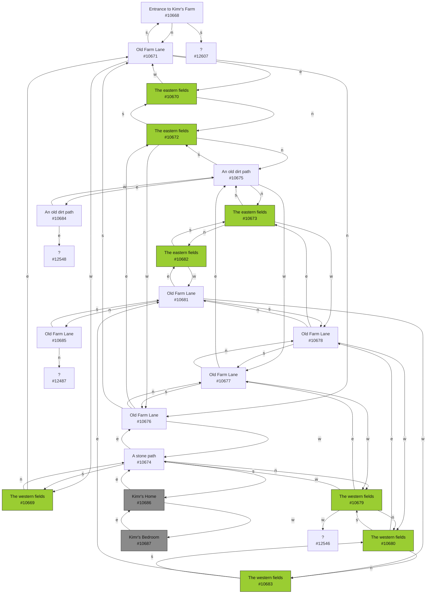

# Kimr's Farm

20 rooms. Solid = direction; dotted = special exit.

```mermaid
flowchart TD
  r10668["Entrance to Kimr's Farm<br/>#10668"]
  r10669["The western fields<br/>#10669"]
  r10670["The eastern fields<br/>#10670"]
  r10671["Old Farm Lane<br/>#10671"]
  r10672["The eastern fields<br/>#10672"]
  r10673["The eastern fields<br/>#10673"]
  r10674["A stone path<br/>#10674"]
  r10675["An old dirt path<br/>#10675"]
  r10676["Old Farm Lane<br/>#10676"]
  r10677["Old Farm Lane<br/>#10677"]
  r10678["Old Farm Lane<br/>#10678"]
  r10679["The western fields<br/>#10679"]
  r10680["The western fields<br/>#10680"]
  r10681["Old Farm Lane<br/>#10681"]
  r10682["The eastern fields<br/>#10682"]
  r10683["The western fields<br/>#10683"]
  r10684["An old dirt path<br/>#10684"]
  r10685["Old Farm Lane<br/>#10685"]
  r10686["Kimr's Home<br/>#10686"]
  r10687["Kimr's Bedroom<br/>#10687"]
  r10668 -->|n| r10671
  r12607["?<br/>#12607"]
  r10668 -->|s| r12607
  r10669 -->|e| r10671
  r10669 -->|n| r10674
  r10670 -->|n| r10672
  r10670 -->|w| r10671
  r10671 -->|e| r10670
  r10671 -->|n| r10676
  r10671 -->|s| r10668
  r10671 -->|w| r10669
  r10672 -->|n| r10675
  r10672 -->|s| r10670
  r10672 -->|w| r10676
  r10673 -->|n| r10682
  r10673 -->|s| r10675
  r10673 -->|w| r10678
  r10674 -->|e| r10676
  r10674 -->|n| r10679
  r10674 -->|s| r10669
  r10674 -->|w| r10686
  r10675 -->|e| r10684
  r10675 -->|n| r10673
  r10675 -->|s| r10672
  r10675 -->|w| r10677
  r10676 -->|e| r10672
  r10676 -->|n| r10677
  r10676 -->|s| r10671
  r10676 -->|w| r10674
  r10677 -->|e| r10675
  r10677 -->|n| r10678
  r10677 -->|s| r10676
  r10677 -->|w| r10679
  r10678 -->|e| r10673
  r10678 -->|n| r10681
  r10678 -->|s| r10677
  r10678 -->|w| r10680
  r10679 -->|e| r10677
  r10679 -->|n| r10680
  r10679 -->|s| r10674
  r12546["?<br/>#12546"]
  r10679 -->|w| r12546
  r10680 -->|e| r10678
  r10680 -->|n| r10683
  r10680 -->|s| r10679
  r10681 -->|e| r10682
  r10681 -->|n| r10685
  r10681 -->|s| r10678
  r10681 -->|w| r10683
  r10682 -->|s| r10673
  r10682 -->|w| r10681
  r10683 -->|e| r10681
  r10683 -->|s| r10680
  r12548["?<br/>#12548"]
  r10684 -->|e| r12548
  r10684 -->|w| r10675
  r12487["?<br/>#12487"]
  r10685 -->|n| r12487
  r10685 -->|s| r10681
  r10686 -->|e| r10674
  r10686 -->|w| r10687
  r10687 -->|e| r10686
  classDef t_field fill:#9acd32,color:#111,stroke:#222
  class r10669 t_field
  class r10670 t_field
  class r10672 t_field
  class r10673 t_field
  class r10679 t_field
  class r10680 t_field
  class r10682 t_field
  class r10683 t_field
  classDef t_inside fill:#8a8a8a,color:#111,stroke:#222
  class r10686 t_inside
  class r10687 t_inside
```
