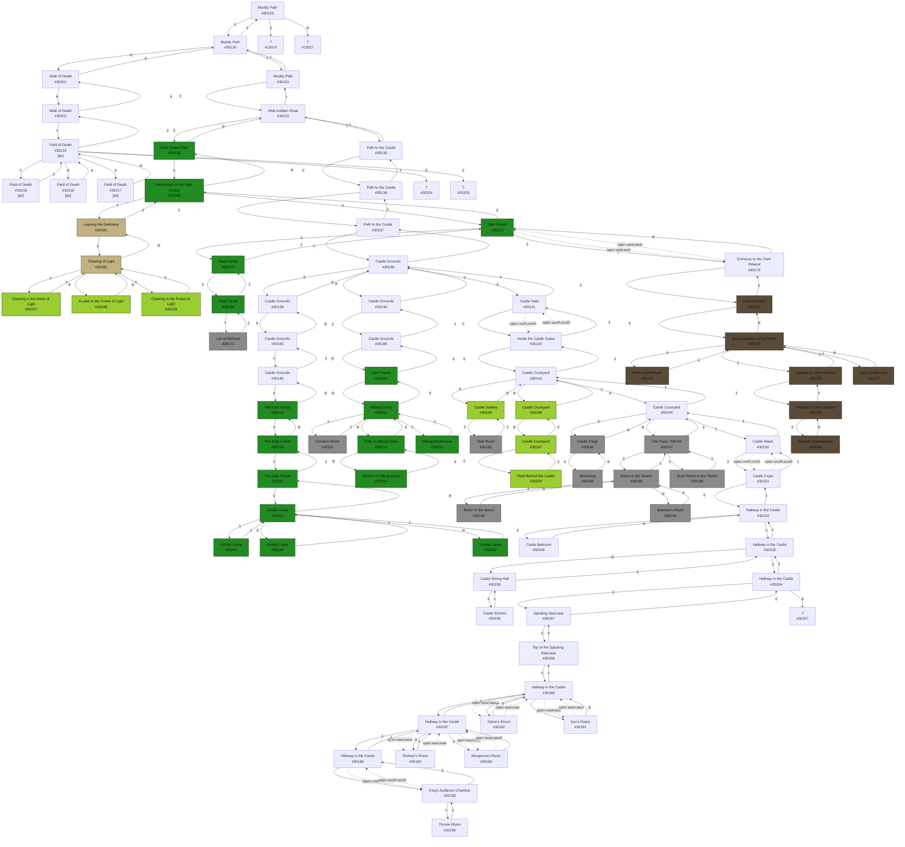

# Kingdom of Ahner

86 rooms. Solid = direction; dotted = special exit.

```mermaid
flowchart TD
  r30129["Muddy Path<br/>#30129"]
  r30130["Muddy Path<br/>#30130"]
  r30131["Muddy Path<br/>#30131"]
  r30201["Walk of Death<br/>#30201"]
  r30202["Walk of Death<br/>#30202"]
  r30215["Field of Death<br/>#30215<br/>[pk]"]
  r30218["Field of Death<br/>#30218<br/>[pk]"]
  r30216["Field of Death<br/>#30216<br/>[pk]"]
  r30217["Field of Death<br/>#30217<br/>[pk]"]
  r30132["Well-trodden Road<br/>#30132"]
  r30133["Dark Forest Path<br/>#30133"]
  r30169["Intersection in the Dark Forest<br/>#30169"]
  r30181["Leaving the Darkness<br/>#30181"]
  r30182["Clearing of Light<br/>#30182"]
  r30227["Clearing in the forest of Light<br/>#30227"]
  r30228["A Lake in the Forest of Light<br/>#30228"]
  r30226["Clearing in the Forest of Light<br/>#30226"]
  r30173["Dark Forest<br/>#30173"]
  r30134["Dark Forest<br/>#30134"]
  r30171["Lair of Mel'issa<br/>#30171"]
  r30135["Path to the Castle<br/>#30135"]
  r30136["Path to the Castle<br/>#30136"]
  r30137["Path to the Castle<br/>#30137"]
  r30138["Castle Grounds<br/>#30138"]
  r30139["Castle Grounds<br/>#30139"]
  r30183["Castle Grounds<br/>#30183"]
  r30184["Castle Grounds<br/>#30184"]
  r30219["The Dark Forest<br/>#30219"]
  r30220["The Dark Forest<br/>#30220"]
  r30221["The Dark Forest<br/>#30221"]
  r30222["Gorlab Camp<br/>#30222"]
  r30224["Gorlab Camp<br/>#30224"]
  r30225["Gorlab Camp<br/>#30225"]
  r30223["Gorlab Camp<br/>#30223"]
  r30140["Castle Grounds<br/>#30140"]
  r30185["Castle Grounds<br/>#30185"]
  r30209["Dark Forest<br/>#30209"]
  r30210["Nilbog Camp<br/>#30210"]
  r30211["Correa's Room<br/>#30211"]
  r30213["Path in Nilbog Camp<br/>#30213"]
  r30214["Kitchen in Nilbog Camp<br/>#30214"]
  r30212["Nilbog Bunkhouse<br/>#30212"]
  r30141["Castle Gate<br/>#30141"]
  r30142["Inside the Castle Gates<br/>#30142"]
  r30143["Castle Courtyard<br/>#30143"]
  r30164["Castle Stables<br/>#30164"]
  r30165["Tack Room<br/>#30165"]
  r30196["Castle Courtyard<br/>#30196"]
  r30197["Castle Courtyard<br/>#30197"]
  r30200["Field Behind the Castle<br/>#30200"]
  r30144["Castle Courtyard<br/>#30144"]
  r30145["Castle Forge<br/>#30145"]
  r30146["Workshop<br/>#30146"]
  r30147["The Tricky Troll Inn<br/>#30147"]
  r30148["Room in the Tavern<br/>#30148"]
  r30195["Room in the tavern<br/>#30195"]
  r30194["Belemer's Room<br/>#30194"]
  r30149["Quiet Room in the Tavern<br/>#30149"]
  r30150["Castle Steps<br/>#30150"]
  r30151["Castle Foyer<br/>#30151"]
  r30152["Hallway in the Castle<br/>#30152"]
  r30206["Castle Ballroom<br/>#30206"]
  r30153["Hallway in the Castle<br/>#30153"]
  r30155["Castle Dining Hall<br/>#30155"]
  r30156["Castle Kitchen<br/>#30156"]
  r30167["Spiraling Staircase<br/>#30167"]
  r30168["Top of the Spiraling Staircase<br/>#30168"]
  r30186["Hallway in the Castle<br/>#30186"]
  r30187["Hallway in the Castle<br/>#30187"]
  r30188["Hallway in the Castle<br/>#30188"]
  r30198["King's Audience Chamber<br/>#30198"]
  r30199["Throne Room<br/>#30199"]
  r30190["Rodney's Room<br/>#30190"]
  r30189["Morganna's Room<br/>#30189"]
  r30192["Glenn's Room<br/>#30192"]
  r30191["Kyu's Room<br/>#30191"]
  r30154["Hallway in the Castle<br/>#30154"]
  r30172["Entrance to the Oreh Hideout<br/>#30172"]
  r30170["Dark Forest<br/>#30170"]
  r30174["Lookout Point<br/>#30174"]
  r30175["Secret Hideout of the Orehs<br/>#30175"]
  r30176["Oreh's Bunkhouse<br/>#30176"]
  r30178["Hallway in Oreh Hideout<br/>#30178"]
  r30179["Hallway in Oreh Hideout<br/>#30179"]
  r30180["Tactical Headquarters<br/>#30180"]
  r30177["Oreh Cookhouse<br/>#30177"]
  r13019["?<br/>#13019"]
  r30129 -->|e| r13019
  r30129 -->|n| r30130
  r13017["?<br/>#13017"]
  r30129 -->|w| r13017
  r30130 -->|n| r30131
  r30130 -->|s| r30129
  r30130 -->|w| r30201
  r30131 -->|n| r30132
  r30131 -->|s| r30130
  r30201 -->|e| r30130
  r30201 -->|w| r30202
  r30202 -->|e| r30201
  r30202 -->|n| r30215
  r30204["?<br/>#30204"]
  r30215 -->|d| r30204
  r30215 -->|e| r30217
  r30215 -->|n| r30218
  r30215 -->|s| r30202
  r30203["?<br/>#30203"]
  r30215 -->|u| r30203
  r30215 -->|w| r30216
  r30218 -->|s| r30215
  r30216 -->|e| r30215
  r30217 -->|w| r30215
  r30132 -->|e| r30133
  r30132 -->|n| r30135
  r30132 -->|s| r30131
  r30133 -->|e| r30169
  r30133 -->|w| r30132
  r30169 -->|n| r30170
  r30169 -->|s| r30181
  r30169 -->|w| r30133
  r30181 -->|e| r30182
  r30181 -->|n| r30169
  r30182 -->|e| r30228
  r30182 -->|n| r30226
  r30182 -->|s| r30227
  r30182 -->|w| r30181
  r30227 -->|n| r30182
  r30228 -->|w| r30182
  r30226 -->|s| r30182
  r30173 -->|n| r30134
  r30173 -->|s| r30170
  r30134 -->|n| r30171
  r30134 -->|s| r30173
  r30171 -->|s| r30134
  r30135 -->|n| r30136
  r30135 -->|s| r30132
  r30136 -->|n| r30137
  r30136 -->|s| r30135
  r30137 -->|n| r30138
  r30137 -->|s| r30136
  r30138 -->|e| r30139
  r30138 -->|n| r30141
  r30138 -->|s| r30137
  r30138 -->|w| r30140
  r30139 -->|e| r30183
  r30139 -->|w| r30138
  r30183 -->|n| r30184
  r30183 -->|w| r30139
  r30184 -->|e| r30219
  r30184 -->|s| r30183
  r30219 -->|e| r30220
  r30219 -->|w| r30184
  r30220 -->|n| r30221
  r30220 -->|w| r30219
  r30221 -->|e| r30222
  r30221 -->|s| r30220
  r30222 -->|e| r30225
  r30222 -->|n| r30223
  r30222 -->|s| r30224
  r30222 -->|w| r30221
  r30224 -->|n| r30222
  r30225 -->|w| r30222
  r30223 -->|s| r30222
  r30140 -->|e| r30138
  r30140 -->|n| r30185
  r30185 -->|s| r30140
  r30185 -->|w| r30209
  r30209 -->|e| r30185
  r30209 -->|w| r30210
  r30210 -->|e| r30209
  r30210 -->|n| r30211
  r30210 -->|s| r30212
  r30210 -->|w| r30213
  r30211 -->|s| r30210
  r30213 -->|e| r30210
  r30213 -->|w| r30214
  r30214 -->|e| r30213
  r30212 -->|n| r30210
  r30141 -->|n| r30142
  r30141 -.->|open north;north| r30142
  r30141 -->|s| r30138
  r30142 -->|n| r30143
  r30142 -.->|open south;south| r30141
  r30142 -->|s| r30141
  r30143 -->|e| r30164
  r30143 -->|n| r30144
  r30143 -->|s| r30142
  r30143 -->|w| r30196
  r30164 -->|n| r30165
  r30164 -->|w| r30143
  r30165 -->|s| r30164
  r30196 -->|e| r30143
  r30196 -->|w| r30197
  r30197 -->|e| r30196
  r30197 -->|n| r30200
  r30200 -->|s| r30197
  r30144 -->|e| r30145
  r30144 -->|n| r30150
  r30144 -->|s| r30143
  r30144 -->|w| r30147
  r30145 -->|e| r30146
  r30145 -->|w| r30144
  r30146 -->|w| r30145
  r30147 -->|e| r30144
  r30147 -->|n| r30148
  r30147 -->|s| r30149
  r30148 -->|e| r30195
  r30148 -->|s| r30147
  r30148 -->|w| r30194
  r30195 -->|w| r30148
  r30194 -->|e| r30148
  r30149 -->|n| r30147
  r30150 -->|n| r30151
  r30150 -.->|open north;north| r30151
  r30150 -->|s| r30144
  r30151 -->|n| r30152
  r30151 -.->|open south;south| r30150
  r30151 -->|s| r30150
  r30152 -->|e| r30206
  r30152 -->|n| r30153
  r30152 -->|s| r30151
  r30206 -->|w| r30152
  r30153 -->|n| r30154
  r30153 -->|s| r30152
  r30153 -->|w| r30155
  r30155 -->|e| r30153
  r30155 -->|s| r30156
  r30156 -->|n| r30155
  r30167 -->|d| r30154
  r30167 -->|u| r30168
  r30168 -->|d| r30167
  r30168 -->|n| r30186
  r30186 -->|e| r30191
  r30186 -->|n| r30187
  r30186 -.->|open east;east| r30191
  r30186 -.->|open west;west| r30192
  r30186 -->|s| r30168
  r30186 -->|w| r30192
  r30187 -->|e| r30189
  r30187 -->|n| r30188
  r30187 -.->|open east;east| r30189
  r30187 -.->|open west;west| r30190
  r30187 -->|s| r30186
  r30187 -->|w| r30190
  r30188 -->|n| r30198
  r30188 -.->|open north;north| r30198
  r30188 -->|s| r30187
  r30198 -->|n| r30199
  r30198 -.->|open south;south| r30188
  r30198 -->|s| r30188
  r30199 -->|s| r30198
  r30190 -->|e| r30187
  r30190 -.->|open east;east| r30187
  r30189 -.->|open west;west| r30187
  r30189 -->|w| r30187
  r30192 -->|e| r30186
  r30192 -.->|open east;east| r30186
  r30191 -.->|open west;west| r30186
  r30191 -->|w| r30186
  r30157["?<br/>#30157"]
  r30154 -->|d| r30157
  r30154 -->|s| r30153
  r30154 -->|u| r30167
  r30172 -.->|open west;west| r30170
  r30172 -->|u| r30174
  r30172 -->|w| r30170
  r30170 -->|e| r30172
  r30170 -->|n| r30173
  r30170 -.->|open east;east| r30172
  r30170 -->|s| r30169
  r30174 -->|d| r30172
  r30174 -->|e| r30175
  r30175 -->|e| r30177
  r30175 -->|n| r30176
  r30175 -->|s| r30178
  r30175 -->|w| r30174
  r30176 -->|s| r30175
  r30178 -->|n| r30175
  r30178 -->|s| r30179
  r30179 -->|e| r30180
  r30179 -->|n| r30178
  r30180 -->|w| r30179
  r30177 -->|w| r30175
  classDef t_forest fill:#228b22,color:#111,stroke:#222
  class r30133 t_forest
  class r30169 t_forest
  classDef t_hills fill:#c2b280,color:#111,stroke:#222
  class r30181 t_hills
  class r30182 t_hills
  classDef t_field fill:#9acd32,color:#111,stroke:#222
  class r30227 t_field
  class r30228 t_field
  class r30226 t_field
  class r30173 t_forest
  class r30134 t_forest
  classDef t_inside fill:#8a8a8a,color:#111,stroke:#222
  class r30171 t_inside
  class r30219 t_forest
  class r30220 t_forest
  class r30221 t_forest
  class r30222 t_forest
  class r30224 t_forest
  class r30225 t_forest
  class r30223 t_forest
  class r30209 t_forest
  class r30210 t_forest
  class r30211 t_inside
  class r30213 t_forest
  class r30214 t_forest
  class r30212 t_forest
  class r30164 t_field
  class r30165 t_inside
  class r30196 t_field
  class r30197 t_field
  class r30200 t_field
  class r30145 t_inside
  class r30146 t_inside
  class r30147 t_inside
  class r30148 t_inside
  class r30195 t_inside
  class r30194 t_inside
  class r30149 t_inside
  class r30170 t_forest
  classDef t_cave fill:#5a4a3a,color:#111,stroke:#222
  class r30174 t_cave
  class r30175 t_cave
  class r30176 t_cave
  class r30178 t_cave
  class r30179 t_cave
  class r30180 t_cave
  class r30177 t_cave
```
