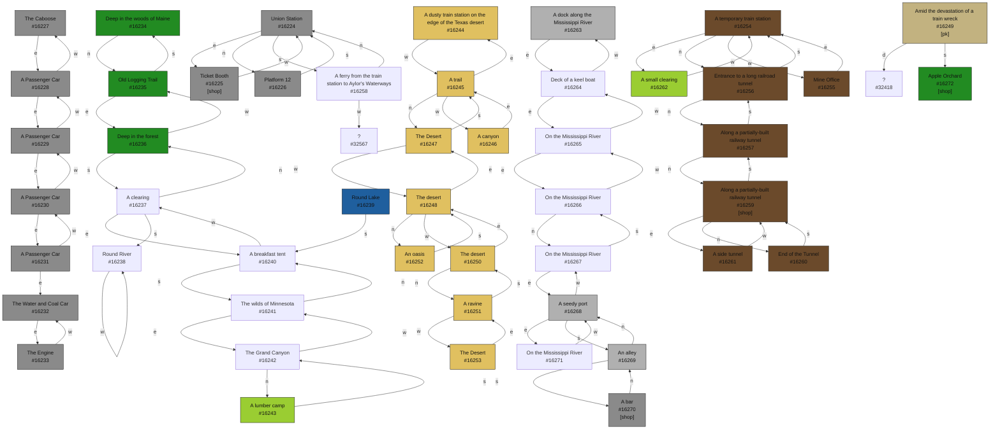

# Land of Legend

49 rooms. Solid = direction; dotted = special exit.

```mermaid
flowchart TD
  r16224["Union Station<br/>#16224"]
  r16225["Ticket Booth<br/>#16225<br/>[shop]"]
  r16226["Platform 12<br/>#16226"]
  r16227["The Caboose<br/>#16227"]
  r16228["A Passenger Car<br/>#16228"]
  r16229["A Passenger Car<br/>#16229"]
  r16230["A Passenger Car<br/>#16230"]
  r16231["A Passenger Car<br/>#16231"]
  r16232["The Water and Coal Car<br/>#16232"]
  r16233["The Engine<br/>#16233"]
  r16234["Deep in the woods of Maine<br/>#16234"]
  r16235["Old Logging Trail<br/>#16235"]
  r16236["Deep in the forest<br/>#16236"]
  r16237["A clearing<br/>#16237"]
  r16238["Round River<br/>#16238"]
  r16239["Round Lake<br/>#16239"]
  r16240["A breakfast tent<br/>#16240"]
  r16241["The wilds of Minnesota<br/>#16241"]
  r16242["The Grand Canyon<br/>#16242"]
  r16243["A lumber camp<br/>#16243"]
  r16244["A dusty train station on the edge of the Texas desert<br/>#16244"]
  r16245["A trail<br/>#16245"]
  r16246["A canyon<br/>#16246"]
  r16247["The Desert<br/>#16247"]
  r16248["The desert<br/>#16248"]
  r16249["Amid the devastation of a train wreck<br/>#16249<br/>[pk]"]
  r16250["The desert<br/>#16250"]
  r16251["A ravine<br/>#16251"]
  r16252["An oasis<br/>#16252"]
  r16253["The Desert<br/>#16253"]
  r16254["A temporary train station<br/>#16254"]
  r16255["Mine Office<br/>#16255"]
  r16256["Entrance to a long railroad tunnel<br/>#16256"]
  r16257["Along a partially-built railway tunnel<br/>#16257"]
  r16258["A ferry from the train station to Aylor's Waterways<br/>#16258"]
  r16259["Along a partially-built railway tunnel<br/>#16259<br/>[shop]"]
  r16260["End of the Tunnel<br/>#16260"]
  r16261["A side tunnel<br/>#16261"]
  r16262["A small clearing<br/>#16262"]
  r16263["A dock along the Mississippi River<br/>#16263"]
  r16264["Deck of a keel boat<br/>#16264"]
  r16265["On the Mississippi River<br/>#16265"]
  r16266["On the Mississippi River<br/>#16266"]
  r16267["On the Mississippi River<br/>#16267"]
  r16268["A seedy port<br/>#16268"]
  r16269["An alley<br/>#16269"]
  r16270["A bar<br/>#16270<br/>[shop]"]
  r16271["On the Mississippi River<br/>#16271"]
  r16272["Apple Orchard<br/>#16272<br/>[shop]"]
  r16224 -->|e| r16225
  r16224 -->|n| r16226
  r16224 -->|s| r16258
  r16225 -->|w| r16224
  r16226 -->|s| r16224
  r16227 -->|e| r16228
  r16228 -->|e| r16229
  r16228 -->|w| r16227
  r16229 -->|e| r16230
  r16229 -->|w| r16228
  r16230 -->|e| r16231
  r16230 -->|w| r16229
  r16231 -->|e| r16232
  r16231 -->|w| r16230
  r16232 -->|e| r16233
  r16233 -->|w| r16232
  r16234 -->|n| r16235
  r16235 -->|e| r16236
  r16235 -->|s| r16234
  r16236 -->|s| r16237
  r16236 -->|w| r16235
  r16237 -->|e| r16240
  r16237 -->|n| r16236
  r16237 -->|s| r16238
  r16238 -->|e| r16238
  r16238 -->|n| r16238
  r16238 -->|s| r16238
  r16238 -->|w| r16238
  r16239 -->|s| r16240
  r16240 -->|s| r16241
  r16240 -->|w| r16237
  r16241 -->|e| r16242
  r16241 -->|n| r16240
  r16242 -->|n| r16243
  r16242 -->|w| r16241
  r16243 -->|s| r16242
  r16244 -->|w| r16245
  r16245 -->|e| r16244
  r16245 -->|n| r16247
  r16245 -->|w| r16246
  r16246 -->|e| r16245
  r16247 -->|s| r16245
  r16247 -->|w| r16248
  r16248 -->|e| r16247
  r16248 -->|n| r16252
  r16248 -->|w| r16250
  r32418["?<br/>#32418"]
  r16249 -->|d| r32418
  r16249 -->|s| r16272
  r16250 -->|e| r16248
  r16250 -->|n| r16251
  r16251 -->|s| r16250
  r16251 -->|w| r16253
  r16252 -->|s| r16248
  r16253 -->|e| r16251
  r16254 -->|e| r16262
  r16254 -->|n| r16256
  r16254 -->|w| r16255
  r16255 -->|e| r16254
  r16256 -->|n| r16257
  r16256 -->|s| r16254
  r16257 -->|n| r16259
  r16257 -->|s| r16256
  r16258 -->|n| r16224
  r32567["?<br/>#32567"]
  r16258 -->|w| r32567
  r16259 -->|e| r16261
  r16259 -->|n| r16260
  r16259 -->|s| r16257
  r16260 -->|s| r16259
  r16261 -->|w| r16259
  r16262 -->|w| r16254
  r16263 -->|e| r16264
  r16264 -->|e| r16265
  r16264 -->|w| r16263
  r16265 -->|e| r16266
  r16265 -->|w| r16264
  r16266 -->|n| r16267
  r16266 -->|w| r16265
  r16267 -->|e| r16268
  r16267 -->|s| r16266
  r16268 -->|e| r16271
  r16268 -->|s| r16269
  r16268 -->|w| r16267
  r16269 -->|n| r16268
  r16269 -->|s| r16270
  r16270 -->|n| r16269
  r16271 -->|w| r16268
  classDef t_inside fill:#8a8a8a,color:#111,stroke:#222
  class r16224 t_inside
  class r16225 t_inside
  class r16226 t_inside
  class r16227 t_inside
  class r16228 t_inside
  class r16229 t_inside
  class r16230 t_inside
  class r16231 t_inside
  class r16232 t_inside
  class r16233 t_inside
  classDef t_forest fill:#228b22,color:#111,stroke:#222
  class r16234 t_forest
  class r16235 t_forest
  class r16236 t_forest
  classDef t_ocean fill:#1f5f9e,color:#111,stroke:#222
  class r16239 t_ocean
  classDef t_field fill:#9acd32,color:#111,stroke:#222
  class r16243 t_field
  classDef t_desert fill:#e0c060,color:#111,stroke:#222
  class r16244 t_desert
  class r16245 t_desert
  class r16246 t_desert
  class r16247 t_desert
  class r16248 t_desert
  classDef t_hills fill:#c2b280,color:#111,stroke:#222
  class r16249 t_hills
  class r16250 t_desert
  class r16251 t_desert
  class r16252 t_desert
  class r16253 t_desert
  classDef t_underground fill:#6b4a2b,color:#111,stroke:#222
  class r16254 t_underground
  class r16255 t_underground
  class r16256 t_underground
  class r16257 t_underground
  class r16259 t_underground
  class r16260 t_underground
  class r16261 t_underground
  class r16262 t_field
  classDef t_city fill:#b0b0b0,color:#111,stroke:#222
  class r16263 t_city
  class r16268 t_city
  class r16269 t_city
  class r16270 t_inside
  class r16272 t_forest
```
