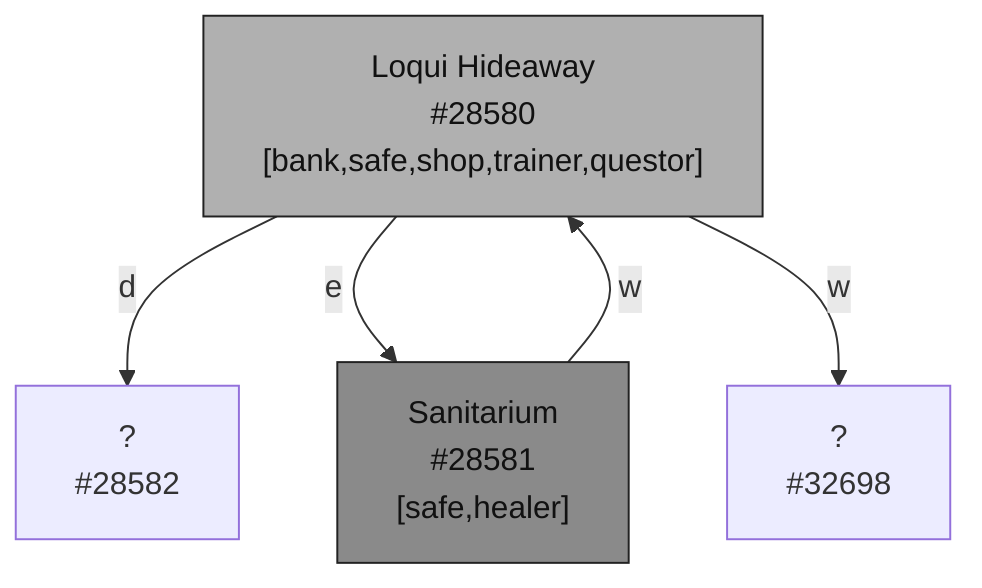

# Loqui Clan Area

2 rooms. Solid = direction; dotted = special exit.

```mermaid
flowchart TD
  r28580["Loqui Hideaway<br/>#28580<br/>[bank,safe,shop,trainer,questor]"]
  r28581["Sanitarium<br/>#28581<br/>[safe,healer]"]
  r28582["?<br/>#28582"]
  r28580 -->|d| r28582
  r28580 -->|e| r28581
  r32698["?<br/>#32698"]
  r28580 -->|w| r32698
  r28581 -->|w| r28580
  classDef t_city fill:#b0b0b0,color:#111,stroke:#222
  class r28580 t_city
  classDef t_inside fill:#8a8a8a,color:#111,stroke:#222
  class r28581 t_inside
```
