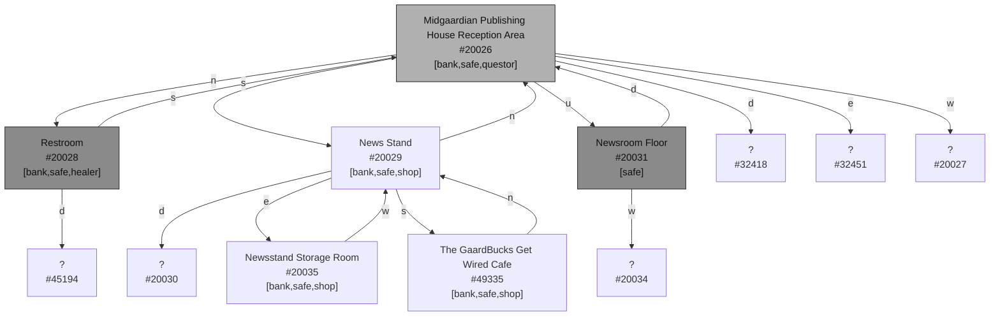

# Midgaardian Publishing House

6 rooms. Solid = direction; dotted = special exit.

```mermaid
flowchart TD
  r20026["Midgaardian Publishing House Reception Area<br/>#20026<br/>[bank,safe,questor]"]
  r20028["Restroom<br/>#20028<br/>[bank,safe,healer]"]
  r20029["News Stand<br/>#20029<br/>[bank,safe,shop]"]
  r20031["Newsroom Floor<br/>#20031<br/>[safe]"]
  r20035["Newsstand Storage Room<br/>#20035<br/>[bank,safe,shop]"]
  r49335["The GaardBucks Get Wired Cafe<br/>#49335<br/>[bank,safe,shop]"]
  r32418["?<br/>#32418"]
  r20026 -->|d| r32418
  r32451["?<br/>#32451"]
  r20026 -->|e| r32451
  r20026 -->|n| r20028
  r20026 -->|s| r20029
  r20026 -->|u| r20031
  r20027["?<br/>#20027"]
  r20026 -->|w| r20027
  r45194["?<br/>#45194"]
  r20028 -->|d| r45194
  r20028 -->|s| r20026
  r20030["?<br/>#20030"]
  r20029 -->|d| r20030
  r20029 -->|e| r20035
  r20029 -->|n| r20026
  r20029 -->|s| r49335
  r20031 -->|d| r20026
  r20034["?<br/>#20034"]
  r20031 -->|w| r20034
  r20035 -->|w| r20029
  r49335 -->|n| r20029
  classDef t_city fill:#b0b0b0,color:#111,stroke:#222
  class r20026 t_city
  classDef t_inside fill:#8a8a8a,color:#111,stroke:#222
  class r20028 t_inside
  class r20031 t_inside
```
