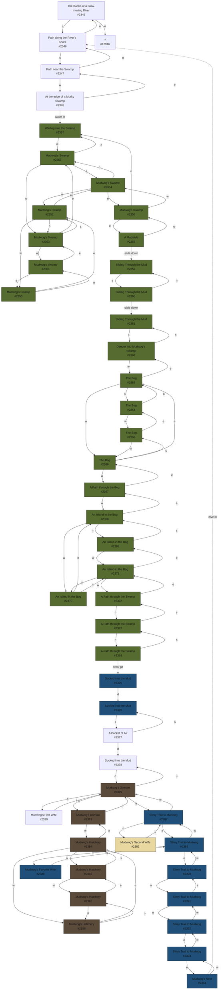

# Mudwog's Swamp

49 rooms. Solid = direction; dotted = special exit.

```mermaid
flowchart TD
  r2349["The Banks of a Slow-moving River<br/>#2349"]
  r2346["Path along the River's Shore<br/>#2346"]
  r2347["Path near the Swamp<br/>#2347"]
  r2348["At the edge of a Murky Swamp<br/>#2348"]
  r2357["Wading into the Swamp<br/>#2357"]
  r2355["Mudwog's Swamp<br/>#2355"]
  r2353["Mudwog's Swamp<br/>#2353"]
  r2351["Mudwog's Swamp<br/>#2351"]
  r2350["Mudwog's Swamp<br/>#2350"]
  r2352["Mudwog's Swamp<br/>#2352"]
  r2354["Mudwog's Swamp<br/>#2354"]
  r2356["Mudwog's Swamp<br/>#2356"]
  r2358["A Mudslide<br/>#2358"]
  r2359["Sliding Through the Mud<br/>#2359"]
  r2360["Sliding Through the Mud<br/>#2360"]
  r2361["Sliding Through the Mud<br/>#2361"]
  r2362["Deeper into Mudwog's Swamp<br/>#2362"]
  r2363["The Bog<br/>#2363"]
  r2364["The Bog<br/>#2364"]
  r2365["The Bog<br/>#2365"]
  r2366["The Bog<br/>#2366"]
  r2367["A Path through the Bog<br/>#2367"]
  r2368["An Island in the Bog<br/>#2368"]
  r2369["An Island in the Bog<br/>#2369"]
  r2371["An Island in the Bog<br/>#2371"]
  r2370["An Island in the Bog<br/>#2370"]
  r2372["A Path through the Swamp<br/>#2372"]
  r2373["A Path through the Swamp<br/>#2373"]
  r2374["A Path through the Swamp<br/>#2374"]
  r2375["Sucked into the Mud<br/>#2375"]
  r2376["Sucked into the Mud<br/>#2376"]
  r2377["A Pocket of Air<br/>#2377"]
  r2378["Sucked into the Mud<br/>#2378"]
  r2379["Mudwog's Domain<br/>#2379"]
  r2380["Mudwog's First Wife<br/>#2380"]
  r2381["Mudwog's Domain<br/>#2381"]
  r2384["Mudwog's Hatchery<br/>#2384"]
  r2386["Mudwog's Hatchery<br/>#2386"]
  r2385["Mudwog's Hatchery<br/>#2385"]
  r2383["Mudwog's Hatchery<br/>#2383"]
  r2387["Slimy Trail to Mudwog<br/>#2387"]
  r2382["Mudwog's Second Wife<br/>#2382"]
  r2388["Slimy Trail to Mudwog<br/>#2388"]
  r2389["Mudwog's Favorite Wife<br/>#2389"]
  r2390["Slimy Trail to Mudwog<br/>#2390"]
  r2391["Slimy Trail to Mudwog<br/>#2391"]
  r2392["Slimy Trail to Mudwog<br/>#2392"]
  r2393["Slimy Trail to Mudwog<br/>#2393"]
  r2394["Mudwog's Nest<br/>#2394"]
  r12916["?<br/>#12916"]
  r2349 -->|n| r12916
  r2349 -->|s| r2346
  r2346 -->|n| r2349
  r2346 -->|s| r2347
  r2347 -->|n| r2346
  r2347 -->|w| r2348
  r2348 -->|e| r2347
  r2348 -.->|wade in| r2357
  r2357 -->|w| r2355
  r2355 -->|e| r2357
  r2355 -->|s| r2354
  r2355 -->|w| r2353
  r2353 -->|e| r2355
  r2353 -->|s| r2352
  r2353 -->|w| r2351
  r2351 -->|e| r2353
  r2351 -->|s| r2350
  r2350 -->|e| r2352
  r2350 -->|n| r2351
  r2352 -->|e| r2354
  r2352 -->|n| r2353
  r2352 -->|w| r2350
  r2354 -->|e| r2356
  r2354 -->|n| r2355
  r2354 -->|w| r2352
  r2356 -->|e| r2358
  r2356 -->|n| r2357
  r2356 -->|w| r2354
  r2358 -.->|slide down| r2359
  r2358 -->|w| r2356
  r2359 -->|s| r2360
  r2360 -->|n| r2359
  r2360 -.->|slide down| r2361
  r2361 -->|s| r2362
  r2362 -->|n| r2361
  r2362 -->|w| r2363
  r2363 -->|e| r2362
  r2363 -->|s| r2364
  r2363 -->|w| r2366
  r2364 -->|n| r2363
  r2364 -->|w| r2365
  r2365 -->|e| r2364
  r2365 -->|n| r2366
  r2366 -->|e| r2363
  r2366 -->|s| r2365
  r2366 -->|w| r2367
  r2367 -->|e| r2366
  r2367 -->|w| r2368
  r2368 -->|e| r2367
  r2368 -->|n| r2369
  r2368 -->|w| r2370
  r2369 -->|s| r2368
  r2369 -->|w| r2371
  r2371 -->|e| r2369
  r2371 -->|s| r2370
  r2371 -->|w| r2372
  r2370 -->|e| r2368
  r2370 -->|n| r2371
  r2372 -->|e| r2371
  r2372 -->|n| r2373
  r2373 -->|n| r2374
  r2373 -->|s| r2372
  r2374 -.->|enter pit| r2375
  r2374 -->|s| r2373
  r2375 -->|d| r2376
  r2376 -->|s| r2377
  r2377 -->|d| r2378
  r2377 -->|n| r2376
  r2378 -->|d| r2379
  r2379 -->|e| r2387
  r2379 -->|n| r2380
  r2379 -->|s| r2381
  r2379 -->|u| r2378
  r2380 -->|s| r2379
  r2381 -->|n| r2379
  r2381 -->|w| r2384
  r2384 -->|e| r2381
  r2384 -->|n| r2383
  r2384 -->|w| r2386
  r2386 -->|e| r2384
  r2386 -->|n| r2385
  r2385 -->|e| r2383
  r2385 -->|s| r2386
  r2383 -->|s| r2384
  r2383 -->|w| r2385
  r2387 -->|e| r2388
  r2387 -->|n| r2382
  r2387 -->|w| r2379
  r2382 -->|s| r2387
  r2388 -->|e| r2390
  r2388 -->|n| r2389
  r2388 -->|w| r2387
  r2389 -->|s| r2388
  r2390 -->|n| r2391
  r2390 -->|w| r2388
  r2391 -->|e| r2392
  r2391 -->|s| r2390
  r2392 -->|e| r2393
  r2392 -->|w| r2391
  r2393 -->|e| r2394
  r2393 -->|w| r2392
  r2394 -.->|dive in| r2346
  r2394 -->|w| r2393
  classDef t_swamp fill:#556b2f,color:#111,stroke:#222
  class r2357 t_swamp
  class r2355 t_swamp
  class r2353 t_swamp
  class r2351 t_swamp
  class r2350 t_swamp
  class r2352 t_swamp
  class r2354 t_swamp
  class r2356 t_swamp
  class r2358 t_swamp
  class r2359 t_swamp
  class r2360 t_swamp
  class r2361 t_swamp
  class r2362 t_swamp
  class r2363 t_swamp
  class r2364 t_swamp
  class r2365 t_swamp
  class r2366 t_swamp
  class r2367 t_swamp
  class r2368 t_swamp
  class r2369 t_swamp
  class r2371 t_swamp
  class r2370 t_swamp
  class r2372 t_swamp
  class r2373 t_swamp
  class r2374 t_swamp
  classDef t_underwater fill:#20507a,color:#111,stroke:#222
  class r2375 t_underwater
  class r2376 t_underwater
  classDef t_cave fill:#5a4a3a,color:#111,stroke:#222
  class r2379 t_cave
  class r2381 t_cave
  class r2384 t_cave
  class r2386 t_cave
  class r2385 t_cave
  class r2383 t_cave
  class r2387 t_underwater
  classDef t_beach fill:#e8d8a0,color:#111,stroke:#222
  class r2382 t_beach
  class r2388 t_underwater
  class r2389 t_underwater
  class r2390 t_underwater
  class r2391 t_underwater
  class r2392 t_underwater
  class r2393 t_underwater
  class r2394 t_underwater
```
