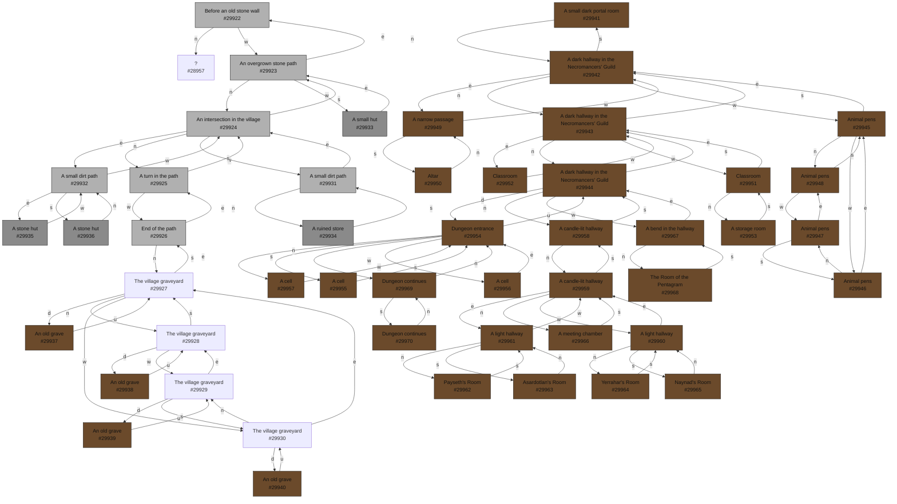

# Necromancers' Guild

49 rooms. Solid = direction; dotted = special exit.

```mermaid
flowchart TD
  r29922["Before an old stone wall<br/>#29922"]
  r29923["An overgrown stone path<br/>#29923"]
  r29933["A small hut<br/>#29933"]
  r29924["An intersection in the village<br/>#29924"]
  r29932["A small dirt path<br/>#29932"]
  r29931["A small dirt path<br/>#29931"]
  r29934["A ruined store<br/>#29934"]
  r29925["A turn in the path<br/>#29925"]
  r29926["End of the path<br/>#29926"]
  r29927["The village graveyard<br/>#29927"]
  r29928["The village graveyard<br/>#29928"]
  r29929["The village graveyard<br/>#29929"]
  r29930["The village graveyard<br/>#29930"]
  r29935["A stone hut<br/>#29935"]
  r29936["A stone hut<br/>#29936"]
  r29939["An old grave<br/>#29939"]
  r29940["An old grave<br/>#29940"]
  r29937["An old grave<br/>#29937"]
  r29938["An old grave<br/>#29938"]
  r29941["A small dark portal room<br/>#29941"]
  r29942["A dark hallway in the Necromancers' Guild<br/>#29942"]
  r29949["A narrow passage<br/>#29949"]
  r29950["Altar<br/>#29950"]
  r29945["Animal pens<br/>#29945"]
  r29946["Animal pens<br/>#29946"]
  r29947["Animal pens<br/>#29947"]
  r29948["Animal pens<br/>#29948"]
  r29943["A dark hallway in the Necromancers' Guild<br/>#29943"]
  r29952["Classroom<br/>#29952"]
  r29951["Classroom<br/>#29951"]
  r29953["A storage room<br/>#29953"]
  r29944["A dark hallway in the Necromancers' Guild<br/>#29944"]
  r29967["A bend in the hallway<br/>#29967"]
  r29968["The Room of the Pentagram<br/>#29968"]
  r29958["A candle-lit hallway<br/>#29958"]
  r29959["A candle-lit hallway<br/>#29959"]
  r29961["A light hallway<br/>#29961"]
  r29960["A light hallway<br/>#29960"]
  r29965["Naynad's Room<br/>#29965"]
  r29964["Yerrahar's Room<br/>#29964"]
  r29963["Asardotlan's Room<br/>#29963"]
  r29962["Payseth's Room<br/>#29962"]
  r29966["A meeting chamber<br/>#29966"]
  r29954["Dungeon entrance<br/>#29954"]
  r29955["A cell<br/>#29955"]
  r29957["A cell<br/>#29957"]
  r29969["Dungeon continues<br/>#29969"]
  r29956["A cell<br/>#29956"]
  r29970["Dungeon continues<br/>#29970"]
  r28957["?<br/>#28957"]
  r29922 -->|n| r28957
  r29922 -->|w| r29923
  r29923 -->|e| r29922
  r29923 -->|n| r29924
  r29923 -->|w| r29933
  r29933 -->|e| r29923
  r29924 -->|e| r29932
  r29924 -->|n| r29925
  r29924 -->|s| r29923
  r29924 -->|w| r29931
  r29932 -->|e| r29935
  r29932 -->|s| r29936
  r29932 -->|w| r29924
  r29931 -->|e| r29924
  r29931 -->|n| r29934
  r29934 -->|s| r29931
  r29925 -->|s| r29924
  r29925 -->|w| r29926
  r29926 -->|e| r29925
  r29926 -->|n| r29927
  r29927 -->|d| r29937
  r29927 -->|n| r29928
  r29927 -->|s| r29926
  r29927 -->|w| r29930
  r29928 -->|d| r29938
  r29928 -->|s| r29927
  r29928 -->|w| r29929
  r29929 -->|d| r29939
  r29929 -->|e| r29928
  r29929 -->|s| r29930
  r29930 -->|d| r29940
  r29930 -->|e| r29927
  r29930 -->|n| r29929
  r29935 -->|w| r29932
  r29936 -->|n| r29932
  r29939 -->|u| r29929
  r29940 -->|u| r29930
  r29937 -->|u| r29927
  r29938 -->|u| r29928
  r29941 -->|n| r29942
  r29942 -->|e| r29949
  r29942 -->|n| r29943
  r29942 -->|s| r29941
  r29942 -->|w| r29945
  r29949 -->|s| r29950
  r29949 -->|w| r29942
  r29950 -->|n| r29949
  r29945 -->|e| r29942
  r29945 -->|n| r29948
  r29945 -->|w| r29946
  r29946 -->|e| r29945
  r29946 -->|n| r29947
  r29947 -->|e| r29948
  r29947 -->|s| r29946
  r29948 -->|s| r29945
  r29948 -->|w| r29947
  r29943 -->|e| r29952
  r29943 -->|n| r29944
  r29943 -->|s| r29942
  r29943 -->|w| r29951
  r29952 -->|w| r29943
  r29951 -->|e| r29943
  r29951 -->|n| r29953
  r29953 -->|s| r29951
  r29944 -->|d| r29954
  r29944 -->|n| r29958
  r29944 -->|s| r29943
  r29944 -->|w| r29967
  r29967 -->|e| r29944
  r29967 -->|n| r29968
  r29968 -->|s| r29967
  r29958 -->|n| r29959
  r29958 -->|s| r29944
  r29959 -->|e| r29961
  r29959 -->|n| r29966
  r29959 -->|s| r29958
  r29959 -->|w| r29960
  r29961 -->|n| r29962
  r29961 -->|s| r29963
  r29961 -->|w| r29959
  r29960 -->|e| r29959
  r29960 -->|n| r29964
  r29960 -->|s| r29965
  r29965 -->|n| r29960
  r29964 -->|s| r29960
  r29963 -->|n| r29961
  r29962 -->|s| r29961
  r29966 -->|s| r29959
  r29954 -->|e| r29957
  r29954 -->|n| r29955
  r29954 -->|s| r29969
  r29954 -->|u| r29944
  r29954 -->|w| r29956
  r29955 -->|s| r29954
  r29957 -->|w| r29954
  r29969 -->|n| r29954
  r29969 -->|s| r29970
  r29956 -->|e| r29954
  r29970 -->|n| r29969
  classDef t_city fill:#b0b0b0,color:#111,stroke:#222
  class r29922 t_city
  class r29923 t_city
  classDef t_inside fill:#8a8a8a,color:#111,stroke:#222
  class r29933 t_inside
  class r29924 t_city
  class r29932 t_city
  class r29931 t_city
  class r29934 t_inside
  class r29925 t_city
  class r29926 t_city
  class r29935 t_inside
  class r29936 t_inside
  classDef t_underground fill:#6b4a2b,color:#111,stroke:#222
  class r29939 t_underground
  class r29940 t_underground
  class r29937 t_underground
  class r29938 t_underground
  class r29941 t_underground
  class r29942 t_underground
  class r29949 t_underground
  class r29950 t_underground
  class r29945 t_underground
  class r29946 t_underground
  class r29947 t_underground
  class r29948 t_underground
  class r29943 t_underground
  class r29952 t_underground
  class r29951 t_underground
  class r29953 t_underground
  class r29944 t_underground
  class r29967 t_underground
  class r29968 t_underground
  class r29958 t_underground
  class r29959 t_underground
  class r29961 t_underground
  class r29960 t_underground
  class r29965 t_underground
  class r29964 t_underground
  class r29963 t_underground
  class r29962 t_underground
  class r29966 t_underground
  class r29954 t_underground
  class r29955 t_underground
  class r29957 t_underground
  class r29969 t_underground
  class r29956 t_underground
  class r29970 t_underground
```
