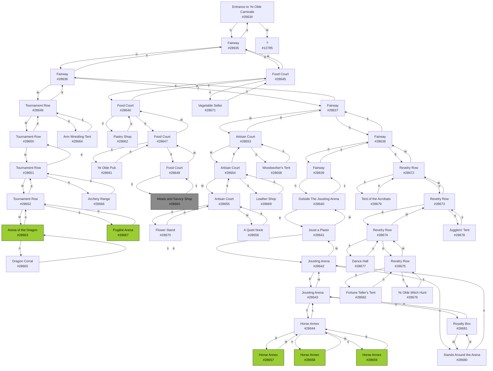

# Olde Worlde Carnivale

49 rooms. Solid = direction; dotted = special exit.

```mermaid
flowchart TD
  r28634["Entrance to Ye Olde Carnivale<br/>#28634"]
  r28635["Fairway<br/>#28635"]
  r28636["Fairway<br/>#28636"]
  r28649["Tournament Row<br/>#28649"]
  r28650["Tournament Row<br/>#28650"]
  r28651["Tournament Row<br/>#28651"]
  r28652["Tournament Row<br/>#28652"]
  r28663["Arena of the Dragon<br/>#28663"]
  r28665["Dragon Corral<br/>#28665"]
  r28667["Pugilist Arena<br/>#28667"]
  r28666["Archery Range<br/>#28666"]
  r28664["Arm Wrestling Tent<br/>#28664"]
  r28637["Fairway<br/>#28637"]
  r28645["Food Court<br/>#28645"]
  r28671["Vegetable Seller<br/>#28671"]
  r28646["Food Court<br/>#28646"]
  r28662["Pastry Shop<br/>#28662"]
  r28647["Food Court<br/>#28647"]
  r28661["Ye Olde Pub<br/>#28661"]
  r28648["Food Court<br/>#28648"]
  r28660["Meats and Savory Shop<br/>#28660"]
  r28653["Artisan Court<br/>#28653"]
  r28654["Artisan Court<br/>#28654"]
  r28655["Artisan Court<br/>#28655"]
  r28669["Leather Shop<br/>#28669"]
  r28670["Flower Stand<br/>#28670"]
  r28656["A Quiet Nook<br/>#28656"]
  r28668["Woodworker's Tent<br/>#28668"]
  r28638["Fairway<br/>#28638"]
  r28672["Revelry Row<br/>#28672"]
  r28639["Fairway<br/>#28639"]
  r28640["Outside The Jousting Arena<br/>#28640"]
  r28641["Joust a Plaisir<br/>#28641"]
  r28642["Jousting Arena<br/>#28642"]
  r28643["Jousting Arena<br/>#28643"]
  r28644["Horse Annex<br/>#28644"]
  r28681["Royalty Box<br/>#28681"]
  r28680["Stands Around the Arena<br/>#28680"]
  r28679["Tent of the Acrobats<br/>#28679"]
  r28673["Revelry Row<br/>#28673"]
  r28674["Revelry Row<br/>#28674"]
  r28678["Jugglers' Tent<br/>#28678"]
  r28677["Dance Hall<br/>#28677"]
  r28675["Revelry Row<br/>#28675"]
  r28682["Fortune Teller's Tent<br/>#28682"]
  r28676["Ye Olde Witch Hunt<br/>#28676"]
  r28657["Horse Annex<br/>#28657"]
  r28659["Horse Annex<br/>#28659"]
  r28658["Horse Annex<br/>#28658"]
  r28634 -->|n| r28635
  r12785["?<br/>#12785"]
  r28634 -->|w| r12785
  r28635 -->|e| r28645
  r28635 -->|n| r28636
  r28635 -->|s| r28634
  r28636 -->|n| r28637
  r28636 -->|s| r28635
  r28636 -->|w| r28649
  r28649 -->|e| r28636
  r28649 -->|n| r28664
  r28649 -->|w| r28650
  r28650 -->|e| r28649
  r28650 -->|w| r28651
  r28651 -->|e| r28650
  r28651 -->|n| r28666
  r28651 -->|w| r28652
  r28652 -->|e| r28651
  r28652 -->|s| r28667
  r28652 -->|w| r28663
  r28663 -->|e| r28652
  r28663 -->|n| r28665
  r28665 -->|s| r28663
  r28667 -->|n| r28652
  r28666 -->|s| r28651
  r28664 -->|s| r28649
  r28637 -->|n| r28638
  r28637 -->|s| r28636
  r28637 -->|w| r28653
  r28645 -->|e| r28646
  r28645 -->|n| r28671
  r28645 -->|w| r28635
  r28671 -->|s| r28645
  r28646 -->|e| r28647
  r28646 -->|n| r28662
  r28646 -->|w| r28645
  r28662 -->|s| r28646
  r28647 -->|e| r28648
  r28647 -->|s| r28661
  r28647 -->|w| r28646
  r28661 -->|n| r28647
  r28648 -->|n| r28660
  r28648 -->|w| r28647
  r28660 -->|s| r28648
  r28653 -->|e| r28637
  r28653 -->|n| r28668
  r28653 -->|w| r28654
  r28654 -->|e| r28653
  r28654 -->|s| r28669
  r28654 -->|w| r28655
  r28655 -->|e| r28654
  r28655 -->|s| r28670
  r28655 -->|w| r28656
  r28669 -->|n| r28654
  r28670 -->|n| r28655
  r28656 -->|e| r28655
  r28668 -->|s| r28653
  r28638 -->|e| r28672
  r28638 -->|n| r28639
  r28638 -->|s| r28637
  r28672 -->|e| r28673
  r28672 -->|s| r28679
  r28672 -->|w| r28638
  r28639 -->|n| r28640
  r28639 -->|s| r28638
  r28640 -->|e| r28641
  r28640 -->|s| r28639
  r28641 -->|e| r28642
  r28641 -->|w| r28640
  r28642 -->|e| r28643
  r28642 -->|s| r28680
  r28642 -->|w| r28641
  r28643 -->|n| r28644
  r28643 -->|s| r28681
  r28643 -->|w| r28642
  r28644 -->|e| r28657
  r28644 -->|n| r28658
  r28644 -->|s| r28643
  r28644 -->|w| r28659
  r28681 -->|n| r28643
  r28681 -->|w| r28680
  r28680 -->|e| r28681
  r28680 -->|n| r28642
  r28679 -->|n| r28672
  r28673 -->|e| r28674
  r28673 -->|n| r28678
  r28673 -->|w| r28672
  r28674 -->|e| r28675
  r28674 -->|s| r28677
  r28674 -->|w| r28673
  r28678 -->|s| r28673
  r28677 -->|n| r28674
  r28675 -->|n| r28676
  r28675 -->|s| r28682
  r28675 -->|w| r28674
  r28682 -->|n| r28675
  r28676 -->|s| r28675
  r28657 -->|w| r28644
  r28659 -->|e| r28644
  r28658 -->|s| r28644
  classDef t_field fill:#9acd32,color:#111,stroke:#222
  class r28663 t_field
  class r28667 t_field
  classDef t_inside fill:#8a8a8a,color:#111,stroke:#222
  class r28660 t_inside
  class r28657 t_field
  class r28659 t_field
  class r28658 t_field
```
