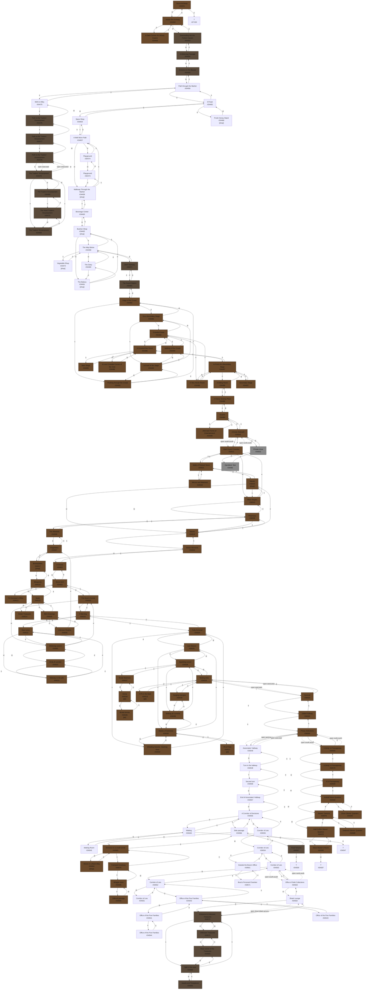

# Onyx Bazaar

131 rooms. Solid = direction; dotted = special exit.

```mermaid
flowchart TD
  r34451["Stone Archway<br/>#34451"]
  r34452["Inside the Archway<br/>#34452"]
  r34468["A Dank Corner of a Musty Cavern<br/>#34468"]
  r34453["Descending into the Forlorn Cavern<br/>#34453"]
  r34454["A Widening Passage<br/>#34454"]
  r34455["Entrance to the Bazaar<br/>#34455"]
  r34456["Path through the Market<br/>#34456"]
  r34475["Well Lit Alley<br/>#34475"]
  r34476["Path to the Traders' Encampment<br/>#34476"]
  r34477["Path to the Traders' Encampment<br/>#34477"]
  r34478["Path to the Traders' Encampment<br/>#34478"]
  r34479["The Traders' Encampment<br/>#34479"]
  r34469["The Traders' Encampment<br/>#34469"]
  r34470["The Head Trader's Encampment<br/>#34470"]
  r34480["The Traders' Encampment<br/>#34480"]
  r34465["A Feast<br/>#34465"]
  r34464["Spice Shop<br/>#34464"]
  r34457["A Well Worn Path<br/>#34457"]
  r34458["Walkway Through the Market<br/>#34458<br/>[shop]"]
  r34474["Playground<br/>#34474"]
  r34473["Playground<br/>#34473"]
  r34463["Beverage Center<br/>#34463"]
  r34466["Fresh Honey Stand<br/>#34466<br/>[shop]"]
  r34462["Butcher Shop<br/>#34462<br/>[shop]"]
  r34459["The Way Below<br/>#34459"]
  r34472["Vegetable Shop<br/>#34472<br/>[shop]"]
  r34460["The Dairy<br/>#34460"]
  r34461["The Bakery<br/>#34461<br/>[shop]"]
  r34471["Dark Stairway<br/>#34471"]
  r34481["The Guard Station<br/>#34481"]
  r34482["Edge of the Crowd<br/>#34482"]
  r34492["Pushing through the Crowd<br/>#34492"]
  r34493["In Front of the Stage<br/>#34493"]
  r34483["On a Secondary Stage<br/>#34483"]
  r34484["Crowded Seats<br/>#34484"]
  r34494["Splitting of the Crowd<br/>#34494"]
  r34485["A Crowded Bar Room<br/>#34485"]
  r34495["Main Stage<br/>#34495"]
  r34486["A Less Crowded Corner of the Club<br/>#34486"]
  r34497["In Front of a Secondary Stage<br/>#34497"]
  r34496["A Very Hectic Room<br/>#34496"]
  r34498["A Sitting Room<br/>#34498"]
  r34487["Secondary Stage<br/>#34487"]
  r34488["A Classy Seating Place<br/>#34488"]
  r34489["Guards<br/>#34489"]
  r34499["Alternate Forms of Entertainment<br/>#34499"]
  r34511["Dark Guard Chamber<br/>#34511"]
  r34510["Black Magiks<br/>#34510"]
  r34521["Walls of Painted Stone<br/>#34521"]
  r34518["Mirrors and Madness<br/>#34518"]
  r34520["Wandz<br/>#34520<br/>[shop]"]
  r34509["Pharmacy<br/>#34509"]
  r34519["Staves<br/>#34519"]
  r34504["Stolen Moments<br/>#34504"]
  r34503["A Choice<br/>#34503"]
  r34502["Stone Arch<br/>#34502"]
  r34512["Pit Overseer's Office<br/>#34512"]
  r34523["The Boss's Corner<br/>#34523"]
  r34533["A Warning<br/>#34533"]
  r34591["Widening cavern<br/>#34591"]
  r34522["Dimly lit corridor<br/>#34522"]
  r34531["Sideway to the pits<br/>#34531"]
  r34532["Open area<br/>#34532"]
  r34524["Fully Armored<br/>#34524"]
  r34525["Last Stance<br/>#34525"]
  r34535["Blades of Darkness<br/>#34535"]
  r34534["Whistling Swords, Clashing Axes<br/>#34534"]
  r34538["Shifting air currents<br/>#34538"]
  r34528["Sparkling corner<br/>#34528"]
  r34529["Testing area<br/>#34529"]
  r34539["Surging energies<br/>#34539"]
  r34537["Brutal Madness<br/>#34537"]
  r34526["Arena<br/>#34526<br/>[pk]"]
  r34536["Brutal Arenas<br/>#34536<br/>[pk]"]
  r34513["A Pit in the Dark<br/>#34513<br/>[pk]"]
  r34527["Pit of Fists<br/>#34527<br/>[pk]"]
  r34530["Survival<br/>#34530"]
  r34540["Gilded hallway<br/>#34540"]
  r34550["Pricey Selections<br/>#34550"]
  r34549["Associates' Hallway<br/>#34549"]
  r34548["Turn in the hallway<br/>#34548"]
  r34558["Second turn<br/>#34558"]
  r34557["End of Associates' Hallway<br/>#34557"]
  r34556["A Corridor of Decisions<br/>#34556"]
  r34546["Waiting<br/>#34546"]
  r34545["Waiting Room<br/>#34545"]
  r34566["Side passage<br/>#34566"]
  r34567["Final Tortures<br/>#34567"]
  r34565["Entrance to a small tunnel<br/>#34565"]
  r34564["Alcove in a Back Alley<br/>#34564<br/>[shop]"]
  r34575["Cramped crawlway<br/>#34575"]
  r34585["Wriggle room<br/>#34585"]
  r34584["Difficult passage<br/>#34584"]
  r34555["Corridor of Lies<br/>#34555"]
  r34554["Corridor of Lies<br/>#34554"]
  r34553["Corridor of Lies<br/>#34553"]
  r34552["Corridor of Lies<br/>#34552"]
  r34551["Corridor of Lies<br/>#34551"]
  r34542["Office of the Five Families<br/>#34542"]
  r34541["Office of the Five Families<br/>#34541"]
  r34544["Office of the Five Families<br/>#34544"]
  r34501["Private show<br/>#34501"]
  r34491["Gamblers' Den<br/>#34491"]
  r34500["A Dusty Stairwell<br/>#34500"]
  r34561["Outside the Boss's Office<br/>#34561"]
  r34508["The Alkaloids<br/>#34508"]
  r34507["Flagellates<br/>#34507"]
  r34517["Breastplates<br/>#34517<br/>[shop]"]
  r34516["Weaponry<br/>#34516"]
  r34515["Seals<br/>#34515"]
  r34514["Stolen Treasures<br/>#34514"]
  r34505["Illicit Drawings<br/>#34505"]
  r34506["Unknown Realms<br/>#34506"]
  r34571["Boss's Personal Chamber<br/>#34571"]
  r34560["A Dimly Lit Passageway<br/>#34560"]
  r34570["A Dimly Lit Passageway<br/>#34570"]
  r34569["A Lit Passageway<br/>#34569"]
  r34580["Kobold Slave Quarters<br/>#34580"]
  r34579["Slaves' Caverns<br/>#34579"]
  r34578["Half-Griffon Slaves' Quarters<br/>#34578"]
  r34588["Slave Master's Room<br/>#34588"]
  r34589["Dwarven Slaves' Quarters<br/>#34589"]
  r34590["Elven Slaves' Quarters<br/>#34590"]
  r34563["Office of Debt Collections<br/>#34563"]
  r34572["Entrance to Unknown Treasures<br/>#34572"]
  r34562["Shark Lounge<br/>#34562"]
  r34582["Split in the cave<br/>#34582"]
  r34573["Unknown Treasures<br/>#34573"]
  r34583["Rear corner of the Treasures<br/>#34583"]
  r34581["Jewels and Timepieces<br/>#34581"]
  r34543["Office of the Five Families<br/>#34543"]
  r27190["?<br/>#27190"]
  r34451 -->|u| r27190
  r34451 -->|w| r34452
  r34452 -->|d| r34453
  r34452 -->|e| r34451
  r34452 -->|n| r34468
  r34468 -->|s| r34452
  r34453 -->|u| r34452
  r34453 -->|w| r34454
  r34454 -->|e| r34453
  r34454 -->|w| r34455
  r34455 -->|e| r34454
  r34455 -->|w| r34456
  r34456 -->|e| r34455
  r34456 -->|n| r34465
  r34456 -->|s| r34475
  r34475 -->|e| r34476
  r34475 -->|n| r34456
  r34476 -->|s| r34477
  r34476 -->|w| r34475
  r34477 -->|e| r34478
  r34477 -->|n| r34476
  r34478 -->|e| r34479
  r34478 -.->|open east;east| r34479
  r34478 -->|w| r34477
  r34479 -->|e| r34480
  r34479 -->|n| r34469
  r34479 -.->|open west;west| r34478
  r34479 -->|w| r34478
  r34469 -->|e| r34470
  r34469 -->|s| r34479
  r34470 -->|s| r34480
  r34470 -->|w| r34469
  r34480 -->|n| r34470
  r34480 -->|w| r34479
  r34465 -->|e| r34466
  r34465 -->|s| r34456
  r34465 -->|w| r34464
  r34464 -->|e| r34465
  r34464 -->|s| r34457
  r34457 -->|n| r34464
  r34457 -->|s| r34474
  r34457 -->|w| r34458
  r34458 -->|e| r34457
  r34458 -->|n| r34463
  r34458 -->|s| r34473
  r34474 -->|n| r34457
  r34474 -->|w| r34473
  r34473 -->|e| r34474
  r34473 -->|n| r34458
  r34463 -->|s| r34458
  r34463 -->|w| r34462
  r34466 -->|w| r34465
  r34462 -->|e| r34463
  r34462 -->|s| r34459
  r34462 -->|w| r34461
  r34459 -->|d| r34471
  r34459 -->|n| r34462
  r34459 -->|s| r34472
  r34459 -->|w| r34460
  r34472 -->|n| r34459
  r34460 -->|e| r34459
  r34460 -->|n| r34461
  r34461 -->|e| r34462
  r34461 -->|s| r34460
  r34471 -->|d| r34481
  r34471 -->|u| r34459
  r34481 -->|e| r34482
  r34481 -->|u| r34471
  r34482 -->|e| r34483
  r34482 -->|s| r34492
  r34482 -->|w| r34481
  r34492 -->|e| r34493
  r34492 -->|n| r34482
  r34493 -->|e| r34494
  r34493 -->|n| r34483
  r34493 -->|w| r34492
  r34483 -->|e| r34484
  r34483 -->|s| r34493
  r34483 -->|w| r34482
  r34484 -->|e| r34485
  r34484 -->|n| r34496
  r34484 -->|s| r34494
  r34484 -->|w| r34483
  r34494 -->|n| r34484
  r34494 -->|w| r34493
  r34485 -->|e| r34486
  r34485 -->|n| r34497
  r34485 -->|s| r34495
  r34485 -->|w| r34484
  r34495 -->|n| r34485
  r34486 -->|w| r34485
  r34497 -->|e| r34498
  r34497 -->|n| r34487
  r34497 -->|s| r34485
  r34497 -->|w| r34496
  r34496 -->|e| r34497
  r34496 -->|s| r34484
  r34498 -->|n| r34488
  r34498 -->|w| r34497
  r34487 -->|s| r34497
  r34488 -->|e| r34489
  r34488 -->|s| r34498
  r34489 -->|d| r34500
  r34489 -->|s| r34499
  r34489 -->|w| r34488
  r34499 -->|n| r34489
  r34511 -->|n| r34500
  r34511 -.->|open north;north| r34500
  r34511 -->|s| r34521
  r34511 -->|w| r34510
  r34510 -->|e| r34511
  r34510 -->|s| r34520
  r34510 -->|w| r34509
  r34521 -->|n| r34511
  r34521 -->|s| r34518
  r34521 -->|w| r34520
  r34518 -->|n| r34521
  r34520 -->|e| r34521
  r34520 -->|n| r34510
  r34520 -->|w| r34519
  r34509 -->|e| r34510
  r34509 -->|s| r34519
  r34509 -->|w| r34508
  r34519 -->|e| r34520
  r34519 -->|n| r34509
  r34519 -->|s| r34504
  r34504 -->|n| r34519
  r34504 -->|w| r34503
  r34503 -->|e| r34504
  r34503 -->|w| r34502
  r34502 -->|d| r34523
  r34502 -->|e| r34503
  r34502 -->|s| r34512
  r34512 -->|n| r34502
  r34523 -->|s| r34533
  r34523 -->|u| r34502
  r34523 -->|w| r34591
  r34533 -->|n| r34523
  r34533 -->|s| r34524
  r34533 -->|w| r34532
  r34591 -->|e| r34523
  r34591 -->|s| r34532
  r34591 -->|w| r34522
  r34522 -->|e| r34591
  r34522 -->|s| r34531
  r34531 -->|e| r34532
  r34531 -->|n| r34522
  r34532 -->|e| r34533
  r34532 -->|n| r34591
  r34532 -->|w| r34531
  r34524 -->|e| r34525
  r34524 -->|n| r34533
  r34524 -->|s| r34534
  r34525 -->|e| r34528
  r34525 -->|s| r34535
  r34525 -->|w| r34524
  r34535 -->|d| r34527
  r34535 -->|e| r34538
  r34535 -->|n| r34525
  r34535 -->|w| r34534
  r34534 -->|e| r34535
  r34534 -->|n| r34524
  r34538 -->|e| r34539
  r34538 -->|n| r34528
  r34538 -->|w| r34535
  r34528 -->|e| r34529
  r34528 -->|n| r34537
  r34528 -->|s| r34538
  r34528 -->|w| r34525
  r34529 -->|d| r34513
  r34529 -->|e| r34530
  r34529 -.->|open east;east| r34530
  r34529 -->|s| r34539
  r34529 -->|w| r34528
  r34539 -->|n| r34529
  r34539 -->|w| r34538
  r34537 -->|d| r34526
  r34537 -->|s| r34528
  r34526 -->|s| r34536
  r34526 -->|u| r34537
  r34536 -->|n| r34526
  r34513 -->|u| r34529
  r34527 -->|u| r34535
  r34530 -.->|open west;west| r34529
  r34530 -->|s| r34540
  r34530 -->|w| r34529
  r34540 -->|n| r34530
  r34540 -->|s| r34550
  r34550 -->|n| r34540
  r34550 -.->|open south;south| r34560
  r34550 -.->|open west;west| r34549
  r34550 -->|s| r34560
  r34550 -->|w| r34549
  r34549 -->|e| r34550
  r34549 -.->|open east;east| r34550
  r34549 -->|w| r34548
  r34548 -->|e| r34549
  r34548 -->|s| r34558
  r34558 -->|n| r34548
  r34558 -->|w| r34557
  r34557 -->|e| r34558
  r34557 -->|w| r34556
  r34556 -->|e| r34557
  r34556 -->|n| r34546
  r34556 -->|s| r34566
  r34556 -->|w| r34555
  r34547["?<br/>#34547"]
  r34546 -->|e| r34547
  r34546 -->|s| r34556
  r34546 -->|w| r34545
  r34545 -->|e| r34546
  r34566 -->|e| r34567
  r34566 -->|n| r34556
  r34566 -->|w| r34565
  r34559["?<br/>#34559"]
  r34567 -->|d| r34559
  r34567 -->|w| r34566
  r34565 -->|e| r34566
  r34565 -->|s| r34575
  r34565 -->|w| r34564
  r34564 -->|e| r34565
  r34575 -->|e| r34585
  r34575 -->|n| r34565
  r34585 -->|e| r34584
  r34585 -->|w| r34575
  r34584 -->|w| r34585
  r34555 -->|e| r34556
  r34555 -->|w| r34554
  r34554 -->|e| r34555
  r34554 -->|n| r34561
  r34554 -->|w| r34553
  r34553 -->|e| r34554
  r34553 -.->|open south;south| r34563
  r34553 -->|s| r34563
  r34553 -->|w| r34552
  r34552 -->|e| r34553
  r34552 -->|n| r34542
  r34552 -->|w| r34551
  r34551 -->|e| r34552
  r34542 -->|n| r34543
  r34542 -->|s| r34552
  r34542 -->|w| r34541
  r34541 -->|e| r34542
  r34541 -->|n| r34544
  r34544 -->|s| r34541
  r34501 -->|n| r34491
  r34501 -->|w| r34500
  r34491 -->|s| r34501
  r34500 -->|e| r34501
  r34500 -.->|open south;south| r34511
  r34500 -->|s| r34511
  r34500 -->|u| r34489
  r34561 -->|n| r34571
  r34561 -->|s| r34554
  r34508 -->|e| r34509
  r34508 -->|w| r34507
  r34507 -->|e| r34508
  r34507 -->|s| r34517
  r34517 -->|n| r34507
  r34517 -->|w| r34516
  r34516 -->|e| r34517
  r34516 -->|w| r34515
  r34515 -->|e| r34516
  r34515 -->|n| r34505
  r34515 -->|w| r34514
  r34514 -->|e| r34515
  r34505 -->|e| r34506
  r34505 -->|s| r34515
  r34506 -->|e| r34507
  r34506 -->|w| r34505
  r34571 -->|s| r34561
  r34560 -->|n| r34550
  r34560 -.->|open north;north| r34550
  r34560 -->|s| r34570
  r34570 -->|n| r34560
  r34570 -->|w| r34569
  r34569 -->|e| r34570
  r34569 -->|w| r34580
  r34580 -->|e| r34569
  r34580 -->|s| r34590
  r34580 -->|w| r34579
  r34579 -->|e| r34580
  r34579 -->|s| r34589
  r34579 -->|w| r34578
  r34578 -->|e| r34579
  r34578 -->|s| r34588
  r34588 -->|n| r34578
  r34587["?<br/>#34587"]
  r34588 -->|w| r34587
  r34589 -->|n| r34579
  r34590 -->|n| r34580
  r34563 -->|n| r34553
  r34563 -.->|open north;north| r34553
  r34563 -->|w| r34562
  r34572 -->|e| r34573
  r34572 -.->|open up;up| r34562
  r34572 -->|s| r34582
  r34572 -->|u| r34562
  r34562 -->|d| r34572
  r34562 -->|e| r34563
  r34562 -.->|open down;down| r34572
  r34582 -->|e| r34583
  r34582 -->|n| r34572
  r34582 -->|w| r34581
  r34573 -->|s| r34583
  r34573 -->|w| r34572
  r34583 -->|n| r34573
  r34583 -->|w| r34582
  r34581 -->|e| r34582
  r34543 -->|s| r34542
  classDef t_underground fill:#6b4a2b,color:#111,stroke:#222
  class r34451 t_underground
  class r34452 t_underground
  class r34468 t_underground
  classDef t_cave fill:#5a4a3a,color:#111,stroke:#222
  class r34453 t_cave
  class r34454 t_cave
  class r34455 t_cave
  class r34476 t_cave
  class r34477 t_cave
  class r34478 t_cave
  class r34479 t_cave
  class r34469 t_cave
  class r34470 t_cave
  class r34480 t_cave
  class r34471 t_cave
  class r34481 t_cave
  class r34482 t_underground
  class r34492 t_underground
  class r34493 t_underground
  class r34483 t_underground
  class r34484 t_underground
  class r34494 t_underground
  class r34485 t_underground
  class r34495 t_underground
  class r34486 t_underground
  class r34497 t_underground
  class r34496 t_underground
  class r34498 t_underground
  class r34487 t_underground
  class r34488 t_underground
  class r34489 t_underground
  class r34499 t_underground
  class r34511 t_underground
  class r34510 t_underground
  class r34521 t_underground
  class r34518 t_underground
  class r34520 t_underground
  class r34509 t_underground
  class r34519 t_underground
  class r34504 t_underground
  class r34503 t_underground
  class r34502 t_underground
  class r34512 t_underground
  class r34523 t_underground
  class r34533 t_underground
  class r34591 t_underground
  class r34522 t_underground
  class r34531 t_underground
  class r34532 t_underground
  class r34524 t_underground
  class r34525 t_underground
  class r34535 t_underground
  class r34534 t_underground
  class r34538 t_underground
  class r34528 t_underground
  class r34529 t_underground
  class r34539 t_underground
  class r34537 t_underground
  class r34526 t_underground
  class r34536 t_underground
  class r34513 t_underground
  class r34527 t_underground
  class r34530 t_underground
  class r34540 t_underground
  class r34550 t_underground
  class r34567 t_cave
  class r34565 t_underground
  class r34564 t_underground
  class r34575 t_underground
  class r34585 t_underground
  class r34584 t_underground
  classDef t_inside fill:#8a8a8a,color:#111,stroke:#222
  class r34501 t_inside
  class r34491 t_inside
  class r34500 t_underground
  class r34508 t_underground
  class r34507 t_underground
  class r34517 t_underground
  class r34516 t_underground
  class r34515 t_underground
  class r34514 t_underground
  class r34505 t_underground
  class r34506 t_underground
  class r34560 t_underground
  class r34570 t_underground
  class r34569 t_underground
  class r34580 t_underground
  class r34579 t_underground
  class r34578 t_underground
  class r34588 t_underground
  class r34589 t_underground
  class r34590 t_underground
  class r34572 t_cave
  class r34582 t_cave
  class r34573 t_cave
  class r34583 t_cave
  class r34581 t_cave
```
