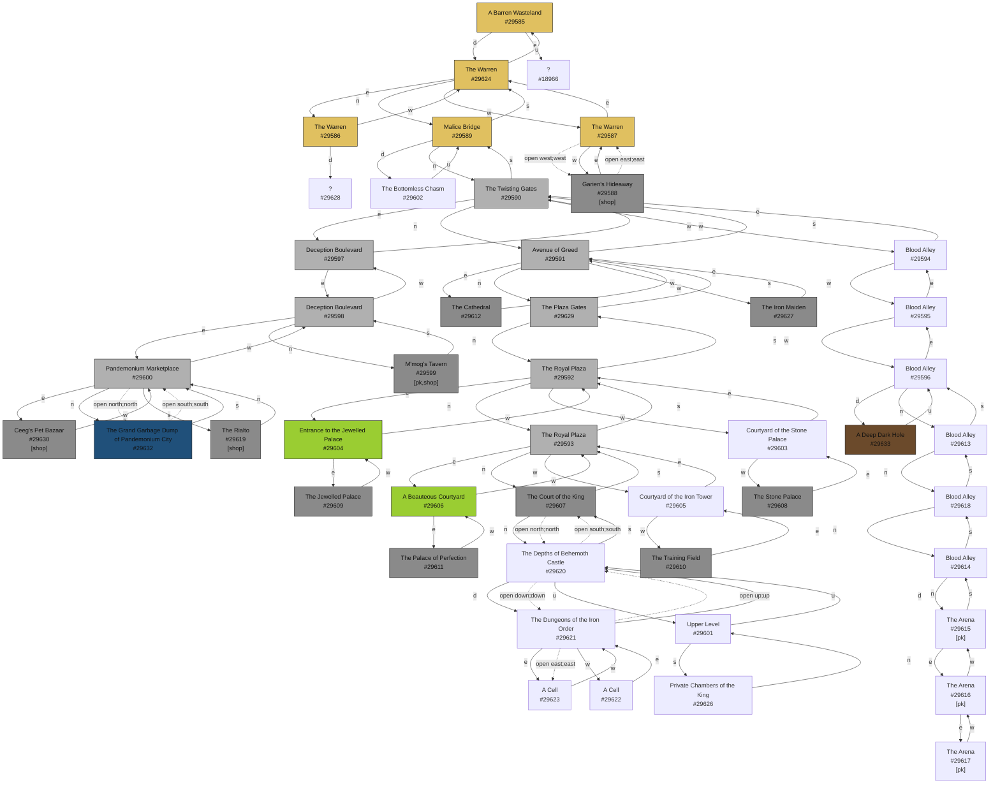

# Paradise Lost

46 rooms. Solid = direction; dotted = special exit.

```mermaid
flowchart TD
  r29585["A Barren Wasteland<br/>#29585"]
  r29624["The Warren<br/>#29624"]
  r29586["The Warren<br/>#29586"]
  r29589["Malice Bridge<br/>#29589"]
  r29590["The Twisting Gates<br/>#29590"]
  r29591["Avenue of Greed<br/>#29591"]
  r29629["The Plaza Gates<br/>#29629"]
  r29592["The Royal Plaza<br/>#29592"]
  r29603["Courtyard of the Stone Palace<br/>#29603"]
  r29604["Entrance to the Jewelled Palace<br/>#29604"]
  r29593["The Royal Plaza<br/>#29593"]
  r29606["A Beauteous Courtyard<br/>#29606"]
  r29602["The Bottomless Chasm<br/>#29602"]
  r29594["Blood Alley<br/>#29594"]
  r29597["Deception Boulevard<br/>#29597"]
  r29598["Deception Boulevard<br/>#29598"]
  r29600["Pandemonium Marketplace<br/>#29600"]
  r29630["Ceeg's Pet Bazaar<br/>#29630<br/>[shop]"]
  r29619["The Rialto<br/>#29619<br/>[shop]"]
  r29632["The Grand Garbage Dump of Pandemonium City<br/>#29632"]
  r29599["M'mog's Tavern<br/>#29599<br/>[pk,shop]"]
  r29595["Blood Alley<br/>#29595"]
  r29596["Blood Alley<br/>#29596"]
  r29613["Blood Alley<br/>#29613"]
  r29618["Blood Alley<br/>#29618"]
  r29614["Blood Alley<br/>#29614"]
  r29615["The Arena<br/>#29615<br/>[pk]"]
  r29633["A Deep Dark Hole<br/>#29633"]
  r29627["The Iron Maiden<br/>#29627"]
  r29612["The Cathedral<br/>#29612"]
  r29588["Garien's Hideaway<br/>#29588<br/>[shop]"]
  r29587["The Warren<br/>#29587"]
  r29609["The Jewelled Palace<br/>#29609"]
  r29608["The Stone Palace<br/>#29608"]
  r29605["Courtyard of the Iron Tower<br/>#29605"]
  r29610["The Training Field<br/>#29610"]
  r29616["The Arena<br/>#29616<br/>[pk]"]
  r29617["The Arena<br/>#29617<br/>[pk]"]
  r29611["The Palace of Perfection<br/>#29611"]
  r29607["The Court of the King<br/>#29607"]
  r29620["The Depths of Behemoth Castle<br/>#29620"]
  r29621["The Dungeons of the Iron Order<br/>#29621"]
  r29623["A Cell<br/>#29623"]
  r29601["Upper Level<br/>#29601"]
  r29626["Private Chambers of the King<br/>#29626"]
  r29622["A Cell<br/>#29622"]
  r29585 -->|d| r29624
  r18966["?<br/>#18966"]
  r29585 -->|e| r18966
  r29624 -->|e| r29586
  r29624 -->|n| r29589
  r29624 -->|u| r29585
  r29624 -->|w| r29587
  r29628["?<br/>#29628"]
  r29586 -->|d| r29628
  r29586 -->|w| r29624
  r29589 -->|d| r29602
  r29589 -->|n| r29590
  r29589 -->|s| r29624
  r29590 -->|e| r29597
  r29590 -->|n| r29591
  r29590 -->|s| r29589
  r29590 -->|w| r29594
  r29591 -->|e| r29612
  r29591 -->|n| r29629
  r29591 -->|s| r29590
  r29591 -->|w| r29627
  r29629 -->|n| r29592
  r29629 -->|s| r29591
  r29592 -->|e| r29604
  r29592 -->|n| r29593
  r29592 -->|s| r29629
  r29592 -->|w| r29603
  r29603 -->|e| r29592
  r29603 -->|w| r29608
  r29604 -->|e| r29609
  r29604 -->|w| r29592
  r29593 -->|e| r29606
  r29593 -->|n| r29607
  r29593 -->|s| r29592
  r29593 -->|w| r29605
  r29606 -->|e| r29611
  r29606 -->|w| r29593
  r29602 -->|u| r29589
  r29594 -->|e| r29590
  r29594 -->|w| r29595
  r29597 -->|e| r29598
  r29597 -->|w| r29590
  r29598 -->|e| r29600
  r29598 -->|n| r29599
  r29598 -->|w| r29597
  r29600 -->|e| r29630
  r29600 -->|n| r29632
  r29600 -.->|open north;north| r29632
  r29600 -->|s| r29619
  r29600 -->|w| r29598
  r29630 -->|w| r29600
  r29619 -->|n| r29600
  r29632 -.->|open south;south| r29600
  r29632 -->|s| r29600
  r29599 -->|s| r29598
  r29595 -->|e| r29594
  r29595 -->|w| r29596
  r29596 -->|d| r29633
  r29596 -->|e| r29595
  r29596 -->|n| r29613
  r29613 -->|n| r29618
  r29613 -->|s| r29596
  r29618 -->|n| r29614
  r29618 -->|s| r29613
  r29614 -->|n| r29615
  r29614 -->|s| r29618
  r29615 -->|e| r29616
  r29615 -->|s| r29614
  r29633 -->|u| r29596
  r29627 -->|e| r29591
  r29612 -->|w| r29591
  r29588 -->|e| r29587
  r29588 -.->|open east;east| r29587
  r29587 -->|e| r29624
  r29587 -.->|open west;west| r29588
  r29587 -->|w| r29588
  r29609 -->|w| r29604
  r29608 -->|e| r29603
  r29605 -->|e| r29593
  r29605 -->|w| r29610
  r29610 -->|e| r29605
  r29616 -->|e| r29617
  r29616 -->|w| r29615
  r29617 -->|w| r29616
  r29611 -->|w| r29606
  r29607 -->|n| r29620
  r29607 -.->|open north;north| r29620
  r29607 -->|s| r29593
  r29620 -->|d| r29621
  r29620 -.->|open down;down| r29621
  r29620 -.->|open south;south| r29607
  r29620 -->|s| r29607
  r29620 -->|u| r29601
  r29621 -->|e| r29623
  r29621 -.->|open east;east| r29623
  r29621 -.->|open up;up| r29620
  r29621 -->|u| r29620
  r29621 -->|w| r29622
  r29623 -->|w| r29621
  r29601 -->|d| r29620
  r29601 -->|s| r29626
  r29626 -->|n| r29601
  r29622 -->|e| r29621
  classDef t_desert fill:#e0c060,color:#111,stroke:#222
  class r29585 t_desert
  class r29624 t_desert
  class r29586 t_desert
  class r29589 t_desert
  classDef t_city fill:#b0b0b0,color:#111,stroke:#222
  class r29590 t_city
  class r29591 t_city
  class r29629 t_city
  class r29592 t_city
  classDef t_field fill:#9acd32,color:#111,stroke:#222
  class r29604 t_field
  class r29593 t_city
  class r29606 t_field
  class r29597 t_city
  class r29598 t_city
  class r29600 t_city
  classDef t_inside fill:#8a8a8a,color:#111,stroke:#222
  class r29630 t_inside
  class r29619 t_inside
  classDef t_underwater fill:#20507a,color:#111,stroke:#222
  class r29632 t_underwater
  class r29599 t_inside
  classDef t_underground fill:#6b4a2b,color:#111,stroke:#222
  class r29633 t_underground
  class r29627 t_inside
  class r29612 t_inside
  class r29588 t_inside
  class r29587 t_desert
  class r29609 t_inside
  class r29608 t_inside
  class r29610 t_inside
  class r29611 t_inside
  class r29607 t_inside
```
