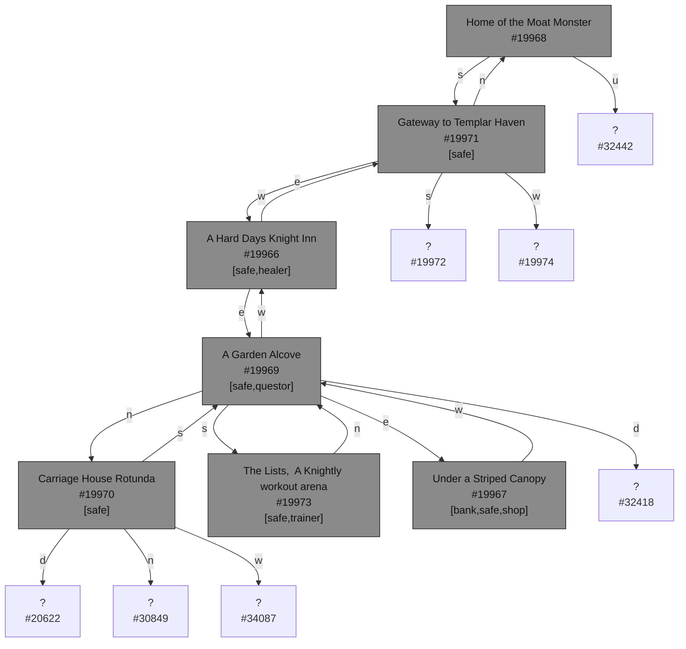

# Perdition Clan Area

7 rooms. Solid = direction; dotted = special exit.

```mermaid
flowchart TD
  r19968["Home of the Moat Monster<br/>#19968"]
  r19971["Gateway to Templar Haven<br/>#19971<br/>[safe]"]
  r19966["A Hard Days Knight Inn<br/>#19966<br/>[safe,healer]"]
  r19969["A Garden Alcove<br/>#19969<br/>[safe,questor]"]
  r19970["Carriage House Rotunda<br/>#19970<br/>[safe]"]
  r19973["The Lists,  A Knightly workout arena<br/>#19973<br/>[safe,trainer]"]
  r19967["Under a Striped Canopy<br/>#19967<br/>[bank,safe,shop]"]
  r19968 -->|s| r19971
  r32442["?<br/>#32442"]
  r19968 -->|u| r32442
  r19971 -->|e| r19966
  r19971 -->|n| r19968
  r19972["?<br/>#19972"]
  r19971 -->|s| r19972
  r19974["?<br/>#19974"]
  r19971 -->|w| r19974
  r19966 -->|e| r19969
  r19966 -->|w| r19971
  r32418["?<br/>#32418"]
  r19969 -->|d| r32418
  r19969 -->|e| r19967
  r19969 -->|n| r19970
  r19969 -->|s| r19973
  r19969 -->|w| r19966
  r20622["?<br/>#20622"]
  r19970 -->|d| r20622
  r30849["?<br/>#30849"]
  r19970 -->|n| r30849
  r19970 -->|s| r19969
  r34087["?<br/>#34087"]
  r19970 -->|w| r34087
  r19973 -->|n| r19969
  r19967 -->|w| r19969
  classDef t_inside fill:#8a8a8a,color:#111,stroke:#222
  class r19968 t_inside
  class r19971 t_inside
  class r19966 t_inside
  class r19969 t_inside
  class r19970 t_inside
  class r19973 t_inside
  class r19967 t_inside
```
