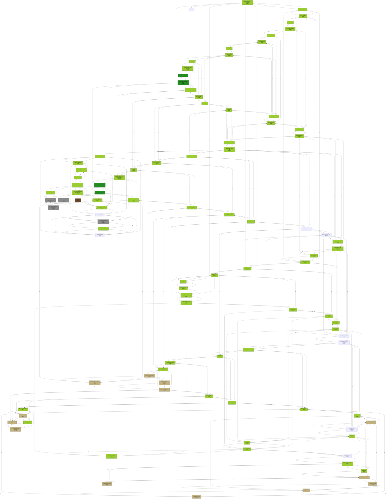

# Plains of Nulan'Boar

99 rooms. Solid = direction; dotted = special exit.

```mermaid
flowchart TD
  r37900["Gazing over a Wide Grassland<br/>#37900"]
  r37901["Out on the plains<br/>#37901"]
  r37902["Out on the plains<br/>#37902"]
  r37903["In tall grass<br/>#37903"]
  r37915["In tall grass<br/>#37915"]
  r37916["A slight rise<br/>#37916"]
  r37917["A rocky path in the foothills<br/>#37917"]
  r37924["A path in the foothills<br/>#37924"]
  r37914["Entering the low foothills<br/>#37914"]
  r37913["On the river bank near the foothills<br/>#37913"]
  r37912["Along the river bank<br/>#37912"]
  r37907["Muddy grassland<br/>#37907"]
  r37906["Plains near a river<br/>#37906"]
  r37905["Muddy ground<br/>#37905"]
  r37904["In tall grass<br/>#37904"]
  r37918["On the green prairie<br/>#37918"]
  r37919["Path through the prairie<br/>#37919"]
  r37920["Out on the plains<br/>#37920"]
  r37921["Near a stream<br/>#37921"]
  r37922["The stream in the grasslands<br/>#37922"]
  r37923["A path in the low foothills<br/>#37923"]
  r37931["Steep foothills<br/>#37931"]
  r37930["A gentle rise<br/>#37930"]
  r37929["A crystal clear stream in the plains<br/>#37929"]
  r37928["A cool stream in the plains<br/>#37928"]
  r37927["Walking through well cropped grass<br/>#37927"]
  r37926["Out on the plains<br/>#37926"]
  r37925["Out on the plains<br/>#37925"]
  r37932["On the prairie<br/>#37932"]
  r37933["On the rolling grasslands<br/>#37933"]
  r37934["Well cropped grass<br/>#37934"]
  r37935["In well cropped grass<br/>#37935"]
  r37936["A shady spot in the plains<br/>#37936"]
  r37937["A cool stream in the plains<br/>#37937"]
  r37938["Muddy ground on the plains<br/>#37938"]
  r37939["Near the foothills<br/>#37939"]
  r37940["In the western foothills<br/>#37940"]
  r37947["Out on the prairie<br/>#37947"]
  r37946["In tall grass<br/>#37946"]
  r37945["A shady spot on the stream<br/>#37945"]
  r37944["Near a grove of ancient trees<br/>#37944"]
  r37943["A shady spot on the plains<br/>#37943"]
  r37942["Well cropped grass<br/>#37942"]
  r37941["Out on the plains<br/>#37941"]
  r37948["A rocky spot in the plains<br/>#37948"]
  r37949["On a treacherous slope in the foothills<br/>#37949"]
  r37958["A turn in the foothills<br/>#37958"]
  r37957["In the low foothills<br/>#37957"]
  r37956["Near the foothills<br/>#37956"]
  r37955["In tall grass on the plains<br/>#37955"]
  r37954["A trampled area<br/>#37954"]
  r36510["A shady spot in the plains<br/>#36510"]
  r36509["In soft grass<br/>#36509"]
  r36508["Well cropped grassland<br/>#36508"]
  r36507["On the green prairie<br/>#36507"]
  r37959["In tall grass<br/>#37959"]
  r37960["Out on the plains<br/>#37960"]
  r37961["In soft grass<br/>#37961"]
  r37962["In well cropped grass<br/>#37962"]
  r37963["In tall grass on the plains<br/>#37963"]
  r37964["Near the winding foothills<br/>#37964"]
  r37965["Along the winding foothills<br/>#37965"]
  r37966["A bend in the foothills<br/>#37966"]
  r37972["Muddy ground in the foothills<br/>#37972"]
  r37971["A small brook in the foothills<br/>#37971"]
  r37970["Next to a babbling brook<br/>#37970"]
  r37969["In tall grass<br/>#37969"]
  r37968["Out on the plains<br/>#37968"]
  r37967["In tall grass<br/>#37967"]
  r37973["Shaded grassland near a large forest<br/>#37973"]
  r37974["In a field of flowers on the edge of a large forest<br/>#37974"]
  r37975["In tall grass near the eaves of a large forest<br/>#37975"]
  r37976["A sparkling brook in the plains<br/>#37976"]
  r37977["Foothills ending at a steep cliff<br/>#37977"]
  r37981["Along the sparkling brook<br/>#37981"]
  r37980["Near a path in the dark forest<br/>#37980"]
  r37979["On the edges of the large forest<br/>#37979"]
  r37978["Just into the dark forest<br/>#37978"]
  r37908["Beside a wide river<br/>#37908"]
  r37909["Muddy spot on the river bank<br/>#37909"]
  r37910["Thick vegetation on the river bank<br/>#37910"]
  r37911["A sandy spot on the river bank<br/>#37911"]
  r37983["Inside a hidden clearing<br/>#37983"]
  r37984["A small sparkling lake<br/>#37984"]
  r37989["A small pasture by the lake<br/>#37989"]
  r37990["A paddock on the lake shore<br/>#37990"]
  r37985["A small sparkling lake<br/>#37985"]
  r37986["A path alongside the lake<br/>#37986"]
  r37987["Path through the scattered tents<br/>#37987"]
  r37988["A small pasture by the lake<br/>#37988"]
  r37991["A small grassy paddock<br/>#37991"]
  r37992["A path through the tents of the Nulan'Boar<br/>#37992"]
  r37994["Middle of the Nulan'Boar camp<br/>#37994"]
  r37993["A large cook fire<br/>#37993"]
  r37995["Before the large tent<br/>#37995"]
  r38000["The hut of the Nulan'Boar hunter<br/>#38000"]
  r37996["Inside the tent of the Nulan'Boar chieftain<br/>#37996"]
  r37997["Chamber of the Nulan'Boar high priestess<br/>#37997"]
  r37982["A dark cave<br/>#37982"]
  r17699["?<br/>#17699"]
  r37900 -->|e| r17699
  r37900 -->|n| r37918
  r37900 -->|s| r37904
  r37900 -->|w| r37901
  r37901 -->|e| r37900
  r37901 -->|n| r37919
  r37901 -->|s| r37905
  r37901 -->|w| r37902
  r37902 -->|e| r37901
  r37902 -->|n| r37920
  r37902 -->|s| r37906
  r37902 -->|w| r37903
  r37903 -->|e| r37902
  r37903 -->|n| r37921
  r37903 -->|s| r37907
  r37903 -->|w| r37915
  r37915 -->|e| r37903
  r37915 -->|n| r37922
  r37915 -->|s| r37912
  r37915 -->|w| r37916
  r37916 -->|e| r37915
  r37916 -->|n| r37923
  r37916 -->|s| r37913
  r37916 -->|w| r37917
  r37917 -->|e| r37916
  r37917 -->|n| r37924
  r37917 -->|s| r37914
  r37924 -->|e| r37923
  r37924 -->|n| r37931
  r37924 -->|s| r37917
  r37914 -->|e| r37913
  r37914 -->|n| r37917
  r37913 -->|e| r37912
  r37913 -->|n| r37916
  r37913 -->|w| r37914
  r37912 -->|e| r37907
  r37912 -->|n| r37915
  r37912 -->|w| r37913
  r37907 -->|e| r37906
  r37907 -->|n| r37903
  r37907 -->|s| r37911
  r37907 -->|w| r37912
  r37906 -->|e| r37905
  r37906 -->|n| r37902
  r37906 -->|s| r37910
  r37906 -->|w| r37907
  r37905 -->|e| r37904
  r37905 -->|n| r37901
  r37905 -->|s| r37909
  r37905 -->|w| r37906
  r37904 -->|n| r37900
  r37904 -->|s| r37908
  r37904 -->|w| r37905
  r37918 -->|n| r37925
  r37918 -->|s| r37900
  r37918 -->|w| r37919
  r37919 -->|e| r37918
  r37919 -->|n| r37926
  r37919 -->|s| r37901
  r37919 -->|w| r37920
  r37920 -->|e| r37919
  r37920 -->|n| r37927
  r37920 -->|s| r37902
  r37920 -->|w| r37921
  r37921 -->|e| r37920
  r37921 -->|n| r37928
  r37921 -->|s| r37903
  r37921 -->|w| r37922
  r37922 -->|e| r37921
  r37922 -->|n| r37929
  r37922 -->|s| r37915
  r37922 -->|w| r37923
  r37923 -->|e| r37922
  r37923 -->|n| r37930
  r37923 -->|s| r37916
  r37923 -->|w| r37924
  r37931 -->|e| r37930
  r37931 -->|n| r37940
  r37931 -->|s| r37924
  r37930 -->|e| r37929
  r37930 -->|n| r37939
  r37930 -->|s| r37923
  r37930 -->|w| r37931
  r37929 -->|e| r37928
  r37929 -->|n| r37938
  r37929 -->|s| r37922
  r37929 -->|w| r37930
  r37928 -->|e| r37927
  r37928 -->|n| r37937
  r37928 -->|s| r37921
  r37928 -->|w| r37929
  r37927 -->|e| r37926
  r37927 -->|n| r37936
  r37927 -->|s| r37920
  r37927 -->|w| r37928
  r37926 -->|e| r37925
  r37926 -->|n| r37935
  r37926 -->|s| r37919
  r37926 -->|w| r37927
  r37925 -->|e| r37932
  r37925 -->|n| r37934
  r37925 -->|s| r37918
  r37925 -->|w| r37926
  r37932 -->|n| r37933
  r37932 -->|w| r37925
  r37933 -->|n| r37941
  r37933 -->|s| r37932
  r37933 -->|w| r37934
  r37934 -->|e| r37933
  r37934 -->|n| r37942
  r37934 -->|s| r37925
  r37934 -->|w| r37935
  r37935 -->|e| r37934
  r37935 -->|n| r37943
  r37935 -->|s| r37926
  r37935 -->|w| r37936
  r37936 -->|e| r37935
  r37936 -->|n| r37944
  r37936 -->|s| r37927
  r37936 -->|w| r37937
  r37937 -->|e| r37936
  r37937 -->|n| r37945
  r37937 -->|s| r37928
  r37937 -->|w| r37938
  r37938 -->|e| r37937
  r37938 -->|n| r37946
  r37938 -->|s| r37929
  r37938 -->|w| r37939
  r37939 -->|e| r37938
  r37939 -->|n| r37947
  r37939 -->|s| r37930
  r37939 -->|w| r37940
  r37940 -->|e| r37939
  r37940 -->|s| r37931
  r37947 -->|e| r37946
  r37947 -->|n| r37956
  r37947 -->|s| r37939
  r37947 -->|w| r37948
  r37946 -->|e| r37945
  r37946 -->|n| r37955
  r37946 -->|s| r37938
  r37946 -->|w| r37947
  r37945 -->|e| r37944
  r37945 -->|n| r37954
  r37945 -->|s| r37937
  r37945 -->|w| r37946
  r37944 -->|e| r37943
  r37944 -.->|enter opening| r37983
  r37944 -->|n| r36510
  r37944 -->|s| r37936
  r37944 -->|w| r37945
  r37943 -->|e| r37942
  r37943 -->|n| r36509
  r37943 -->|s| r37935
  r37943 -->|w| r37944
  r37942 -->|e| r37941
  r37942 -->|n| r36508
  r37942 -->|s| r37934
  r37942 -->|w| r37943
  r37941 -->|n| r36507
  r37941 -->|s| r37933
  r37941 -->|w| r37942
  r37948 -->|e| r37947
  r37948 -->|n| r37957
  r37948 -->|w| r37949
  r37949 -->|e| r37948
  r37949 -->|n| r37958
  r37958 -->|e| r37957
  r37958 -->|s| r37949
  r37957 -->|e| r37956
  r37957 -->|n| r37966
  r37957 -->|s| r37948
  r37957 -->|w| r37958
  r37956 -->|e| r37955
  r37956 -->|n| r37965
  r37956 -->|s| r37947
  r37956 -->|w| r37957
  r37955 -->|e| r37954
  r37955 -->|n| r37964
  r37955 -->|s| r37946
  r37955 -->|w| r37956
  r37954 -->|e| r36510
  r37954 -->|n| r37963
  r37954 -->|s| r37945
  r37954 -->|w| r37955
  r36510 -->|e| r36509
  r36510 -->|n| r37962
  r36510 -->|s| r37944
  r36510 -->|w| r37954
  r36509 -->|e| r36508
  r36509 -->|n| r37961
  r36509 -->|s| r37943
  r36509 -->|w| r36510
  r36508 -->|e| r36507
  r36508 -->|n| r37960
  r36508 -->|s| r37942
  r36508 -->|w| r36509
  r36507 -->|n| r37959
  r36507 -->|s| r37941
  r36507 -->|w| r36508
  r37959 -->|s| r36507
  r37959 -->|w| r37960
  r37960 -->|e| r37959
  r37960 -->|n| r37967
  r37960 -->|s| r36508
  r37960 -->|w| r37961
  r37961 -->|e| r37960
  r37961 -->|n| r37968
  r37961 -->|s| r36509
  r37961 -->|w| r37962
  r37962 -->|e| r37961
  r37962 -->|n| r37969
  r37962 -->|s| r36510
  r37962 -->|w| r37963
  r37963 -->|e| r37962
  r37963 -->|n| r37970
  r37963 -->|s| r37954
  r37963 -->|w| r37964
  r37964 -->|e| r37963
  r37964 -->|n| r37971
  r37964 -->|s| r37955
  r37964 -->|w| r37965
  r37965 -->|e| r37964
  r37965 -->|n| r37972
  r37965 -->|s| r37956
  r37965 -->|w| r37966
  r37966 -->|e| r37965
  r37966 -->|s| r37957
  r37972 -->|e| r37971
  r37972 -->|s| r37965
  r37971 -->|e| r37970
  r37971 -->|n| r37977
  r37971 -->|s| r37964
  r37971 -->|w| r37972
  r37970 -->|e| r37969
  r37970 -->|n| r37976
  r37970 -->|s| r37963
  r37970 -->|w| r37971
  r37969 -->|e| r37968
  r37969 -->|n| r37975
  r37969 -->|s| r37962
  r37969 -->|w| r37970
  r37968 -->|e| r37967
  r37968 -->|n| r37974
  r37968 -->|s| r37961
  r37968 -->|w| r37969
  r37967 -->|n| r37973
  r37967 -->|s| r37960
  r37967 -->|w| r37968
  r37973 -->|n| r37978
  r37973 -->|s| r37967
  r37973 -->|w| r37974
  r37974 -->|e| r37973
  r37974 -->|n| r37979
  r37974 -->|s| r37968
  r37974 -->|w| r37975
  r37975 -->|e| r37974
  r37975 -->|n| r37980
  r37975 -->|s| r37969
  r37975 -->|w| r37976
  r37976 -->|e| r37975
  r37976 -->|n| r37981
  r37976 -->|s| r37970
  r37976 -->|w| r37977
  r37977 -->|e| r37976
  r37977 -->|s| r37971
  r37981 -->|e| r37980
  r37981 -.->|enter underbrush| r37982
  r37981 -->|s| r37976
  r37980 -->|e| r37979
  r37980 -->|s| r37975
  r37980 -->|w| r37981
  r37979 -->|e| r37978
  r37979 -->|s| r37974
  r37979 -->|w| r37980
  r37978 -->|s| r37973
  r37978 -->|w| r37979
  r37908 -->|n| r37904
  r37908 -->|w| r37909
  r37909 -->|e| r37908
  r37909 -->|n| r37905
  r37909 -->|w| r37910
  r37910 -->|e| r37909
  r37910 -->|n| r37906
  r37910 -->|w| r37911
  r37911 -->|e| r37910
  r37911 -->|n| r37907
  r37983 -->|e| r37986
  r37983 -.->|enter opening| r37944
  r37983 -->|n| r37984
  r37984 -->|e| r37985
  r37984 -->|n| r37989
  r37984 -->|s| r37983
  r37989 -->|e| r37990
  r37989 -->|s| r37984
  r37990 -->|e| r37991
  r37990 -->|s| r37985
  r37990 -->|w| r37989
  r37985 -->|e| r37988
  r37985 -->|n| r37990
  r37985 -->|s| r37986
  r37985 -->|w| r37984
  r37986 -->|e| r37987
  r37986 -->|n| r37985
  r37986 -->|w| r37983
  r37987 -->|e| r37993
  r37987 -->|n| r37988
  r37987 -->|w| r37986
  r37988 -->|e| r37994
  r37988 -->|n| r37991
  r37988 -->|s| r37987
  r37988 -->|w| r37985
  r37991 -->|e| r37992
  r37991 -->|s| r37988
  r37991 -->|w| r37990
  r37992 -->|n| r38000
  r37992 -->|s| r37994
  r37992 -->|w| r37991
  r37994 -->|e| r37995
  r37994 -->|n| r37992
  r37994 -->|s| r37993
  r37994 -->|w| r37988
  r37993 -->|n| r37994
  r37993 -->|w| r37987
  r37995 -.->|enter painting| r37996
  r37995 -->|w| r37994
  r38000 -->|s| r37992
  r37996 -->|e| r37997
  r37996 -.->|enter flap| r37995
  r37996 -.->|open east;east| r37997
  r37997 -.->|open west;west| r37996
  r37997 -->|w| r37996
  r37982 -.->|enter underbrush| r37981
  classDef t_field fill:#9acd32,color:#111,stroke:#222
  class r37900 t_field
  class r37901 t_field
  class r37902 t_field
  class r37903 t_field
  class r37915 t_field
  class r37916 t_field
  classDef t_hills fill:#c2b280,color:#111,stroke:#222
  class r37917 t_hills
  class r37924 t_hills
  class r37914 t_hills
  class r37913 t_field
  class r37907 t_field
  class r37906 t_field
  class r37905 t_field
  class r37904 t_field
  class r37918 t_field
  class r37919 t_field
  class r37920 t_field
  class r37921 t_field
  class r37923 t_hills
  class r37931 t_hills
  class r37930 t_field
  class r37927 t_field
  class r37926 t_field
  class r37925 t_field
  class r37932 t_field
  class r37933 t_field
  class r37934 t_field
  class r37935 t_field
  class r37936 t_field
  class r37938 t_field
  class r37939 t_field
  class r37940 t_hills
  class r37947 t_field
  class r37946 t_field
  class r37944 t_field
  class r37943 t_field
  class r37942 t_field
  class r37941 t_field
  class r37948 t_field
  class r37949 t_hills
  class r37958 t_field
  class r37957 t_hills
  class r37956 t_field
  class r37955 t_field
  class r37954 t_field
  class r36510 t_field
  class r36509 t_field
  class r36508 t_field
  class r36507 t_field
  class r37959 t_field
  class r37960 t_field
  class r37961 t_field
  class r37962 t_field
  class r37963 t_field
  class r37964 t_field
  class r37965 t_hills
  class r37966 t_hills
  class r37972 t_hills
  class r37971 t_hills
  class r37970 t_field
  class r37969 t_field
  class r37968 t_field
  class r37967 t_field
  class r37973 t_field
  class r37974 t_field
  class r37975 t_field
  class r37976 t_field
  class r37977 t_hills
  classDef t_forest fill:#228b22,color:#111,stroke:#222
  class r37981 t_forest
  class r37980 t_forest
  class r37979 t_forest
  class r37978 t_forest
  class r37908 t_field
  class r37909 t_field
  class r37910 t_field
  class r37911 t_field
  class r37983 t_field
  class r37989 t_field
  classDef t_inside fill:#8a8a8a,color:#111,stroke:#222
  class r37990 t_inside
  class r37986 t_field
  class r37987 t_field
  class r37988 t_field
  class r37991 t_field
  class r37992 t_field
  class r37994 t_field
  class r37993 t_field
  class r37995 t_field
  class r38000 t_inside
  class r37996 t_inside
  class r37997 t_inside
  classDef t_underground fill:#6b4a2b,color:#111,stroke:#222
  class r37982 t_underground
```
