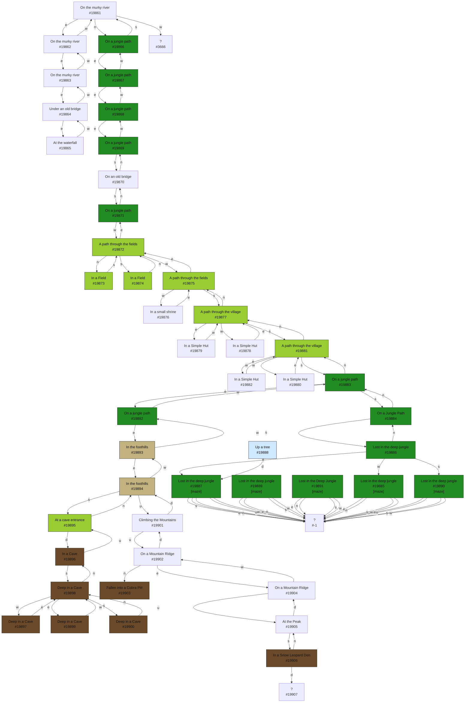

# Raganatittu

46 rooms. Solid = direction; dotted = special exit.

```mermaid
flowchart TD
  r19861["On the murky river<br/>#19861"]
  r19862["On the murky river<br/>#19862"]
  r19863["On the murky river<br/>#19863"]
  r19864["Under an old bridge<br/>#19864"]
  r19865["At the waterfall<br/>#19865"]
  r19866["On a jungle path<br/>#19866"]
  r19867["On a jungle path<br/>#19867"]
  r19868["On a jungle path<br/>#19868"]
  r19869["On a jungle path<br/>#19869"]
  r19870["On an old bridge<br/>#19870"]
  r19871["On a jungle path<br/>#19871"]
  r19872["A path through the fields<br/>#19872"]
  r19873["In a Field<br/>#19873"]
  r19874["In a Field<br/>#19874"]
  r19875["A path through the fields<br/>#19875"]
  r19876["In a small shrine<br/>#19876"]
  r19877["A path through the village<br/>#19877"]
  r19879["In a Simple Hut<br/>#19879"]
  r19878["In a Simple Hut<br/>#19878"]
  r19881["A path through the village<br/>#19881"]
  r19882["In a Simple Hut<br/>#19882"]
  r19880["In a Simple Hut<br/>#19880"]
  r19883["On a jungle path<br/>#19883"]
  r19892["On a jungle path<br/>#19892"]
  r19893["In the foothills<br/>#19893"]
  r19894["In the foothills<br/>#19894"]
  r19884["On a Jungle Path<br/>#19884"]
  r19886["Lost in the deep jungle<br/>#19886"]
  r19887["Lost in the deep jungle<br/>#19887<br/>[maze]"]
  r19889["Lost in the deep jungle<br/>#19889<br/>[maze]"]
  r19891["Lost in the Deep Jungle<br/>#19891<br/>[maze]"]
  r19885["Lost in the deep jungle<br/>#19885<br/>[maze]"]
  r19888["Up a tree<br/>#19888"]
  r19890["Lost in the deep jungle<br/>#19890<br/>[maze]"]
  r19895["At a cave entrance<br/>#19895"]
  r19896["In a Cave<br/>#19896"]
  r19898["Deep in a Cave<br/>#19898"]
  r19897["Deep in a Cave<br/>#19897"]
  r19899["Deep in a Cave<br/>#19899"]
  r19900["Deep in a Cave<br/>#19900"]
  r19901["Climbing the Mountains<br/>#19901"]
  r19902["On a Mountain Ridge<br/>#19902"]
  r19903["Fallen into a Cobra Pit!<br/>#19903"]
  r19904["On a Mountain Ridge<br/>#19904"]
  r19905["At the Peak<br/>#19905"]
  r19906["In a Snow Leopard Den<br/>#19906"]
  r19861 -->|e| r19862
  r19861 -->|n| r19866
  r3666["?<br/>#3666"]
  r19861 -->|w| r3666
  r19862 -->|e| r19863
  r19862 -->|w| r19861
  r19863 -->|e| r19864
  r19863 -->|w| r19862
  r19864 -->|e| r19865
  r19864 -->|w| r19863
  r19865 -->|w| r19864
  r19866 -->|e| r19867
  r19866 -->|s| r19861
  r19867 -->|e| r19868
  r19867 -->|w| r19866
  r19868 -->|e| r19869
  r19868 -->|w| r19867
  r19869 -->|s| r19870
  r19869 -->|w| r19868
  r19870 -->|n| r19869
  r19870 -->|s| r19871
  r19871 -->|n| r19870
  r19871 -->|w| r19872
  r19872 -->|e| r19871
  r19872 -->|n| r19873
  r19872 -->|s| r19874
  r19872 -->|w| r19875
  r19873 -->|s| r19872
  r19874 -->|n| r19872
  r19875 -->|e| r19872
  r19875 -->|s| r19877
  r19875 -->|w| r19876
  r19876 -->|e| r19875
  r19877 -->|e| r19879
  r19877 -->|n| r19875
  r19877 -->|s| r19881
  r19877 -->|w| r19878
  r19879 -->|w| r19877
  r19878 -->|e| r19877
  r19881 -->|e| r19882
  r19881 -->|n| r19877
  r19881 -->|s| r19883
  r19881 -->|w| r19880
  r19882 -->|w| r19881
  r19880 -->|e| r19881
  r19883 -->|e| r19892
  r19883 -->|n| r19881
  r19883 -->|s| r19884
  r19892 -->|e| r19893
  r19892 -->|w| r19883
  r19893 -->|e| r19894
  r19893 -->|w| r19892
  r19894 -->|s| r19895
  r19894 -->|u| r19901
  r19894 -->|w| r19893
  r19884 -->|n| r19883
  r19884 -->|s| r19886
  r19886 -->|e| r19887
  r19886 -->|n| r19884
  r19886 -->|s| r19890
  r19886 -->|w| r19885
  r-1["?<br/>#-1"]
  r19887 -->|e| r-1
  r19887 -->|n| r-1
  r19887 -->|s| r-1
  r19887 -->|u| r-1
  r19887 -->|w| r-1
  r19889 -->|e| r-1
  r19889 -->|n| r-1
  r19889 -->|s| r-1
  r19889 -->|w| r-1
  r19891 -->|e| r-1
  r19891 -->|n| r-1
  r19891 -->|s| r-1
  r19891 -->|w| r-1
  r19885 -->|e| r-1
  r19885 -->|n| r-1
  r19885 -->|s| r-1
  r19885 -->|w| r-1
  r19888 -->|d| r19887
  r19890 -->|e| r-1
  r19890 -->|n| r-1
  r19890 -->|s| r-1
  r19890 -->|w| r-1
  r19895 -->|d| r19896
  r19895 -->|n| r19894
  r19896 -->|s| r19898
  r19896 -->|u| r19895
  r19898 -->|e| r19899
  r19898 -->|n| r19896
  r19898 -->|s| r19900
  r19898 -->|w| r19897
  r19897 -->|e| r19898
  r19899 -->|w| r19898
  r19900 -->|n| r19898
  r19901 -->|d| r19894
  r19901 -->|u| r19902
  r19902 -->|d| r19901
  r19902 -->|e| r19904
  r19902 -->|n| r19903
  r19904 -->|u| r19905
  r19904 -->|w| r19902
  r19905 -->|d| r19904
  r19905 -->|s| r19906
  r19907["?<br/>#19907"]
  r19906 -->|d| r19907
  r19906 -->|n| r19905
  classDef t_forest fill:#228b22,color:#111,stroke:#222
  class r19866 t_forest
  class r19867 t_forest
  class r19868 t_forest
  class r19869 t_forest
  class r19871 t_forest
  classDef t_field fill:#9acd32,color:#111,stroke:#222
  class r19872 t_field
  class r19873 t_field
  class r19874 t_field
  class r19875 t_field
  class r19877 t_field
  class r19881 t_field
  class r19883 t_forest
  class r19892 t_forest
  classDef t_hills fill:#c2b280,color:#111,stroke:#222
  class r19893 t_hills
  class r19894 t_hills
  class r19884 t_forest
  class r19886 t_forest
  class r19887 t_forest
  class r19889 t_forest
  class r19891 t_forest
  class r19885 t_forest
  classDef t_air fill:#cfe8ff,color:#111,stroke:#222
  class r19888 t_air
  class r19890 t_forest
  class r19895 t_field
  classDef t_underground fill:#6b4a2b,color:#111,stroke:#222
  class r19896 t_underground
  class r19898 t_underground
  class r19897 t_underground
  class r19899 t_underground
  class r19900 t_underground
  class r19903 t_underground
  class r19906 t_underground
```
