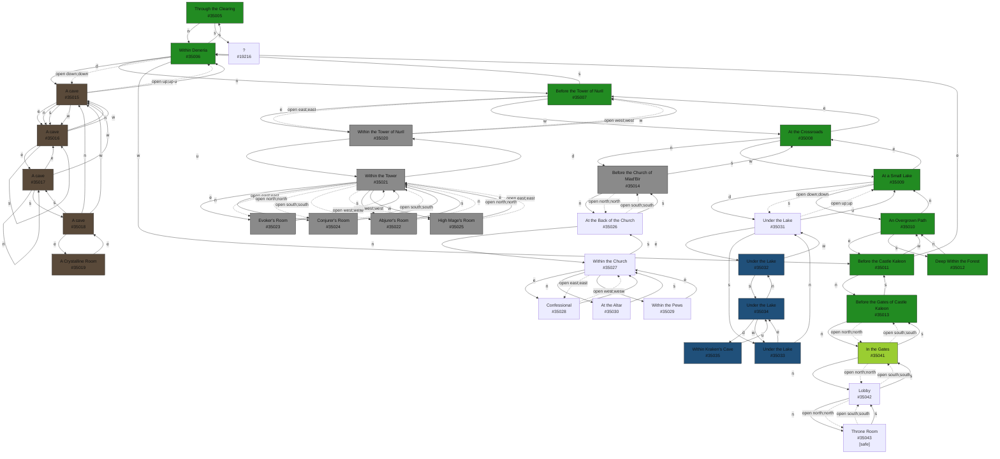

# Realm of Deneria

34 rooms. Solid = direction; dotted = special exit.

```mermaid
flowchart TD
  r35005["Through the Clearing<br/>#35005"]
  r35006["Within Deneria<br/>#35006"]
  r35015["A cave<br/>#35015"]
  r35016["A cave<br/>#35016"]
  r35017["A cave<br/>#35017"]
  r35018["A cave<br/>#35018"]
  r35019["A Crystalline Room<br/>#35019"]
  r35011["Before the Castle Kaleon<br/>#35011"]
  r35013["Before the Gates of Castle Kaleon<br/>#35013"]
  r35041["In the Gates<br/>#35041"]
  r35042["Lobby<br/>#35042"]
  r35043["Throne Room<br/>#35043<br/>[safe]"]
  r35010["An Overgrown Path<br/>#35010"]
  r35012["Deep Within the Forest<br/>#35012"]
  r35009["At a Small Lake<br/>#35009"]
  r35031["Under the Lake<br/>#35031"]
  r35008["At the Crossroads<br/>#35008"]
  r35007["Before the Tower of Nuril<br/>#35007"]
  r35020["Within the Tower of Nuril<br/>#35020"]
  r35021["Within the Tower<br/>#35021"]
  r35023["Evoker's Room<br/>#35023"]
  r35025["High Mage's Room<br/>#35025"]
  r35024["Conjurer's Room<br/>#35024"]
  r35022["Abjurer's Room<br/>#35022"]
  r35014["Before the Church of Miad'Bir<br/>#35014"]
  r35026["At the Back of the Church<br/>#35026"]
  r35027["Within the Church<br/>#35027"]
  r35028["Confessional<br/>#35028"]
  r35029["Within the Pews<br/>#35029"]
  r35030["At the Altar<br/>#35030"]
  r35032["Under the Lake<br/>#35032"]
  r35034["Under the Lake<br/>#35034"]
  r35033["Under the Lake<br/>#35033"]
  r35035["Within Kraken's Cave<br/>#35035"]
  r35005 -->|n| r35006
  r19216["?<br/>#19216"]
  r35005 -->|s| r19216
  r35006 -->|d| r35015
  r35006 -->|n| r35007
  r35006 -.->|open down;down| r35015
  r35006 -->|s| r35005
  r35006 -->|w| r35011
  r35015 -->|e| r35016
  r35015 -->|n| r35016
  r35015 -.->|open up;up| r35006
  r35015 -->|s| r35016
  r35015 -->|u| r35006
  r35015 -->|w| r35016
  r35016 -->|e| r35017
  r35016 -->|n| r35015
  r35016 -->|s| r35016
  r35016 -->|w| r35015
  r35017 -->|e| r35016
  r35017 -->|n| r35017
  r35017 -->|s| r35018
  r35017 -->|w| r35015
  r35018 -->|e| r35019
  r35018 -->|n| r35015
  r35018 -->|s| r35017
  r35018 -->|w| r35015
  r35019 -->|e| r35018
  r35011 -->|e| r35006
  r35011 -->|n| r35013
  r35011 -->|w| r35010
  r35013 -->|n| r35041
  r35013 -.->|open north;north| r35041
  r35013 -->|s| r35011
  r35041 -->|n| r35042
  r35041 -.->|open north;north| r35042
  r35041 -.->|open south;south| r35013
  r35041 -->|s| r35013
  r35042 -->|n| r35043
  r35042 -.->|open north;north| r35043
  r35042 -.->|open south;south| r35041
  r35042 -->|s| r35041
  r35043 -.->|open south;south| r35042
  r35043 -->|s| r35042
  r35010 -->|e| r35011
  r35010 -->|n| r35009
  r35010 -->|s| r35012
  r35012 -->|n| r35010
  r35009 -->|d| r35031
  r35009 -->|e| r35008
  r35009 -.->|open down;down| r35031
  r35009 -->|s| r35010
  r35031 -->|e| r35032
  r35031 -.->|open up;up| r35009
  r35031 -->|s| r35033
  r35031 -->|u| r35009
  r35008 -->|e| r35007
  r35008 -->|n| r35014
  r35008 -->|w| r35009
  r35007 -->|e| r35020
  r35007 -.->|open east;east| r35020
  r35007 -->|s| r35006
  r35007 -->|w| r35008
  r35020 -.->|open west;west| r35007
  r35020 -->|u| r35021
  r35020 -->|w| r35007
  r35021 -->|d| r35020
  r35021 -->|e| r35023
  r35021 -->|n| r35024
  r35021 -.->|open east;east| r35023
  r35021 -.->|open north;north| r35024
  r35021 -.->|open south;south| r35022
  r35021 -.->|open west;west| r35025
  r35021 -->|s| r35022
  r35021 -->|w| r35025
  r35023 -.->|open west;west| r35021
  r35023 -->|w| r35021
  r35025 -->|e| r35021
  r35025 -.->|open east;east| r35021
  r35024 -.->|open south;south| r35021
  r35024 -->|s| r35021
  r35022 -->|n| r35021
  r35022 -.->|open north;north| r35021
  r35014 -->|n| r35026
  r35014 -.->|open north;north| r35026
  r35014 -->|s| r35008
  r35026 -->|n| r35027
  r35026 -.->|open south;south| r35014
  r35026 -->|s| r35014
  r35027 -->|e| r35028
  r35027 -->|n| r35030
  r35027 -.->|open east;east| r35028
  r35027 -->|s| r35026
  r35027 -->|w| r35029
  r35028 -.->|open west;west| r35027
  r35028 -->|w| r35027
  r35029 -->|e| r35027
  r35030 -->|s| r35027
  r35032 -->|s| r35034
  r35032 -->|w| r35031
  r35034 -->|d| r35035
  r35034 -->|n| r35032
  r35034 -->|w| r35033
  r35033 -->|e| r35034
  r35033 -->|n| r35031
  r35035 -->|u| r35034
  classDef t_forest fill:#228b22,color:#111,stroke:#222
  class r35005 t_forest
  class r35006 t_forest
  classDef t_cave fill:#5a4a3a,color:#111,stroke:#222
  class r35015 t_cave
  class r35016 t_cave
  class r35017 t_cave
  class r35018 t_cave
  class r35019 t_cave
  class r35011 t_forest
  class r35013 t_forest
  classDef t_field fill:#9acd32,color:#111,stroke:#222
  class r35041 t_field
  class r35010 t_forest
  class r35012 t_forest
  class r35009 t_forest
  class r35008 t_forest
  class r35007 t_forest
  classDef t_inside fill:#8a8a8a,color:#111,stroke:#222
  class r35020 t_inside
  class r35021 t_inside
  class r35023 t_inside
  class r35025 t_inside
  class r35024 t_inside
  class r35022 t_inside
  class r35014 t_inside
  classDef t_underwater fill:#20507a,color:#111,stroke:#222
  class r35032 t_underwater
  class r35034 t_underwater
  class r35033 t_underwater
  class r35035 t_underwater
```
