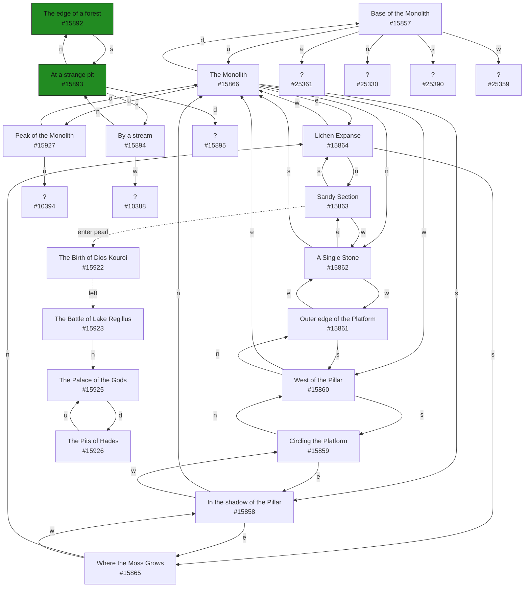

# Realm of the Zodiac

18 rooms. Solid = direction; dotted = special exit.

```mermaid
flowchart TD
  r15857["Base of the Monolith<br/>#15857"]
  r15866["The Monolith<br/>#15866"]
  r15860["West of the Pillar<br/>#15860"]
  r15861["Outer edge of the Platform<br/>#15861"]
  r15862["A Single Stone<br/>#15862"]
  r15863["Sandy Section<br/>#15863"]
  r15864["Lichen Expanse<br/>#15864"]
  r15865["Where the Moss Grows<br/>#15865"]
  r15858["In the shadow of the Pillar<br/>#15858"]
  r15859["Circling the Platform<br/>#15859"]
  r15927["Peak of the Monolith<br/>#15927"]
  r15892["The edge of a forest<br/>#15892"]
  r15893["At a strange pit<br/>#15893"]
  r15894["By a stream<br/>#15894"]
  r15922["The Birth of Dios Kouroi<br/>#15922"]
  r15923["The Battle of Lake Regillus<br/>#15923"]
  r15925["The Palace of the Gods<br/>#15925"]
  r15926["The Pits of Hades<br/>#15926"]
  r25361["?<br/>#25361"]
  r15857 -->|e| r25361
  r25330["?<br/>#25330"]
  r15857 -->|n| r25330
  r25390["?<br/>#25390"]
  r15857 -->|s| r25390
  r15857 -->|u| r15866
  r25359["?<br/>#25359"]
  r15857 -->|w| r25359
  r15866 -->|d| r15857
  r15866 -->|e| r15864
  r15866 -->|n| r15862
  r15866 -->|s| r15858
  r15866 -->|u| r15927
  r15866 -->|w| r15860
  r15860 -->|e| r15866
  r15860 -->|n| r15861
  r15860 -->|s| r15859
  r15861 -->|e| r15862
  r15861 -->|s| r15860
  r15862 -->|e| r15863
  r15862 -->|s| r15866
  r15862 -->|w| r15861
  r15863 -.->|enter pearl| r15922
  r15863 -->|s| r15864
  r15863 -->|w| r15862
  r15864 -->|n| r15863
  r15864 -->|s| r15865
  r15864 -->|w| r15866
  r15865 -->|n| r15864
  r15865 -->|w| r15858
  r15858 -->|e| r15865
  r15858 -->|n| r15866
  r15858 -->|w| r15859
  r15859 -->|e| r15858
  r15859 -->|n| r15860
  r15927 -->|d| r15866
  r10394["?<br/>#10394"]
  r15927 -->|u| r10394
  r15892 -->|s| r15893
  r15895["?<br/>#15895"]
  r15893 -->|d| r15895
  r15893 -->|n| r15892
  r15893 -->|s| r15894
  r15894 -->|n| r15893
  r10388["?<br/>#10388"]
  r15894 -->|w| r10388
  r15922 -.->|left| r15923
  r15923 -->|n| r15925
  r15925 -->|d| r15926
  r15926 -->|u| r15925
  classDef t_forest fill:#228b22,color:#111,stroke:#222
  class r15892 t_forest
  class r15893 t_forest
```
