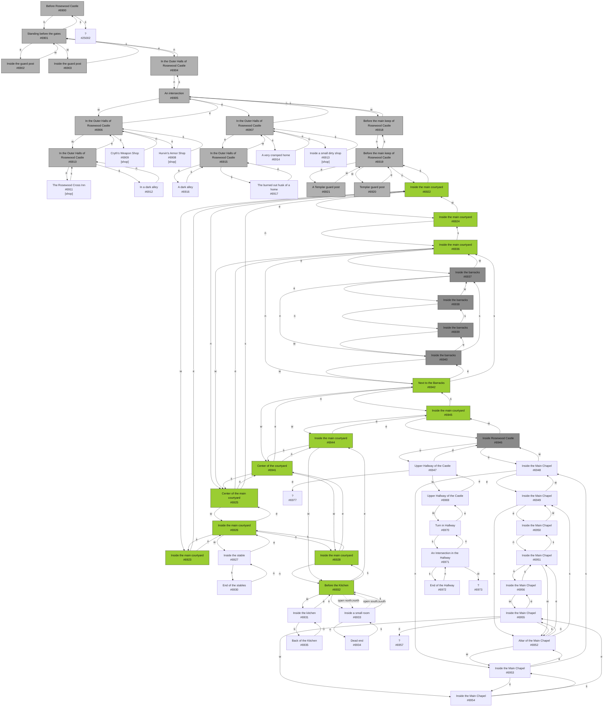

# Rosewood Castle

59 rooms. Solid = direction; dotted = special exit.

```mermaid
flowchart TD
  r6900["Before Rosewood Castle<br/>#6900"]
  r6901["Standing before the gates<br/>#6901"]
  r6902["Inside the guard post<br/>#6902"]
  r6903["Inside the guard post<br/>#6903"]
  r6904["In the Outer Halls of Rosewood Castle<br/>#6904"]
  r6905["An intersection<br/>#6905"]
  r6906["In the Outer Halls of Rosewood Castle<br/>#6906"]
  r6910["In the Outer Halls of Rosewood Castle<br/>#6910"]
  r6911["The Rosewood Cross Inn<br/>#6911<br/>[shop]"]
  r6909["Cryth's Weapon Shop<br/>#6909<br/>[shop]"]
  r6908["Hurvin's Armor Shop<br/>#6908<br/>[shop]"]
  r6912["In a dark alley<br/>#6912"]
  r6907["In the Outer Halls of Rosewood Castle<br/>#6907"]
  r6915["In the Outer Halls of Rosewood Castle<br/>#6915"]
  r6916["A dark alley<br/>#6916"]
  r6917["The burned out husk of a home<br/>#6917"]
  r6914["A very cramped home<br/>#6914"]
  r6913["Inside a small dirty shop<br/>#6913<br/>[shop]"]
  r6918["Before the main keep of Rosewood Castle<br/>#6918"]
  r6919["Before the main keep of Rosewood Castle<br/>#6919"]
  r6921["A Templar guard post<br/>#6921"]
  r6920["Templar guard post<br/>#6920"]
  r6922["Inside the main courtyard<br/>#6922"]
  r6924["Inside the main courtyard<br/>#6924"]
  r6923["Inside the main courtyard<br/>#6923"]
  r6926["Inside the main courtyard<br/>#6926"]
  r6925["Center of the main courtyard<br/>#6925"]
  r6936["Inside the main courtyard<br/>#6936"]
  r6937["Inside the barracks<br/>#6937"]
  r6938["Inside the barracks<br/>#6938"]
  r6939["Inside the barracks<br/>#6939"]
  r6940["Inside the barracks<br/>#6940"]
  r6942["Next to the Barracks<br/>#6942"]
  r6941["Center of the courtyard<br/>#6941"]
  r6928["Inside the main courtyard<br/>#6928"]
  r6927["Inside the stable<br/>#6927"]
  r6930["End of the stables<br/>#6930"]
  r6932["Before the Kitchen<br/>#6932"]
  r6944["Inside the main courtyard<br/>#6944"]
  r6945["Inside the main courtyard<br/>#6945"]
  r6946["Inside Rosewood Castle<br/>#6946"]
  r6948["Inside the Main Chapel<br/>#6948"]
  r6949["Inside the Main Chapel<br/>#6949"]
  r6950["Inside the Main Chapel<br/>#6950"]
  r6951["Inside the Main Chapel<br/>#6951"]
  r6956["Inside the Main Chapel<br/>#6956"]
  r6952["Altar of the Main Chapel<br/>#6952"]
  r6955["Inside the Main Chapel<br/>#6955"]
  r6953["Inside the Main Chapel<br/>#6953"]
  r6954["Inside the Main Chapel<br/>#6954"]
  r6947["Upper Hallway of the Castle<br/>#6947"]
  r6931["Inside the kitchen<br/>#6931"]
  r6935["Back of the Kitchen<br/>#6935"]
  r6933["Inside a small room<br/>#6933"]
  r6934["Dead end<br/>#6934"]
  r6969["Upper Hallway of the Castle<br/>#6969"]
  r6970["Turn in Hallway<br/>#6970"]
  r6971["An Intersection in the Hallway<br/>#6971"]
  r6972["End of the Hallway<br/>#6972"]
  r6900 -->|n| r6901
  r25002["?<br/>#25002"]
  r6900 -->|s| r25002
  r6901 -->|e| r6902
  r6901 -->|n| r6904
  r6901 -->|s| r6900
  r6901 -->|w| r6903
  r6902 -->|w| r6901
  r6903 -->|e| r6901
  r6904 -->|n| r6905
  r6904 -->|s| r6901
  r6905 -->|e| r6907
  r6905 -->|n| r6918
  r6905 -->|s| r6904
  r6905 -->|w| r6906
  r6906 -->|e| r6905
  r6906 -->|n| r6908
  r6906 -->|s| r6909
  r6906 -->|w| r6910
  r6910 -->|e| r6906
  r6910 -->|n| r6911
  r6910 -->|s| r6912
  r6911 -->|s| r6910
  r6909 -->|n| r6906
  r6908 -->|s| r6906
  r6912 -->|n| r6910
  r6907 -->|e| r6915
  r6907 -->|n| r6913
  r6907 -->|s| r6914
  r6907 -->|w| r6905
  r6915 -->|n| r6916
  r6915 -->|s| r6917
  r6915 -->|w| r6907
  r6916 -->|s| r6915
  r6917 -->|n| r6915
  r6914 -->|n| r6907
  r6913 -->|s| r6907
  r6918 -->|n| r6919
  r6918 -->|s| r6905
  r6919 -->|e| r6921
  r6919 -->|n| r6922
  r6919 -->|s| r6918
  r6919 -->|w| r6920
  r6921 -->|w| r6919
  r6920 -->|e| r6919
  r6922 -->|e| r6924
  r6922 -->|n| r6925
  r6922 -->|s| r6919
  r6922 -->|w| r6923
  r6924 -->|n| r6936
  r6924 -->|w| r6922
  r6923 -->|e| r6922
  r6923 -->|n| r6926
  r6926 -->|e| r6925
  r6926 -->|n| r6928
  r6926 -->|s| r6923
  r6926 -->|w| r6927
  r6925 -->|e| r6936
  r6925 -->|n| r6941
  r6925 -->|s| r6922
  r6925 -->|w| r6926
  r6936 -->|e| r6937
  r6936 -->|n| r6942
  r6936 -->|s| r6924
  r6936 -->|w| r6925
  r6937 -->|e| r6938
  r6937 -->|n| r6940
  r6937 -->|w| r6936
  r6938 -->|n| r6939
  r6938 -->|w| r6937
  r6939 -->|s| r6938
  r6939 -->|w| r6940
  r6940 -->|e| r6939
  r6940 -->|s| r6937
  r6940 -->|w| r6942
  r6942 -->|e| r6940
  r6942 -->|n| r6945
  r6942 -->|s| r6936
  r6942 -->|w| r6941
  r6941 -->|e| r6942
  r6941 -->|n| r6944
  r6941 -->|s| r6925
  r6941 -->|w| r6928
  r6928 -->|e| r6941
  r6928 -->|n| r6932
  r6928 -->|s| r6926
  r6927 -->|e| r6926
  r6927 -->|s| r6930
  r6930 -->|n| r6927
  r6932 -->|e| r6944
  r6932 -->|n| r6933
  r6932 -.->|open north;north| r6933
  r6932 -->|s| r6928
  r6932 -->|w| r6931
  r6944 -->|e| r6945
  r6944 -->|s| r6941
  r6944 -->|w| r6932
  r6945 -->|e| r6946
  r6945 -->|s| r6942
  r6945 -->|w| r6944
  r6946 -->|e| r6948
  r6946 -->|u| r6947
  r6946 -->|w| r6945
  r6948 -->|e| r6949
  r6948 -->|n| r6953
  r6948 -->|w| r6946
  r6949 -->|e| r6950
  r6949 -->|n| r6952
  r6949 -->|w| r6948
  r6950 -->|n| r6951
  r6950 -->|w| r6949
  r6951 -->|n| r6956
  r6951 -->|s| r6950
  r6951 -->|w| r6952
  r6956 -->|s| r6951
  r6956 -->|w| r6955
  r6952 -->|e| r6951
  r6952 -->|n| r6955
  r6952 -->|s| r6949
  r6952 -->|w| r6953
  r6955 -->|e| r6956
  r6957["?<br/>#6957"]
  r6955 -->|n| r6957
  r6955 -->|s| r6952
  r6955 -->|w| r6954
  r6953 -->|e| r6952
  r6953 -->|n| r6954
  r6953 -->|s| r6948
  r6954 -->|e| r6955
  r6954 -->|s| r6953
  r6947 -->|d| r6946
  r6977["?<br/>#6977"]
  r6947 -->|e| r6977
  r6947 -->|w| r6969
  r6931 -->|e| r6932
  r6931 -->|s| r6935
  r6935 -->|n| r6931
  r6933 -->|n| r6934
  r6933 -.->|open south;south| r6932
  r6933 -->|s| r6932
  r6934 -->|s| r6933
  r6969 -->|e| r6947
  r6969 -->|w| r6970
  r6970 -->|e| r6969
  r6970 -->|s| r6971
  r6971 -->|n| r6970
  r6971 -->|s| r6972
  r6973["?<br/>#6973"]
  r6971 -->|w| r6973
  r6972 -->|n| r6971
  classDef t_city fill:#b0b0b0,color:#111,stroke:#222
  class r6900 t_city
  class r6901 t_city
  class r6902 t_city
  class r6903 t_city
  class r6904 t_city
  class r6905 t_city
  class r6906 t_city
  class r6910 t_city
  class r6907 t_city
  class r6915 t_city
  class r6918 t_city
  class r6919 t_city
  class r6921 t_city
  class r6920 t_city
  classDef t_field fill:#9acd32,color:#111,stroke:#222
  class r6922 t_field
  class r6924 t_field
  class r6923 t_field
  class r6926 t_field
  class r6925 t_field
  class r6936 t_field
  classDef t_inside fill:#8a8a8a,color:#111,stroke:#222
  class r6937 t_inside
  class r6938 t_inside
  class r6939 t_inside
  class r6940 t_inside
  class r6942 t_field
  class r6941 t_field
  class r6928 t_field
  class r6932 t_field
  class r6944 t_field
  class r6945 t_field
  class r6946 t_inside
```
