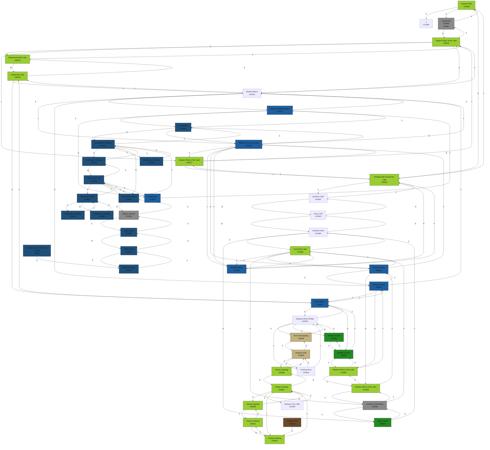

# Sen'narre Lake

50 rooms. Solid = direction; dotted = special exit.

```mermaid
flowchart TD
  r15489["Eastern Path<br/>#15489"]
  r15490["A Small Hut<br/>#15490<br/>[shop]"]
  r15491["Dividing Path Around the Lake<br/>#15491"]
  r15492["Southern Path<br/>#15492"]
  r15493["Rocky Cliff<br/>#15493"]
  r15494["Southern Path<br/>#15494"]
  r15495["Around the Lake<br/>#15495"]
  r15496["A Cabin on the Shore<br/>#15496"]
  r15497["Dense Wood<br/>#15497"]
  r15498["Western Shore of the Lake<br/>#15498"]
  r15499["Western Shore of the Lake<br/>#15499"]
  r15500["Nesting Ground<br/>#15500"]
  r15501["Nesting Ground<br/>#15501"]
  r15502["Stepping-Stone Bridge<br/>#15502"]
  r15503["Trickling River<br/>#15503"]
  r15504["Rock Outcropping<br/>#15504"]
  r15505["Northern Path<br/>#15505"]
  r15506["Grassy Clearing<br/>#15506"]
  r15507["Grassy Clearing<br/>#15507"]
  r15508["Between Two Cliffs<br/>#15508"]
  r15509["Grassy Clearing<br/>#15509"]
  r15510["Clear Waters<br/>#15510"]
  r15511["Grassy Clearing<br/>#15511"]
  r15512["Grassy Clearing<br/>#15512"]
  r15513["A Rabbit Hole<br/>#15513"]
  r15514["Around the Lake<br/>#15514"]
  r15515["Bend Around the Lake<br/>#15515"]
  r15516["Eastern Shore of the Lake<br/>#15516"]
  r15517["Eastern Shore of the Lake<br/>#15517"]
  r15518["Shallow Waters<br/>#15518"]
  r15519["Middle of Sen'narre Lake<br/>#15519"]
  r15520["Muddy Waters<br/>#15520"]
  r15521["Underwater<br/>#15521"]
  r15522["Sen'narre Lake<br/>#15522"]
  r15523["Sen'narre Lake<br/>#15523"]
  r15524["Sinking in Muddy Water<br/>#15524"]
  r15525["Underwater<br/>#15525"]
  r15526["Floor of the Lake<br/>#15526"]
  r15527["Before the Caves<br/>#15527"]
  r15528["Underwater Dwelling<br/>#15528"]
  r15529["Underwater Dwelling<br/>#15529"]
  r15530["Underwater Clearing<br/>#15530"]
  r15531["Underwater Clearing<br/>#15531"]
  r15532["Dwelling of the Elder<br/>#15532"]
  r15533["Floor of the Lake<br/>#15533"]
  r15534["Watery Caverns<br/>#15534"]
  r15535["Watery Way<br/>#15535"]
  r15536["Watery Way<br/>#15536"]
  r15537["Before the Light<br/>#15537"]
  r15538["Beyond the Blue Shimmer<br/>#15538<br/>[safe]"]
  r12059["?<br/>#12059"]
  r15489 -->|e| r12059
  r15489 -->|n| r15490
  r15489 -->|w| r15491
  r15490 -->|s| r15489
  r15490 -->|w| r15516
  r15491 -->|e| r15489
  r15491 -->|n| r15517
  r15491 -->|s| r15492
  r15491 -->|w| r15518
  r15492 -->|n| r15491
  r15492 -->|w| r15493
  r15493 -->|e| r15492
  r15493 -->|w| r15494
  r15494 -->|e| r15493
  r15494 -->|n| r15495
  r15494 -->|w| r15497
  r15495 -->|e| r15518
  r15495 -->|n| r15522
  r15495 -->|s| r15494
  r15495 -->|w| r15496
  r15496 -->|e| r15495
  r15496 -->|n| r15498
  r15496 -->|s| r15497
  r15497 -->|e| r15494
  r15497 -->|n| r15496
  r15498 -->|e| r15522
  r15498 -->|n| r15499
  r15498 -->|s| r15496
  r15499 -->|e| r15523
  r15499 -->|n| r15500
  r15499 -->|s| r15498
  r15500 -->|e| r15510
  r15500 -->|n| r15501
  r15500 -->|s| r15499
  r15501 -->|e| r15502
  r15501 -->|s| r15500
  r15502 -->|e| r15504
  r15502 -->|n| r15503
  r15502 -->|s| r15510
  r15502 -->|w| r15501
  r15503 -->|e| r15505
  r15503 -->|s| r15502
  r15504 -->|n| r15505
  r15504 -->|w| r15502
  r15505 -->|e| r15506
  r15505 -->|s| r15504
  r15505 -->|w| r15503
  r15506 -->|e| r15507
  r15506 -->|w| r15505
  r15507 -->|e| r15509
  r15507 -->|n| r15508
  r15507 -->|s| r15512
  r15507 -->|w| r15506
  r15508 -->|s| r15507
  r15509 -->|s| r15511
  r15509 -->|w| r15507
  r15510 -->|e| r15514
  r15510 -->|n| r15502
  r15510 -->|s| r15523
  r15510 -->|w| r15500
  r15511 -->|n| r15509
  r15511 -->|w| r15512
  r15512 -->|e| r15511
  r15512 -->|n| r15507
  r15513 -->|e| r15512
  r15514 -->|e| r15515
  r15514 -->|s| r15520
  r15514 -->|w| r15510
  r15515 -->|s| r15516
  r15515 -->|w| r15514
  r15516 -->|e| r15490
  r15516 -->|n| r15515
  r15516 -->|s| r15517
  r15516 -->|w| r15520
  r15517 -->|n| r15516
  r15517 -->|s| r15491
  r15517 -->|w| r15519
  r15518 -->|e| r15491
  r15518 -->|n| r15519
  r15518 -->|w| r15495
  r15519 -->|d| r15521
  r15519 -->|e| r15517
  r15519 -->|n| r15520
  r15519 -->|s| r15518
  r15519 -->|w| r15522
  r15520 -->|d| r15524
  r15520 -->|e| r15516
  r15520 -->|n| r15514
  r15520 -->|s| r15519
  r15520 -->|w| r15523
  r15521 -->|d| r15531
  r15521 -->|n| r15524
  r15521 -->|u| r15519
  r15522 -->|e| r15519
  r15522 -->|n| r15523
  r15522 -->|s| r15495
  r15522 -->|w| r15498
  r15523 -->|e| r15520
  r15523 -->|n| r15510
  r15523 -->|s| r15522
  r15523 -->|w| r15499
  r15524 -->|s| r15521
  r15524 -->|u| r15520
  r15524 -->|w| r15525
  r15525 -->|d| r15526
  r15525 -->|e| r15524
  r15526 -->|e| r15530
  r15526 -->|n| r15527
  r15526 -->|s| r15533
  r15526 -->|u| r15525
  r15527 -->|n| r15528
  r15527 -->|s| r15526
  r15527 -->|w| r15529
  r15528 -->|s| r15527
  r15529 -->|e| r15527
  r15530 -->|s| r15531
  r15530 -->|w| r15526
  r15531 -->|n| r15530
  r15531 -->|s| r15532
  r15531 -->|u| r15521
  r15531 -->|w| r15533
  r15532 -->|n| r15531
  r15533 -->|e| r15531
  r15533 -->|n| r15526
  r15533 -->|w| r15534
  r15534 -->|e| r15533
  r15534 -->|s| r15535
  r15535 -->|n| r15534
  r15535 -->|w| r15536
  r15536 -->|e| r15535
  r15536 -->|n| r15537
  r15537 -->|s| r15536
  r15538 -->|d| r15537
  classDef t_field fill:#9acd32,color:#111,stroke:#222
  class r15489 t_field
  classDef t_inside fill:#8a8a8a,color:#111,stroke:#222
  class r15490 t_inside
  class r15491 t_field
  class r15495 t_field
  class r15496 t_inside
  classDef t_forest fill:#228b22,color:#111,stroke:#222
  class r15497 t_forest
  class r15498 t_field
  class r15499 t_field
  class r15500 t_forest
  class r15501 t_forest
  classDef t_hills fill:#c2b280,color:#111,stroke:#222
  class r15504 t_hills
  class r15505 t_hills
  class r15506 t_field
  class r15507 t_field
  class r15509 t_field
  classDef t_ocean fill:#1f5f9e,color:#111,stroke:#222
  class r15510 t_ocean
  class r15511 t_field
  class r15512 t_field
  classDef t_underground fill:#6b4a2b,color:#111,stroke:#222
  class r15513 t_underground
  class r15514 t_field
  class r15515 t_field
  class r15516 t_field
  class r15517 t_field
  class r15518 t_ocean
  class r15519 t_ocean
  classDef t_underwater fill:#20507a,color:#111,stroke:#222
  class r15521 t_underwater
  class r15522 t_ocean
  class r15523 t_ocean
  class r15524 t_ocean
  class r15525 t_ocean
  class r15526 t_underwater
  class r15527 t_underwater
  class r15528 t_underwater
  class r15529 t_underwater
  class r15530 t_underwater
  class r15531 t_underwater
  class r15532 t_underwater
  class r15533 t_underwater
  class r15534 t_inside
  class r15535 t_underwater
  class r15536 t_underwater
  class r15537 t_underwater
  class r15538 t_underwater
```
