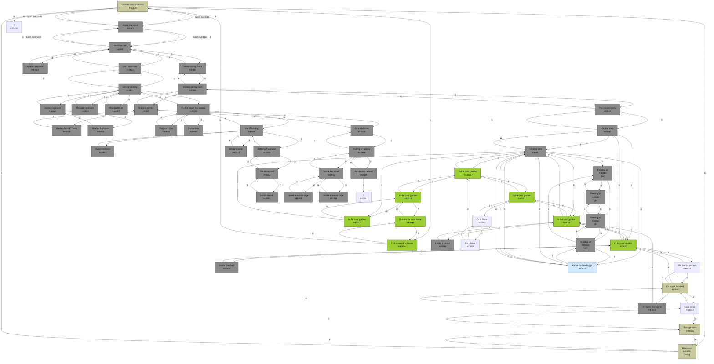

# Sheila's Cat Sanctuary

55 rooms. Solid = direction; dotted = special exit.

```mermaid
flowchart TD
  r40900["Outside the cats' home<br/>#40900"]
  r40901["Inside the porch<br/>#40901"]
  r40902["Entrance hall<br/>#40902"]
  r40955["Ellie's stall<br/>#40955<br/>[shop]"]
  r40956["Storage area<br/>#40956"]
  r40943["On a fence<br/>#40943"]
  r40947["On top of the shed<br/>#40947"]
  r40934["On the fire escape<br/>#40934"]
  r40920["In the cats' garden<br/>#40920"]
  r40910["On the patio<br/>#40910"]
  r40909["The conservatory<br/>#40909"]
  r40906["Sheila's dining room<br/>#40906"]
  r40907["Sheila's kitchen<br/>#40907"]
  r40908["Sheila's laundry room<br/>#40908"]
  r40903["Sheila's living room<br/>#40903"]
  r40904["Kittens' playroom<br/>#40904"]
  r40954["Path around the house<br/>#40954"]
  r40949["Outside the cats' home<br/>#40949"]
  r40918["In the cats' garden<br/>#40918"]
  r40922["In the cats' garden<br/>#40922"]
  r40921["In the cats' garden<br/>#40921"]
  r40919["In the cats' garden<br/>#40919"]
  r40911["Feeding area<br/>#40911"]
  r40917["In the cats' garden<br/>#40917"]
  r40946["Inside a kennel<br/>#40946"]
  r40948["Inside the shed<br/>#40948"]
  r40944["On top of the kennel<br/>#40944"]
  r40957["On a fence<br/>#40957"]
  r40958["On a fence<br/>#40958"]
  r40914["Feeding pit<br/>#40914<br/>[pk]"]
  r40912["Feeding pit<br/>#40912<br/>[pk]"]
  r40913["Feeding pit<br/>#40913<br/>[pk]"]
  r40915["Feeding pit<br/>#40915<br/>[pk]"]
  r40916["Above the feeding pit<br/>#40916"]
  r40923["On a staircase<br/>#40923"]
  r40924["On the landing<br/>#40924"]
  r40933["The cats' bedroom<br/>#40933"]
  r40927["Main bathroom<br/>#40927"]
  r40925["Further down the landing<br/>#40925"]
  r40928["Sheila's bedroom<br/>#40928"]
  r40929["Sheila's bathroom<br/>#40929"]
  r40930["The purr room<br/>#40930"]
  r40945["Quarantine<br/>#40945"]
  r40926["End of landing<br/>#40926"]
  r40931["Guest bedroom<br/>#40931"]
  r40950["Bottom of staircase<br/>#40950"]
  r40932["Sheila's study<br/>#40932"]
  r40951["On a staircase<br/>#40951"]
  r40952["Inside the loft<br/>#40952"]
  r40935["On a staircase<br/>#40935"]
  r40936["A dimly lit hallway<br/>#40936"]
  r40937["Inside the larder<br/>#40937"]
  r40940["An unused hallway<br/>#40940"]
  r40938["Inside a mouse cage<br/>#40938"]
  r40939["Inside a mouse cage<br/>#40939"]
  r40900 -->|e| r40901
  r40900 -->|n| r40955
  r40900 -.->|open east;east| r40901
  r40900 -->|s| r40954
  r12426["?<br/>#12426"]
  r40900 -->|w| r12426
  r40901 -->|e| r40902
  r40901 -.->|open east;east| r40902
  r40901 -.->|open west;west| r40900
  r40901 -->|w| r40900
  r40902 -->|n| r40904
  r40902 -.->|open west;west| r40901
  r40902 -->|s| r40903
  r40902 -->|u| r40923
  r40902 -->|w| r40901
  r40955 -->|e| r40956
  r40955 -->|s| r40900
  r40956 -->|u| r40943
  r40956 -->|w| r40955
  r40943 -->|d| r40956
  r40943 -->|n| r40947
  r40947 -->|d| r40920
  r40947 -->|e| r40944
  r40947 -->|s| r40934
  r40947 -->|w| r40943
  r40934 -->|d| r40920
  r40934 -->|n| r40947
  r40920 -->|e| r40919
  r40920 -->|n| r40948
  r40920 -->|s| r40910
  r40920 -->|u| r40934
  r40910 -->|e| r40911
  r40910 -->|n| r40920
  r40910 -->|s| r40909
  r40909 -->|n| r40910
  r40909 -->|w| r40906
  r40906 -->|e| r40909
  r40906 -->|n| r40907
  r40906 -->|w| r40903
  r40907 -->|d| r40935
  r40907 -->|n| r40908
  r40907 -->|s| r40906
  r40908 -->|s| r40907
  r40903 -->|e| r40906
  r40903 -->|n| r40902
  r40904 -->|s| r40902
  r40954 -->|e| r40949
  r40954 -->|w| r40900
  r40949 -->|s| r40954
  r40949 -->|w| r40918
  r40918 -->|e| r40949
  r40918 -->|n| r40922
  r40918 -->|w| r40917
  r40922 -->|n| r40921
  r40922 -->|s| r40918
  r40922 -->|w| r40911
  r40921 -->|s| r40922
  r40921 -->|u| r40957
  r40921 -->|w| r40919
  r40919 -->|e| r40921
  r40919 -->|n| r40946
  r40919 -->|s| r40911
  r40919 -->|w| r40920
  r40911 -->|d| r40914
  r40911 -->|e| r40922
  r40911 -->|n| r40919
  r40911 -->|s| r40917
  r40911 -->|u| r40916
  r40911 -->|w| r40910
  r40917 -->|e| r40918
  r40917 -->|n| r40911
  r40946 -->|s| r40919
  r40948 -->|s| r40920
  r40944 -->|d| r40919
  r40944 -->|w| r40947
  r40957 -->|d| r40921
  r40957 -->|s| r40958
  r40958 -->|d| r40922
  r40958 -->|n| r40957
  r40914 -->|e| r40915
  r40914 -->|n| r40912
  r40912 -->|e| r40913
  r40912 -->|s| r40914
  r40912 -->|u| r40916
  r40913 -->|s| r40915
  r40913 -->|w| r40912
  r40915 -->|n| r40913
  r40915 -->|w| r40914
  r40916 -->|d| r40912
  r40916 -->|e| r40911
  r40916 -->|n| r40911
  r40916 -->|s| r40911
  r40916 -->|w| r40911
  r40923 -->|d| r40902
  r40923 -->|u| r40924
  r40924 -->|d| r40923
  r40924 -->|e| r40927
  r40924 -->|n| r40933
  r40924 -->|s| r40928
  r40924 -->|w| r40925
  r40933 -->|s| r40924
  r40927 -->|w| r40924
  r40925 -->|e| r40924
  r40925 -->|n| r40945
  r40925 -->|s| r40930
  r40925 -->|w| r40926
  r40928 -->|e| r40929
  r40928 -->|n| r40924
  r40929 -->|w| r40928
  r40930 -->|n| r40925
  r40945 -->|s| r40925
  r40926 -->|e| r40925
  r40926 -->|n| r40931
  r40926 -->|s| r40950
  r40926 -->|w| r40932
  r40931 -->|s| r40926
  r40950 -->|n| r40926
  r40950 -->|u| r40951
  r40932 -->|e| r40926
  r40951 -->|d| r40950
  r40951 -->|n| r40952
  r40952 -->|s| r40951
  r40935 -->|d| r40936
  r40935 -->|u| r40907
  r40936 -->|e| r40940
  r40936 -->|n| r40937
  r40936 -->|u| r40935
  r40937 -->|e| r40939
  r40937 -->|s| r40936
  r40937 -->|w| r40938
  r40941["?<br/>#40941"]
  r40940 -->|n| r40941
  r40940 -->|w| r40936
  r40938 -->|e| r40937
  r40939 -->|w| r40937
  classDef t_road fill:#c9c9a0,color:#111,stroke:#222
  class r40900 t_road
  classDef t_inside fill:#8a8a8a,color:#111,stroke:#222
  class r40901 t_inside
  class r40902 t_inside
  class r40955 t_road
  class r40956 t_road
  class r40947 t_road
  classDef t_field fill:#9acd32,color:#111,stroke:#222
  class r40920 t_field
  class r40910 t_inside
  class r40909 t_inside
  class r40906 t_inside
  class r40907 t_inside
  class r40908 t_inside
  class r40903 t_inside
  class r40904 t_inside
  class r40954 t_field
  class r40949 t_field
  class r40918 t_field
  class r40922 t_field
  class r40921 t_field
  class r40919 t_field
  class r40911 t_inside
  class r40917 t_field
  class r40946 t_inside
  class r40948 t_inside
  class r40944 t_inside
  class r40914 t_inside
  class r40912 t_inside
  class r40913 t_inside
  class r40915 t_inside
  classDef t_air fill:#cfe8ff,color:#111,stroke:#222
  class r40916 t_air
  class r40923 t_inside
  class r40924 t_inside
  class r40933 t_inside
  class r40927 t_inside
  class r40925 t_inside
  class r40928 t_inside
  class r40929 t_inside
  class r40930 t_inside
  class r40945 t_inside
  class r40926 t_inside
  class r40931 t_inside
  class r40950 t_inside
  class r40932 t_inside
  class r40951 t_inside
  class r40952 t_inside
  class r40935 t_inside
  class r40936 t_inside
  class r40937 t_inside
  class r40940 t_inside
  class r40938 t_inside
  class r40939 t_inside
```
