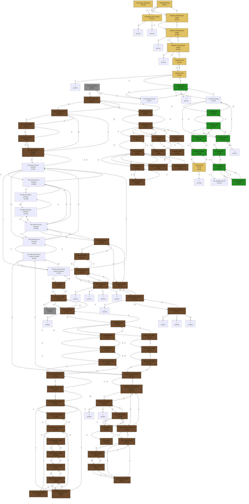

# Sho'aram, Castle in the Sand

87 rooms. Solid = direction; dotted = special exit.

```mermaid
flowchart TD
  r37700["A Ferocious Sandstorm<br/>#37700"]
  r37701["Unforgiving Heat<br/>#37701"]
  r37713["An Endless Sea of Sand<br/>#37713"]
  r37702["Parched, Poached and Pelted<br/>#37702"]
  r37703["Parched, Poached and Pelted<br/>#37703"]
  r37704["Parched, Poached and Pelted<br/>#37704"]
  r37705["A Broken Path<br/>#37705"]
  r37706["A Broken Path<br/>#37706"]
  r37719["A Desert Oasis<br/>#37719"]
  r37720["A Natural Spring<br/>#37720"]
  r37721["A Desert Oasis<br/>#37721"]
  r37723["An Odd Path<br/>#37723"]
  r37724["An Odd Path<br/>#37724"]
  r37725["The Path Ends<br/>#37725"]
  r37726["On Strange Ground<br/>#37726"]
  r37729["A Desert Oasis<br/>#37729"]
  r37730["A Patch of Green<br/>#37730"]
  r37731["A Patch of Green<br/>#37731"]
  r37732["A Rocky Path<br/>#37732<br/>[shop]"]
  r37728["A Small Oasis<br/>#37728"]
  r37727["On Strange Ground<br/>#37727"]
  r37837["The Tower Room<br/>#37837"]
  r37870["The Council Tower<br/>#37870"]
  r37877["The East Wing<br/>#37877"]
  r37878["The East Wing<br/>#37878"]
  r37879["The East Wing<br/>#37879"]
  r37885["The East Wing<br/>#37885"]
  r37886["The East Wing<br/>#37886"]
  r37887["Treasurer's Room<br/>#37887"]
  r37888["Royal Sergeant's Room<br/>#37888"]
  r37884["High Mage's Room<br/>#37884"]
  r37883["A Visitors' Suite<br/>#37883"]
  r37880["The East Wing<br/>#37880"]
  r37882["A Visitors' Suite<br/>#37882"]
  r37881["A Visitors' Suite<br/>#37881"]
  r37766["The Council Tower<br/>#37766"]
  r37747["The Council Tower<br/>#37747"]
  r37768["The Council Tower<br/>#37768"]
  r37767["The Council Tower Entrance<br/>#37767"]
  r37782["The Grand Council Chamber<br/>#37782"]
  r37868["The Grand Council Chamber<br/>#37868"]
  r37769["The Ruined Palace Entrance<br/>#37769"]
  r37748["The Ruined Palace Entrance<br/>#37748"]
  r37749["The Grand Council Chamber<br/>#37749"]
  r37781["The Grand Council Chamber<br/>#37781"]
  r37783["The Dais of the Grand Council Chamber<br/>#37783"]
  r37763["The Vestibule<br/>#37763"]
  r37762["The Guards' Walk<br/>#37762"]
  r37772["The Armory<br/>#37772"]
  r37761["A Ruined Tower<br/>#37761"]
  r37760["A Ruined Tower<br/>#37760"]
  r37759["A Wide Walkway<br/>#37759"]
  r37794["A Wide Walkway<br/>#37794"]
  r37795["A Turn in the Corridor<br/>#37795"]
  r37796["A Turn in the Corridor<br/>#37796"]
  r37797["A Pillared Entrance<br/>#37797"]
  r37798["An Enchanted Garden<br/>#37798"]
  r37804["An Enchanted Garden<br/>#37804<br/>[pk]"]
  r37799["An Enchanted Garden<br/>#37799"]
  r37800["An Enchanted Garden<br/>#37800"]
  r37801["An Enchanted Garden<br/>#37801"]
  r37803["An Enchanted Garden<br/>#37803"]
  r37806["An Enchanted Garden<br/>#37806"]
  r37805["An Enchanted Garden<br/>#37805"]
  r37802["An Enchanted Garden<br/>#37802"]
  r37758["The Guards' Walk<br/>#37758"]
  r37757["The Guards' Walk<br/>#37757"]
  r37756["The Guards' Walk<br/>#37756"]
  r37755["The Servants' Entrance<br/>#37755"]
  r37754["Entrance to the Tower of the Guard<br/>#37754"]
  r37784["The Dais of the Grand Council Chamber<br/>#37784"]
  r37789["Entry to Palace Kitchens<br/>#37789"]
  r37790["The Palace Kitchen<br/>#37790"]
  r37793["The Palace Kitchen<br/>#37793"]
  r37792["The Palace Kitchen<br/>#37792"]
  r37791["The Palace Kitchen<br/>#37791"]
  r37786["The Kitchen Wing<br/>#37786"]
  r37753["Tower of the Guard<br/>#37753"]
  r37787["The Scullery<br/>#37787"]
  r37788["The Scullery<br/>#37788"]
  r37745["The Royal Tower<br/>#37745"]
  r37741["The Royal Tower<br/>#37741"]
  r37740["The Royal Tower<br/>#37740"]
  r37770["The Royal Tower<br/>#37770"]
  r37872["The Royal Tower<br/>#37872"]
  r37751["The West Royal Wing<br/>#37751"]
  r37752["The West Royal Wing<br/>#37752"]
  r37701 -->|e| r37713
  r37701 -->|s| r37702
  r37712["?<br/>#37712"]
  r37713 -->|e| r37712
  r37734["?<br/>#37734"]
  r37713 -->|s| r37734
  r37713 -->|w| r37701
  r37702 -->|n| r37701
  r37702 -->|s| r37703
  r37714["?<br/>#37714"]
  r37703 -->|e| r37714
  r37703 -->|n| r37702
  r37703 -->|s| r37704
  r37716["?<br/>#37716"]
  r37704 -->|e| r37716
  r37704 -->|n| r37703
  r37704 -->|s| r37705
  r37705 -->|e| r37706
  r37705 -->|n| r37704
  r37707["?<br/>#37707"]
  r37706 -->|e| r37707
  r37706 -->|n| r37719
  r37706 -->|w| r37705
  r37719 -->|e| r37727
  r37719 -->|n| r37720
  r37719 -->|s| r37706
  r37718["?<br/>#37718"]
  r37719 -->|w| r37718
  r37720 -->|e| r37728
  r37720 -->|n| r37721
  r37720 -->|s| r37719
  r37721 -->|e| r37729
  r37721 -->|n| r37723
  r37721 -->|s| r37720
  r37722["?<br/>#37722"]
  r37721 -->|w| r37722
  r37723 -->|s| r37721
  r37723 -->|w| r37724
  r37724 -->|e| r37723
  r37724 -->|s| r37726
  r37724 -->|w| r37725
  r37725 -->|e| r37724
  r37726 -->|n| r37724
  r37729 -->|e| r37730
  r37729 -->|s| r37728
  r37729 -->|w| r37721
  r37730 -->|s| r37731
  r37730 -->|w| r37729
  r37731 -->|n| r37730
  r37731 -->|s| r37732
  r37709["?<br/>#37709"]
  r37732 -->|e| r37709
  r37732 -->|n| r37731
  r37728 -->|n| r37729
  r37728 -->|w| r37720
  r37727 -->|w| r37719
  r37837 -->|d| r37870
  r37837 -->|u| r37727
  r37870 -->|d| r37766
  r37870 -->|u| r37837
  r37870 -->|w| r37877
  r37877 -->|e| r37870
  r37877 -->|w| r37878
  r37878 -->|e| r37877
  r37878 -->|n| r37879
  r37878 -->|s| r37880
  r37878 -->|w| r37883
  r37879 -->|n| r37885
  r37879 -->|s| r37878
  r37885 -->|e| r37886
  r37885 -->|n| r37888
  r37885 -->|s| r37879
  r37885 -->|w| r37884
  r37886 -->|n| r37887
  r37886 -->|w| r37885
  r37887 -->|s| r37886
  r37888 -->|s| r37885
  r37884 -->|e| r37885
  r37883 -->|e| r37878
  r37880 -->|n| r37878
  r37880 -->|s| r37881
  r37880 -->|w| r37882
  r37882 -->|e| r37880
  r37881 -->|n| r37880
  r37766 -->|n| r37747
  r37766 -->|u| r37870
  r37766 -->|w| r37767
  r37747 -->|s| r37766
  r37747 -->|w| r37768
  r37768 -->|e| r37747
  r37768 -->|s| r37767
  r37767 -->|e| r37766
  r37767 -->|n| r37768
  r37767 -->|w| r37782
  r37782 -->|e| r37767
  r37782 -->|n| r37868
  r37782 -->|s| r37783
  r37782 -->|w| r37781
  r37868 -->|n| r37769
  r37868 -->|s| r37782
  r37868 -->|w| r37749
  r37769 -->|s| r37868
  r37769 -->|w| r37748
  r37748 -->|e| r37769
  r37748 -->|s| r37749
  r37749 -->|e| r37868
  r37749 -->|n| r37748
  r37749 -->|s| r37781
  r37749 -->|w| r37745
  r37781 -->|e| r37782
  r37781 -->|n| r37749
  r37781 -->|s| r37784
  r37783 -->|e| r37763
  r37783 -->|n| r37782
  r37783 -->|w| r37784
  r37763 -->|s| r37762
  r37763 -->|w| r37783
  r37762 -->|e| r37772
  r37762 -->|n| r37763
  r37762 -->|w| r37761
  r37772 -->|w| r37762
  r37841["?<br/>#37841"]
  r37761 -->|d| r37841
  r37761 -->|e| r37762
  r37761 -->|s| r37760
  r37760 -->|n| r37761
  r37760 -->|s| r37759
  r37760 -->|w| r37758
  r37759 -->|n| r37760
  r37759 -->|s| r37794
  r37794 -->|n| r37759
  r37794 -->|s| r37795
  r37795 -->|e| r37796
  r37795 -->|n| r37794
  r37796 -->|n| r37797
  r37796 -->|w| r37795
  r37797 -->|e| r37798
  r37797 -->|s| r37796
  r37798 -->|n| r37799
  r37798 -->|s| r37804
  r37798 -->|w| r37797
  r37804 -->|e| r37805
  r37804 -->|n| r37798
  r37799 -->|e| r37800
  r37799 -->|s| r37798
  r37800 -->|e| r37801
  r37800 -->|s| r37802
  r37800 -->|w| r37799
  r37801 -->|s| r37803
  r37801 -->|w| r37800
  r37803 -->|n| r37801
  r37803 -->|s| r37806
  r37806 -->|n| r37803
  r37806 -->|w| r37805
  r37805 -->|e| r37806
  r37805 -->|n| r37802
  r37805 -->|w| r37804
  r37802 -->|n| r37800
  r37802 -->|s| r37805
  r37758 -->|e| r37760
  r37758 -->|n| r37757
  r37757 -->|s| r37758
  r37757 -->|w| r37756
  r37756 -->|e| r37757
  r37756 -->|n| r37755
  r37755 -->|e| r37784
  r37755 -->|s| r37756
  r37755 -->|w| r37754
  r37754 -->|e| r37755
  r37754 -->|n| r37753
  r37754 -->|w| r37789
  r37784 -->|e| r37783
  r37784 -->|n| r37781
  r37784 -->|w| r37755
  r37789 -->|e| r37754
  r37789 -->|n| r37786
  r37789 -->|s| r37790
  r37790 -->|n| r37789
  r37790 -->|s| r37793
  r37790 -->|w| r37791
  r37793 -->|n| r37790
  r37793 -->|w| r37792
  r37792 -->|e| r37793
  r37792 -->|n| r37791
  r37791 -->|e| r37790
  r37791 -->|s| r37792
  r37786 -->|e| r37753
  r37786 -->|s| r37789
  r37786 -->|w| r37787
  r37863["?<br/>#37863"]
  r37753 -->|d| r37863
  r37753 -->|s| r37754
  r37871["?<br/>#37871"]
  r37753 -->|u| r37871
  r37753 -->|w| r37786
  r37787 -->|e| r37786
  r37787 -->|n| r37788
  r37788 -->|s| r37787
  r37745 -->|e| r37749
  r37745 -->|n| r37741
  r37745 -->|w| r37770
  r37741 -->|s| r37745
  r37741 -->|w| r37740
  r37740 -->|e| r37741
  r37740 -->|s| r37770
  r37740 -->|u| r37872
  r37770 -->|e| r37745
  r37770 -->|n| r37740
  r37872 -->|d| r37740
  r37742["?<br/>#37742"]
  r37872 -->|e| r37742
  r37771["?<br/>#37771"]
  r37872 -->|n| r37771
  r37744["?<br/>#37744"]
  r37872 -->|s| r37744
  r37838["?<br/>#37838"]
  r37872 -->|u| r37838
  r37872 -->|w| r37751
  r37751 -->|e| r37872
  r37750["?<br/>#37750"]
  r37751 -->|n| r37750
  r37751 -->|w| r37752
  r37752 -->|e| r37751
  r37873["?<br/>#37873"]
  r37752 -->|n| r37873
  r37875["?<br/>#37875"]
  r37752 -->|s| r37875
  r37874["?<br/>#37874"]
  r37752 -->|w| r37874
  classDef t_desert fill:#e0c060,color:#111,stroke:#222
  class r37700 t_desert
  class r37701 t_desert
  class r37713 t_desert
  class r37702 t_desert
  class r37703 t_desert
  class r37704 t_desert
  class r37705 t_desert
  class r37706 t_desert
  classDef t_forest fill:#228b22,color:#111,stroke:#222
  class r37719 t_forest
  class r37721 t_forest
  class r37723 t_forest
  class r37724 t_forest
  class r37725 t_forest
  class r37729 t_forest
  class r37730 t_forest
  class r37731 t_forest
  class r37732 t_desert
  class r37728 t_forest
  classDef t_inside fill:#8a8a8a,color:#111,stroke:#222
  class r37837 t_inside
  classDef t_underground fill:#6b4a2b,color:#111,stroke:#222
  class r37870 t_underground
  class r37877 t_underground
  class r37878 t_underground
  class r37879 t_underground
  class r37885 t_underground
  class r37886 t_underground
  class r37887 t_underground
  class r37888 t_underground
  class r37884 t_underground
  class r37883 t_underground
  class r37880 t_underground
  class r37882 t_underground
  class r37881 t_underground
  class r37766 t_underground
  class r37747 t_underground
  class r37768 t_underground
  class r37767 t_underground
  class r37763 t_underground
  class r37762 t_underground
  class r37772 t_inside
  class r37761 t_underground
  class r37760 t_underground
  class r37759 t_underground
  class r37794 t_underground
  class r37795 t_underground
  class r37796 t_underground
  class r37797 t_underground
  class r37798 t_underground
  class r37804 t_underground
  class r37799 t_underground
  class r37800 t_underground
  class r37801 t_underground
  class r37803 t_underground
  class r37806 t_underground
  class r37805 t_underground
  class r37802 t_underground
  class r37758 t_underground
  class r37757 t_underground
  class r37756 t_underground
  class r37755 t_underground
  class r37754 t_underground
  class r37789 t_underground
  class r37790 t_underground
  class r37793 t_underground
  class r37792 t_underground
  class r37791 t_underground
  class r37786 t_underground
  class r37753 t_underground
  class r37787 t_underground
  class r37788 t_underground
  class r37745 t_underground
  class r37741 t_underground
  class r37740 t_underground
  class r37770 t_underground
  class r37872 t_underground
  class r37751 t_underground
  class r37752 t_underground
```
